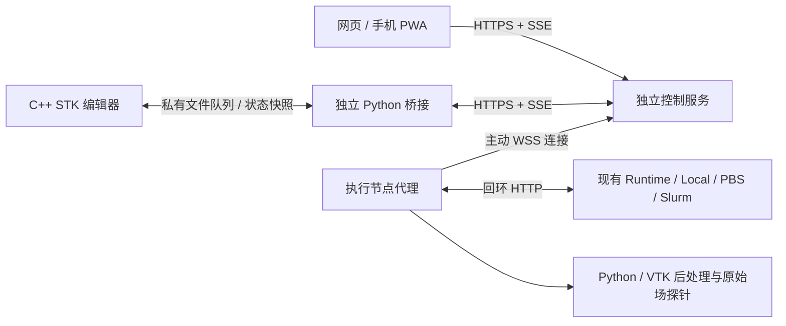

# STK Blender 原生工作台

当前桌面主线为 [Synorder Blender 宿主 + STK 插件](../plugins/synorder/README.md)。本目录保留此前的 **Blender 5.2.1 源码定制版**，用于迁移回退和回归验证。`SPACE_STK` 是新增的 C++ 编辑器，界面分区、控件编排、绘制、三维交互均由 STK 控制。Blender 提供窗口、输入、字体、基础文本控件和 GPU 后端；应用模板只负责启动编辑器和写入操作队列。

固定版本、源码 SHA256 和依赖提交见 [upstream.json](upstream.json)。这与已有 `native/` Rust/egui 技术原型分开；后者暂停扩展。Qt 界面与 Runtime 回归测试继续保留。

## 源码与构建

需要 Python 3、Git、Git LFS、CMake、C++20 编译器，以及该平台的 Blender 上游构建依赖。

```bash
curl -fL https://download.blender.org/source/blender-5.2.1.tar.xz -o /tmp/blender-5.2.1.tar.xz
python3 blender/prepare.py --source-dir /tmp/stk-blender --clone \
  --source-archive /tmp/blender-5.2.1.tar.xz
```

准备脚本检查固定提交、校验官方源码包、恢复 GitHub 镜像缺失的 LFS 资源，再应用注册补丁和 STK 源码。重复执行不改写相同文件；遇到冲突的本地修改会停止。它不会 reset 或清理已有工作树。

接着按上游方式取得当前平台的依赖子模块。必须使用该源码提交所记录的子模块提交，不能把 release 分支最新版本直接当作已验证版本。Linux x64 固定为 `ecbd06cf6d2a4aa6b00a61ffb479fc81b17aba08`：

```bash
git -C /tmp/stk-blender submodule update --init --depth 1 lib/linux_x64
git -C /tmp/stk-blender/lib/linux_x64 lfs pull
python3 blender/build.py --source-dir /tmp/stk-blender \
  --build-dir /tmp/stk-blender-build --jobs 8
```

macOS 使用 `lib/macos_arm64`；Windows 使用对应的 Windows 子模块及上游要求的编译器。`build.py` 默认保留上游依赖和编辑器，只关闭 Cycles。额外 CMake 参数放在 `--` 后，例如 `-- -DLIBDIR=/path/to/libraries`。

本次 Linux 构建环境的具体配置与验证范围见 [validation.md](validation.md)。用于虚拟显示测试的 X11 精简配置不等于发行配置：Blender 5.2 的 Linux 原生 IME 分支依赖 Wayland，正式 Linux 发行必须启用并验收 Wayland 输入法。

## 启动与计算闭环

安装当前 STK Python 项目及控制、科学视图依赖：

```bash
python -m pip install -e '.[control,visualization]' -c blender/requirements-tested.txt
suan-blender --blender /tmp/stk-blender-build/bin/blender --demo
```

`--demo` 加载明确标注“非计算结果”的本地着色曲面。也可用 `--scene /path/scene.json` 打开版本 1 的科学显示数据。只能使用包含 `SPACE_STK` 的定制二进制；普通 Blender 不能代替。

运行计算前，在独立终端启动已有 Runtime、控制服务与节点代理：

```bash
suan server init --state-dir /path/runtime
suan server start --state-dir /path/runtime
suan-control init --state-dir /path/control
suan-control serve --state-dir /path/control --allow-demo-template --web-dir web/dist
```

控制服务启动后，在另一终端签发节点配对码：

```bash
suan-control pair --state-dir /path/control --role node
suan-node pair --control-url http://127.0.0.1:8790 --name 本机计算节点 \
  --runtime-state-dir /path/runtime --state-dir /path/node
suan-node run --state-dir /path/node
```

`suan-node pair` 会隐藏输入配对码。再签发客户端配对码，在 STK 工作台填写服务地址和配对码：

```bash
suan-control pair --state-dir /path/control --role client
```

选择节点、创建项目、运行已授权解析场模板、选择任务、读取结果文件，然后选择 `scalar-0.vti` 或 `scalar-1.vti` 并生成切片/等值面；`vector.vti` 用于向量箭头。服务器未启用示例模板时会拒绝该示例提交。

中键旋转、Shift 中键平移、滚轮缩放；拖动四条分隔线调整五个区域；列表与日志区域用滚轮滚动。单击科学模型把三角形交点转换为双精度物理坐标，交给执行节点从原始场做数值探针。探针结果显示在日志区域。

当前时间步通过选择对应结果文件切换。示例 VTI 在 FieldData 中存储 `STK_timestep`、`STK_units` 和 `STK_coordinate_units`，视图读取原文件元数据；请求时间步与已知元数据不一致会被拒绝。通用时间序列索引是后续验收项。

## 自动验证

`requirements-tested.txt` 记录本次 Linux / Python 3.12 通过验证的直接依赖约束；其他系统仍需建立各自的验收记录。

```bash
python -m pytest
python blender/tests/run_ui_smoke.py --blender /tmp/stk-blender-build/bin/blender \
  --output /tmp/stk-ui-validation
```

第二条命令需要可用的图形显示。它生成固定演示数据、启动真实原生窗口、模拟旋转/分区拖动/中文文本提交并保存截图与 `report.json`；失败时返回非零状态。中文验证覆盖已提交的 Unicode 文本，输入法候选窗和组合文本仍须在目标系统上验收。

## 进程与协议



操作 ID 在客户端重试、控制服务和 Runtime 之间保持稳定。SSE 游标持久化，断线时显示最后同步时间，恢复后重新同步状态。场景文件按临时文件 + 原子替换写入，晚到的旧视图请求不会覆盖新请求。GPU 顶点只保存相对坐标，物理原点与单位留在视图描述中。

启动器只负责自己的桥接进程，退出时不停止 Runtime、节点代理或控制服务。一个状态目录同时只允许一个工作台实例，其他设备使用自己的状态目录与配对身份。凭证留在私有 `client.json`，不会进入 `.blend`。

AI 使用结构化操作并在控制端执行策略。原子提交整个工具批次；新命令和超额资源进入复核。工作台需先“查看操作详情”，在日志区检查参数后批准。真实模型调用尚未启用，测试采用模拟模型，不需要创建密钥。

## 目录与许可

- `source/blender/editors/space_stk/`：原生绘制、交互和可独立测试的科学相机。
- `patches/`：Blender 的 DNA、RNA、SpaceType、CMake 注册补丁。
- `scripts/startup/bl_app_templates_system/STK/`：启动与不可变操作队列。
- `../suan/blender_client/`：独立网络桥接、启动器、场景校验。
- `tests/`：C++ 坐标与拾取测试；Python 集成测试在根目录 `tests/`。
- `platforms/harmony/`：鸿蒙移植边界和环境检查。

Blender 定制源码与其应用模板按文件中的 `GPL-2.0-or-later` 标识提供，附有 GPL 文本；发行时须保留上游版权、完整许可证、所使用依赖许可及对应源码。STK 原有 MIT 文件保持原有许可，独立服务通过协议交互。不得把本目录生成的 Blender 定制程序标成仅受根目录 MIT 许可约束。
