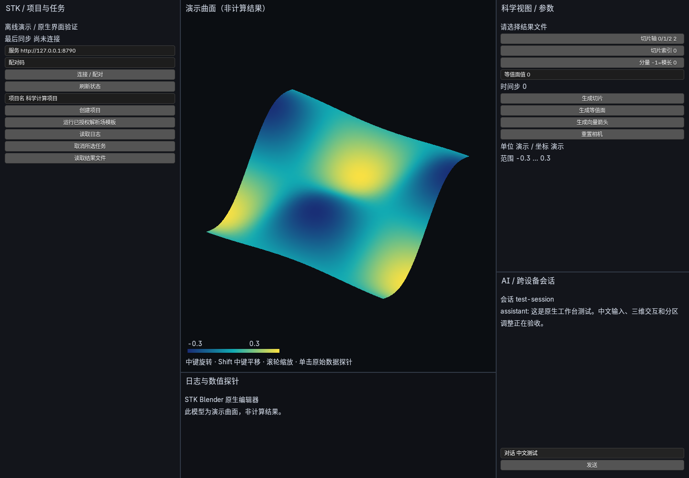

# Blender 原生工作台验证记录

验证日期：2026-09-10。已完成可运行的 Linux 原生原型和计算闭环；跨平台正式发布验收尚未完成。

## 本次结果

- Blender 5.2.1 LTS 定制源码编译、链接、安装成功，实际二进制为 `/tmp/stk-blender-build/bin/blender`。新增编辑器为 C++ `SPACE_STK`，五个区域及三维交互在编辑器内绘制。
- 真实窗口验证通过：着色模型旋转、分隔线拖动、中文 Unicode 文本编辑与提交。测试检查帧变化和本次新产生的操作文件，避免把旧截图或旧命令当成成功。
- 后台验证通过：原生编辑器与操作注册、写入命令队列、保存和重新打开 `.blend`。[后台日志](validation/headless.log)
- 完整 Python 回归 **90 passed，3 条依赖弃用警告**，包含旧 Qt 界面、Runtime、控制服务、模型模拟、科学视图和 Blender 桥接。[回归日志](validation/regression.log)
- 使用固定提交的原始文件重新验证集成补丁；首次应用成功、再次应用不改变文件，本地修改会被拒绝覆盖。C++ 格式检查、Python 编译检查及 `git diff --check` 通过。
- Python sdist 与 wheel 构建成功；从独立目录导入已安装 wheel 中的 Blender 客户端并检查 `suan-blender` 入口通过。安装包提供桥接程序，原生二进制需另行构建。

实际界面截图：



[初始画面](validation/baseline.png)、[旋转后](validation/rotated.png)、[调整分区后](validation/resized.png)、[原始测量报告](validation/report.json)。截图直接读取原生编辑器的 RGBA 帧缓冲；本环境的 Xvfb/Mesa 标准前缓冲截图会返回黑图，故未使用它作为画面证据。

## 科学与任务验证范围

科学验收使用已知解析场，不代表任何具体物理求解器的正确性验收。

- 双精度物理坐标与原始场三线性探针：解析式 `f(x,y,z)=x+2y−3z`，包含 `x≈10⁶` 的远原点、非等距网格、边界及域外请求。探针绝对误差阈值 `10⁻⁹`；禁止默认相对容差放宽远原点测试。
- 三个方向切片的坐标和标量值绝对误差阈值 `10⁻⁷`。VTK 等值面顶点代回解析式的绝对误差阈值 `10⁻⁵`；显示几何在相对坐标中计算，最终 GPU 顶点采用 float32，原始探针保持 float64。这组收紧容差后的 6 项科学测试另行通过。
- VTK 向量箭头生成、网格预算、空间元数据读取，以及 C++ 相机旋转、缩放、平移、自动适配视窗、前后遮挡拾取和物理坐标恢复通过。
- 控制服务→节点代理→真实本地 Runtime 完成建项目、提交解析场任务、读取结果、生成视图、读取原始数据探针。`scalar-0.vti` 切换至 `scalar-1.vti` 后时间步从 0 变为 1，场值整体增加 2；单位和坐标单位来自文件元数据。不匹配的时间步请求被拒绝。
- 丢失提交响应后重启桥接、同一操作重放、SSE 游标恢复、晚到旧视图结果、切换任务时清理旧结果等场景通过。关闭启动器只终止自己管理的桥接进程，正在运行的 Runtime 作业继续执行。
- 模拟模型验证结构化工具批次原子提交、重试幂等、新脚本进入复核、复核前必须查看操作详情；云端上下文剔除命令、环境变量、原始数据和项目路径。未配置或创建 API 密钥，未执行真实云端模型调用。

上述协议闭环、原生窗口和 Python/VTK 精度分别有测试覆盖；尚未进行真实手机、服务器和桌面的跨设备联合现场验收。

## 固定场景性能记录

本次使用 Ubuntu 26.04.1、双路 Intel Xeon E5-2690 v3、48 个逻辑 CPU、约 121 GiB 系统内存。窗口为 Xvfb `1440×1000`、24 位色；渲染器为 Mesa llvmpipe（LLVM 21.1.8），OpenGL 4.5 / Mesa 26.0.8。这是 CPU 软件渲染环境。[完整环境与源码指纹](validation/environment.json)

| 项目 | 本次测量 |
|---|---|
| 固定显示数据 | 32×32 演示曲面，1,024 顶点、1,922 三角形 |
| 首次显示 | 1.272 秒，从启动进程前计时至首次捕获原生编辑器画面 |
| 强制重绘 | 30 次 / 0.540 秒，约 55.5 次/秒 |
| 进程峰值 RSS | 446,196 KiB，约 436 MiB |
| 空闲采样 | 1.199 秒内编辑器重绘 0 次 |
| 显存 | 未测量；本环境为 CPU 软件渲染 |

强制重绘测量期间暂停截图读取；RSS 包含测试截图缓冲。首次显示使用已有文件缓存，不是清缓存后的冷启动；单次小场景测量不能推断大规模科学数据的交互帧率，也不能作为 AMD、Apple、NVIDIA 或国产 GPU 的性能结论。正式性能验收还需固定实机、数据规模和分辨率，覆盖大数据、连续交互、显存和长期运行。

## 构建与复现

上游源码、官方归档 SHA256 和 Linux 依赖提交固定在 [upstream.json](upstream.json)。Python 直接依赖约束见 [requirements-tested.txt](requirements-tested.txt)。本次用 GCC 15.2、CMake 4.2.3、Ninja；原生内嵌 Python 3.13，独立桥接 Python 3.12.13。

本次容器采用 `blender_lite.cmake` 精简配置，并手动启用国际化、Python 安装和 X11：

```bash
cmake -S /tmp/stk-blender-5.2.1 -B /tmp/stk-blender-build -G Ninja \
  -C /tmp/stk-blender-5.2.1/build_files/cmake/config/blender_lite.cmake \
  -DLIBDIR=/tmp/stk-blender-libs \
  -DCMAKE_PREFIX_PATH=/tmp/stk-blender-system/usr \
  -DCMAKE_C_FLAGS=-I/tmp/stk-blender-system/usr/include \
  -DCMAKE_CXX_FLAGS=-I/tmp/stk-blender-system/usr/include \
  -DWITH_GHOST_X11=ON -DWITH_GHOST_WAYLAND=OFF \
  -DWITH_VULKAN_BACKEND=OFF -DWITH_INPUT_IME=ON \
  -DWITH_INTERNATIONAL=ON -DWITH_PYTHON_INSTALL=ON \
  -DCMAKE_BUILD_TYPE=Release -DCMAKE_EXPORT_COMPILE_COMMANDS=ON
cmake --build /tmp/stk-blender-build --target install --parallel 16
```

`/tmp/stk-blender-system` 是本次容器解压系统开发依赖的隔离目录，普通开发机应使用正常安装的上游依赖，省略对应三个路径参数。正式构建入口和依赖获取说明见 [README.md](README.md)。

真实窗口验证可复现为：

```bash
DISPLAY=:95 LIBGL_ALWAYS_SOFTWARE=1 \
  /tmp/stk-runtime-venv/bin/python blender/tests/run_ui_smoke.py \
  --blender /tmp/stk-blender-build/bin/blender --output /tmp/stk-ui-validation
```

显示 `:95` 需预先启动对应分辨率的 Xvfb；实机运行时使用实际显示并取消 `LIBGL_ALWAYS_SOFTWARE`，为每个硬件组合保存独立结果。后台验证使用 `STK_BLENDER_STATE_DIR` 指向测试目录，再运行 `--background --factory-startup --app-template STK --python-exit-code 2 --python blender/tests/smoke.py`。

完整回归命令为 `python -m pytest -q`。本容器旧 Qt 依赖需附加 `QT_QPA_PLATFORM=offscreen`、`MPLCONFIGDIR=/tmp/stk-matplotlib` 和 `LD_LIBRARY_PATH=/tmp/stk-qt-libs/usr/lib/x86_64-linux-gnu`，Runtime 测试需要回环网络。

## 尚未通过的发布条件

当前通过的是 Linux X11 软件渲染原型。Windows、Apple Silicon macOS、Wayland 与 AMD Linux、国产 GPU 的具体驱动组合仍需编译和实机验收。

中文测试覆盖字体绘制和提交后的 Unicode 文本，未覆盖平台输入法的候选窗与组合文本。当前 X11 精简配置不具备 Blender 的 Wayland IME 路径；正式 Linux 包需启用 Wayland 并测试中文输入法。剪贴板、多个 DPI/缩放比例、休眠恢复、图形设备丢失、无障碍和长期稳定性仍待专项验收。

鸿蒙当前只有环境诊断和移植设计，**尚无 GHOST OHOS 实现、可安装原生包或模拟器通过记录**。当前环境未发现 SDK、DevEco 工具或 `hdc`，需要用户提供此前提到的 SDK/模拟器位置才能继续目标工具链上的实现与验证。[诊断结果](validation/harmony-environment.json) / [移植边界](platforms/harmony/README.md)。真机兼容性和性能仍是鸿蒙正式发布的必要条件。

科学视图目前采用有大小预算的 JSON 三角网格；通用时间序列索引、分块二进制缓存和大型数据渐进传输尚未完成。网页/PWA 沿用现有控制协议，真实多设备会话恢复仍待联合验收。复杂专业工具与 Qt 的全面迁移继续留在后续阶段；现有 Runtime 和 Qt 回归继续保留。
