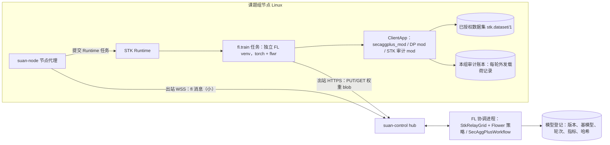

# 联邦学习框架评估：现有框架能否满足 STK 的需要

状态：**调研结论，待所有者决定；均未实现。** 上位方案：[思劲平台方向](sijin-platform-2026-10.md)“所有者决定”第 5、6、7 条。以下内容由调研整理，标“未核实”处没有一手来源；涉及法律的结论须法务确认。

日期：2026-10-08。对应 STK 仓库 `docs/design/sijin-platform-2026-10.md`
“所有者决定”第 5 条：先评估现有框架，再决定用现成框架还是自研（S4 之前完成）。

**怎么核实的**：发行版本与日期、Python 范围和依赖取自 PyPI JSON API；仓库活跃度、是否归档取自 GitHub REST API；
许可证逐个读了仓库里的 LICENSE 文件。此外下载了 `flwr` 1.39.0、`nvflare` 2.9.0、`appfl` 1.11.0、`fedbiomed` 6.4.1
的 wheel 包，**只做了源码静态阅读，没有运行任何框架**。文中标“未核实”的内容没有一手来源。所有数据截至 2026-10-08。

---

## 结论摘要

- **没有哪个现成框架能开箱满足全部 10 条需求。** 最接近的是 **Flower（`flwr`）**：Apache-2.0，PyTorch 支持完善，
  有 FedAvg 和 FedProx，开源版自带 SecAgg+ 与差分隐私，节点只需出站连接，几乎每周发版。NVIDIA FLARE 排第二：
  站点侧的隐私策略和审计做得最好，但不支持 Windows，没有掩码式安全聚合（只有同态加密），整套系统也偏重。
  其余候选要么已停更或即将归档（OpenFL、FATE、FedML、Substra、FedScale、FederatedScope），
  要么许可不允许商用（IBM FL），要么定位不对（PySyft）。
- **推荐方案 A1：把 Flower 当作算法库，跑在 STK 自己的出站 WSS 中继上。** 协调端实现 Flower 的抽象 `Grid` 接口
  （`get_node_ids / push_messages / pull_messages / send_and_receive`），节点端在 Runtime 任务里直接调用
  `ClientApp(message, context)`。**不部署** SuperLink/SuperNode，不开任何入站端口，也不额外走一条 gRPC 链路。
  源码已确认：SecAgg+ 工作流只用到 `grid.get_node_ids()`、`grid.run` 和 `grid.send_and_receive()`，见第二节。
  备选是 A2：用 Flower 的 `grpc-adapter` 传输，经我们的中继做隧道（NVFlare 集成 Flower 时就是这么做的）。
- **主要差距**：
  1. 设计文档里写的 Flower“传输可自定义”不准确。1.39 只能通过配置选 `grpc-rere` 或 `grpc-adapter`，
     要走我们的中继，必须自己写 Grid 适配或隧道。
  2. SecAgg+ 只存在于旧版（legacy）API：`LegacyContext`、`NumPyClient`、`flwr.client.mod`。
     新的 Message API 策略里没有安全聚合，而 Flower 正在逐步淘汰旧 API。
  3. “离开本组的是什么”的审计、按数据集授权（opt-in）、模型登记，这些都得 STK 自己做。
     开源 Flower 没有审计日志（审计日志是企业版功能），而且企业版也只记元数据。
- **依赖冲突，需要所有者决定**：`flwr` 从 1.31.0（2026-06-08）起要求 Python ≥ 3.11。1.39.0 硬性锁定
  `fastapi>=0.138,<0.139`，而 STK 的 `control` extra 锁定的是 `fastapi==0.141.1`，两者在同一个虚拟环境里装不下。
  可选的做法有三种：FL 节点放弃 Python 3.10；固定使用 `flwr<1.31`；或者给 FL 单独建一个虚拟环境（推荐）。
- **Windows 是 STK 自己的问题，不只是框架的问题。** STK 的 Runtime 和节点代理目前只在 Linux 上运行
  （见 `docs/hub.md`）。Flower 在 PyPI 上只声明支持 Linux 和 macOS，没有正式的 Windows 支持说明。
  NVFlare、Fed-BioMed、SecretFlow 都不支持原生 Windows。Windows 工作站要参与训练，需要先决定走 WSL2 还是另配一台 Linux 节点。
- **自研（方案 C）**：在中继上实现 FedAvg/FedProx 工作量很小，难的是安全聚合（密钥协商、Shamir 秘密分享、掉线恢复）。
  建议直接复用 Flower 的 SecAgg+ 实现，不要重写。这样 A1 和 C 实际上会收敛成同一个形态：STK 负责编排，Flower 只当算法库。

---

## 一、对照表

图例：✅ 满足｜◐ 部分满足或需要我们开发｜✗ 不满足｜? 未核实。

### 1.1 主要候选

| 需求 | Flower 1.39 | NVIDIA FLARE 2.9 | APPFL 1.11 | Fed-BioMed 6.4 | 自研（C） |
|---|---|---|---|---|---|
| 1 横向 FL、FedAvg/FedProx、非 IID、3–20 站点、轮间进出 | ✅ FedAvg、FedProx、FedAvgM、FedAdam/Yogi/Adagrad、QFedAvg 等；每轮从在线节点中采样 | ✅ FedAvg、Scaffold、FedProx 损失（PT）；按最少客户端数推进 | ✅ FedAvg、FedAvgM、FedAdam、FedAsync、FedBuff、FedCompass；有 FedProx trainer | ◐ FedAvg、Scaffold、`fedprox_mu`；以研究者为中心的流程 | ◐ FedAvg/FedProx 容易实现，其余要自己写 |
| 2 安全聚合 / 差分隐私 | ✅/◐ SecAgg 与 SecAgg+（容忍掉线），但只在旧 API；DP 有中心式和本地式，带 RDP 记账 | ◐ 没有掩码式 SecAgg，只有同态加密（TenSEAL，Linux 专用）；DP 过滤器加 Opacus | ◐ 两两掩码，**不容忍掉线**；有 DP 和 Opacus | ✅ Joye-Libert 与 LOM 安全聚合；DP 用 Opacus | ✗ 安全聚合需要从零写并做密码学审查 |
| 3 可审计“离开本组的内容”，按数据集 opt-in | ◐ 客户端 mod 可以检查外发消息；审计日志是企业版功能且只记元数据 | ✅/◐ 站点侧隐私策略（scopes、结果过滤器）和每个作业的 `audit.log`；没有载荷级展示 | ◐ 要自己做 | ◐ 节点侧有“训练计划审批”；载荷展示要自己做 | ✅ 完全由我们掌控 |
| 4 跑在我们自己的出站 WSS 中继上 | ◐ 节点只出站（gRPC 9092）；要走中继，得写 `Grid` 适配或 `grpc-adapter` 隧道 | ◐ 节点只出站；可加自定义驱动（`comm_driver_path`），已有 http/websocket 驱动 | ◐ 通信器与 agent 解耦，可自写通信层 | ◐ 节点出站连研究者的 gRPC 服务端；没有自定义传输 | ✅ |
| 5 自托管与完全离线 | ✅ 需关闭遥测（默认开启）和更新检查 | ✅ 自建，需要 provisioning 证书 | ✅（Globus 部分除外） | ✅ | ✅ |
| 6 作为库在我们的任务运行器里跑 | ✅/◐ `ClientApp.__call__` 与 `Grid` 抽象可用；serde 属于内部 API | ◐ 训练代码可通过 Client API 嵌入，但编排必须用 FLARE 自己的进程 | ✅ `ClientAgent`/`ServerAgent` 本身就是库 | ✗ 以自带 CLI 和进程为主 | ✅ |
| 7 PyTorch、Windows、Python 3.10–3.12、资源占用、国内镜像 | ◐ PyTorch ✅；Windows ?；Python ≥ 3.11；锁定 fastapi 0.138；阿里云和清华镜像都有 1.39.0 | ◐ PyTorch ✅；Windows ✗（未列为支持平台）；Python ≥ 3.10；依赖重（Flask==3.1.3、gunicorn、docker 等）；镜像都有 | ◐ PyTorch ✅；Windows ?；依赖很重（ray、globus、wandb、boto3 等都是必装） | ✗ Python < 3.12；没有 Windows；带医学影像依赖 | ✅ |
| 8 许可与付费墙 | ✅ Apache-2.0，无 CLA；OIDC、审计日志、多联邦、PostgreSQL 状态库属于企业版；SecAgg+ 和 DP 是开源的 | ✅ Apache-2.0，贡献需签 DCO；没有发现付费墙 | ✅ MIT | ✅ Apache-2.0 | ✅ |
| 9 成熟度与维护 | ✅ 1.39.0 发布于 2026-09-28，约每周一版，约 7.2k stars；有中文文档翻译（完整度未核实） | ✅ 2.9.0 发布于 2026-09-04；NVIDIA 主导 | ◐ 1.11.0 发布于 2026-08-25，约 186 stars | ◐ 6.4.1 发布于 2026-08-06，约 93 stars | — |
| 10 迁移学习与版本化钩子 | ◐ 可以用预训练权重作为初始参数；没有模型登记 | ◐ 同左（有模型持久化组件） | ◐ 同左（有 checkpoint） | ◐ 同左 | ◐ 由 STK 的模型登记（S3）承担 |

### 1.2 排除的候选

| 框架 | 许可（LICENSE 文件） | 维护证据 | 一票否决的原因 |
|---|---|---|---|
| OpenFL（LF，原 Intel） | Apache-2.0，[LICENSE](https://github.com/securefederatedai/openfederatedlearning/blob/develop/LICENSE) | 最后一版 v1.9（2025-06-23） | README 原文：“is no longer under active development and will soon be archived… we recommend the community transitions to Flower” |
| IBM Federated Learning | **IBM 自定义许可，仅限非商业用途**，[LICENSE](https://github.com/IBM/federated-learning-lib/blob/main/LICENSE) | 仓库已归档，最后一版 v2.0.1（2023-08） | 许可第 3 条：“use the Program for non-commercial purposes” |
| FedML / TensorOpera | Apache-2.0，[LICENSE](https://github.com/FedML-AI/FedML/blob/master/LICENSE) | PyPI 最后一版 0.9.6（2025-02-24）；GitHub 最后推送 2025-10-28 | 维护停滞；gRPC 后端让**每个参与方**都在 `0.0.0.0:port` 上监听，且不加密（`add_insecure_port`），需要入站端口；文档的主流程以 TensorOpera/MLOps 平台为中心（自托管方式未核实） |
| FATE（微众银行，LF） | Apache-2.0，[LICENSE](https://github.com/FederatedAI/FATE/blob/master/LICENSE) | 最后一版 v2.2.0（2024-07-31），最后推送 2024-11 | 维护停滞；部署重（FATE-Flow、OSX/rollsite、EggRoll）；跨方通信组件（1.x 文档中 rollsite 用 9370 端口）需要能被对方或 exchange 访问 |
| PySyft（OpenMined） | Apache-2.0，[LICENSE](https://github.com/OpenMined/PySyft/blob/dev/LICENSE) | 0.10.0（2026-08-26） | 已转向“远程数据科学”，传输走 Google Drive；README 没有 FedAvg 训练 |
| Substra（LF，Owkin） | Apache-2.0，[LICENSE](https://github.com/Substra/substra/blob/main/LICENSE) | 1.0.0（2024-10-14）之后无推送 | 维护停滞；服务端打包在 Kubernetes 上 |
| SecretFlow（蚂蚁） | Apache-2.0，[LICENSE](https://github.com/secretflow/secretflow/blob/main/LICENSE) | 1.14.0b0（2025-09-26），全是 beta 版 | README：“Non-release versions … are prohibited from using in any production environment”；Python 3.10；推荐 8 核 16G；Windows 只能用 WSL2 |
| FedScale | Apache-2.0，[LICENSE](https://github.com/SymbioticLab/FedScale/blob/master/LICENSE) | 最后推送 2023-12 | 偏研究与基准测试，已停更 |
| FederatedScope（阿里） | Apache-2.0，[LICENSE](https://github.com/alibaba/FederatedScope/blob/master/LICENSE) | 最后一版 v0.3.0（2023-04），最后推送 2024-08 | 已停更 |
| TensorFlow Federated | Apache-2.0，[LICENSE](https://github.com/google-parfait/tensorflow-federated/blob/main/LICENSE) | PyPI 0.87.0（2024-09），只有 manylinux wheel | 只支持 TensorFlow，不支持 PyTorch，直接排除 |

---

## 二、各框架说明

### 2.1 Flower（`flwr`，Flower Labs）

- **许可**：Apache-2.0，见 <https://github.com/flwrlabs/flower/blob/main/LICENSE>。源文件头是
  “Copyright 2025 Flower Labs GmbH … Licensed under the Apache License, Version 2.0”。
  仓库已从 `adap/flower` 迁到 `flwrlabs/flower`。
  [CONTRIBUTING.md](https://github.com/flwrlabs/flower/blob/main/CONTRIBUTING.md) 只要求贡献按 Apache-2.0 授权，**没有 CLA**。
  Apache-2.0 允许闭源商用分发，只需保留许可与版权声明；两个仓库都没有 NOTICE 文件。
- **企业版边界**（读 1.39.0 源码与文档核实）：开源包里预留了 `flwr.ee` 的导入钩子（`flwr/superlink/config_loader.py`、
  `flwr/superlink/extensions.py`），装上企业版才有以下功能：
  - Control API 的 OIDC 账户认证。文档原文：“OpenID Connect Authentication is a Flower Enterprise feature.”
    （<https://flower.ai/docs/framework/how-to-authenticate-accounts.html>）
  - 审计日志。文档原文：“Audit logging is a Flower Enterprise feature.”，而且只记元数据，例如 `FleetServicer.PullMessages`，
    不记载荷（<https://flower.ai/docs/framework/how-to-configure-audit-logging.html>）。
  - 多联邦管理（FederationManager）、非 SQLite 的状态库（如 PostgreSQL）、许可插件，以及 “SuperGrid Extensions”。

  **开源可用**的有：SecAgg 与 SecAgg+、DP 包装器与 DP mod、TLS、SuperNode 的 EC 密钥认证
  （<https://flower.ai/docs/framework/how-to-authenticate-supernodes.html>），以及 FAB 签名校验（`trusted_entities`）。
  **安全聚合不在付费墙后面。**
- **传输模型**（<https://flower.ai/docs/framework/ref-flower-network-communication.html>）：
  - SuperNode 作为 gRPC 客户端，**主动连接** SuperLink 的 Fleet API（默认 9092）。文档原文：
    “only outgoing connections are necessary to connect to the SuperLink”。
  - `flwr` CLI 与 ServerApp 通过 HTTP 连接 SuperLink 的 8000 端口。Runtime API 从 1.35 起、Control API 从 1.37 起改为 HTTP。
  - process 隔离模式下，SuperNode 会在本机 9094 端口提供 Runtime API。
  - 1.39 的 `TRANSPORT_TYPES` 只有 `grpc-rere`、`grpc-adapter` 和仅用于仿真的 `vce`（见 `flwr/common/constant.py`），
    **不能通过配置换成 WebSocket 或我们的中继。**
  - `grpc-adapter` 的作用是把 Fleet API 的每个请求包成 `MessageContainer{grpc_message_name, grpc_message_content: bytes, metadata}`，
    统一走一个一元 RPC `GrpcAdapter.SendReceive`，便于经第三方系统转发。NVFlare 就是这样把 Flower 作业放在自己的通信层上跑的
    （<https://nvflare.readthedocs.io/en/2.6/user_guide/flower_integration/flower_detailed_design.html>）。
  - 风险：如果校园网只放行经 HTTP 代理的 HTTPS，或者做 TLS 检查，gRPC/HTTP2 可能连不通。是否会遇到要看每所学校，未核实。
- **安全聚合**：有 SecAgg 和 SecAgg+（<https://flower.ai/docs/framework/explanation-ref-secure-aggregation-protocols.html>）。
  - 威胁模型是诚实但好奇的服务器。私钥用 Shamir 秘密分享拆分，可以容忍部分掉线。
  - 主要参数：`num_shares`、`reconstruction_threshold`、`clipping_range=8.0`、`quantization_range=2^22`、`modulus_range=2^32`
    （<https://flower.ai/docs/framework/ref-api/flwr.server.workflow.SecAggPlusWorkflow.html>）。
  - **只能用旧 API**：服务端是 `flwr.server.workflow.SecAggPlusWorkflow`，要求 `LegacyContext`；客户端是
    `flwr.client.mod.secaggplus_mod`。官方示例用的是 `NumPyClient` 加 `flwr.server.strategy.FedAvg`
    （<https://github.com/flwrlabs/flower/tree/main/examples/flower-secure-aggregation>）。
    新的 `flwr.serverapp.strategy` 和 `flwr.clientapp.mod` 里没有 secagg（grep wheel 确认）。
  - 示例用的 `NumPyClient` 就在 `flwr/compat/client/numpy_client.py` 里，而 `flwr.compat` 包的说明是
    “Compatibility package containing deprecated legacy components”。这是安全聚合依赖逐步淘汰的 API 的直接证据。
- **差分隐私**（<https://flower.ai/docs/framework/how-to-use-differential-privacy.html>，文档注明处于 preview）：
  - 服务端裁剪：`DifferentialPrivacyServerSideFixedClipping` 和 `…AdaptiveClipping`。
  - 客户端裁剪：`DifferentialPrivacyClientSide…`，配合 `fixedclipping_mod` 或 `adaptiveclipping_mod`。
  - 本地 DP：`LocalDpMod`。
  - 样本级 DP 用 Opacus。代码里有 `supercore/privacy_accounting/rdp_accountant.py`。
- **审计钩子**：mod 可以“inspect the incoming Message and the resulting outgoing Message”
  （<https://flower.ai/docs/framework/how-to-use-built-in-mods.html>），内置的有 `arrays_size_mod` 和 `message_size_mod`。
  我们可以写一个 STK 审计 mod，在消息发出前记录并展示载荷。
- **作为库使用**（读源码核实）：
  - `ClientApp.__call__(message, context) -> Message` 可以在进程内直接调用。
  - `flwr.serverapp.Grid` 是抽象基类，有 `get_node_ids`、`push_messages`、`pull_messages`、`send_and_receive`、`create_message`。
  - 新 API 的 `FedAvg.aggregate_train(server_round, replies)` 是纯计算。
  - 旧 API 的 `DefaultWorkflow` 和 `SecAggPlusWorkflow` 只调用 `grid.get_node_ids()`、`grid.run.run_id` 和 `grid.send_and_receive()`。
  - 消息序列化用 `flwr.common.serde.message_to_proto/message_from_proto`，但这不在文档声明的公开 API 里。
  - 结论：**库模式可行**，但要依赖半内部的接口。
- **Windows**：
  - PyPI classifier 只列了 `POSIX :: Linux` 和 `MacOS`。安装文档只写“Flower requires at least Python 3.11”，没有说明支持哪些操作系统
    （<https://flower.ai/docs/framework/how-to-install-flower.html>）。
  - 源码里有 `os.name == "nt"` 分支；仿真（Ray）在 Windows 上会提示“experimental… run best in WSL2”。
  - wheel 是纯 Python 的；依赖的 `grpcio` 1.84 有 cp310–cp313 的 win_amd64 轮子。
  - **原生 Windows 能不能用，未核实。**
- **Python、依赖与资源占用**：
  - 1.39.0 要求 `>=3.11`。1.30.0（2026-05-20）是最后一个支持 3.10 的版本，从 1.31.0（2026-06-08）起放弃 3.10。
  - 1.39 的核心依赖（不能按 extra 拆分）包括 `grpcio`、`protobuf<7`、`cryptography<47`、`fastapi>=0.138,<0.139`、
    `starlette>=1.3.1,<1.4`、`uvicorn[standard]`、`sqlalchemy[asyncio]`、`alembic`、`uv`、`httpx`。
    fastapi 与 starlette 的这组锁定从 1.33 起就有，与 STK 的 `fastapi==0.141.1` 冲突。
  - 1.30.0 还没有引入 fastapi 依赖。
  - 解压后 5.1 MB，不依赖 torch（PyTorch 由我们自己装）。
- **离线运行**：
  - 遥测**默认开启**：`FLWR_TELEMETRY_ENABLED` 默认为 `"1"`，上报到 `https://telemetry.flower.ai/api/v1/event`（`flwr/supercore/telemetry.py`）。
  - 另有更新检查，可用 `FLWR_DISABLE_UPDATE_CHECK` 关闭。
  - STK 必须把这两项都关掉。SuperNode 默认不在运行时安装依赖。
- **国内镜像**：2026-10-08 实测，阿里云和清华的 PyPI 镜像都有 `flwr-1.39.0-py3-none-any.whl`。
- **成熟度**：1.39.0 发布于 2026-09-28；1.33 到 1.39 共 8 周 7 个版本；约 7.2k stars，408 个 open issue，当天仍有推送；
  classifier 为 Production/Stable。OpenFL 官方建议迁移到 Flower。有中文文档翻译
  （<https://flower.ai/docs/framework/main/zh_Hans/index.html> 可访问，完整度未核实）。
- **迁移学习**：把预训练权重（`ArrayRecord(model.state_dict())`）作为初始参数，例如传给 `strategy.start(initial_arrays=…)`，
  冻结哪些层由训练代码决定。没有模型登记或版本库。
- **风险**：
  - API 变动快：Runtime API 和 Control API 分别在 1.35（2026-08-25）和 1.37（2026-09-15）才改成 HTTP。
  - 安全聚合挂在逐步淘汰的旧 API 上。
  - Python 下限与 fastapi 锁定。
  - 由单一公司主导，部分运维功能放在企业版。

### 2.2 NVIDIA FLARE（`nvflare`）

- **许可**：Apache-2.0，见 <https://github.com/NVIDIA/NVFlare/blob/main/LICENSE>。贡献须签 DCO
  （[CONTRIBUTING.md](https://github.com/NVIDIA/NVFlare/blob/main/CONTRIBUTING.md)）。没有发现付费功能。
- **传输模型**（<https://nvflare.readthedocs.io/en/main/user_guide/admin_guide/configurations/communication_configuration.html>）：
  - 服务端监听端口：provisioning 示例里 `fed_learn_port: 8002`，另有 admin 端口。原文：
    “All client cells are connected to the server cell … By default, all sites only connect to the server”，即站点只出站。
  - 2.9.0 wheel 里的驱动：gRPC（默认）、`aio_http_driver`（基于 aiohttp 的 websocket，方案为 http/https）、tcp/stcp、shared-file。
    另有 “FLARE supports custom communication drivers”，通过 `comm_driver_path` 加载。provisioning 支持中继节点（tree_prov）。
- **安全聚合与 DP**：
  - 在 2.9.0 wheel 里 grep `secagg`、`secure aggregation`、`pairwise mask`，**都没有结果**，也就是没有掩码式安全聚合。
  - 替代方案是同态加密（`nvflare/app_opt/he`，基于 TenSEAL CKKS）。按安装文档，HE 只支持 Python 3.10–3.13，且不支持 macOS
    （<https://nvflare.readthedocs.io/en/main/installation.html>）。
  - DP 方面有 `PercentilePrivacy`、`SVTPrivacy`、`ExcludeVars` 等过滤器，样本级用 Opacus
    （<https://nvflare.readthedocs.io/en/main/user_guide/admin_guide/security/differential_privacy.html>）。
- **审计与站点控制**：
  - 过滤器可以挂在四个位置：任务数据和任务结果，服务端和客户端各一处
    （<https://nvflare.readthedocs.io/en/main/user_guide/admin_guide/security/data_privacy_protection.html>）。
  - 源码有站点侧的 `nvflare/private/privacy_manager.py`（scopes，站点自己定义）和每个作业的 `audit.log`。
  - 这是候选里最接近“站点说了算”的设计，但没有面向课题组的载荷展示。
- **作为库**：
  - Client API 可以嵌进训练脚本；2.9.0 wheel 里有 Recipe 和 Collab API（`nvflare/recipe`、`nvflare/collab`），可以从 Python 提交作业。
  - 但生产部署仍然需要 provisioning（startup kit 与证书）、常驻的服务端和客户端进程，以及每个作业单独的 job cell。
  - 不能像库一样只取聚合算法来用。
- **Windows**：安装文档只写了 “Linux” 和 “OSX”；PyPI classifier 只有 Linux。**Windows 未列为支持平台**，按不支持处理。
- **Python 与依赖**：要求 ≥ 3.10（文档说测试到 3.14）。核心依赖有 `Flask==3.1.3`、`gunicorn`、`docker`、`aiohttp`、`pydantic`、
  `grpcio` 等，偏重。
- **成熟度**：2.9.0 发布于 2026-09-04，2.9.1rc1 发布于 2026-09-24，当天仍有推送，约 981 stars，NVIDIA 主导。
  可以把 Flower 应用作为 FLARE 作业运行
  （<https://nvflare.readthedocs.io/en/main/user_guide/data_scientist_guide/flower_integration/flower_run_as_flare_job.html>）。
- **风险**：不支持 Windows；没有掩码式安全聚合；体系重；FLARE 自带一套身份与证书，会和 STK 的 hub 身份体系重复。

### 2.3 APPFL（Argonne）

- **许可**：MIT，“Copyright (c) 2023 Argonne National Laboratory”，见 <https://github.com/APPFL/APPFL/blob/main/LICENSE>。
- **架构**：`ClientAgent` 和 `ServerAgent` 与通信器解耦。通信器有 MPI、gRPC、Globus Compute、Ray，**适合放到我们自己的传输上**。
  聚合器很全：FedAvg、FedAvgM、FedAdam、FedYogi、FedAdagrad、FedAsync、FedBuff、FedCompass 等；有 FedProx trainer。
- **安全聚合**：`appfl/privacy/secure_aggregator.py` 是基于预共享秘密的两两掩码。docstring 明确写着
  “**No Dropout Tolerance**: ALL clients that start a round MUST complete it”，而且无法防止服务器与客户端合谋。
  DP 方面有 `dp.py` 和 `opacus_dp.py`。
- **依赖**：`ray[default]`、`globus-sdk`、`globus-compute-endpoint`、`wandb`、`boto3`、`proxystore[all]`、`seaborn`、`opacus` 等
  **全部是必装依赖**，占用很大。Windows 支持未核实（classifier 写的是 “OS Independent”）。
- **成熟度**：1.11.0 发布于 2026-08-25，约 186 stars，美国能源部资助。
- **结论**：设计思路可以参考，但安全聚合太弱、依赖太重，不建议作为主线。

### 2.4 Fed-BioMed（Inria）

- **许可**：Apache-2.0，“Copyright (c) 2021-present Inria and UCA”，见 <https://github.com/fedbiomed/fedbiomed/blob/develop/LICENSE.md>。
- **传输**：研究者一端运行 gRPC 服务端（`fedbiomed/transport/server.py`，`add_secure_port`），节点主动连过去。
  端口矩阵未核实。
- **隐私**：安全聚合有 Joye-Libert 和 LOM 两种（<https://arxiv.org/abs/2409.00974>）；DP 用 Opacus。
  节点侧有**训练计划审批**（`FBM_SECURITY_TRAINING_PLAN_APPROVAL`），节点管理员要先批准训练代码才会执行，
  是 STK“按数据集 opt-in”可以借鉴的做法。
- **不适合的原因**：要求 Python `>=3.10,<3.12`（不含 3.12）；不支持 Windows；依赖里带 `monai`、`itk`、`nibabel`、`unet` 等医学影像包；
  流程以研究者为中心。6.4.1 发布于 2026-08-06，约 93 stars。

### 2.5 排除项的补充证据

- **OpenFL**：README 第 27 行写明不再积极开发、即将归档，建议迁移到 Flower
  （<https://github.com/securefederatedai/openfederatedlearning>）。1.8 版加过 SecAgg，但只支持 `WaitForAllPolicy`
  （<https://openfl.readthedocs.io/en/v1.8/about/features_index/secure_aggregation.html>）。
- **IBM FL**：<https://github.com/IBM/federated-learning-lib/blob/main/LICENSE> 第 3 条只允许非商业用途，
  并禁止修改、分发和逆向工程。GitHub API 显示仓库 `archived=true`。
- **FedML**：许可 Apache-2.0（<https://github.com/FedML-AI/FedML/blob/master/LICENSE>）。
  [`grpc_comm_manager.py`](https://github.com/FedML-AI/FedML/blob/master/python/fedml/core/distributed/communication/grpc/grpc_comm_manager.py)
  第 72 行是 `add_insecure_port("0.0.0.0:port")`，按 ip_config 表直连对方。MQTT+S3 后端的自托管方式未核实。
- **FATE**：v2.2.0 发布于 2024-07-31，此后没有新版本。HomoNN 的 FedAVG “featuring secure aggregation”
  （<https://github.com/FederatedAI/FATE/blob/master/doc/2.0/fate/components/homo_nn.md>）。
  跨方组件需要入站端口，依据是 1.x 文档（<https://fate.readthedocs.io/en/develop/_build_temp/cluster-deploy/README.html>）。
- **PySyft**：README 写着 “Works over Google Drive today, extensible to any file-based transport”（<https://github.com/OpenMined/PySyft>）。
- **SecretFlow**：安装文档写 “SecretFlow does not support Windows directly now” 以及 “Python：3.10”
  （<https://github.com/secretflow/secretflow/blob/main/docs/getting_started/installation.md>）。

---

## 三、方案比较

| 方案 | 做法 | 工作量（粗估，1 名熟悉 STK 的工程师） | 主要风险 |
|---|---|---|---|
| **A1** Flower 作库，走我们的中继 | 协调端实现 `StkRelayGrid(Grid)`，在它上面跑 Flower 策略或旧版工作流（含 SecAgg+）；节点端在 Runtime 任务里调用 `ClientApp(message, context)`，挂 secagg、DP 和 STK 审计 mod；权重走 hub 的 blob | FedAvg、FedProx、DP 加审计 3–5 人周；SecAgg+ 接入加掉线测试再 1–2 人周 | serde 与 Grid 是半内部接口，要跟着升级；SecAgg+ 在旧 API 上；节点要独立的 FL 虚拟环境（Python ≥ 3.11 或固定 `flwr<1.31`）；Context 状态要我们持久化 |
| **A2** Flower 原生运行时，`grpc-adapter` 隧道 | 节点运行 SuperNode，指向本机回环上的 STK 隧道桩；字节经 WSS 送到协调端，再转给本机的 SuperLink（`--fleet-api-type grpc-adapter`） | 隧道 2–3 人周；SuperLink、SuperNode 进程与 FAB 生命周期管理 1–2 人周 | 要多管两类常驻进程；FAB（应用代码）由协调端下发，必须开签名校验；适配器协议是内部细节；Windows 上的 SuperNode 未核实 |
| **B** 框架自带网络（Flower SuperLink 或 NVFlare 服务端） | 在公网或客户本地暴露 SuperLink 9092（或经支持 HTTP/2 的反向代理挂到 443），站点只出站 | 搭起来 1–2 人周 | 和 hub 并存第二条网络与身份体系（两套证书与配对）；校园网可能不放行 gRPC/HTTP2；每个站点都要再走一遍网管审批；审计照样得自己做 |
| **C** 完全自研 | 在 hub 上自己实现 FedAvg/FedProx、安全聚合与 DP（DP 用 Opacus） | FedAvg/FedProx 2–3 人周；从零写安全聚合 4–8 人周，加外部密码学审查 | 密码学实现出错；掉线恢复与阈值参数要自己验证；长期维护成本 |
| **C′** 自研编排加 Flower 原语 | 同 C，但安全聚合复用 `flwr.common.secure_aggregation`（Shamir、量化、对称加密）或整套旧版工作流 | 与 A1 接近 | 与 A1 相同。实际上就是 A1 |

补充两点：

- **站点很少时**：如果一轮只有 2 个参与方，任一方都能从聚合结果减去自己的更新，反推出另一方的更新。
  因此应规定**每轮至少 3 个参与方才聚合**，并设好 `reconstruction_threshold`。
- **FedProx**：各框架的 FedProx 都只在服务端下发 `proximal_mu`，近端项要由客户端训练循环自己加。
  STK 的 `train` 函数必须实现这一项，选哪个框架都一样。
- **站点少时的中心式 DP**：噪声相对信号会很大，对模型效果影响明显。建议优先用站点本地的样本级 DP（Opacus DP-SGD），并做实验验证。

---

## 四、推荐与 STK 集成草图

**推荐 A1**：Flower 只当算法库用，通信、身份、审计、调度都由 STK 负责；A2 作为备选。理由有四点：

1. 只用 hub 已有的出站 WSS 和 HTTPS，不新增端口，也不需要再向校方网管申请一条 gRPC 链路；
2. “离开本组的是什么”由 STK 在发出前记录和展示，不依赖 Flower 企业版；
3. 安全聚合与 DP 复用 Flower 现成的、经过论文与社区检验的实现；
4. 将来换框架或自研时，只需替换算法层。

### 组件映射

| STK 组件 | 承担的 FL 职责 | 需要新增或修改的内容 |
|---|---|---|
| **FL 协调进程**（与 hub 同机，或客户本地自建） | 联邦运行对象：模型规格、策略（FedAvg/FedProx）、轮数、每轮最少参与方、SecAgg+ 与 DP 参数；实现 `StkRelayGrid`；只保存聚合结果；每轮写记录（参与方、样本数、指标、各载荷的 sha256） | 新进程，与 hub 各用独立的虚拟环境（hub 的 `control` extra 锁定 fastapi 0.141.1，与 flwr 冲突）。只需要 numpy 加 flwr，不需要 torch；hub 本身不引入 Flower 依赖 |
| **hub（suan-control）** | 转发 FL 消息；存放全局模型与更新的 blob | 新增操作类型，例如 `fl.message`。hub 现有上限是请求 1 MiB、帧 16 MiB，权重必须走 blob。现在节点只能取 `workspace.import` 所列的 blob，需要加一条节点读取 FL 全局模型 blob 的路由 |
| **节点代理（suan-node）** | 收到 FL 消息后检查这个运行是否已获本组授权，再提交 Runtime 任务；保存每个运行、每个节点的 Flower `Context`，供 SecAgg 多阶段使用 | 新增 FL 授权表；`Context` 持久化在节点状态目录 |
| **Runtime 任务 `fl.train`** | 在独立虚拟环境里加载数据与模型，执行 `ClientApp(message, context)`；排队、日志、取消沿用现有机制 | 新的任务模板；FL 虚拟环境的 Python 与依赖锁定与主环境分开 |
| **STK 审计 mod** | 在外发消息离开进程前，记录消息类型、轮次、数组名称、形状与 dtype、字节数、sha256、样本数、指标、DP 参数（裁剪、噪声、ε）、是否经 SecAgg 掩码；可选择“首轮或每轮人工放行” | 新增；记录写入项目，课题组在桌面端查看 |
| **数据集契约 `stk.dataset/1`（S3）** | 按数据集 opt-in：哪个模型或运行可以用、何时撤回 | 新字段；节点拒绝未授权运行的消息 |
| **模型登记（S3）** | 每轮或最终的全局模型作为新版本登记；迁移学习用登记中的基模型作为 `initial_arrays`；客户本地微调复用同一份 `train` 函数，不走联邦 | 与 S3 的登记统一 |
| **离线交付（S7）** | 设置 `FLWR_TELEMETRY_ENABLED=0` 与 `FLWR_DISABLE_UPDATE_CHECK=1`；随包带上所有 wheel；不用 FAB 和运行时依赖安装 | 打包脚本 |

### 实施顺序建议（S4 内）

1. 写一个单进程原型：用内存版 `Grid` 加 3 个 `ClientApp`，跑通 FedAvg/FedProx；在一个 MuFerro 生成的小数据集上验证收敛。
2. 换成 `StkRelayGrid`，经 hub 跑通三节点、只出站网络下的多轮训练，权重走 blob。
3. 接入审计 mod 和授权检查，桌面端显示每轮外发内容。
4. 接入 SecAgg+（旧 API）与 DP，测试掉线、少于 3 个参与方、节点中途加入等情况。
5. 写一个升级守护测试：锁定 `flwr` 版本，CI 覆盖 Grid、serde 与 SecAgg 的接口，升级前必须跑通。

### 需要所有者决定

- FL 节点的 Python 下限：选 ≥ 3.11（跟进最新 Flower），还是固定 `flwr<1.31` 以保留 3.10。
- FL 是否用独立虚拟环境（推荐），还是调整 STK `control` extra 里的 `fastapi==0.141.1`。
- Windows 站点：原生支持（需要先把 STK Runtime 移植到 Windows）、WSL2，还是统一另配 Linux 节点。
- 每轮最少参与方数，以及安全聚合是默认开启还是可选。

---

## 五、不确定之处

- **Flower 在原生 Windows 上能否正常运行**：没有官方说明，也没有实测；只有 classifier、源码分支和 grpcio 的 Windows 轮子作为间接证据。
- **Flower 会不会把 SecAgg+ 移植到新 Message API，或者何时移除旧 API**：没有找到路线图。
- **`flwr.common.serde`、`Grid` 等接口的稳定性承诺**：文档没有声明它们是公开 API。
- **`flwr` 1.30.x 是否已具备 A1 需要的全部接口**（Message API 策略与 `Grid`）：没有逐一核对这一版。
- **Flower 企业版的价格、条款和完整功能清单**：没有找到官方页面，只从源码钩子和两篇文档推断。
- **Flower 中文文档的完整度**：只确认了页面能打开（HTTP 200）。
- **NVFlare**：自定义驱动接口的稳定性、HE 在 Python 3.12 上能否实际运行、与 Flower 集成的版本约束
  （文档摘要提到 2.7.x 用 `flwr>=1.16,<1.26`，较新版本要求 `flwr>=1.26`，没有读原文核对）、
  站点侧 privacy scopes 的确切配置格式，都未核实。
- **FATE 2.x** 的安全聚合实现细节与端口矩阵（端口依据的是 1.x 文档），**FedML** MQTT+S3 后端能否完全自托管，
  **Fed-BioMed** 的端口矩阵，**APPFL** 在 Windows 上的可用性：均未核实。
- **校园网能否放行 gRPC/HTTP2，或长连接的 WSS**：取决于各校，需要在首批合作课题组实测。
- **国内镜像**：是从本机访问镜像索引查到的，不代表国内网络下的实际速度。
- **工作量**：都是粗估，没有经过原型验证。
