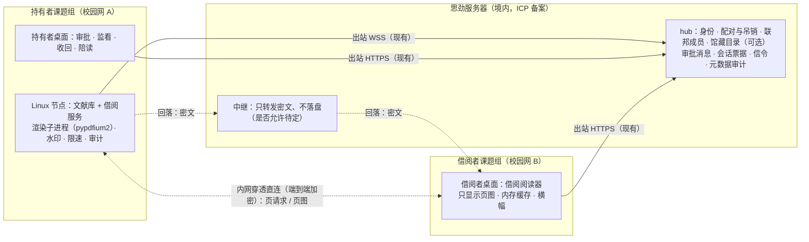

# 文献"借阅"（远程只读查看、不交付文件）方案评估

状态：**调研结论，待所有者决定；均未实现。** 日期：2026-10-08；2026-10-09 按独立核查结果修订（补全引文、补入遗漏的合同条款与法条）。
上位决定：`docs/design/sijin-platform-2026-10.md`"所有者决定（第二轮，2026-10-08）"第 6、7、8、9、10、11 条；下文"第 n 条"均指第二轮（文献存放在课题组 Linux 服务器；文献不经思劲中转、要直连；用内网穿透建立连接；
中心服务与中继可放在思劲服务器；**默认不跨机构分享付费全文，只允许"借阅"——对方远程连接到持有者的 STK 查看，无法把文献下载到自己那里**；
新增类似 VS Code Live Share 的共享会话、共享页面、语音与文字交流）。
相关文档：仓库 `docs/design/sijin-platform-2026-10.md`（第一轮所有者决定第 7 条"类 BitTorrent 分块共享"、5.5 节）、`docs/design/node-networking-evaluation-2026-10.md`（下称"组网评估"：L0 直通中继、L2 文献分块共享）、
`docs/hub.md`（读路径、节点代理）、`docs/design/document-preview-spike.md`（文档预览嵌入尚未选型）。
同批第二轮评估：`docs/design/nat-traversal-evaluation-2026-10.md`（下称"内网穿透评估"：RustDesk、ZeroTier、直连成功率与失败时的处理）、
`docs/design/live-share-evaluation-2026-10.md`（下称"协作共享评估"：第 11 条的共享会话）、`docs/design/python311-flower-upgrade-2026-10.md`（第 2 条 Python ≥ 3.11 升级）。

标注约定：**（未核实）** 表示没有找到一手来源或没有实测；**（未实测）** 表示数字需要原型测量。
涉及法律的内容只是**为律师准备的问题与材料，不构成法律意见**。许可证以仓库里的 LICENSE 文件或包元数据为准（2026-10-08 查询）。

---

## 结论摘要

- **"无法下载"在技术上只能做到"不交付文件"，做不到"内容不离开持有者"。** 页面像素总要到达借阅者屏幕；截图、录屏、手机拍照、OCR 都无法完全阻止。
  能做到的是：只发按需渲染、带水印、限分辨率的页图，不发 PDF、不发文本层；限速、限页、限时、同一时间只借给一人；两端与 hub 都留审计。
  威慑主要靠**带借阅者身份的水印 + 可核对的审计**，而不是"防截图"。水印只解决溯源，不能让借阅符合出版商许可（见下文爱思唯尔第 1.4 条）。
- **所有强制措施必须放在持有者一侧。** 仓库 `desktop/LICENSE` 写明桌面程序是 **GPL-2.0-or-later**（含 Blender 代码），借阅者有权取得源码、改掉"禁止保存/禁止截图"后自行编译。
  因此客户端侧的限制只是便利与威慑，渲染、水印、限速、页数上限、审计都在持有者的 Linux 节点上执行。
  （附带提醒：任务前提"闭源商业分发"与桌面程序的实际许可冲突，需所有者另行处理；`desktop/` 以外的 Python 包按根目录 `LICENSE` 为 MIT。）
- **推荐路线 (a)：持有者节点渲染页图、按页流式发送。** 持有者课题组 Linux 服务器上用 **pypdfium2**（Apache-2.0 / BSD-3-Clause，封装 PDFium；PDFium 的 LICENSE 为 BSD 三条款文本加 Apache-2.0 全文）
  在隔离的子进程中渲染，叠加水印后以 PNG/WebP 发给借阅者；桌面已有 libspng 解码 PNG（`desktop/engine/lib/stk_io/src/png.cc`），不必先解决浏览器嵌入。
  MuPDF/PyMuPDF（AGPL-3.0 或 Artifex 商业许可：用于服务端须按 AGPL 向所有交互用户公开自己应用的完整源码，做不到才需买商业许可）与 Poppler（GPL，且没有可购买的闭源许可）不适合闭源分发的节点；
  pdf.js（Apache-2.0）在查看端运行、必须把 PDF 交给查看端，所以不适合借阅者端（可用于持有者自己的本地预览）。
- **路线 (b) 远程桌面（如 RustDesk）只作临时手段，(c) 加密文件 + DRM 不采用。** RustDesk 客户端与服务端都是 AGPL-3.0，共享整个桌面，文件传输、终端、TCP 隧道、远程打印、摄像头等权限都要靠设置项逐一关闭，容易配错；
  (c) 本质上把（加密的）文件交给了借阅者，与第 10 条字面冲突；而且 Internet Archive 的"一借一还 + 加密 PDF/EPUB + 浏览器阅读器"在美国第二巡回法院仍被判定不属于合理使用（IA 是非营利组织，法院也认定其使用为非商业性）。
- **法律上，"只看不下载"并不自动脱离"提供作品"。** 最高法关于信息网络传播权的司法解释第三条把"使公众能够在个人选定的时间和地点以**下载、浏览或者其他方式**获得"认定为提供行为；
  《信息网络传播权保护条例》第七条的图书馆例外只适用于图书馆等机构"向本馆馆舍内服务对象"提供，**课题组远程借阅用不上**。
  关键问题是：持有者逐次批准、只给一个具名同行看，是否构成"向公众提供"——这是给律师的第一个问题。
  对思劲，同一司法解释的第四条（分工合作共同提供的承担连带责任）、第十条（以目录、索引等推荐、且公众可直接以下载或浏览等方式获得的，可认定"应知"）、第十一条（直接获得经济利益的注意义务较高）都与 hub 的"馆藏目录与撮合"直接相关。
  另外，把出版社排版的 PDF 渲染成页图还涉及《著作权法》第三十七条出版者的**版式设计权**（保护期十年），即便是作者自己发表的论文。
- **出版商许可因社而异，但"给外机构的人渲染带水印的页图"在爱思唯尔模板下很难站住（须律师判断）。** 爱思唯尔的标准订购协议（捷克公开合同 2020、2026 版）允许授权用户把单篇文章"提供给第三方同行用于学术或研究用途"
  （2026 版收窄为"有限数量"的第三方同行，包括非商业平台上邀请制工作组的成员），禁止"实质性或系统性"地再分发；
  但第 1.4 条第一项禁止修改或制作演绎作品，例外只有"为在计算机屏幕上向**授权用户**呈现所必需"的部分——给非授权的外机构借阅者渲染并加水印的页图不在这个例外里。
  订购合同的签约方是**大学**而不是课题组，2026 版第 3.2 条要求订购方把访问与使用限于授权用户、防止滥用；课题组对外借阅可能连累本校的订购。
  2026 版还新增 AI 条款（只能在"封闭托管环境"内与 AI 工具结合使用、不得向第三方分享任何部分）与第 1.5.3 条 TDM 限制（不得公开由数据集得出的模型权重、不得把数据集或 TDM 产出用于商业目的、AI 系统不得用数据集训练也不得提交给外部 AI 系统；不适用于 CC 等开放获取内容），
  **直接关系到思劲用文献训练模型、做材料智能体与知识库**，不只影响借阅，须尽快交给律师。
  施普林格·自然的许可（经第三方大学页面转述）允许通过 SharedIt 向第三方同行传送"合理数量"，但不得替代对方的订购。
  中国高校（DRAA 等联盟）实际签署的条款**未核实**，必须按出版商逐一确认。
- **传输上复用"内网穿透 + 协作会话"，并要求端到端加密；"密文中继满足第 7 条"有两个前提。** 借阅应定义为第 11 条协作会话的一种会话类型（持有者节点作为无界面参与者，提供"页图通道"），控制面走现有 hub 出站通道。
  第 7 条（不经思劲中转）与第 9 条（中继可在思劲）及校园网常封 UDP 的现实之间有冲突：hub 现有读路径在 hub 处解开 TLS，**明文页图经过它就违反第 7 条**；
  唯一兼容的折中是"只转发密文、不落盘"的中继。前提一：密钥校验**不能只靠 hub**——hub 本身就是设备公钥目录，换掉登记的公钥即可做中间人（RFC 8827 §9.1），
  需要 TOFU（首次信任后固定公钥）、带外核对或密钥透明日志，而 RFC 8827 也承认人工核对指纹的界面"not suitable for general use"。
  前提二：回落中继经 443 或 HTTP 代理出站，应事先取得三所试点学校网络中心的书面同意，不能设计成绕过学校的安全管控。是否允许这种回落是所有者最重要的决定。
- **建议先上"合法渠道优先 + 陪读"，自助借阅等律师意见与持有者所在学校图书馆的同意。** 借阅前先查开放获取版本、出版商分享链接（施普林格·自然 SharedIt、爱思唯尔 Share Link 等）、对方本校是否已订购、图书馆文献传递；
  三个试点组（北京、珠海、聊城）先用 **CC 许可的开放获取全文和作者接受稿**验证机制（不用出版社排版的 PDF，即便是各组自己发表的论文，因为涉及版式设计权与作者转让给出版社的权利）；
  持有者在场的"陪读"模式（第 11 条的共享会话 + 页图 + 语音文字）作为第一个形态。

---

## 详细分析

### 一、需求与威胁模型

| 项目 | 内容 |
|---|---|
| 持有者 | 课题组的 Linux 常驻服务器（所有者决定第 6 条），PDF 由组员用本机构权限下载后导入；人是该组成员或文献管理员。订购合同的签约方是所在大学（或联盟），不是课题组（见 5.3） |
| 借阅者 | 另一机构的 STK 用户（桌面程序），经 hub 认证的设备 |
| 要保护的 | PDF 文件本身（不交付）；文本层（不交付）；高分辨率整篇副本（不交付）；持有者机器上的其他文件（不暴露） |
| 不可能保护的 | 屏幕上显示的像素（截图、录屏、拍照、OCR） |
| 对手能力 | 借阅者可以修改并重新编译 GPL 桌面程序；可以在虚拟机或远程桌面里运行 STK；可以用另一台设备拍屏 |
| 思劲的位置 | 运营 hub 与中继（第 9 条），按第 7 条**不应看到或留存文献内容** |

结论：唯一不可绕过的控制点是**持有者节点决定发出什么**（哪一页、什么分辨率、带什么水印、多快、发给谁、发多少）。

### 二、三条技术路线

#### (a) 持有者节点渲染页图、按页流式发送（推荐）

- **流程**：借阅者打开借阅阅读器 → 请求第 n 页（含目标宽度）→ 持有者节点校验会话票据与配额 → 子进程用 PDFium 渲染该页 → 叠加水印 → 编码 PNG/WebP → 经端到端加密通道发出 → 借阅者只在内存中显示，会话结束清空。
- **只发图像、不发文本层**：借阅者无法选中复制文字。检索在持有者节点完成（PDFium 有文本提取接口，本地执行），只返回命中页码与高亮矩形，不返回文本。
- **缩放**：按视口请求分块（tile），设分辨率上限（建议整页宽度不超过约 1600 像素，图表局部放大不超过 2 倍，具体数值待试用后定）。
- **桌面改动小**：桌面已用 libspng 编解码 PNG（`desktop/engine/lib/stk_io/src/png.cc`、`desktop/engine/lib/stk_gfx/src/png.cc`），新增一个"借阅阅读器"编辑器显示图像即可；
  不依赖尚未选型的浏览器嵌入（`docs/design/document-preview-spike.md` 写明 WebView 嵌入与 Linux 预览后端都还未验证）。
- **代价**：持有者节点要在线；每页一次渲染（PDFium 不是线程安全的，需要进程池，见下）；带宽为页图大小（单页字节数与渲染耗时**未实测**）。

#### (b) 远程桌面看持有者机器上的阅读器（不推荐作为产品路径）

- **RustDesk**：客户端仓库与服务端仓库在 GitHub 上的许可都是 **AGPL-3.0**（[rustdesk/rustdesk](https://github.com/rustdesk/rustdesk)、[rustdesk/rustdesk-server](https://github.com/rustdesk/rustdesk-server)，GitHub API 2026-10-08）。
  把它的代码嵌入闭源产品不可行；作为独立、未修改的程序并行使用时，AGPL 第 13 条（"if you modify the Program … must prominently offer all users interacting with it remotely through a computer network … the Corresponding Source"，
  原文见 [MuPDF 仓库所附 AGPL 全文](https://github.com/ArtifexSoftware/mupdf/blob/master/COPYING)）只在修改时触发——但这仍要由法务确认分发方式。
  官方文档列出 `access-mode`（custom/full/view）、`enable-file-transfer`、`enable-clipboard`、`enable-keyboard` 等设置，此外还有 `enable-terminal`、`enable-tunnel`（TCP 隧道）、`enable-remote-printer`、`enable-camera` 等权限要关
  （[高级设置](https://rustdesk.com/docs/en/self-host/client-configuration/advanced-settings/)）。
  同一文档写明 Override、Default、Strategy 这几类集中下发的设置在"Web Console → Custom Clients / Strategies"里配置；开源服务端能否集中强制"只读、禁文件传输"，还是必须购买 Server Pro，**未核实**。
  如果不能，就只能靠持有者在客户端里手工设置，配错的风险更大。
  官方称"基于 NaCl 的端到端加密"，中继看不到明文这一点只见于第三方文章（**未核实**）。
- **问题**：
  1. 共享的是整个桌面或会话，借阅者若能操作阅读器翻页，就能触到阅读器的"另存为/打印/打开文件"对话框，进而接触持有者机器上的其他文件；要做成专用的受限账户或虚拟机，运维成本高。
  2. 课题组的 Linux 服务器通常没有图形会话，需要虚拟显示（Xvfb 等），持有者组难以维护。
  3. 水印、页数上限、按页审计都做不了（只能录屏式审计），而这些恰恰是威慑的主体。
  4. 身份与授权是 RustDesk 自己的一套，和 STK 的设备配对、吊销、审计不是一套。
- **定位**：可在试点期作为"持有者在场演示"的临时手段，前提是持有者用专用账户、只开查看模式并逐项关闭上述权限，且只演示 CC 许可的开放获取全文或作者接受稿；长期由第 11 条的 STK 自有屏幕共享取代。
  内网穿透评估的立场更保守：建议试点期不把原样的 RustDesk 加自建 hbbs/hbbr 用于真实文献（共享整个桌面、配置容易出错、打洞失败时同样经过 hbbr）。

#### (c) 加密文件 + DRM（不采用）

- 把加密的 PDF（或 EPUB）交给借阅者，由客户端在授权期内解密显示。这在字面上就是"把文献下载到借阅者那里"，与第 10 条冲突。
- 技术上，解密发生在借阅者的 GPL 客户端里，任何人都能改出一个导出明文的版本；DRM 只对闭源、加固的客户端有一定作用，而 STK 桌面不是。
- 法律上也无帮助：Internet Archive 的借阅者可以"在 IA 的 BookReader 网页阅读器中阅读，或下载加密的 PDF 或 EPUB 版本"，IA 称该软件"只允许经授权的读者下载和阅读所借图书"（判决第 11 页），
  法院仍认定不属于合理使用（见第五节）。

#### 补充形态

- **陪读（与第 11 条重合）**：持有者本人在场，在协作会话里打开文献，借阅者看页图（持有者共享阅读窗口时，受限文献按 6.4 改走页图通道）、语音与文字交流。持有者控制翻页，天然是"一对一、同步、有人在场"。建议作为第一个形态。
- **问答借阅（以后再议）**：借阅者向持有者节点的本地知识库提问，只得到带页码出处的回答与短引文，不看整页。离开持有者的内容最少，但爱思唯尔 2026 版的 AI 条款与第 1.5.3 条 TDM 限制（见第五节）恰好限制"与 AI 工具结合使用并向第三方分享任何部分"，必须先过法务。

#### 路线比较

| 维度 | (a) 节点渲染页图 | (b) 远程桌面看阅读器 | (c) 加密文件 + DRM | 陪读（第 11 条） |
|---|---|---|---|---|
| 借阅者是否拿到文件 | 否 | 否 | **是**（加密） | 否 |
| 文本可否复制 | 否（只发图像） | 取决于剪贴板设置 | 取决于客户端 | 否 |
| 水印（借阅者身份） | ✅ 持有者侧写入像素 | ❌ 难以逐人加 | 客户端侧，可去除 | ✅ 同 (a) |
| 按页限速、页数上限、按页审计 | ✅ | ❌ | 部分 | ✅ |
| 暴露持有者其他文件 | 否 | **有风险** | 否 | 否 |
| 能否被改客户端绕过 | 只能绕过客户端侧的防截图 | 同 | **可直接导出明文** | 同 (a) |
| 持有者需在场 | 否（可设逐次审批） | 是 | 否 | 是 |
| 主要许可问题 | 无（PDFium 宽松许可，附带通知） | AGPL | 视 DRM 方案（Readium LCP 等未核实） | 取决于协作通道选型 |
| 工作量 | 中：节点服务 + 桌面阅读器 | 低（现成软件）但难以产品化 | 高 | 与第 11 条共用 |

### 三、PDF 渲染库与许可（闭源分发视角）

| 库 | 许可（一手来源） | 用在持有者节点（Python，闭源分发） | 备注 |
|---|---|---|---|
| **PDFium** | [LICENSE](https://pdfium.googlesource.com/pdfium/+/refs/heads/main/LICENSE)：前半为 BSD 三条款（"Copyright 2014 The PDFium Authors"），后附 Apache License 2.0 全文 | ✅ | Chrome 的 PDF 引擎；对期刊 PDF 兼容性好 |
| **pypdfium2** 5.14.0 | README："available by the terms and conditions of Apache-2.0 / BSD-3-Clause"（[仓库](https://github.com/pypdfium2-team/pypdfium2)）；PyPI 元数据 `requires_python >=3.6`、许可 "BSD-3-Clause, Apache-2.0, dependency licenses"（[PyPI](https://pypi.org/project/pypdfium2/)，5.14.0 于 2026-10-04 上传） | ✅ **推荐** | 二进制来自 [bblanchon/pdfium-binaries](https://github.com/bblanchon/pdfium-binaries)（构建脚本 MIT；该项目 2026-10-05 发布的最新版是 chromium/8086，而 pypdfium2 5.14.0 打包的是 PDFium 8076，见 [autorelease/record.json](https://raw.githubusercontent.com/pypdfium2-team/pypdfium2/5.14.0/autorelease/record.json)）。README："PDFium's license as well as dependency licenses have to be shipped with binary distributions"；[BUILD_LICENSES/](https://github.com/pypdfium2-team/pypdfium2/tree/main/BUILD_LICENSES) 含 abseil、agg23、FreeType、HarfBuzz、ICU、lcms、libjpeg-turbo、OpenJPEG、libpng、libtiff、zlib 等，并按平台分了子目录（如 `cibw_musl/`、`pdfium-binaries_musl/`、`v8_xfa/`、`android/`、`all_except_musl/`）；README 提醒"a subset of pypdfium2 builds may link with the libgcc runtime library"，所以随附哪些许可取决于实际分发的 wheel。FreeType 选 FTL 时有在文档中致谢的要求（[FreeType LICENSE.TXT](https://github.com/freetype/freetype/blob/master/LICENSE.TXT)）。默认 wheel 用不含 V8/XFA 的构建（README："Otherwise, use the regular (non-V8) binaries"；V8/XFA 构建要用 `PDFIUM_PLATFORM=auto-v8` 加 `--no-binary` 另装），减少攻击面。README 写明 "PDFium is inherently not thread-safe" |
| **MuPDF / PyMuPDF** 1.28.2 | [COPYING](https://github.com/ArtifexSoftware/mupdf/blob/master/COPYING)：GNU AGPL v3；PyPI："Dual Licensed - GNU AFFERO GPL 3.0 or Artifex Commercial License"（[PyPI](https://pypi.org/project/PyMuPDF/)，`requires_python >=3.10`） | ❌（除非买商业许可） | Artifex 原句："You cannot deploy our open-source as part of a server-based application or service, without disclosing your own application's full source code under AGPL to any users interacting with it."；下一句："If you can't meet the requirements of the GNU AGPLv3 above, a commercial license is required."（[Artifex 许可页](https://artifex.com/licensing)）。即开源版可以用在服务端，条件是按 AGPL 向所有交互用户公开自己应用的完整源码；做不到才需要商业许可。对闭源节点而言结论不变。商业许可按份计费且有季度最低费用，价格需询价 |
| **Poppler** | [README](https://gitlab.freedesktop.org/poppler/poppler/-/blob/master/README.md)："Poppler is licensed under the GPL, not the LGPL, so programs which call Poppler must be licensed under the GPL as well"；COPYING 为 GPLv2，另附 COPYING3 | ❌ 链接；⚠️ 作为独立程序调用 | README 的 History 一节写明 Glyph & Cog 的商业许可"only allows you to use xpdf in a closed source product, not poppler itself"，即 Poppler 没有可购买的闭源许可。可调用系统包里的 `pdftoppm` 子进程作为备选，是否构成"独立程序"的通信需法务按 [GPL FAQ（MereAggregation）](https://www.gnu.org/licenses/gpl-faq.html#MereAggregation) 判断（本次抓取被拒，原文措辞**未核实**） |
| **pdf.js** | [LICENSE](https://github.com/mozilla/pdf.js/blob/master/LICENSE)：Apache License 2.0 | — | 在查看端运行，需要把 PDF 交给查看端；**不适合借阅者端**。可用于持有者自己的本地预览（见文档预览验证计划） |

建议：

1. 持有者节点用 pypdfium2（非 V8 构建），在**独立子进程**中渲染（PDFium 非线程安全；PDF 是不可信输入，子进程同时作为沙箱：无网络、限内存与时间、只读挂载文献库），按页返回 RGBA，由父进程加水印并编码。
2. 发行包随附 `BUILD_LICENSES/` 中与实际分发的 wheel（平台、是否 musl、是否链接 libgcc）对应的全部第三方许可，以及 FreeType 致谢。
3. pypdfium2 支持 Python 3.6 以上，与所有者决定第 2 条（升级到 Python 3.11 以上，见 `docs/design/python311-flower-upgrade-2026-10.md`）不冲突。
4. 不把 PDFium 链进桌面程序：借阅者端本来就不需要 PDF 引擎。许可上，`desktop/LICENSE` 为 GPL-2.0-or-later，因为有"or later"，可以选 GPLv3；
   ASF 说明 Apache-2.0 与 GPLv3 兼容、与 GPLv2 不兼容（[ASF GPL 兼容性](https://www.apache.org/licenses/GPL-compatibility.html)）；
   Blender 官方说"All the components that together make Blender are compatible under the newer GNU GPL Version 3 or later. That is also the license to use for any distribution of Blender binaries"（[Blender 许可](https://www.blender.org/about/license/)）。
   仓库 `desktop/packaging/THIRD-PARTY-NOTICES.md` 也已写明，可执行文件因含 Apache-2.0 组件，"as distributed are covered by GPL-3.0-or-later"。
   因此 PDFium 所附 Apache-2.0 文本与桌面程序的兼容性基本不成问题（仍以法务意见为准）。持有者节点服务属于 `desktop/` 以外的 Python 包（根目录 `LICENSE` 为 MIT），与 pypdfium2 没有许可冲突。
   真正的冲突是任务里"闭源商业分发"的前提与 GPL 桌面程序不符（见"需要所有者决定"第 10 项）。

### 四、能防什么、不能防什么

| 措施 | 防住什么 | 防不住什么 | 在哪执行 |
|---|---|---|---|
| 只发页图，不发 PDF、不发文本层 | 直接得到文件；复制文本 | OCR；截图 | 持有者节点 |
| 按需逐页，最多预取前后各 1 页 | 一次性抓全文 | 慢慢翻完整篇 | 持有者节点 |
| 速率限制（如持续每 3 秒 1 页、短时突发 5 页；数值待定） | 脚本批量抓取 | 人工逐页截图 | 持有者节点 |
| 分辨率上限与分块缩放 | 获得印刷级副本 | 屏幕级副本 | 持有者节点 |
| 会话时限（如 60 分钟、空闲 5 分钟断开）、每日页数配额、冷却期 | 长期占用与系统性获取 | — | 持有者节点（hub 票据也写明） |
| **同一时间只借给一人**（每篇文献一把锁）、每个借阅者同时只开一个会话 | 一份副本同时服务多人 | 见下："一借一还"在法律上无效 | 持有者节点 |
| 持有者逐次审批、随时收回 | 无人知情的借阅 | — | 持有者桌面 → 节点 |
| **可见水印**：借阅者姓名、机构、时间、会话号，半透明斜向平铺，位置逐页随机抖动 | 截图外传后无法溯源 | 用图像处理去除（费力）；裁剪 | 持有者节点写入像素 |
| **隐形标记**：会话号编码进像素（如水印字间距、位置的微小变化，或频域标记；具体算法与库**未选型**） | 去掉可见水印后的溯源 | 强力重采样、重新排版的 OCR 文本 | 持有者节点 |
| 客户端：不提供保存、打印、导出、复制菜单；只在内存缓存；显示"借阅中"横幅 | 普通用户的无意留存 | 改过的客户端 | 借阅者桌面（**可被绕过**） |
| 客户端：Windows `SetWindowDisplayAffinity(WDA_EXCLUDEFROMCAPTURE)` | 常见截图/录屏 API | 拍照、改客户端、虚拟机外截屏 | 借阅者桌面（**可被绕过**） |
| 审计：两端各自记录 + hub 只记元数据；页图哈希入账 | 事后核对"谁看了什么" | 事前阻止 | 三处 |

说明：

- **防截图**：微软文档说明 `WDA_EXCLUDEFROMCAPTURE` 自 Windows 10 2004 起支持（更早版本上表现为 `WDA_MONITOR`），且"it works only when the Desktop Window Manager (DWM) is composing the desktop"；
  并明确"unlike a security feature or an implementation of Digital Rights Management (DRM), there is no guarantee … will strictly protect windowed content, for example where someone takes a photograph of the screen"
  （[SetWindowDisplayAffinity](https://learn.microsoft.com/en-us/windows/win32/api/winuser/nf-winuser-setwindowdisplayaffinity)）。
  macOS 的 `NSWindow.sharingType = .none` 在 ScreenCaptureKit、全屏与录屏下的表现只有开发者论坛的零散报告，彼此不一致（[thread 808016](https://developer.apple.com/forums/thread/808016)、[thread 770585](https://developer.apple.com/forums/thread/770585)，**未核实**）；
  Linux（X11/Wayland）没有通用机制。加上 GPL 客户端可改，结论是：防截图只是"顺手做"，不能作为合规依据。
- **渲染并加水印本身可能就超出许可**：爱思唯尔协议第 1.4 条第一项（2020 版与 2026 版都有）禁止"abridge, modify, translate or create any derivative work and/or service ... except to the extent necessary to make them perceptible on a computer screen to Authorized Users"。
  给非授权用户（外机构借阅者）渲染并加水印的页图不在这个例外里。水印与限速能做到的是威慑、溯源与"非系统性"，不能使借阅符合许可（见 5.3、5.4）。
- **水印不得遮盖出版商的权利信息**：爱思唯尔协议第 1.4 条禁止"remove, obscure or modify in any way any copyright notices"（见第五节）；
  《信息网络传播权保护条例》第十八条第（三）项把"故意删除或者改变通过信息网络向公众提供的作品……的权利管理电子信息"列为侵权行为（[条例全文](https://www.gov.cn/zwgk/2013-02/08/content_2330133.htm)）。
  实现上，持有者节点先用 PDFium 的文本接口找出含"©"、"doi"、"Downloaded"、"All rights reserved"等的行，水印避开这些区域，也不裁掉页眉页脚。
- **实名水印是个人信息处理**：《个人信息保护法》第二十三条规定，向其他个人信息处理者提供个人信息，应当告知接收方的名称、联系方式、处理目的、处理方式和个人信息种类，并取得个人的**单独同意**；
  第十七条规定了处理前的告知义务（[网信办全文](https://www.cac.gov.cn/2021-08/20/c_1631050028355286.htm)）。hub 把借阅者的姓名和机构交给持有者课题组、持有者节点把实名写进页图，都要事先告知并取得借阅者的单独同意。
  建议可见水印用"姓名 + 机构 + 时间"，会话号放在隐形标记中。保存期限等其余要求本次未查（见 5.5 第 9 问）。
- **"一借一还"只是许可类比，不是法律护盾**：第二巡回法院写道"Whether it delivers the copies on a one-to-one owned-to-loaned basis or not, IA's recasting of the Works as digital books is not transformative"（判决第 31 页）。
  在本方案中保留它，是为了限制规模、体现"非系统性"（与爱思唯尔协议的"systematically"一词对应），而不是因为它能使借阅合法。
- **审计格式**：持有者节点写只追加的 JSONL，每条带上一条的哈希（哈希链）：请求、审批人、票据、会话起止、每页（页码、分辨率、页图 SHA-256、水印会话号、时间、字节）、收回。
  借阅者桌面记录收到的页图哈希；hub 只记会话号、双方、DOI 或文件哈希、时间、字节数、路径（直连/中继），**不记内容**。三方可按哈希对账；hub 日志按《网络安全法》留存不少于六个月（见组网评估"合规"一节）。
  另外，《信息网络传播权保护条例》第十三条规定著作权行政管理部门可以要求网络服务提供者提供涉嫌侵权的服务对象的姓名、联系方式、网络地址等资料；第二十五条规定无正当理由拒绝或拖延提供的予以警告，情节严重的没收设备（[条例全文](https://www.gov.cn/zwgk/2013-02/08/content_2330133.htm)）。
  设计 hub 元数据审计时要考虑这一义务（能对应到借阅双方的身份与网络地址），用户协议也应向借阅双方披露。
- **技术措施本身受法律保护**：《著作权法》第四十九条把技术措施定义为"用于防止、限制未经权利人许可浏览、欣赏作品……的有效技术、装置或者部件"，并禁止故意避开或破坏（[著作权法 2020 修正文本](https://www.ncsti.gov.cn/zcfg/flfg/202104/t20210402_29487.html)）。
  STK 的限制是否属于"权利人"的技术措施（持有者不是权利人）**需律师判断**；即便不属于，也应在借阅协议中约定借阅者不得绕过。

### 五、法律背景（须律师确认，不构成法律意见）

#### 5.1 中国法

- **信息网络传播权的定义**：《著作权法》第十条第一款第（十二）项："信息网络传播权，即以有线或者无线方式向公众提供，使公众可以在其选定的时间和地点获得作品的权利"（[2020 修正文本](https://www.ncsti.gov.cn/zcfg/flfg/202104/t20210402_29487.html)，转载自中国人大网）。
  条例第二十六条的定义相同（加"个人选定"）。条例第二条："任何组织或者个人将他人的作品……通过信息网络向公众提供，应当取得权利人许可，并支付报酬。"
- **"浏览"也是提供**：最高人民法院《关于审理侵害信息网络传播权民事纠纷案件适用法律若干问题的规定》（2020 修正）第三条第二款："通过上传到网络服务器、设置共享文件或者利用文件分享软件等方式，将作品……置于信息网络中，使公众能够在个人选定的时间和地点以下载、浏览或者其他方式获得的，人民法院应当认定其实施了前款规定的提供行为。"
  （文字见 [JETRO 收录的 2021 年合并文本](https://www.jetro.go.jp/ext_images/world/asia/cn/ip/law/pdf/origin/interpret20210101_20.pdf)，与 [elawcn.com 转载](https://www.elawcn.com/rule/2022/0331/1040.html)一致；
  最高法官网的法释〔2020〕19号修改决定（[court.gov.cn](https://www.court.gov.cn/fabu/xiangqing/282671.html)）第十一项显示，该次修改只改了引言和第十三、十四条，据此第三条仍为 2012 年原文。）
  含义：只发页图、不许下载，**不能**仅凭"没有下载"排除提供行为；争点会落在"公众"——持有者逐次批准、只给一个具名同行看，是否属于"向公众提供"。
- **条例第七条（图书馆例外）帮不上**："图书馆、档案馆、纪念馆、博物馆、美术馆等可以不经著作权人许可，通过信息网络向**本馆馆舍内服务对象**提供本馆收藏的合法出版的数字作品……但不得直接或者间接获得经济利益。当事人另有约定的除外。"
  课题组不是这些机构，借阅者也不在"馆舍内"；思劲作为商业平台参与还涉及"经济利益"。
- **可能相关的例外**：条例第六条第（三）项："为学校课堂教学或者科学研究，向少数教学、科研人员提供少量已经发表的作品"；
  《著作权法》第二十四条第（一）项"为个人学习、研究或者欣赏，使用他人已经发表的作品"、第（六）项"为学校课堂教学或者科学研究……少量复制已经发表的作品，供教学或者科研人员使用"，
  且受该条首句"不得影响该作品的正常使用，也不得不合理地损害著作权人的合法权益"约束。整篇文章是否算"少量"、借阅者是否算"少数科研人员"，需律师判断。
- **出版者的版式设计权**：《著作权法》第三十七条："出版者有权许可或者禁止他人使用其出版的图书、期刊的版式设计"，保护期十年（[2020 修正文本](https://www.ncsti.gov.cn/zcfg/flfg/202104/t20210402_29487.html)）。
  把出版社排版的 PDF 渲染成页图给他人看，涉及出版者的这项权利；即便是"各组自己发表的论文"，作者往往已把权利转让给出版社，版式设计权本来也属于出版者，作者能否分享出版社排版的 PDF 取决于出版社政策。
  例如爱思唯尔的作者分享政策只允许作者"privately share your Published Journal Article (PJA) with known research colleagues for their personal use"，并建议优先使用分享链接（[Elsevier 分享政策](https://www.elsevier.com/about/policies-and-standards/sharing)）。
  因此试点宜改用作者接受稿或 CC 许可的开放获取全文，或者先按出版社政策核对。
- **技术措施义务**：条例第十条第（四）项要求依例外提供作品时"采取技术措施，防止本条例第七条、第八条、第九条规定的服务对象以外的其他人获得著作权人的作品，并防止……服务对象的复制行为对著作权人利益造成实质性损害"。
  第四节的措施可以视为对这种义务的工程回应（即使最终依据不是第七条）。
- **思劲作为传输者的位置**：条例第二十条：网络服务提供者"对服务对象提供的作品……提供自动传输服务，并具备下列条件的，不承担赔偿责任：（一）未选择并且未改变所传输的作品、表演、录音录像制品；（二）向指定的服务对象提供该作品、表演、录音录像制品，并防止指定的服务对象以外的其他人获得。"
  只转发密文、不落盘、只送给票据指定的借阅者的中继，与这两个条件吻合；但第二十条只免除"赔偿责任"，hub 若提供馆藏目录、撮合借阅，是否还算单纯的传输服务、是否有帮助侵权风险，需律师判断。
- **馆藏目录与撮合的风险**：同一最高法规定还有三条与 hub 直接相关（[JETRO 合并文本](https://www.jetro.go.jp/ext_images/world/asia/cn/ip/law/pdf/origin/interpret20210101_20.pdf)）：
  第四条（与他人以分工合作等方式共同提供的，承担连带责任）；第十条（以榜单、目录、索引等方式推荐，且公众可以直接以下载、浏览等方式获得的，可以认定应知）；
  第十一条（直接获得经济利益的，负较高的注意义务）。hub 的馆藏目录加借阅请求是否落入第十条、思劲作为商业主体是否适用第十一条，需律师判断；这也是"需要所有者决定"第 7 项建议默认不登记馆藏目录的理由之一。
- **网络服务提供者的资料提供义务**：条例第十三条、第二十五条（见第四节"审计格式"）。

#### 5.2 美国"受控数字借阅"（CDL）判例

- 《Hachette Book Group v. Internet Archive》，第二巡回法院 2024-09-04（No. 23-1260，[判决 PDF](https://www.govinfo.gov/content/pkg/USCOURTS-ca2-23-01260/pdf/USCOURTS-ca2-23-01260-0.pdf)）。法院提出的问题是：
  非营利组织扫描整本书、"subject to a one-to-one owned-to-loaned ratio between its print copies and the digital copies it makes available at any given time"，未经授权在网上免费借阅，是否合理使用——"we conclude the answer is no"（第 2 页）。
- 法院认为"IA's use of the Works is not transformative"，数字本"serve the same exact purpose as the originals: making authors' works available to read"（第 24 页）；
  对 IA 请求只限于其自有图书，法院认为"the fair use analysis would not be substantially different"，拒绝缩小判决范围（第 63 页脚注 12）。
  法院在第 38 页认定 IA 的使用"non-commercial in nature"，仍判定不属于合理使用；思劲是商业主体，第一个因素对它会更不利。
- 对本方案的启示：IA 的借阅已有一借一还、浏览器阅读器与加密下载，这些技术限制没有改变结论；本方案不交付文件、比 IA 更"克制"，也不能据此推定结论会不同——**技术限制不能替代授权**。
  差异：美国法、合理使用框架，与中国法不同；IA 是自有纸书，本方案的持有者通常只有**许可**（订购合同），权利更弱；涉案为图书，本方案为期刊论文。
  涉案 127 部作品都有正版电子书可买或可授权（判决第 14–15 页）；期刊论文同样有按篇购买的市场（例如爱思唯尔合同里的 24 小时"Transaction"访问）与文献传递市场，"市场替代"的论证可能同样适用（须律师判断）。

#### 5.3 出版商与高校订购协议

以下为公开的捷克公共机构合同（含 Elsevier 标准模板编号 "CRM 17.0"），**中国高校与 DRAA 等联盟实际签署的条款未核实**，必须逐社、逐校确认。
注意订购合同的签约方是大学（或联盟），课题组只是"授权用户"所在的单位；合同义务落在学校身上。

- **爱思唯尔，2020 版**（Masaryk 大学，[合同 PDF](https://smlouvy.gov.cz/smlouva/soubor/14734724/Smlouva_c._1113-0001-20-_Zahranicni_periodika_ve_forme_online_pristupu_pro_LF_MU_pro_rok_2020_-_ELSEVIER.pdf)）：
  - 1.2 授权用户为本校师生员工及合同方，另有"individuals using computer terminals within the library facilities at the Sites … ('Walk-in Users')"；3.1 写明"providing remote access to the Subscribed Products by Authorized Users who are Walk-in Users is not permitted"。
  - 1.3 授权用户可以"print, download and store a reasonable portion of individual items … for the exclusive use of such Authorized User"；
    也可以"provide print or electronic copies of individual items from the Subscribed Products to other Authorized Users and to third-party colleagues for their scholarly or research use"；
    "share individual journal articles … with third party colleagues individually for their scholarly or research use"；
    "share individual journal articles … with a limited number of third party colleagues as part of an invitation only working group on non-commercial platforms or tools"。
  - 1.4 第一项禁止"abridge, modify, translate or create any derivative work and/or service ... except to the extent necessary to make them perceptible on a computer screen to Authorized Users"（2026 版同）。
- **爱思唯尔，2026 版**（CzechELib 联盟，[合同 PDF](https://smlouvy.gov.cz/smlouva/soubor/43546081/Elsevier_ScienceDirect_2026plus_Redigov%C3%A1no.pdf)）：
  - 1.2 除到馆用户外，授权用户可经"a secure network that requires a secure ID card or other protective security safeguards"远程访问。
  - 1.3 保留与第三方同行分享的条款，但措辞收窄为"to a limited number of third-party colleagues, inclusive of colleagues who are part of an invitation only work group on non-commercial platforms or tools"。
  - 1.4 禁止演绎作品（同 2020 版，例外只及于向授权用户在屏幕上呈现）；禁止"substantially or systematically reproduce, retain, store locally, redistribute or disseminate the Subscribed Products"，禁止"remove, obscure or modify in any way any copyright notices"；
  - 1.4 新增 AI 条款：不得把订购内容"in combination with an artificial intelligence tool"使用，除非在"Closed Hosted Environment solely for use by the Subscriber or Authorized User"中、不训练第三方 AI、且"does not share the Subscribed Product or any part thereof with a third party"。
  - 1.5.3（TDM）：(c) 不得公开或披露由该数据集得出的模型权重；(d) 不得直接或间接把数据集或 TDM 产出用于商业目的；(h) AI 系统不得用数据集训练，且"does not submit ... to an external AI System"。
    第 1.5.3 条末尾写明，这些限制不适用于 CC 等开放获取许可的内容。
    AI 条款与 TDM 条款合在一起，**直接关系到思劲的核心计划**：用课题组文献或由文献得出的数据训练思劲的模型（铁电、锂电池）、做材料智能体与 S5 的知识库/RAG，以及"问答借阅"
    （例如把全文送往外部模型 API 是否仍属"封闭托管环境"、由付费全文抽取的事实与嵌入是否属于 TDM 产出）。超出本文范围，但必须尽快交给律师。
  - 3.2 订购方须"take appropriate measures to protect against the misuse or unauthorized access … through or to … the Subscribed Products and/or information derived therefrom"，并"limiting access to and use of the Subscribed Products to Authorized Users"。
    课题组对外借阅可能被视为本校没有履行这一义务、连累本校的订购，所以除律师意见外，还应取得本校图书馆的同意，作为自助借阅的前提。
- **施普林格·自然**：SharedIt 是出版商自己的"只读分享链接"（"shareable links to view-only versions of peer-reviewed research papers"，"Reasonable sharing is encouraged for non-commercial, personal use"，[SharedIt 页面](https://www.springernature.com/gp/researchers/sharedit)）。
  某大学对其许可的摘录：授权用户可"transmit to a third-party colleague, via the Springer Nature Sharedit functionality, reasonable amounts"，但不得"act as a replacement for that third-party recipient's own subscription"（[Western University 资源说明](https://westernu.libguides.com/database_information/springer)，二手）。
  含义：对施普林格·自然的文章，**出版商自己的分享链接就是合规的"借阅"**，STK 应优先引导，而不是自己流式发送。爱思唯尔也提供分享链接（Share Link），其作者分享政策建议优先用链接（[Elsevier 分享政策](https://www.elsevier.com/about/policies-and-standards/sharing)）。
- **既有合法渠道**：各校图书馆的馆际互借与文献传递（CALIS、NSTL 等，按页或按篇收费，见例如[同济大学图书馆说明](https://www.lib.tongji.edu.cn/userfiles/files/admin/pdf/WXCDLC.pdf)，本次未逐一核实）；
  爱思唯尔协议也允许订购方为同一国家的非营利图书馆做馆际互借，但要求"not routinely or systematically provided"并保存统计（2026 版 1.3）。

#### 5.4 对"只远程查看、不下载，是否仍可能违反许可"的回答

**合理地可能违反，但因出版商而异；对爱思唯尔模板而言风险较高。** 理由：

1. 许可通常把"访问"本身（"access, search, browse and view"）限定给授权用户；外机构人员通过持有者的副本查看，就是让非授权用户获得内容。到馆用户不得远程访问的条款说明出版商在意"谁在看、在哪看"，而不只是"有没有下载"。
2. 下载权是"for the exclusive use of such Authorized User"；把已下载副本的内容按需显示给别人，超出了"专用"。
3. 爱思唯尔第 1.4 条第一项只允许为"在计算机屏幕上向**授权用户**呈现"而做必要的改动；持有者节点为非授权的借阅者渲染并加水印的页图，不在这个例外里。
4. 反过来，爱思唯尔模板明确允许向第三方同行"提供……电子副本"用于学术研究（2026 版限于"有限数量"），施普林格·自然允许经 SharedIt 向第三方同行传送合理数量——在这些许可下，偶尔一对一地给同行一篇文章本身**未必违约**，甚至比本方案更宽（允许给副本）。
   但这些条款说的是授权用户本人分享单篇文章；一个平台化的页图服务是否属于这种分享，须律师判断。
5. 风险放大器在于**"系统性"与"平台化"**：一个由商业公司运营、有馆藏目录、可批量请求的借阅服务，更可能被认定为"systematically … disseminate"、"替代订购"，也更难算"non-commercial platforms or tools"。
   而且合同义务在学校：2026 版第 3.2 条要求订购方把访问与使用限于授权用户、防止滥用，课题组的借阅可能连累本校的订购。

#### 5.5 给律师的问题清单

1. 持有者逐次批准、在限定时间内只向一名具名的外机构科研人员显示带水印的页图（不交付文件），在中国法下是否构成"向公众提供"作品（《著作权法》第十条第（十二）项；最高法规定第三条）？若持有者对同一联邦内的任何成员都可能批准，结论是否改变？
2. 上述行为能否落入条例第六条第（三）项或《著作权法》第二十四条第（一）、（六）项？"少量"是否可以是整篇论文？借阅者是否算"少数教学、科研人员"？
3. 思劲运营 hub（身份、馆藏目录、审批消息、签发会话票据）与只转发密文的中继，分别处于什么法律地位？能否适用条例第二十条？提供馆藏目录与撮合是否构成帮助侵权，是否落入最高法规定第四条（分工合作）、第十条（以目录、索引推荐即可认定应知）、第十一条（直接获得经济利益的较高注意义务）？用户协议应如何分配责任？
4. 持有者所在高校与出版商（经 DRAA 等联盟）签订的订购协议中，"授权用户""远程访问""学术分享/第三方同行""系统性再分发""馆际互借""订购方防止滥用的义务"条款的原文是什么？首批三校（北京、珠海、聊城）各自的协议能否取得？课题组对外借阅需要本校图书馆以什么形式同意？
5. 对爱思唯尔：持有者节点为非授权的借阅者渲染并加水印的页图，是否违反第 1.4 条第一项（演绎作品，例外只及于向授权用户在屏幕上呈现）？STK 是否属于"non-commercial platforms or tools"？平台化、可重复的借阅是否构成"systematically … redistribute or disseminate"？若只在同一联邦、每篇每次一人、有审批，是否可以接受？
6. 对施普林格·自然：在已有 SharedIt 的情况下，经 STK 另行显示页图是否违反"via the Springer Nature Sharedit functionality"的限定？
7. 爱思唯尔 2026 版 AI 条款与第 1.5.3 条 TDM 限制：持有者本地知识库（含本地模型）、调用外部模型 API、向外机构返回带短引文的回答，各自是否违反"Closed Hosted Environment"与"does not share … any part thereof with a third party"？
   思劲用课题组文献或由文献得出的数据（抽取的事实、嵌入、模拟标签）训练铁电、锂电池模型和材料智能体，是否违反 1.5.3 的 (c)（模型权重）、(d)（商业目的）、(h)（外部 AI 系统）？哪些内容因属 CC 等开放获取许可而不受限制？
8. 持有者的水印、限速等是否属于《著作权法》第四十九条意义上的"技术措施"？借阅者绕过时，应当以什么合同条款约束？
9. 实名水印与借阅审计（姓名、机构、时间、页码）涉及的个人信息处理：按《个人信息保护法》第十七条告知、第二十三条取得单独同意的具体形式；保存期限；与条例第十三条的资料提供义务如何协调？
10. 若陪读通过第 11 条的屏幕共享进行（持有者在自己屏幕上打开付费 PDF 并共享），与页图借阅的法律评价是否相同？
11. 若借阅者本机构其实也订购了该刊，借阅是否仍有问题？反之，是否应要求借阅者先声明本校无权访问？
12. 出现投诉时（出版商通知），持有者与思劲各自应如何处理（停止借阅、提供日志）？日志中哪些内容可以提供给出版商？著作权行政管理部门按条例第十三条要求提供借阅者资料时，hub 应保留并提供什么？
13. 出版者的版式设计权（《著作权法》第三十七条）：把出版社排版的 PDF（包括各组自己发表、已把权利转让给出版社的论文）渲染成页图给外机构的人看，是否需要出版者许可？改用作者接受稿是否可以避开？
14. （**未核实**，评估未展开）思劲中继在用户之间转发数据（包括第 11 条的语音与文字交流），除 ICP 备案外是否还需要增值电信业务经营许可（组网评估"合规"一节已提到 B13 类业务）？端到端加密、思劲无法解密的设计，与商用密码管理以及网络运营者协助执法的义务之间是什么关系？

### 六、与内网穿透、协作/观看通道的复用；持有者服务器与桌面的分工

#### 6.1 "持有者的 STK 客户端"指什么

第 10 条说"远程连接到我们具有文献的 STK 客户端本地"，第 6 条说文献放在组内 Linux 服务器。组网评估（L2）已建议持有者是课题组的 Linux 常驻节点而不是笔记本。
本文按此设计：**渲染与策略执行在节点；持有者的桌面程序负责审批、监看与陪读**。若某成员的 PDF 只在笔记本上，只能用陪读（屏幕共享）形态，不提供自助借阅。

#### 6.2 架构

#### 6.3 一次借阅的流程

1. **合法渠道优先**：借阅者按 DOI 请求。hub 或借阅者本地先查开放获取版本（如 Unpaywall、OpenAlex 的开放获取位置，接口**未在本次核实**）、出版商分享链接（施普林格·自然 SharedIt、爱思唯尔 Share Link 等）、提示"贵校是否已订购"、图书馆文献传递入口。都不可用时才进入借阅。
2. **找持有者**：馆藏目录只在各组**自愿**登记、且只对其指定的合作组可见（DOI 级）；否则由借阅者点名向某组请求。
3. **审批**：hub 把请求推给持有者组；按持有者策略，付费文献由人逐次批准（显示借阅者姓名、机构、文章、时长），开放获取文献可自动。
4. **票据**：hub 签发会话票据：借阅者设备公钥、持有者节点公钥、文献 SHA-256、页数/速率/分辨率/时长上限、到期时间。持有者节点**再按本地策略复核**（本地策略优先于 hub）。
5. **建链**：经 hub 信令建立持有者节点 ↔ 借阅者桌面的端到端加密通道（直连优先，失败时按所有者决定回落到密文中继或直接失败）。
   **密钥校验不能只靠 hub**：若双方只用配对时登记在 hub 设备记录中的公钥校验对端，hub 本身就是公钥目录，换掉登记的公钥就能做中间人，挡不住
   RFC 8827 §9.1 所说的信令服务器中间人（"the signaling server can potentially mount a man-in-the-middle attack unless implementations have some mechanism for independently verifying keys"，[RFC 8827](https://www.rfc-editor.org/rfc/rfc8827.html)）。
   需要以下至少一种：TOFU（首次连接后在两端固定对端公钥，之后变化即告警并拒绝）、带外核对（首次借阅时显示双方指纹/安全码供人工核对）、密钥透明日志（hub 登记的公钥写入可公开审计的只追加日志）。
   RFC 8827 同一节也承认，人工核对指纹的界面"not suitable for general use"，所以带外核对只能作补充。"只转发密文的中继满足第 7 条"这一结论取决于这个问题能否解决（内网穿透评估也讨论了"信任根不放在思劲"）。
6. **阅读**：页请求 → 节点渲染加水印 → 页图；持有者桌面实时看到"对方正在看第 n 页"，可一键收回。
7. **结束**：到时、空闲、收回或借阅者关闭；借阅者端清空内存；三方审计落账。

#### 6.4 与第 11 条协作会话共用什么

第 11 条（共享对话、作图、共享页面让别人观看，加语音与文字；产品设计见协作共享评估）需要的东西，借阅几乎都要：

| 共用部件 | 协作会话 | 借阅 |
|---|---|---|
| 会话对象（参与者、角色、权限、到期） | 主持人/观看者 | 持有者节点（无界面参与者）+ 持有者（可选）/借阅者 |
| 信令与内网穿透、回落中继 | 同 | 同 |
| 端到端加密与密钥校验 | 同 | 同，且是第 7 条的前提 |
| 语音、文字频道 | 有 | 陪读时有 |
| 内容通道 | 屏幕/窗口视频、对话与图表的结构化同步 | **页图通道**（请求/响应式消息） |
| 审计 | 谁加入、何时 | 加上每页记录 |

因此建议：**先把会话、信令、穿透、加密做成通用层（为第 11 条），借阅只加三样：节点上的渲染服务、借阅策略（审批、限额、水印）、按页审计。**
页图通道应走消息式通道（WebRTC 数据通道或 QUIC 流），而不是视频轨道——视频编码会让水印和小字变糊，且无法逐页审计。

与协作共享评估的衔接：该评估的媒体栈（LiveKit）是 SFU，媒体一律经思劲服务器转发，因此它明确**文献借阅不走 LiveKit、也不放进它的分期**，借阅的内容通道（节点渲染页图、水印、限速）与直连失败时的处理以本文和内网穿透评估为准；
可以复用的是它的邀请、审批与审计（C1）。该评估同时提到，把文献内容（文本或页面图像）作为数据发给对方"等于给了副本"。本文的看法是：页图与窗口视频到达借阅者的都是像素，借阅者都能截屏；
页图通道不交付 PDF 与文本层，并且可以逐页加实名水印、限速、限分辨率并逐页审计，窗口视频做不到。页图是否在法律上被视为"副本"，与 5.5 第 1、5、13 问一起交给律师（见"需要所有者决定"第 6 项）。

**第 11 条的屏幕共享会形成"旁路"**：持有者在共享自己的 STK 窗口时打开付费 PDF，外机构参与者同样看到了全文。
建议 STK 的内置阅读区在被共享时，对标为"付费/许可受限"的文献显示占位，除非持有者对该次会话启用借阅策略（这时改走页图通道，带水印与审计）。外部阅读器窗口 STK 管不了，只能在共享前提示。

#### 6.5 与现有 hub 和组网评估的关系

- **hub 读路径不适合直接承载页图**：`POST /api/v1/nodes/{node_id}/read` 经节点 WebSocket 转发，节点到 hub、hub 到客户端都是在 hub 处终止的 TLS（见 `docs/hub.md`"读路径"），hub 进程能看到明文页图，违反第 7 条；
  它还有 30 秒超时、每节点 16 个未完成读取的限制。控制面（审批、票据、信令）可以复用现有通道与配对、吊销、操作记录。
- **组网评估中的"流式直通端点"**（L0 第 5 条）只有在其中跑的是**端到端加密**的流时才满足第 7 条；建议把它定义为"密文中继"。
- **组网评估 L2 的"分块共享"**：在第 10 条之后，只用于开放获取文献与同一机构内（若法务认可）；跨机构付费全文改为本文的借阅，不再分块交付。
- **传输选型由组网评估与内网穿透评估决定**（iroh、WebRTC/coturn、ZeroTier、RustDesk 等的比较见 `docs/design/nat-traversal-evaluation-2026-10.md`）。借阅对传输层的要求只有五条：两端都只出站；端到端加密且密钥与 STK 设备身份绑定（校验不依赖 hub，见 6.3 第 5 步）；中继不落盘且只见密文；
  至少中继能经 443/TLS（并在需要时经 HTTP 代理）工作；提供消息式通道。组网评估已指出 aiortc 的 TURN 客户端没有 HTTP 代理支持、iroh 的 Python/C 绑定没有暴露代理设置，这对强制代理的校园意味着回落中继需另行处理
  （内网穿透评估提出：强制代理的学校要么用 hub 流式直通端点承载应用层端到端加密的内容，要么不参与借阅）。
- **校方同意是试点前提**：回落中继经 443 或 HTTP 代理出站，应当事先取得三所试点学校（北京、珠海、聊城）网络中心的书面同意，作为试点前提；不能只在直连失败时"提示找网管"，也不能设计成绕过学校的安全管控
  （组网评估"需要校方网络管理批准的事项"已列出出站 443 等事项）。

#### 6.6 各处运行什么

| 位置 | 运行 | 不做 |
|---|---|---|
| 持有者 Linux 节点（suan-node 旁的新服务，Python ≥ 3.11） | 文献库（文件、SHA-256、DOI、出版商、许可类别、导入人）；借阅策略；渲染子进程池（pypdfium2，沙箱）；水印；服务端检索；限速与配额；每篇一把借阅锁；哈希链审计；穿透端点 | 不向外发 PDF 或文本层 |
| 持有者桌面 | 审批/拒绝、实时监看、收回；陪读（语音、文字、翻页） | 不需要 PDF 引擎 |
| 借阅者桌面 | 借阅阅读器（页图显示、分块缩放、翻页、检索命中跳转）；内存缓存；横幅；Windows 防捕获标志；本地审计 | 不提供保存/打印/复制/导出 |
| 思劲 hub（第 9 条） | 身份、配对、吊销、联邦成员关系、可选的馆藏目录、审批路由、会话票据、信令、元数据审计（≥6 个月；考虑条例第十三条的资料提供义务） | 不存、不解密页图；不作为唯一的密钥信任来源 |
| 思劲中继（若批准） | 转发密文 | 不落盘、不解密 |

### 七、分期建议

| 阶段 | 内容 | 前提 |
|---|---|---|
| B0 | 合法渠道优先：开放获取检索、出版商分享链接（SharedIt、爱思唯尔 Share Link 等）引导、文献传递入口；同机构共享沿用 L2 | 无（不依赖律师意见） |
| B1 | 节点渲染服务 + 借阅阅读器 + 水印 + 审计；三个试点组用 **CC 许可的开放获取全文与作者接受稿**测试（不用出版社排版的 PDF，含各组自己发表的论文）；陪读形态（与第 11 条会话一起） | 第 11 条的会话与穿透层；不依赖 hub 的密钥校验（6.3 第 5 步）；所有者对中继回落的决定；三校网络中心对出站方式（含回落中继）的书面同意 |
| B2 | 自助借阅（逐次审批、限额、同一时间一人），只对律师认可的出版商/许可类别开放 | 律师意见；持有者所在学校图书馆的同意；首批三校的订购协议条款 |
| B3 | 问答借阅（只返回回答与短引文） | 律师对 AI 条款与第 1.5.3 条 TDM 限制的意见 |

---

## 推荐

1. **采用路线 (a)**：持有者课题组 Linux 节点用 pypdfium2（非 V8 构建，独立沙箱子进程）渲染页图，叠加实名可见水印与隐形会话标记，按页经端到端加密通道发给借阅者；不发 PDF、不发文本层；检索在节点完成。
2. **所有强制措施在持有者节点执行**：逐次审批（付费）、每篇同一时间一人、按需逐页、速率与分辨率上限、会话时限与每日配额、随时收回；客户端侧的"禁止保存/防截图"只作辅助，并在文档中如实说明可被绕过。
3. **审计三方对账**：节点哈希链日志、借阅者本地日志、hub 元数据日志；hub 永不接触内容，但元数据要能满足条例第十三条的资料提供义务，并在用户协议中披露。
4. **传输复用第 11 条的协作会话层**（见协作共享评估与内网穿透评估）：会话、信令、内网穿透、端到端加密做成通用层；借阅是其中一种会话类型（持有者节点为无界面参与者，内容为页图消息通道）；陪读作为第一个形态。
   对端公钥校验不依赖 hub（TOFU、带外核对或密钥透明日志）。屏幕共享时，对受限文献的内置阅读区显示占位，避免旁路。
5. **合法渠道优先**：借阅入口先给开放获取版本、出版商分享链接（SharedIt、爱思唯尔 Share Link 等）、本校订购提示和文献传递入口；馆藏目录由各组自愿、按合作组可见。
6. **法律先行于开放**：机制可以先做、先用 CC 许可的开放获取全文与作者接受稿测试；跨机构付费全文的自助借阅，等律师按第 5.5 节问题给出意见、取得持有者所在学校图书馆的同意、并取得首批三校的订购协议条款后，再按出版商/许可类别逐个开放。
   对爱思唯尔内容，第 1.4 条的演绎作品例外只及于授权用户，自助借阅很可能需要出版商另行许可（须律师判断）。
7. **不采用**：(c) 加密文件 + DRM；MuPDF/PyMuPDF（除非购买商业许可）；Poppler 链接；把 RustDesk 嵌入产品。RustDesk 独立运行最多只作试点期的临时陪读手段，且只用于不受订购许可限制的内容。

## 需要所有者决定

1. **直连失败时是否允许经思劲中继回落（只转发密文、不落盘）？** 建议：允许，但有两个前提：(i) 对端公钥校验不依赖 hub（TOFU、带外核对或密钥透明日志，见 6.3 第 5 步），否则"思劲看不到"无法成立；
   (ii) 回落中继经 443 或 HTTP 代理出站，事先取得三校网络中心的书面同意（见本节第 12 项）。校园网常封或限速 UDP，只允许直连会让相当比例的借阅失败；满足这两个前提的密文中继在技术上满足"思劲看不到、也不留存文献"，并与条例第二十条的传输服务条件吻合。
   若坚持字面的"不经过思劲中转"，则直连失败时借阅直接失败，改走馆际互借等正常渠道。
2. **持有者是课题组 Linux 节点还是成员的桌面？** 建议：节点负责渲染与策略，桌面负责审批与陪读；只在笔记本上的文献只能陪读。
3. **审批方式**：建议付费/许可受限的文献逐次人工审批；开放获取文献自动；不提供"对某组永久自动批准"，至少在律师意见之前。
4. **试点内容**：建议北京、珠海、聊城三组的首轮测试只用 CC 许可的开放获取全文和作者接受稿，不用出版社排版的 PDF（即便是各组自己发表的论文：涉及《著作权法》第三十七条的版式设计权，作者往往已把权利转让给出版社），先验证机制、水印、审计与穿透；付费全文等律师意见。
5. **水印内容**：建议可见水印为"借阅者姓名 + 机构 + 借阅时间"，隐形标记为会话号；借阅前按《个人信息保护法》第十七条告知、按第二十三条取得借阅者的单独同意（hub 把姓名和机构交给持有者课题组同样需要）。
6. **先陪读还是先自助借阅？** 建议先陪读（持有者在场、与第 11 条一起交付），自助借阅放在 B2。
   陪读里的阅读内容也走页图消息通道（可逐页水印与审计），不走协作共享评估的 LiveKit 窗口视频（SFU 一律经思劲转发，该评估也已把借阅排除在 LiveKit 之外）；语音与文字可以复用协作会话。
7. **馆藏目录是否在 hub 上公开给联邦成员？** 建议各组自愿登记、DOI 级、只对其指定的合作组可见；默认不登记，由借阅者点名请求。理由之一是最高法规定第十条（以目录、索引等推荐、且公众可直接以下载或浏览等方式获得的，可认定应知）与第十一条（直接获得经济利益的注意义务较高）。
8. **问答借阅与用文献训练模型**：问答借阅（对外返回本地知识库的回答与短引文）建议推迟。更重要的是，爱思唯尔 2026 版的 AI 条款与第 1.5.3 条 TDM 限制（不得公开由数据集得出的模型权重、不得商业使用数据集或 TDM 产出、AI 系统不得用数据集训练也不得提交给外部 AI 系统）
   直接影响思劲用课题组文献或由文献得出的数据训练铁电、锂电池模型、材料智能体与知识库（S3、S5），也影响 S5 能否把付费全文送往外部模型 API。建议在律师意见之前，模型训练与对外服务只用 CC 等开放获取内容和自有数据，并把这一问题列为律师的优先事项。
9. **默认限额**：建议每篇同一时间一人；会话 60 分钟、空闲 5 分钟断开；持续每 3 秒 1 页、突发 5 页；整页宽度上限约 1600 像素；每个借阅者每天的页数配额由持有者组设定。数值在 B1 试用后调整。
10. **桌面程序的许可**：`desktop/` 为 GPL-2.0-or-later，分发的可执行文件按 GPL-3.0-or-later（`desktop/packaging/THIRD-PARTY-NOTICES.md`；Blender 官方的二进制也按 GPLv3 或更高版本分发），`desktop/` 以外的 Python 包为 MIT；这与"闭源商业分发"的设想冲突，也意味着客户端侧保护可被改掉。
    PDFium 的 Apache-2.0 文本因可选 GPLv3 基本不成问题；链接 AGPL 组件（如 RustDesk、MuPDF）仍会把 AGPL 的网络条款带进来。建议所有者确认桌面继续按 GPL 发布（协作共享评估也请所有者确认这一点）。
11. **自助借阅是否以持有者所在学校图书馆的同意为前提？** 建议：是。订购合同的签约方是大学，爱思唯尔 2026 版第 3.2 条要求订购方把访问限于授权用户、防止滥用，课题组对外借阅可能连累本校的订购；B2 前提除律师意见外，加上本校图书馆的书面同意。
12. **试点前是否先取得三校网络中心的书面同意？** 建议：是，范围包括出站 443、可能的 HTTP 代理与回落中继，以及打洞直连；不设计任何绕过学校安全管控的方式。

## 不确定之处

1. **中国高校实际订购协议**：DRAA 等联盟与爱思唯尔、施普林格·自然、Wiley、ACS、APS、知网等签署的条款（授权用户、远程访问、学术分享、演绎作品、AI 与 TDM 使用、订购方防止滥用的义务）均**未核实**；本文引用的是捷克公开合同与一份美国大学的摘录。
2. **法律定性**：一对一、经批准、限时的页图显示是否属"向公众提供"；第六条第（三）项与第二十四条的适用；思劲的帮助侵权风险，最高法规定第四、十、十一条与条例第二十条的适用；出版者版式设计权的影响——均须律师意见。
   最高法规定第三条的文字已对照 JETRO 合并文本，并据最高法官网的 2020 修改决定判断第三条未改；最高法官网的全文合并文本仍未取得。
3. **防截图**：macOS `sharingType` 在 ScreenCaptureKit、全屏与录屏下的实际效果**未核实**；Linux 无通用机制；Windows 的防捕获只在 DWM 合成桌面时有效。
4. **性能**：pypdfium2 渲染单页耗时、单页 PNG/WebP 大小、经中继时的翻页延迟**未实测**。
5. **隐形水印**：算法与开源库未选型，抗拍照、抗重采样能力**未实测**。
6. **许可细节**：PDFium 中哪些文件属于 Apache-2.0 未逐一核对（因桌面程序可选 GPLv3，影响不大，仍以法务意见为准）；以子进程调用 Poppler 是否算独立程序（GPL FAQ 本次抓取被拒）；
   RustDesk 中继"看不到明文"仅见二手说法；RustDesk 开源服务端能否集中强制只读与禁用文件传输、还是需要 Server Pro，**未核实**；Readium LCP 等 DRM 方案的许可未查。
7. **开放获取检索接口**（Unpaywall、OpenAlex 的字段与使用条件）本次未核实。
8. **传输层**：选型以组网评估与内网穿透评估为准；强制 HTTP 代理下的回落中继（aiortc、iroh 绑定均无代理支持）如何实现仍未解决；
   不依赖 hub 的密钥校验采用 TOFU、带外核对还是密钥透明日志，尚未设计。
9. **个人信息**：《个人信息保护法》第十七条（告知）与第二十三条（向其他处理者提供须单独同意）已可引用；单独同意的具体形式、借阅日志的保存期限、与条例第十三条资料提供义务的协调，本次未查。
10. **电信与密码合规**（**未核实**）：思劲中继在用户之间转发数据（含第 11 条的语音与文字）是否需要 ICP 备案以外的增值电信业务经营许可；端到端加密、思劲无法解密的设计与商用密码管理、网络运营者协助执法义务的关系。已列入 5.5 第 14 问。
