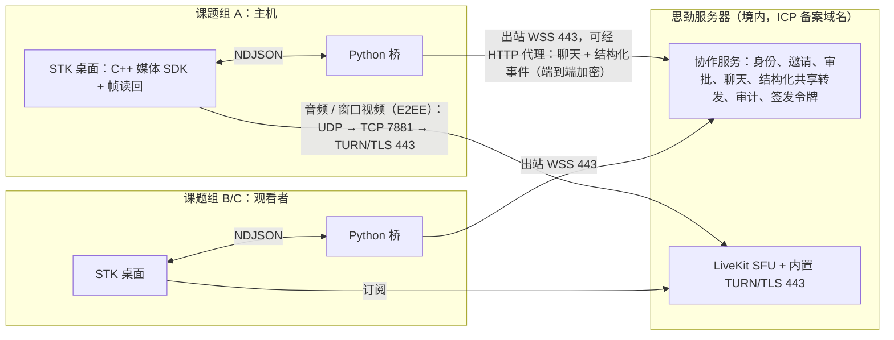

# 协作共享评估：类 VS Code Live Share 的会话共享、页面共享与语音文字交流

状态：**调研结论，待所有者决定；均未实现。** 日期：2026-10-08（2026-10-09 复核修订）。
上位方案：`docs/design/sijin-platform-2026-10.md`“所有者决定（第二轮）”第 11 条（共享对话、作图与页面，参与者之间语音和文字交流），
并受第 5、7、8、9、10 条约束（学校不开端口、文献不经思劲中转、必须内网穿透、中心服务与中转在思劲服务器、文献只“借阅”）。
相关评估：`docs/design/node-networking-evaluation-2026-10.md`（下称“组网评估”）、`docs/design/fl-framework-evaluation-2026-10.md`、`docs/hub.md`；
同批第二轮评估：`docs/design/nat-traversal-evaluation-2026-10.md`（下称“内网穿透评估”，含 RustDesk 与 ZeroTier）、
`docs/design/literature-lending-evaluation-2026-10.md`（下称“文献借阅评估”）、`docs/design/python311-flower-upgrade-2026-10.md`。

**怎么核实的**：许可证逐个读了仓库里的 LICENSE / COPYING / LICENCE 原文（raw.githubusercontent.com 与 webrtc.googlesource.com）；
版本与日期取自 GitHub API 与 PyPI JSON（2026-10-08 查询）；协议、端口与行为取自官方文档或源码；STK 现状取自本仓库源码与文档。
2026-10-09 复核时补读了 LiveKit 服务端与 Rust SDK 在固定提交上的源码，并下载了 LiveKit C++ SDK v1.12.2 的 Linux x64 预编译包，
只查看了文件大小、`build-info.json` 并对库文件运行 `strings`，没有运行它。
**没有运行任何候选系统，没有实测带宽、打洞或画质。** 标 **（未核实）** 的内容没有找到一手来源；涉及法律的结论须法务确认。

---

## 结论摘要

1. **Live Share 本身是“结构化共享 + 跟随”，不是视频。** 它的云服务只做认证与会话发现，内容经端到端加密的 SSH 传输（直连，或 SSH 套在 TLS WebSocket 上经 Azure Relay 中继）；
   直连要求主机在 5990–5999 中开放一个端口接受局域网入站连接（原文“inbound local network connections”，针对的是主机防火墙与局域网，不是校园出口）。
   三所学校之间没有共同的局域网，学校也不开放端口（决定 5），所以对 STK 只能参照“只走中继”。它的语音扩展已弃用，产品本身已进入维护模式。
   **可借鉴的是权限模型**（每次会话一次性的邀请链接、主机审批、只读、移除参与者、跟随与“请求关注”、排除文件），而不是它的传输。
2. **两种需求用两种机制。** “看对话/作图”用**结构化共享**：主机 STK 把对话消息、分析结果（`stk.graph-result/1` 中以 sha256 引用的 blob）、步号与相机、当前编辑器等事件发到会话，
   观看者的 STK 在本地渲染——文字清晰、可交互、带宽很小、走现有的出站 WSS 443（可经 HTTP 代理），并且**能按数据标注逐个对象检查**。
   “看我操作”用**窗口视频**：只采集 STK 自己的窗口（引擎已有 `GPU_offscreen_read_color` 读回），不采集整个桌面。
   第三种“绘制指令流”（`stk_ui::DrawList` 本来就是与后端无关、可序列化的绘制命令）适合作为以后的优化。
3. **媒体栈推荐自托管 LiveKit。** 服务端 Apache-2.0（Go，基于 Pion），官方 C++ SDK v1.12.2（Apache-2.0，Linux/macOS/Windows，建在其 Rust SDK 之上，支持端到端加密；
   有三平台预编译包，直接使用不需要 Rust 工具链），Python 侧只需 `livekit-api` 签发令牌（要求 Python ≥ 3.9，与升级到 3.11 无冲突，升级见 `docs/design/python311-flower-upgrade-2026-10.md`）；
   内置 TURN/TLS 可设在 443。需要注意：LiveKit 是 SFU，媒体一律经服务器转发，未见点对点直连模式（未核实），所以按决定 7 它不能承载文献借阅；
   默认 STUN 列表是 Twilio 加两个 Google 公共服务器，但只在未启用内置 TURN/UDP、也未配置 `turn_servers`/`stun_servers` 时才下发——本方案启用 TURN/UDP 3478，默认列表本不会下发，仍建议显式配置自建 STUN，并在服务端显式设置 `node_ip`；
   Rust SDK 在信令 WebSocket 与 HTTP 调用两处读取进程环境变量中的代理，媒体能否经强制代理**未核实**，改成显式代理配置需要修补 SDK 或在启动时设置环境变量；
   **预编译 C++ SDK 已静态编入 OpenH264 编码器、FFmpeg H.264 解码路径与 H.265 解析代码**，包内没有第三方许可声明（至少 Linux x64 包如此）——要关闭 H.264/H.265，就得放弃预编译包、三平台自建 libwebrtc 与 SDK，工作量明显增加。
4. **备选**：Galene（MIT，单进程 Go，内置 TURN、文字聊天、屏幕/窗口共享与录制，协议有文档，但只有网页客户端，原生端要自己实现协议）是最轻的替代；
   mediasoup（ISC）、Janus（GPL-3.0）、Pion（MIT）都要自己写房间、鉴权与信令；Jitsi（Apache-2.0）栈重（Java + XMPP），没有原生 C++ SDK。
5. **RustDesk 不嵌入，只作架构参考。** 客户端与服务端都是 AGPL-3.0；它是“整机远程桌面”应用而不是库，默认端口 21115–21117 不是 443。
   STK 桌面本身是 **GPL-2.0-or-later**（因为含第三方的 Blender 代码；分发的可执行文件因含 Apache-2.0 组件按 GPL-3.0-or-later），思劲不能仅凭自己是版权人就把桌面闭源分发。
   按 GPLv3 第 13 条可以与 AGPLv3 代码结合，但 AGPL 第 13 条的网络交互条款会附着到组合上。
   本次任务给出的“闭源商业分发”前提与仓库现状冲突；这不是协作功能独有的问题，而是整个平台方案的前置决定（见“需要所有者决定”第 1 条）。
6. **隐私与同意**：跨机构共享默认逐次同意；结构化共享复用 S1a 的数据标注（私有对象需要本次单独授权并记入审计）；
   像素无法逐个对象检查，所以每次开始窗口共享都要明确同意、持续显示“正在共享”、可暂停，建议自动遮挡显示私有对象的区域；
   **默认不录制**（语音属于个人信息，录音要充分知情、自愿明确的同意）；审计只记元数据；跨机构共享的内容建议端到端加密，使思劲服务器看不到内容。
7. **合规风险须法务确认**：由思劲在自己的服务器上为多所高校运营语音、画面与即时消息，与《电信业务分类目录》B22“国内互联网会议电视及图像服务业务……协同工作”
   和 B25“信息即时交互服务”的定义吻合，可能需要增值电信业务许可；C1 的文字聊天与协作会话可能属于“聊天室、通讯群组”一类功能，
   可能要按《具有舆论属性或社会动员能力的互联网信息服务安全评估规定》在上线或增设功能时自行开展安全评估；
   《网络安全法》第二十六条要求即时通讯服务取得用户真实身份信息，第二十三条要求网络日志留存不少于六个月；
   LiveKit 与 TURN 各需一个 CA 签发证书的域名，都要 ICP 备案。
8. **分期**：C1 文字聊天与协作会话服务（邀请、审批、审计）→ C2 结构化共享对话与作图（含跟随）→ C3 语音（LiveKit，仅音频）→ C4 STK 窗口共享 → C5 绘制指令流、录制。
   **文献借阅不在本线**：按决定 7 只走课题组之间的直连、以后再做，不放在 LiveKit 上（第四节；机制见文献借阅评估）。
   前两步不引入媒体栈与新许可，可以直接用于北京、珠海、聊城三个课题组的试点；试点期间语音可暂用各校已放行的会议软件。
   经 443 连入校园网的前提是三校网管知情同意、放行思劲的域名与 IP，方案不设计成绕开校方的安全管控。
   粗估 C1–C4 合计约 14–21 人周（按直接使用 LiveKit 预编译 SDK 计），**不含**跨机构身份与中心服务这一前置（由组网/中心服务那条线交付），
   也**不含**为关闭 H.264/H.265 而三平台自建 libwebrtc 与 SDK 的工作（需另行估算）。

---

## 详细分析

### 一、VS Code Live Share 如何工作（参考模型）

**角色与数据位置**。主机（host）共享，客人（guest）凭链接加入。客人“remote model”访问主机共享的文件，无需同步整个项目，编辑保存在主机上
（[co-edit 文档](https://learn.microsoft.com/en-us/visualstudio/liveshare/use/coedit-follow-focus-visual-studio-code)：“The resulting edits are persisted on the host's computer”）。

**服务、身份与加密**（[安全文档](https://learn.microsoft.com/en-us/visualstudio/liveshare/reference/security)，最后更新 2022-11-21）：
- “The role of the Live Share service is limited to user authentication and session discovery. The service itself does not store or ever have access any of the content of a session.”
- “all data transmitted between peers is end-to-end encrypted using the SSH protocol. In the case of a relay connection, the SSH encryption is layered on top of TLS-encrypted WebSockets.”
- 主机每次共享生成会话专用的 RSA 密钥对，私钥只在内存；客人用服务签发的 JWT（含身份声明与“可访问该会话”的声明）向主机证明身份，主机校验，**可按设置提示主机用户确认**。

**连接方式**（[连接文档](https://learn.microsoft.com/en-us/visualstudio/liveshare/reference/connectivity)，最后更新 2023-01-09）：
- 默认 auto：能直连就直连，否则经云中继；直连“require a port between 5990 and 5999 be opened”，表格中写的是主机要开放端口“to accept inbound local network connections”——
  针对的是主机桌面防火墙与局域网场景，不是校园出口。
- relay 模式“No port is opened on the host's machine”，客户端需要出站访问 `*.servicebus.windows.net:443`（Azure Relay）；中继“does not persist any traffic routed through it”。
  任何模式都还需要出站访问 `*.liveshare.vsengsaas.visualstudio.com:443` 与 `*.online.visualstudio.com`。
- 代理：靠 `HTTP_PROXY`/`HTTPS_PROXY` 环境变量或 VS Code 的代理设置，文档承认“some limitations around proxy use”。

**邀请与加入控制**（安全文档）：
- 每次会话生成“new unique identifier”，链接“only valid for the duration of a single collaboration session”；
- 有人加入时主机收到通知，可“Remove”；设置 `liveshare.guestApprovalRequired` 后每个客人都要主机批准；
- 未登录的“匿名”客人只能**只读**加入，默认需要主机批准。

**只读、跟随与关注**：
- 只读会话中客人不能编辑，但仍能看到彼此光标与高亮；终端可只读或读写共享，VS Code 默认把终端**只读**共享（安全文档）。
- 加入时“you'll automatically follow the host”，跟随时编辑器与对方的当前文件和滚动位置同步；打开别的文件或关闭当前文件即自动退出跟随；
  “Focus participants”向所有人发通知请求关注；跟随绑定到编辑器组，可以一边跟随一边独立浏览（co-edit 文档）。
- `.vsls.json` 的 `excludeFiles` 让某些文件在任何情况下（包括跟随跳转）都不对客人打开。

**语音与现状**：Live Share Audio 扩展的商店页标题为“[Deprecated] Live Share Audio”，正文写明“has been deprecated”（[商店页](https://marketplace.visualstudio.com/items?itemName=MS-vsliveshare.vsliveshare-audio)）；
Live Share 官方首页（2026-05-27 更新）写明“Visual Studio Live Share is in maintenance mode, with no additional features planned”（[首页](https://learn.microsoft.com/en-us/visualstudio/liveshare/)），
但首页正文仍写着“have voice calls”，属于过时措辞。上面引用的连接与安全文档分别更新于 2023-01-09 和 2022-11-21，都早于维护模式公告。
也就是说，**参考对象本身没有内置语音，且已停止发展**；它的价值在于交互与权限模型。

**对 STK 的映射**

| Live Share 机制 | STK 对应设计（建议，未实现） |
|---|---|
| 服务只做认证与会话发现，内容端到端加密 | 思劲中心服务做身份、邀请、审批、在场状态与转发；共享内容端到端加密，中心服务只见元数据（第六节） |
| auto / direct / relay | 只用 relay（出站 443）；直连作为以后的优化，复用内网穿透评估选定的穿透层 |
| 每会话一次性邀请链接 + JWT | 会话 ID 随机且只在会话期间有效；中心服务签发会话令牌；媒体令牌（LiveKit JWT）只在主机批准后签发 |
| guestApprovalRequired、Remove | 跨机构客人**默认需要主机批准**（比 Live Share 默认更严）；主机可随时移除，移除即吊销令牌 |
| 只读会话、匿名只读客人 | 默认只读；**不允许匿名**（须中心服务的实名账号，见第五节合规） |
| 跟随主机、请求关注 | 主机广播“焦点”（编辑器、对象、滚动、相机、步号）；客人默认跟随，可脱离；主机可请求关注 |
| excludeFiles | 共享清单：只有清单内的对象可被客人看到；私有对象需单独授权 |
| 共享终端只读 | 共享 Runtime 任务日志与进度（只读）；客人不能提交任务、不能调用主机的模型 |

### 二、STK 现状：决定方案的仓库事实

- **许可**：`desktop/LICENSE` 写明 `desktop/` 下全部为 GPL-2.0-or-later（含 Blender 代码）；`desktop/packaging/THIRD-PARTY-NOTICES.md` 写明可执行文件因含 Apache-2.0 组件，
  “as distributed are covered by GPL-3.0-or-later”。`desktop/` 以外的内容（Python 包 `suan`、`web/` 前端、`toolkits/` 等）按根目录 `LICENSE` 为 MIT。
  **桌面不是闭源的**：它受 GPL 约束是因为其中含第三方的 Blender 代码（GPL-2.0-or-later），思劲不能仅凭自己是版权人就改为闭源分发。
  引入的库必须与 GPL-3.0-or-later 兼容；例如 LiveKit（Apache-2.0）只能与 GPL-3.0-or-later 结合，与现有 `THIRD-PARTY-NOTICES.md` 的表述一致。
- **桌面经 Python 桥访问 hub**：`docs/specs/stk-desktop-bridge-v1.md` 中桥保存已配对 hub（`hubs.json`），桌面与桥之间是 stdio 上的 NDJSON。
  结构化共享的事件量小，可以走这条路；**音视频帧不应经过 NDJSON 桥**，媒体 SDK 应放在 C++ 进程里。
- **引擎能读回自己的画面**：`desktop/engine/lib/stk_gfx/src/offscreen.cc` 调用 `GPU_offscreen_read_color`，`stk_viewer_gpu` 有 `GPU_texture_read` 与分块 PNG 导出，
  `stk-desktop --headless --export` 能导出整个应用画面。所以“只采集 STK 窗口”在三平台上都不需要操作系统的屏幕录制接口。
- **界面是可序列化的绘制命令**：`desktop/engine/lib/stk_ui/include/stk/ui/draw_list.hh`：“Backend-neutral draw list produced by ui_core and consumed by a Painter … tests serialize it to JSON goldens”。
  命令只有圆角框、矩形、三角、文字、色条、图像、裁剪八种。**但**：`Image` 命令引用的是主机的纹理句柄；三维查看器由 `stk_viewer_gpu` 直接用 GPU 模块绘制，不在 DrawList 里。
- **按需重绘**：窗口管理器是“on-demand event loop”，区域用 `tag_redraw()` 标记重绘（`stk_wm/include/stk/wm/screen.hh`）；界面静止时不出新帧，有利于低码率。
- **数据标注（S1a 已交付）**：`project_labels` 只追加，没有记录即为私有；模型网关发往外部端点前检查 `labels.is_public("table", …)`（`suan/models/gateway.py`）。
- **AI 对话与分析结果的存储**：对话在项目 SQLite 的 `project_contexts` / `project_messages` / `project_requests`（带 sha256）；
  分析结果 `stk.graph-result/1` 的图、表、三维数据包都以 `sha256:` 引用内容寻址 blob（`docs/hub.md`）。这正是结构化共享需要的“可寻址、可校验”的数据形态。
- **hub 不能直接当协作服务用**：hub 是单一所有者加配对设备的单租户服务；`suan/control/store.py` 里的 `sessions` / `messages` 表是网页端与服务端模型的对话
  （`suan/control/app.py` 的 `/api/v1/sessions/{id}/messages` 把用户消息交给 `model.reply`），**不是人与人的协作会话**。
  跨三所学校的协作需要思劲中心服务上的**多机构身份**（账号、所属机构、课题组）——目前不存在，属于前置工作。可复用的是模式：SSE 事件流、内容寻址 blob、配对与吊销。
- **网络基础**：组网评估的 L0 是“出站 WSS/HTTPS 443 到协调服务，补显式 HTTP 代理与自定义 CA”。文字与结构化共享直接建在 L0 上即可。

### 三、屏幕共享、语音与文字的技术候选

#### 3.1 对照表

| 候选 | 许可（读了原文） | 形态 | C++ / Python 客户端 | 只放行出站 443 | 强制 HTTP 代理 | 适合度 |
|---|---|---|---|---|---|---|
| libwebrtc（Google） | BSD-3（[LICENSE](https://webrtc.googlesource.com/src/+/refs/heads/main/LICENSE)）＋专利授权（[PATENTS](https://webrtc.googlesource.com/src/+/refs/heads/main/PATENTS)） | C++ 媒体引擎：采集、编解码、回声消除、ICE、SRTP | 本身是 C++；构建体系庞大 | 经 TURN/TLS | 原生库的代理配置未核实 | 构件；LiveKit C++ SDK 已内含 |
| **LiveKit 服务端** v1.13.9 | Apache-2.0（[LICENSE](https://github.com/livekit/livekit/blob/master/LICENSE)） | Go SFU，依赖 `pion/webrtc/v4`（LiveKit 的分支）与 `pion/turn`（[go.mod](https://github.com/livekit/livekit/blob/master/go.mod)），内置 TURN | [C++ SDK](https://github.com/livekit/client-sdk-cpp) v1.12.2（Apache-2.0，有三平台预编译包）；Rust `livekit` 0.9.4；Python `livekit` 1.1.20、`livekit-api` 1.2.1（[LICENSE](https://github.com/livekit/python-sdks/blob/main/LICENSE)，PyPI 标 `>=3.9.0`） | ✅ TURN/TLS 可设 443 | ⚠️ 信令 WebSocket 与 HTTP 调用读进程环境代理；媒体未核实 | **推荐** |
| LiveKit Egress | Apache-2.0（[LICENSE](https://github.com/livekit/egress/blob/main/LICENSE)） | 录制、导出 | — | — | — | 仅在决定录制时 |
| Galene 1.2.1（tag） | MIT（[LICENCE](https://github.com/jech/galene/blob/master/LICENCE)） | Go 单进程 SFU；“built-in TURN server”、“text chat”、“screen and window sharing”、“recording to disk”（[galene.org](https://galene.org/)） | 只有网页客户端；[协议文档](https://github.com/jech/galene/blob/master/galene-protocol.md)公开，原生端要在 libwebrtc 上自行实现 | 内置 TURN，TLS 443 未核实 | 未核实 | 备选（最轻） |
| mediasoup v3 | ISC（[LICENSE](https://github.com/versatica/mediasoup/blob/v3/LICENSE)） | Node.js 模块（另有 Rust）；“signaling agnostic”、“just handle the media layer”（[概述](https://mediasoup.org/documentation/overview/)） | [libmediasoupclient](https://github.com/versatica/libmediasoupclient)（C++，ISC，需 libwebrtc） | 需自配 TURN | — | 要自写房间、鉴权、信令 |
| Janus | GPL-3.0（[COPYING](https://github.com/meetecho/janus-gateway/blob/master/COPYING)） | C 服务端加插件 | 无官方原生 SDK（未核实） | 需配 coturn | — | 本地交付时要随附源码；要自写较多 |
| Pion | MIT（[LICENSE](https://github.com/pion/webrtc/blob/master/LICENSE)） | Go WebRTC 库 | — | — | — | 只是构件（LiveKit 已在用） |
| Jitsi Meet / Videobridge | Apache-2.0（[jitsi-meet](https://github.com/jitsi/jitsi-meet/blob/master/LICENSE)、[JVB](https://github.com/jitsi/jitsi-videobridge/blob/master/LICENSE)） | Java JVB + XMPP + 网页 | IFrame API / React SDK / 移动 SDK（[jitsi.org/iframe](https://jitsi.org/iframe)）；未见原生 C++ 桌面 SDK（未核实是否完全没有） | 官方要求 10000/UDP 与 5349/TCP（[快速部署](https://jitsi.github.io/handbook/docs/devops-guide/devops-guide-quickstart/)），未写 443 上的 TURN | — | 栈重，不适合嵌入原生桌面 |
| coturn | BSD-3（[LICENSE](https://github.com/coturn/coturn/blob/master/LICENSE)） | TURN 服务器 | — | ✅ TURN/TLS 443 | — | 只在不用 LiveKit 内置 TURN 时 |
| libdatachannel | MPL-2.0（[README](https://github.com/paullouisageneau/libdatachannel)：“licensed under MPL 2.0 since version 0.18”） | C++ 数据通道与 SRTP 媒体传输，不含编解码与回声消除 | C++/C 绑定 | 需换 libnice 后端才有 TURN TCP/TLS（组网评估） | 仅 libnice、仅无认证 HTTP（组网评估） | 自建轻量方案的构件 |
| RustDesk 1.5.0 / rustdesk-server 1.1.16 | 均为 AGPL-3.0（[LICENCE](https://github.com/rustdesk/rustdesk/blob/master/LICENCE)、[LICENSE](https://github.com/rustdesk/rustdesk-server/blob/master/LICENSE)） | Rust 整机远程桌面**应用**；hbbs 会合与打洞，hbbr 中继 | 不是库 | 默认 TCP 21115–21117、UDP 21116，WebSocket 21118/21119 | 未核实（见内网穿透评估） | 架构参考，不嵌入 |

#### 3.2 LiveKit 的要点

- **C++ SDK**：README 列出“Publish local audio/video tracks”、“Data tracks … and data streams”、“RPC between participants”、“End-to-end encryption (E2EE)”，
  “Supported platforms: Linux (x64, arm64), macOS (12.3+, Apple Silicon & Intel), Windows (x64)”；“Building requires a stable Rust toolchain”，硬件编码“via the underlying Rust SDK”。
  发布 v1.12.0（2026-09-23）、v1.12.1（2026-10-06）、v1.12.2（2026-10-07），更新频繁。它可以直接把 RGBA 帧推给 `VideoSource::captureFrame`，正好接 STK 的帧读回。
- **预编译包与源码构建**：`docs/building.md` 有“Using prebuilt releases”一节，v1.12.2 提供三平台预编译包（[release](https://github.com/livekit/client-sdk-cpp/releases/tag/v1.12.2)，压缩包约 10.7–13.7 MB）。
  **直接用预编译包不需要 Rust 工具链**，只有从源码构建才需要。复核时下载的 `livekit-sdk-linux-x64-1.12.2.tar.gz` 解压后约 36 MB（`liblivekit_ffi.so` 28.0 MB、`liblivekit.so` 7.8 MB），
  `build-info.json` 记为 `livekit_ffi_version` 0.12.82。从源码构建时，`webrtc-sys` 会从 GitHub Releases 下载约 156 MB 的预编译 libwebrtc（`webrtc-89d790b`），境内 CI 需要镜像。
- **代价**：三平台打包要加入这两个库；预编译包里只有 `build-info.json`，**没有任何第三方许可声明**。STK 的 `THIRD-PARTY-NOTICES.md` 要自行列出 libwebrtc 的依赖
  （FFmpeg LGPL-2.1+、OpenH264 BSD-2、BoringSSL、libvpx、Opus、libyuv、abseil 等）与 Rust crate 的许可，并履行 FFmpeg 的 LGPL 义务。
  预编译库还已编入 H.264/H.265 相关代码，见 3.4。macOS 与 Windows 包解压后的体积本次未测。
- **令牌与权限**：参与者 JWT 带授权，例如 `{"canPublish":true,"canSubscribe":true,"canPublishData":true}`（C++ SDK README 的 `lk token create --grant` 示例）。
  只读观看者即 `canPublish:false`；能发言的参与者只给音频发布权（细粒度到轨道来源的授权未核实）。令牌由 Python 中心服务签发（`livekit-api`），主机批准之后才签发。
  服务端移除参与者的接口名本次未核实。
- **端口**（[端口与防火墙](https://docs.livekit.io/home/self-hosting/ports-firewall/)）：TCP 7880（API 与 WebSocket，置于终止 TLS 的负载均衡之后）、TCP 7881（ICE/TCP，“when the client could not connect via UDP”）、
  UDP 50000–60000 或单端口 7882、TURN/TLS 5349（无负载均衡时“needs to be set to 443”）、TURN/UDP 3478。这些都是**思劲服务器上的入站端口**，校园侧只需出站。
  [config-sample.yaml](https://github.com/livekit/livekit/blob/master/config-sample.yaml) 还写明 TURN/UDP“recommended to 443 if not running HTTP3/QUIC server”，
  ICE/TCP 的 `tcp_port` 也可设为 80/443（“only 80/443 on public IP are allowed if less than 1024”）；对只放行 443 的校园，这是 TURN/TLS 之外的另一档。
  ICE/TCP 若也用 TCP 443，与 HTTPS、TURN/TLS 同样需要另外的公网 IP 或分流（具体做法未核实）。
- **TURN 与证书**（[部署文档](https://docs.livekit.io/home/self-hosting/deployment/)，现重定向到 `docs.livekit.io/transport/self-hosting/deployment/`）：
  “Enabling TURN/TLS gives you the broadest coverage in client connectivity, including those behind corporate firewalls”；
  “If you are using TURN, then a separate TURN domain and SSL cert will be needed, as well”；“The SSL certificate must be signed by a trusted certificate authority; self-signed certs do not work here”
  （这句原文针对主信令域名；TURN/TLS 的客户端同样要校验证书，按同样要求处理）。
  config-sample.yaml 中 TURN 的 `tls_port`（默认 5349）“if not using a load balancer, this must be set to 443”；而且服务端下发给客户端的 TURN/TLS 地址在代码中写死为
  `turns:<TURN 域名>:443?transport=tcp`（[roommanager.go](https://github.com/livekit/livekit/blob/5a5a6132c7a4a31acf8e3d9169005d1a597272af/pkg/service/roommanager.go) 第 1079 行），与 `tls_port` 的设置无关。
  所以与 HTTPS 共用 443 时需要第二个公网 IP 或按 SNI 分流的四层代理；经负载均衡或 SNI 分流时，必须把 443 转发到 `tls_port`。
- **STUN 默认值**：config-sample 的注释写“by default LiveKit clients use Google's public STUN servers”，但代码中的默认列表是
  `global.stun.twilio.com:3478`、`stun.l.google.com:19302`、`stun1.l.google.com:19302`（[mediatransportutil config.go](https://github.com/livekit/mediatransportutil/blob/f234b534b095/pkg/rtcconfig/config.go) 第 38–42 行），第一项是 Twilio；
  而且只在 `hasSTUN` 为假时才下发给客户端（roommanager.go 第 1151 行）。启用内置 TURN/UDP（“UDP TURN is used as STUN”）、配置了 `turn_servers` 或 `stun_servers` 时，`hasSTUN` 都为真，不会下发默认列表；
  只开 TURN/TLS 时仍会下发。本方案启用内置 TURN/UDP 3478，默认列表本来就不会下发，但仍建议用 `stun_servers` 显式配置思劲自建的服务器
  （这些境外 STUN 服务在境内的可达性未核实，按不可达处理）。
- **服务端公网地址**：服务端若开启 `use_external_ip`，会用 STUN 探测自己的公网 IP，所用服务器可能是上面的境外默认列表（未核实）。部署在思劲境内服务器时，应显式设置 `node_ip`。
- **强制 HTTP 代理**：Rust SDK 读取进程环境变量中的代理有两处。
  一是信令 WebSocket：[`livekit-net/src/native/proxy.rs`](https://github.com/livekit/rust-sdks/blob/35d7655c580147c2ad05fc8ffa5d885e88c822b9/livekit-net/src/native/proxy.rs) 第 46–51 行，
  URL 为 wss 时读 `HTTPS_PROXY`/`https_proxy`，为 ws 时读 `HTTP_PROXY`/`http_proxy`；不处理 `NO_PROXY`；认证只支持 URL 中 user:password 形式的 Basic；
  WSS 经代理需要 `rustls-tls-native-roots` 特性（livekit-ffi 默认开启）。
  二是同一 crate 的 HTTP 客户端（`livekit-net/src/native/mod.rs` 第 45 行的 `reqwest::Client::new()`）：reqwest 默认启用系统代理
  （[reqwest 0.12.28 lib.rs](https://raw.githubusercontent.com/seanmonstar/reqwest/v0.12.28/src/lib.rs) 第 139 行“System proxies are enabled by default”），
  底层 hyper-util 无条件读取 `ALL_PROXY`、`HTTP_PROXY`、`HTTPS_PROXY`、`NO_PROXY`（[hyper-util 0.1.20 matcher.rs](https://raw.githubusercontent.com/hyperium/hyper-util/v0.1.20/src/client/proxy/matcher.rs) 第 228–236 行）；
  这个客户端用于信令失败后调用的 `rtc/validate`（`livekit-signaling/src/lib.rs` 第 631 行）与 LiveKit Cloud 的区域查询。
  两处都依赖进程级环境变量，且对 `NO_PROXY` 的处理不一致，与组网评估“默认不读环境代理”的做法相反。Rust 层虽有 `livekit_net::set_ws_client`/`set_http_client` 注入点，
  但 `livekit-ffi/src` 中没有暴露（据 grep 结果），C++ SDK 无法直接使用——要改成显式代理配置，只能修补 SDK，或在启动 C++ 进程时设置环境变量。
  媒体侧，`webrtc-sys/src` 中除音频设备的 AdmProxy 外没有任何代理相关代码，**ICE/TURN 媒体能否经强制代理未核实，按不能处理**。
  强制代理的学校只能用文字与结构化共享（走 L0），或窗口共享的低帧率回落（第五节）。
- **端到端加密**（[加密文档](https://docs.livekit.io/home/client/tracks/encryption/)）：覆盖音视频轨道；设置 `encryption` 后数据消息也加密；“no intermediaries (including LiveKit servers) can access or modify the content”；
  “Signaling messages … are not end-to-end encrypted”；“LiveKit does not (and cannot) store or transport encryption keys for you”——密钥要由我们的中心服务以外的方式（或经端到端加密的通道）分发。
- **规模**（[基准](https://docs.livekit.io/home/self-hosting/benchmark/)，16 核 `c2-standard-16`）：1 个发布者对 3000 个订阅者的直播，出向 531 MBps、CPU 92%；10 发布者对 3000 订阅者的纯音频，出向 23 MBps。
  三个课题组的试点远低于这个量级。

#### 3.3 RustDesk：能不能用

- **许可**：客户端与服务端都是 AGPL-3.0（见上表；客户端最新 1.5.0，2026-09-30；服务端最新 1.1.16，2026-07-20）。
  仓库内 `libs/scrap/Cargo.toml` 声明 `license = "MIT"`（该目录没有 LICENSE 文件），RustDesk 对它的修改是否按 MIT 授权（未核实），这不改变整体为 AGPL-3.0 的结论。
  服务端另有闭源的 Server Pro（[自托管文档](https://rustdesk.com/docs/en/self-host/)：Pro 增加 web 控制台、OIDC、LDAP、访问控制等）。
- **与 STK 结合的许可后果**：[GPLv3 第 13 条](https://www.gnu.org/licenses/gpl-3.0.txt)允许把 GPLv3 作品与 AGPLv3 作品“link or combine … into a single combined work”，
  但“the special requirements of the GNU Affero General Public License, section 13, concerning interaction through a network will apply to the combination as such”。
  [AGPLv3 第 13 条](https://www.gnu.org/licenses/agpl-3.0.txt)要求修改版向“all users interacting with it remotely through a computer network”提供对应源码。
  STK 桌面本已是 GPL，这在法律上可行，但把整个桌面带进 AGPL 的网络条款，并让“闭源商业分发”彻底不可能。**原样**运行 hbbs/hbbr 作为独立进程，对客户端没有许可影响；修改后对外提供服务则须公开修改。
- **架构**（自托管文档）：hbbs 是 ID/会合服务器（TCP 21116 用于“device registration and NAT hole punching”，TCP 21115 做 NAT 类型测试），hbbr 是中继（TCP 21117，WebSocket 21119）；
  “If hole punching fails, A will communicate with B via the relay server”。也就是“会合 → 打洞 → TCP 中继”，与组网评估推荐的 iroh 路线同构。WebSocket 端口文档说一般经 nginx 反代，
  **原生客户端能否只用 443 上的 WebSocket 连接，本文未核实**；RustDesk 的打洞方式、代理支持与 443 上的行为由内网穿透评估逐项核查。
- **为什么不适合本需求**：它采集的是**整个桌面**（其他应用、通知、聊天窗口都会被看到），且带远程控制、文件传输与剪贴板共享等功能（未核实默认开关）——与“只给对方看 STK 的这个对话/作图”、
  “借阅不能下载”的要求相反；它不是可嵌入的库；在一些高校，远程控制软件本身就需要网管审批（未核实具体规定）。
- **结论**：借鉴它的“会合 + 打洞 + 中继”结构与按端口分工的部署方式；不嵌入其代码，不把它作为 STK 的共享通道。
- 所有者在决定 8 中同时提到 ZeroTier：它属于组网线，组网评估与内网穿透评估的结论都是不推荐（控制器自 1.16.0 起商业使用需另购许可，TCP 回落是“最后手段”），本文不重复。

#### 3.4 编解码与专利

- 屏幕内容建议用 **VP8/VP9**：libvpx 为 BSD-3（[LICENSE](https://github.com/webmproject/libvpx/blob/main/LICENSE)），附 Google 的专利授权（[PATENTS](https://github.com/webmproject/libvpx/blob/main/PATENTS)）。语音用 Opus（libwebrtc 内置）。
- **H.264**：OpenH264 源码为 BSD-2（[LICENSE](https://github.com/cisco/openh264/blob/master/LICENSE)），但 Cisco 承担 MPEG LA 费用只针对“Cisco-provided binary”，前提是
  “The Cisco-provided binary is separately downloaded to an end user’s device, and not integrated into or combined with third party software prior to being downloaded”
  （[BINARY_LICENSE](https://www.openh264.org/BINARY_LICENSE.txt)）；另有三项条件：用户能启用或禁用该二进制、显示“OpenH264 Video Codec provided by Cisco Systems, Inc.”、在 EULA 中复述上述文字。
  专利许可声明本身也限定为“PERSONAL USE OF A CONSUMER OR OTHER USES IN WHICH IT DOES NOT RECEIVE REMUNERATION”。
  所以**打包进我们的程序、或从源码编译的 OpenH264，都不在豁免范围内**；商业产品即使改用 Cisco 二进制也不一定被覆盖，须法务确认。
- LiveKit 预编译 libwebrtc 的构建参数：[build_linux.sh](https://github.com/livekit/rust-sdks/blob/35d7655c580147c2ad05fc8ffa5d885e88c822b9/webrtc-sys/libwebrtc/build_linux.sh) 第 139–141 行为
  `ffmpeg_branding="Chrome"`、`rtc_use_h264=true`、`rtc_use_h265=true`；`build_macos.sh` 同样打开 H.264/H.265；`build_windows.cmd` 打开 `rtc_use_h264=true` 与 `ffmpeg_branding="Chrome"`，
  没有显式设置 `rtc_use_h265`（Windows 的默认值未核实）；iOS/Android 为 `rtc_use_h264=false`。预编译 libwebrtc 的版本固定为 `webrtc-89d790b`（`webrtc-sys/build/src/lib.rs` 第 31 行）。
- **这不只是“自建时的构建参数”问题**：复核时对 v1.12.2 Linux 预编译包的 `liblivekit_ffi.so` 运行 `strings`，可见“CWelsH264SVCEncoder::InitEncoder(), openh264 codec version”、
  “Failed to create OpenH264 encoder”、“FFmpeg H.264 decoder not found.”、“../common_video/h265/h265_sps_parser.cc”。
  也就是说，**直接用推荐的预编译包，就已经在分发 OpenH264 编码器（从源码编译，不是 Cisco 提供的二进制）、FFmpeg H.264 解码路径与 H.265 解析代码**。
  分发这些代码是否触发 H.264/H.265 专利许可义务**未核实，须法务**；FFmpeg 的 LGPL 义务也要履行（3.2）。
- **关闭它们的代价**：要放弃预编译 C++ 包，用 Rust 工具链从源码构建 SDK，为三平台各自构建关闭这两项的 libwebrtc，再经环境变量 `LK_CUSTOM_WEBRTC`（`webrtc-sys/build/src/lib.rs` 第 81 行）接入；
  `webrtc-sys` 在 `rtc_use_h264=false` 下能否编译**未核实**。工作量明显大于只改构建参数，C3/C4 的人周估算没有包含这部分（见分期）。
  只用 VP8/VP9/AV1 仍是发布包的目标，取舍见“需要所有者决定”第 9 条。

#### 3.5 采集方式：操作系统录屏 vs 读回自己的画面

- 操作系统录屏在 Wayland 上要经 xdg-desktop-portal 的 ScreenCast：Start()“will typically result the portal presenting a dialog letting the user do the selection”，经 PipeWire 取流
  （[portal 文档](https://flatpak.github.io/xdg-desktop-portal/docs/doc-org.freedesktop.portal.ScreenCast.html)）；macOS 需要“屏幕录制”权限、Windows 用 Windows.Graphics.Capture（本次未取得官方原文，**未核实**）。
- STK 自己用 GPU 模块渲染，可以把**本窗口**的帧读回（`GPU_offscreen_read_color`），三平台一致，不需要任何系统权限，也**不可能**带出其他应用的内容。
- 反过来说：没有了系统的录屏确认框，**STK 内的逐次同意就是唯一的门槛**，必须做实（第六节）。同步读回会阻塞渲染，1080p 每帧约 8 MB，需异步读回或降帧（性能未实测）。

#### 3.6 文字聊天放在哪里

文字消息走中心服务的 WSS 会话通道，不走媒体服务器的数据通道：在只有 443 和强制代理的学校也能用；消息可按会话保存到主机项目、受审计；
媒体服务不可用时聊天照常。媒体数据通道只用于高频、可丢的状态（如远程指针）。

### 四、结构化共享、窗口视频与绘制指令流

| 方面 | A 结构化共享 | B 窗口视频（只采集 STK 窗口） | C 绘制指令流（DrawList） |
|---|---|---|---|
| 传的是什么 | 对话消息、AI 请求状态、分析结果 blob 引用、相机/步号、焦点编辑器 | 编码后的像素（VP8/VP9） | 每帧（有变化时）的绘制命令；图像与三维区域另传 |
| 观看端 | 本地 STK 渲染，原生清晰，可缩放、可脱离跟随自行浏览 | 任意分辨率下都是视频，文字可能模糊，不能交互 | 本地重画，文字清晰，不能独立浏览 |
| 带宽 | 很小：对话 KB 级；图/表几十到几百 KB；三维数据包 MB–GB 但按 sha256 只传一次（估算） | 720p5 约 0.8 Mbps，1080p15 约 2.5 Mbps，`original` 7 Mbps（LiveKit [预设](https://github.com/livekit/client-sdk-js/blob/main/src/room/track/options.ts)） | 未实测；界面静止时为零 |
| 网络 | 走 L0 的 WSS 443，可经 HTTP 代理 | 需 UDP 或 TURN/TLS 443；强制代理下未核实 | 同 A |
| 数据边界检查 | **能**逐个对象查标注并列出共享清单 | **不能**，只能逐次同意 + 遮挡 | 部分：能知道哪个区域在显示哪个对象 |
| 三维查看器 | 观看端用同一份 `stk-render-payload-v2` 数据重新渲染，跟随主机相机 | 照原样看到 | 三维区域不在 DrawList 内，需配合 A 或 B |
| 版本耦合 | 需要共享协议版本（如 `stk.share/1`）与功能探测 | 无 | 强：两端 STK 版本需一致 |
| 适合 | **“看对话/作图/分析”** | **“看我操作”**（菜单、表单、调参过程） | 以后替代 B 的一部分，省带宽、更清晰 |
| 工作量 | 中（每种可共享对象都要定义事件与渲染） | 中（媒体栈集成是大头） | 中高（纹理与三维区域、版本兼容） |

**建议**：
- “共享某个对话、作图”= A。共享对话：上下文（及其参数表的标注检查）、消息、进行中的 AI 回答（流式）、草案与提议（只读）。
  **AI 请求只在主机上执行**，用主机的端点与密钥；客人可以在聊天里建议问题，由主机决定是否发送——客人不能消耗主机的模型额度，也不能借主机把数据发给外部模型。
  共享作图：`stk.graph-result/1` 的输出（图的 SVG/PNG 与 `data_blob`、表、三维数据包）加上参数与步号；观看端按 sha256 取 blob、本地渲染。
- “共享页面，看我的操作”= B，只采集 STK 窗口，带“正在共享”边框与暂停键。
- 跟随：主机广播焦点（当前编辑器类型与对象 ID、滚动、查看器相机、步号），客人默认跟随，自行切换即脱离；“请求关注”同 Live Share。
- blob 传输：hub 现有的 blob 存储是“存储再转发”，会在思劲侧留副本。共享内容应走组网评估提出的**流式直通**（不落盘），或端到端加密后带短 TTL 缓存。

**与文献“借阅”（决定 10）的关系**：借阅就是“远程看持有者 STK 中的文献，不能下载”。A 会把文献内容（文本或页面图像）作为数据发给对方，等于给了副本，不适合；
B 只发像素，最接近“在持有者的客户端上查看”。但 LiveKit 是 SFU，媒体一律经思劲服务器转发（未见点对点模式，未核实），
而所有者已在决定 7 中明确“文献不经思劲中转，课题组之间直连；可以晚些再做”。所以**文献借阅不走 LiveKit，也不放进本文的分期**：按决定 7 只走课题组之间的直连、以后再做。
文献借阅评估把借阅定义为协作会话的一种会话类型，可以复用 C1 的邀请、审批与审计；内容通道（持有者节点渲染页图、水印、限速）与直连打不通时如何处理，
见 `docs/design/literature-lending-evaluation-2026-10.md` 与 `docs/design/nat-traversal-evaluation-2026-10.md`。
另外对方仍可截屏，技术上无法完全阻止，借阅的法律边界须法务确认。

### 五、在思劲境内服务器自托管

**组件**（均在思劲服务器，均未实现）：
1. 协作服务（Python，可与中心服务同进程或独立）：账号与机构、会话、邀请、审批、在场状态、文字聊天、结构化共享事件转发、LiveKit 令牌签发、审计。出站 WSS 443，客户端经桥连入。
2. LiveKit SFU（单一 Go 二进制）加内置 TURN（TLS 443，独立域名与证书）。试点单节点即可；官方配置注释写“redis is recommended for production deploys”（部署文档）。
   显式设置 `node_ip`，不依赖 `use_external_ip` 的 STUN 探测（3.2）。
3. 自建 STUN（LiveKit 内置 TURN/UDP 3478 同时提供 STUN），并在 `stun_servers` 中显式配置，不使用境外默认列表。

**思劲服务器需开放的入站端口**：443/TCP（协作服务与 LiveKit 信令，经反向代理）、TURN/TLS 443/TCP（第二个 IP 或 SNI 分流；下发给客户端的地址固定为 `:443`，分流时把 443 转发到 `tls_port`）、
7881/TCP（ICE/TCP，可按需改为 80/443）、UDP 50000–60000（或 7882 单端口）、3478/UDP（TURN/UDP；config-sample 建议在不运行 HTTP3/QUIC 时设为 UDP 443）。
校园侧不开任何端口，只需出站。

**校园侧连接路径**：ICE 同时收集候选，优先 UDP 直达 SFU；UDP 不通时用 ICE/TCP 7881（端口文档：“Used when the client could not connect via UDP”）或 TURN/TLS 443
（具体选择顺序由 ICE 决定，未逐项核实）。只放行 443 的学校可以用 TURN/TLS 443，或把 ICE/TCP 设在 TCP 443、TURN/UDP 设在 UDP 443 作为另一档（未实测）；
有强制 HTTP 代理的学校媒体按不可用处理，窗口共享回落为“经协作服务 WSS 发低帧率关键帧”（例如 1–2 帧/秒的 VP9 或 WebP，未实测）。具体要在三所学校用诊断工具实测（组网评估 L0 第 2 条）。

**校方网管的同意**：经 443 进入校园网的前提是校方网管知情同意，并把思劲的域名与 IP 列入放行名单；方案不设计成绕开学校的安全管控。
在做 TLS 检查（中间人解密）的网络里，TURN/TLS 可能直接失败（未核实），同样需要与网管沟通。

**带宽估算**（试点：6 人、3 所学校、1 人共享；SFU 出向 ≈ 观看人数 × 码率；未实测）：

| 内容 | 主机上行 | SFU 出向合计 |
|---|---|---|
| 语音：6 人，每路 speech 预设 24 kbps，每人收另外 5 路 | 24 kbps | 约 0.7 Mbps（静音与 DTX 时更低） |
| 窗口共享 720p5 给 5 人 | 0.8 Mbps | 4 Mbps |
| 窗口共享 1080p15 给 5 人 | 2.5 Mbps | 12.5 Mbps |
| 结构化共享：对话与二维图 | KB/s 级 | KB/s 级 |
| 结构化共享：三维数据包（一次性） | 数据包大小 × 1 | 数据包大小 × 5（可按 sha256 去重缓存） |

经 TURN 的参与者：TURN 与 SFU 不在同一台主机时，思劲侧要多走一跳（TURN↔SFU），按两倍估；内置 TURN 与 SFU 同机时这一跳在本机内（未实测）。
**试点规模下，4 核 8 GB、峰值 20–30 Mbps 出向即可**（估算）。境内带宽价格与 CERNET 和运营商之间的互联质量未核实，建议放在多线 BGP 机房并实测。

**域名、证书与备案**：协作服务、LiveKit 信令、TURN 各需域名（TURN 必须独立域名与 CA 证书）。按组网评估引用的阿里云说明，境内服务器上的域名须在接入商处 ICP 备案，且“ICP备案不区分端口号”。

**电信业务许可与安全评估（须法务）**：
- 《电信业务分类目录（2015 年版）》B22 国内多方通信服务业务：“通过多方通信平台和公用通信网或互联网实现国内两点或多点之间实时交互式或点播式的话音、图像通信服务”，
  其中“国内互联网会议电视及图像服务业务是为国内用户在互联网上两点或多点之间提供的交互式的多媒体综合应用，如远程诊断、远程教学、协同工作等”；
  B25 信息服务业务中的信息即时交互服务“包括即时通信、交互式语音服务（IVR），以及基于互联网的端到端双向实时话音业务（含视频话音业务）”
  （B22、B25 原文见上海市通信管理局托管的[目录原文 PDF](https://shca.miit.gov.cn/cms_files/filemanager/oldfile/shca/uploads/1/file/public/201803/20180313094125_6847g0.pdf)；
  目录 2015-12-28 发布、2016-03-01 起施行，见[工信部通告](https://wap.miit.gov.cn/zwgk/zcwj/wjfb/tg/art/2020/art_e98406cd89844f7e92ea1bcf3b5301e0.html)。
  2019 年修订只新增 A12-4 第五代数字蜂窝移动通信业务，B22/B25 未变——此点仅见于[转载](https://www.elawcn.com/telecommunication/2019/1130/498.html)，工信部原文页未核实）。
- 思劲为合作高校运营语音、画面与即时消息，字面上与之吻合。是否构成“经营”（例如作为科研合作的一部分、不对公众开放、不单独收费）、需要哪类许可，须法务确认。
  可选的降低风险的做法：功能只对签约合作课题组开放；本地交付的客户在自己的服务器上运行（属于其内部工具）；或媒体部分改用持牌的商业实时音视频服务（这样数据经过第三方，与“数据留在课题组”的取向冲突）。
- 《具有舆论属性或社会动员能力的互联网信息服务安全评估规定》（[网信办全文](https://www.cac.gov.cn/2018-11/15/c_1123716072.htm)）第二条列明“聊天室、通讯群组……或者附设相应功能”，
  第三条要求这类服务上线或增设相关功能时自行开展安全评估。C1 的文字聊天和协作会话是否触发安全评估，须法务确认。
- 《网络安全法》（2025 年修正）第二十六条：“为用户提供信息发布、即时通讯等服务，在与用户签订协议或者确认提供服务时，应当要求用户提供真实身份信息”；
  第二十三条第（三）项：“按照规定留存相关的网络日志不少于六个月”（[网信办全文](https://www.cac.gov.cn/2025-12/29/c_1768735112911946.htm)）。
  所以协作账号要实名（例如手机号或机构认证），不能有匿名客人；连接与会话元数据日志留存不少于六个月。

### 六、隐私、同意、录制与审计

**谁可以加入**
- 只能是思劲中心服务上的实名账号，带所属机构与课题组；不支持匿名客人。
- 主机从通讯录或一次性链接邀请；会话 ID 随机，会话结束即失效。
- **跨机构客人默认需要主机逐个批准**；同课题组成员可设为免批准（所有者决定）。主机随时可移除（同时吊销会话令牌与媒体令牌）、可结束会话。
- 角色：观看（默认，只读）/ 发言（可开麦、可发文字）/ 主讲（可共享）。v1 不提供远程控制主机的 STK。

**数据外发与同意**（按所有者规则：数据默认不对外发，只有标为“公开”的才可以发；向其他机构共享屏幕需要逐次明确同意）
- **结构化共享**：开始共享前生成“共享清单”，列出将要发出的每个对象（对话、其上下文所用的参数表、分析结果及其来源、文件），逐个查标注：
  公开对象直接列入；私有对象（没有标注即私有）必须在本次共享中逐个勾选授权，授权**只对本次会话、本次接收方有效**，不改变对象的标注；
  清单的 sha256、接收方、时间写入项目审计。主机在共享过程中新打开的对象，要再次确认才进入清单（对应 Live Share 的 excludeFiles 思路，但默认排除）。
- **窗口视频**：像素无法逐个对象检查，所以每次开始都弹出明确同意（写明接收方机构与人员），持续显示“正在共享”边框与计时，一键暂停/结束；
  建议默认遮挡显示私有对象的编辑器区域（STK 知道每个区域显示的是哪个对象，可在画面读回前覆盖遮罩；可行性未验证），主机可在本次共享中逐区域放开。
- **端到端加密**：跨机构共享的媒体与结构化内容建议端到端加密（LiveKit 的 E2EE 覆盖媒体与数据消息，结构化通道用会话密钥加密），中心服务只转发密文与元数据；
  密钥由主机生成，经客人设备的公钥加密分发。这样可以对校方说明“思劲服务器看不到共享内容”。

**录制**
- **v1 不录制**。语音与画面属于个人信息：《个人信息保护法》第四条“个人信息是以电子或者其他方式记录的与已识别或者可识别的自然人有关的各种信息”；
  基于同意处理时，“该同意应当由个人在充分知情的前提下自愿、明确作出”（第十四条），处理前要“以显著方式、清晰易懂的语言”告知（第十七条）
  （[网信办全文](https://www.cac.gov.cn/2021-08/20/c_1631050028355286.htm)）。第二十八条把“生物识别”列为敏感个人信息；普通会议录音是否构成声纹等生物识别信息的处理，**须法务确认**。
- 将来如要录制：每次由主机发起、所有参与者在加入时与开始录制时各自同意、全程显示录制标识；录制文件存在主机所在课题组，不存思劲服务器（不用服务端 Egress，或 Egress 只写到课题组存储）。
- 文字聊天：默认保存在主机项目中（作为会话记录的一部分），参与者可见保存策略；不在中心服务长期保存消息内容（加密转发后即丢弃）。

**审计（只记元数据，不记内容）**
- 中心服务：会话创建与结束、邀请、加入申请、批准/拒绝、移除、角色变更、共享开始/结束（类型、清单哈希、接收方）、录制开始/结束、字节数、来源 IP；留存不少于六个月。
- 主机项目：每次共享的清单与授权记录（与 S1a 的标注记录同样只追加、可追溯）。
- 课题组与校方可调阅本组相关记录，回答“离开本组的是什么”。

---

## 推荐

**总体**：文字与结构化共享建在组网评估的 L0（出站 WSS 443）上，由思劲中心服务转发；语音与窗口视频用自托管 LiveKit；不嵌入 RustDesk；
以后若内网穿透评估选定的点对点层在某对学校之间能直连，再把结构化共享的数据改走直连。文献借阅按决定 7 只走直连，不经这里的 LiveKit（第四节）。

**与所有者“复用同一套穿透连接”的提法不同**：本方案中媒体走 LiveKit 自带的 ICE/TURN，文字与结构化共享走 L0（以后可走组网线的穿透层）。原因：
语音需要回声消除、抖动缓冲与拥塞控制，这些在 WebRTC 栈里是现成的，在通用穿透隧道上要自己实现；文字与结构化共享（C1、C2）本来就不需要节点间直连，
只用出站 443 即可上线，不必等穿透层完成。两条路径共用同一套中心服务身份、会话与令牌签发，部署在同一处思劲服务器上。
内网穿透评估另行建议以 WebRTC（ICE 打洞、自建 TURN/TLS 443、DTLS 端到端加密）作为点对点会话层，同时承载借阅与共享会话；
本文的 LiveKit 同样基于 WebRTC 与自建 TURN/TLS 443。两者是否统一、如何统一，放在“需要所有者决定”第 3 条（媒体栈）中一并决定，本文不下结论。

**分期**（工作量为一名熟悉代码的工程师的粗估人周，未含测试环境与三校联调的等待时间；C3、C4 按直接使用 LiveKit 预编译 C++ SDK 估算）

| 阶段 | 内容 | 工作量 | 验收 |
|---|---|---|---|
| C0（前置，属其他线） | 中心服务上的实名账号、机构与课题组；桥与节点支持显式 HTTP 代理与自定义 CA；ICP 备案域名；三校网管同意并放行思劲的域名与 IP | — | 三所学校的桌面都能经 443 登录中心服务 |
| C1 | 协作会话服务：创建、邀请、主机审批、移除、在场状态、文字聊天、审计；桌面“协作”面板 | 3–4 | 三校各一人进入同一会话互发消息；跨机构加入必须经主机批准；审计可查 |
| C2 | 结构化共享：对话（含进行中的 AI 回答流）、分析结果（图、表、三维数据包）、跟随与请求关注、共享清单与标注检查、内容端到端加密、不落盘转发 | 4–6 | 主机共享一个 MuFerro 分析结果与一段 AI 对话，观看者本地渲染并跟随相机；私有参数表未授权时不发出（测试证明）；思劲侧不留内容 |
| C3 | 语音：部署 LiveKit 与 TURN/TLS 443（显式 `stun_servers` 与 `node_ip`）；桌面集成 C++ SDK 预编译包（仅音频）、设备选择、静音与按键说话；网络诊断；`THIRD-PARTY-NOTICES.md` 补齐 libwebrtc 依赖与 Rust crate 的许可 | 4–6（自建关闭 H.264/H.265 的 libwebrtc 与 SDK 另计，未估算） | 只放行出站 443 的网络下三校可通话；未批准的人拿不到媒体令牌 |
| C4 | 窗口共享：本窗口帧异步读回、VP8/VP9 轨道、逐次同意、共享边框、私有区域遮罩、强制代理时的低帧率回落 | 3–5（同上） | 1080p 下文字可读；切换到私有表时自动遮挡；暂停后不再发帧 |
| C5 | 按需：绘制指令流、远程指针、录制（经同意） | 待定 | — |

文献借阅不在上表：按决定 7 只走课题组之间的直连、以后再做（第四节），由文献借阅评估那条线规划。

**试点建议**：先交付 C1、C2 给北京、珠海、聊城三个课题组（不依赖媒体栈，强制代理的学校也能用）；C3 完成前，语音可暂用各校已放行的会议软件。
试点前由合作方协助向三校网管说明用途，征得同意并放行思劲的域名与 IP。
C3 之前用诊断工具在三校实测 UDP、TCP 7881、TURN/TLS 443、UDP 443、TLS 检查与代理情况，决定窗口共享的默认档位。

---

## 需要所有者决定

1. **许可立场（前置，影响整个平台方案）**：任务前提写的是“闭源商业分发”，但 `desktop/` 是 GPL-2.0-or-later（分发时为 GPL-3.0-or-later），原因是其中含第三方的 Blender 代码，
   思劲不能仅凭自己是版权人就闭源分发；`desktop/` 以外（Python 包、`web/`、`toolkits/` 等）为 MIT。这一冲突与协作功能无关，应作为整个平台方案的前置决定。
   **建议：确认桌面继续按 GPL 发布**；在此前提下 LiveKit（Apache-2.0，按 GPL-3.0-or-later 结合）、libvpx（BSD-3）等都可用；**不引入 RustDesk（AGPL-3.0）代码**，以免 AGPL 网络条款附着到整个桌面。
2. **分期顺序**：先做文字聊天加结构化共享（C1、C2），再做语音（C3）与窗口共享（C4）？**建议：是。** 理由：不引入媒体栈、新许可与电信许可问题，强制代理的学校也能用，且“看对话/作图”的体验本来就是结构化更好。
3. **媒体栈**：自托管 LiveKit（推荐）、Galene（更轻，但原生端要自写协议）、内网穿透评估建议的点对点 WebRTC 层、或在通用穿透隧道（如 iroh）上自建（要自己做抖动缓冲与回声消除，不建议）。**建议：LiveKit。**
   这意味着媒体**不**复用节点间的同一套穿透连接（与上位方案第二轮决定第 11 条备注的提法不同，理由见“推荐”），只共用身份、会话与令牌签发；与内网穿透评估的点对点 WebRTC 层是否统一，在此一并决定。
4. **试点期语音**：C3 完成前是否暂用外部会议软件？**建议：是**，内置语音放在 C3。
5. **私有数据的共享授权方式**：允许“本次会话、本次接收方”的单次授权（不改变标注，记入审计），还是必须先把对象标为“公开”？**建议：单次授权**——共享给合作者不等于公开，而且标为公开会让它也可以发给外部模型 API。
6. **端到端加密**：跨机构共享的媒体与结构化内容是否必须端到端加密？**建议：必须**（思劲只转发密文与元数据）。
7. **录制**：v1 是否完全不提供录制？**建议：不提供**；以后提供时须全体同意、存在主机课题组。
8. **同课题组成员加入是否免批准**；跨机构客人是否一律需批准？**建议：同组免批准，跨机构一律批准**；v1 不提供远程控制。
9. **编解码与预编译包**：LiveKit 预编译 C++ SDK 已编入 OpenH264 编码器、FFmpeg H.264 解码与 H.265 解析代码。可选：
   (a) 直接用预编译包，工作量按现估算，但 H.264/H.265 专利与 FFmpeg LGPL 义务须法务确认；
   (b) 自建关闭这两项的 libwebrtc 与 SDK，只用 VP8/VP9/AV1，三平台构建工作量明显增加（`rtc_use_h264=false` 能否编译未核实）。
   **建议：先请法务给出意见，同时验证 (b) 能否编译，再定 C3 排期；法务意见出来前，不把含这些代码的预编译包随 STK 对外分发。**
10. **电信业务许可、安全评估与实名**：请法务确认思劲运营协作功能是否需要 B22/B25 类增值电信业务许可、ICP 备案性质（经营性或非经营性）、
    C1 的文字聊天与协作会话是否要按安全评估规定自行评估，以及实名方式。
    **建议：在法务确认前，功能只对签约合作课题组开放，账号实名，不对公众开放。**
11. **校园网放行**：经 443 连入三校的前提是校方网管同意。**建议：C1 试点前由合作方协助向三校网管说明用途、申请放行思劲的域名与 IP，不设计成绕开校方管控。**

文献借阅不列为待决定事项：所有者已在决定 7 中定为“不经思劲中转、课题组之间直连、可以晚些再做”，本文按此执行（第四节）。

---

## 不确定之处

1. **LiveKit 与强制 HTTP 代理**：Rust SDK 在信令 WebSocket（只读 `HTTPS_PROXY`/`HTTP_PROXY`，忽略 `NO_PROXY`，只支持 URL 中的 Basic 认证）与 reqwest HTTP 调用（读 `ALL_PROXY` 与 `NO_PROXY`）两处读取进程环境代理；
   显式配置的注入点没有经 livekit-ffi 暴露；ICE/TURN 媒体能否经 HTTP CONNECT 代理，源码中没有找到相关配置，未实测。
2. **LiveKit C++ SDK 的集成成本**：Linux x64 预编译包解压后约 36 MB，macOS 与 Windows 未测；关闭 H.264/H.265 时需从源码构建，`webrtc-sys` 在 `rtc_use_h264=false` 下能否编译未核实；
   源码构建要下载约 156 MB 的 libwebrtc，`webrtc-sys` 从 GitHub 下载预编译库在境内的速度（社区曾提出 CDN 问题，见 rust-sdks issue #247），境内 CI 需要镜像。
3. **授权粒度**：LiveKit 令牌能否限制到“只发布音频、不发布屏幕”这一级（`canPublishSources` 一类字段），本次未核实；移除参与者的服务端接口名未核实。
4. **境外 STUN 在境内的可达性**：默认列表（Twilio、Google）的可达性未核实，方案中按不可达处理、显式配置自建 STUN；`use_external_ip` 探测公网 IP 时所用的服务器未核实，方案中显式设置 `node_ip`。
5. **校园网实测**：三所学校的 UDP、TCP 7881、TURN/TLS 443、UDP 443、强制代理、TLS 检查（TURN/TLS 在 TLS 检查下是否失败）与 Web 认证门户情况；CERNET 与思劲机房之间的带宽与时延；境内带宽价格。
6. **画面采集性能与画质**：1080p 帧读回的开销、VP8/VP9 对界面文字的清晰度与码率，均未实测；私有区域遮罩的实现可行性未验证；绘制指令流的带宽未测。
7. **macOS 与 Windows 的系统录屏权限**：ScreenCaptureKit 页面未取得正文，Windows.Graphics.Capture 未查；方案用自身帧读回，绕开了这一点，但若以后要共享其他应用需再查。
8. **Galene**：内置 TURN 能否在 TLS 443 上服务、版本发布日期（只看到 tag 1.2.1）未核实；Janus 是否提供商业许可、Jitsi 是否完全没有原生 C++ SDK 未核实。
9. **RustDesk**：原生客户端能否只经 443 上的 WebSocket 连接（内网穿透评估另有核查）；高校对远程控制软件的成文规定；`libs/scrap` 修改部分的授权。
10. **法律**：B22/B25 许可边界与“经营”的认定；ICP 经营性与否；安全评估规定是否适用于 C1 的聊天与协作会话；会议录音是否构成生物识别信息处理；
    H.264/H.265 代码路径的专利义务（含 OpenH264 二进制许可只覆盖 Cisco 二进制、限于消费者个人使用或不收取报酬的使用）与 FFmpeg 的 LGPL 义务；文献借阅的版权边界（对方可截屏，见文献借阅评估）。
    以上均须法务确认。
11. **前置依赖**：跨机构实名账号、中心服务与 HTTP 代理支持由其他工作线交付，进度会直接决定 C1 何时能开始。
