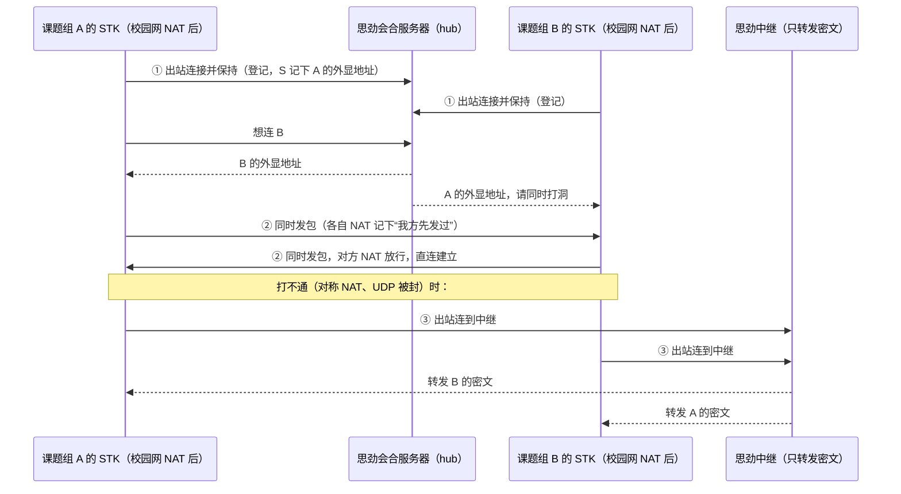

# 内网穿透评估：RustDesk、ZeroTier 与 STK 的节点连接

状态：**调研结论，待所有者决定；均未实现。** 日期：2026-10-08（版本、许可与提交记录均为当日查询）；2026-10-09 定稿时并入了独立复核的补充。

上位决定：[思劲平台方向](sijin-platform-2026-10.md)“所有者决定（第二轮）”第 5、7、8、9、10、11 条（下文“第 n 条”均指第二轮），
同时受第 2 条（Python ≥ 3.11）与第 6 条（文献存放在课题组的 Linux 服务器上）约束。

与已有文档的关系：[`node-networking-evaluation-2026-10.md`](node-networking-evaluation-2026-10.md)（下称“组网评估”）已经评估过 iroh、libp2p、WebRTC、Tailscale/Headscale、
Nebula、NetBird、Shadowsocks，以及 hub 不支持强制代理的缺口。本文只补三部分：对 RustDesk 与 ZeroTier 的深入核查、直连成功率与失败时的处理，
以及第二轮决定带来的变化。文献“借阅”与“共享会话”的产品设计另有评估（[文献借阅评估](literature-lending-evaluation-2026-10.md)、
[协作共享评估](live-share-evaluation-2026-10.md)），本文只讨论它们需要的连接层；Python 版本升级见 [Python 3.11 与 Flower 升级评估](python311-flower-upgrade-2026-10.md)。

**怎么核实的**：许可证逐个读了仓库里的 LICENSE 文件（GitHub API）。RustDesk 读了以下源码：`rustdesk` master 分支的 `src/client.rs`；
`hbb_common` main 分支的 `src/config.rs`、`websocket.rs`、`proxy.rs`、`tcp.rs`；`rustdesk-server` master 分支的
`src/rendezvous_server.rs`、`relay_server.rs`。ZeroTier 读了 dev 分支与 1.14.2 标签下的 LICENSE、`nonfree/LICENSE.md`、`RELEASE-NOTES.md`，
以及 libzt 的 LICENSE。Python 包的版本与轮子取自 PyPI JSON。定稿前的独立复核另读了：`rustdesk` 的 `src/rendezvous_mediator.rs`、
`hbb_common` 的 `src/socket_client.rs`、`rustdesk-server` 的 `src/main.rs` 与 `src/hbbr.rs`、ZeroTierOne 的 `service/OneService.cpp`（dev）与
`controller/EmbeddedNetworkController.cpp`（1.14.2 标签）、libzt 的 `src/NodeService.cpp`，并核对了 1.5.0 标签固定的 `hbb_common` 提交，以及 Squid 的默认配置 `src/cf.data.pre`。
**没有运行任何软件，也没有做网络实测。**

标注约定：**（未核实）** 表示没有找到一手来源；**（未实测）** 表示需要试点测量才能确定。涉及法律的内容只是准备交给律师的问题，不构成法律意见。

---

## 结论摘要

- **“内网穿透”就是“先往外连”，学校不需要开任何端口。** 两端各自主动连到公网上的会合服务器，然后同时向对方发包“打洞”直连，打不通再由中继转发。
  这三步里的每一个连接都由校内主机发起。RustDesk、ZeroTier、Tailscale、iroh 都是这一套做法。
  STK 的 hub 已经完成了第一步（节点主动以 WSS 连入，见 [`docs/hub.md`](../hub.md)），也有一种中继（存储再转发的 blob）。还缺四样：强制代理支持、打洞直连、**不落盘**的中继、实时音视频。
- **RustDesk 不能嵌入闭源产品，但它的结构值得照搬。** 客户端与服务端都是 AGPL-3.0；共用的网络库 `hbb_common` 在拆分前（1.2.3、1.3.6 标签）就是 AGPL 仓库里的普通目录，
  独立仓库没有许可文件只意味着“没有另行授权”，不会打开闭源使用的口子；Server Pro 只是闭源的管理端，与穿透无关，也不改变客户端的许可。
  结构上，hbbs 负责会合与 NAT 检测，客户端 1.5.0 会尝试四种打洞（UDP、TCP、IPv6，以及 1.5.0 新增的 WebRTC），hbbr 只转发密文。
  它支持 HTTP、HTTPS、SOCKS5 三种代理，**但代理与只走 443 的 WebSocket 模式互斥**：WebSocket 连接不经代理；代理模式要 CONNECT 到 21116/21117，
  而常见代理（如 Squid 的推荐配置）默认拒绝 CONNECT 到 443 以外的端口。在既只放行 443、又强制代理的学校，原样的 RustDesk 很可能两条路都走不通（**未实测**）。
- **RustDesk 自建时有几个坑。**
  - 按官方文档，只放行 TCP 443 时它“只能走 WSS 中继、不能直连”；而且只有服务器地址写成**域名**、并把 `api-server` 设成 https 地址时才用 `wss`，
    否则是明文 `ws`，而且改写后的地址不带端口，连的是 80 而不是 443；地址写成 IP 时，无论 `api-server` 怎么设，都是明文 `ws` 连到 21118/21119。所以思劲必须用域名部署（境内即 ICP 备案域名），并在 443 上做反向代理。
  - 端到端加密的信任根是会合服务器的密钥：没配密钥或密钥不符时，TCP 与中继连接会退回**不加密**。另外 hbbr 默认不校验密钥，不加 `-k` 启动就是任何人都能用的开放中继。
  - UDP 被封、又没有手动打开“禁用 UDP”时，从源码看客户端不会自动改用 TCP 登记，大概率显示离线（**未实测**）。
- **ZeroTier 不推荐。** 许可：1.16 起控制器改为非商业的源码可用许可，营利公司、非营利组织、政府机构的使用都算商业使用，“教育”例外只给学生个人、不含机构使用，
  所以即使由高校课题组自己运行也不在免费范围内。1.14.2 及以前的版本，按 BSL 条文已于 2026-01-01 转为 Apache-2.0（包括当时的控制器），
  但许可文件里写的版本号有歧义（源文件头部能部分消除），且该分支已停更，须法务确认。
  技术：需要虚拟网卡和管理员权限，在校方看来就是 VPN；TCP 回落官方自称“慢”，文档说要“几分钟”才会切换（源码中的常量是 60 秒）；
  回落连接只是加了伪造的 TLS 1.2 头，并不是真正的 TLS，只支持 IPv4，源码中也没有 HTTP 代理支持，遇到 TLS 检查或强制代理大概率失败（**未实测**）。
  libzt 的 main 分支最后一次提交在 2024-11-07，PyPI 上只有 cp35–cp39 的轮子，与第 2 条（Python ≥ 3.11）冲突。
- **直连无法保证。** 公开数据如下：一项大规模测量（IPFS/libp2p 节点）的打洞成功率为 70% ± 7.1%，但这是不含中继预约与地址发现失败的“条件成功率”，端到端会更低；
  该测量中 TCP 与 QUIC 打洞没有显著差异。较早的 RFC 5128 引述 UDP 打洞在 80% 以上的 NAT 设备上可行、TCP 略高于 60%（约 2005 年的家用 NAT）；
  双方都是“硬 NAT”时接近 0；UDP 被封时 UDP 打洞为 0。运营商级 NAT 很普遍，中国校园网和 CERNET 的 NAT 分布则没有公开数据。
  三个课题组两两之间共 3 对连接，只要一所学校封了出站 UDP，与它有关的两对就无法直连。
- **文献打不通直连时，实际只有两个选项。**“由参与课题组托管中继”不可行：它要求该校开放入站端口，也违反“不得为校外提供代理服务”一类的校规。
  剩下的是：(a) 拒绝这次借阅；(b) 在思劲服务器上放一个端到端加密、不落盘的中继，思劲读不到也存不下内容。
  建议默认用 (b)，课题组可以改选 (a)。但要先问清“不经思劲中转”的原因：如果是为了隐私，(b) 能满足；如果是为了规避版权责任，那是法律问题。
- **推荐路线：照搬“会合、打洞、中继”三步，不嵌入 RustDesk 或 ZeroTier 的代码。** hub 继续做会合与信令（先补代理支持和诊断工具）。
  点对点会话层用 WebRTC：ICE 打洞，经 TLS 443 的自建 TURN 中继，DTLS 端到端加密，原生支持语音与屏幕画面。
  这一层同时承载第 10 条的借阅和第 11 条的共享会话。iroh 从“首选直连层”降为备选，因为第 10 条取消了跨机构传文件这一主要用途。
- **先在三所学校做试点测量，再定文献的回落策略。** 在北京、珠海、聊城三个课题组的节点上逐一诊断：出站 443、强制代理、TLS 检查、出站 UDP、
  UDP 是否被限速（持续吞吐、丢包与时延随时间的变化）、NAT 类型、IPv6。然后两两测试打洞，得出 3 对连接实际走直连还是中继。

---

## 详细分析

### 一、为什么“先连出去”就不需要学校开端口（给非网络专业的读者）

**打个比方**：学校出口的防火墙或 NAT，像一栋楼的总机前台。

- 楼里的人可以往外打电话（出站连接）。外面的人直接打进来，前台不知道该转给谁，也不允许，一律挂断（入站被拒）。这就是“学校不开端口”。
- 但楼里的人先打出去之后，对方在**这通电话里**回话，前台会放行，因为它记下了“楼里谁打给了谁”。
  这条记录就是 NAT 或防火墙的“会话状态”。Tailscale 的原话是 "packets must flow out before packets can flow back in"
  （[How NAT traversal works](https://tailscale.com/blog/how-nat-traversal-works)）。

**内网穿透分三步**（RustDesk、ZeroTier、Tailscale、iroh 都是这三步，只是名字不同）：

1. **登记**：两边的 STK 各自主动连到思劲公网上的会合服务器，并保持连接。这台服务器在 RustDesk 里叫 hbbs（ID 服务器），
   在 ZeroTier 里叫根服务器（root），在 STK 里就是 hub。这一步相当于“往外打电话”，学校不需要开端口。
   会合服务器同时会看到每一方在公网上的“外显地址”，即 NAT 分配的公网 IP 和端口。
2. **打洞**：A 想连 B 时，会合服务器把双方的外显地址告诉对方，两边**同时**向对方的外显地址发包。
   各自的前台看到“楼里的人刚往这个地址打过”，就放行对方发来的包，直连由此建立。之后的数据不再经过任何服务器。
3. **中继**：打不通时（何时打不通见第四节），两边再各自往外连到一台公网中继服务器，由它在两条连接之间转发。
   只要内容是两端加密的，中继只能看到密文。

**要点**：

- 三步里的每个连接都由校内主机**主动发起**，所以“学校不开端口”和“内网穿透”并不矛盾，这正是第 5、8 条想要的。
- STK 现有的 hub 已经完成第 1 步和一种第 3 步：节点主动以 WSS 连入 hub，结果以 blob 形式上传到 hub（存储再转发，见 [`docs/hub.md`](../hub.md)）。
  还缺四样：强制 HTTP 代理支持（组网评估的第一条结论）、第 2 步打洞、**不落盘**的第 3 步，以及第 11 条要的实时音视频。
- **打洞虽然由本机先发包，效果却是让校外主机的数据进入校内主机。** 对“禁止校外一切访问”的出口策略，这在意图上需要事先说明
  （见组网评估“合规”一节引用的北航开放端口承诺书）。所以直连要逐校取得网管同意，不能当作绕过安全措施的手段来宣传。

### 二、RustDesk

#### 2.1 架构

- **hbbs（会合与 ID 服务器）**：客户端在这里登记 ID、发心跳、检测 NAT 类型。收到“A 要连 B”时，由它决定打洞还是中继。
  [`rendezvous_server.rs`](https://github.com/rustdesk/rustdesk-server/blob/master/src/rendezvous_server.rs) 中的处理是：
  - 双方在同一内网（同一公网 IP）时，让对方取本地地址直连（`FetchLocalAddr`），否则下发 `PunchHole` 开始打洞；
  - 服务器设置了 `ALWAYS_USE_RELAY=Y`，或者一方在局域网、另一方不在时，把 NAT 类型改写为 `SYMMETRIC`（注释：“will force relay”），强制走中继。
  - hbbs 默认会生成密钥对并校验客户端带来的 key：`rustdesk-server` 的 `src/main.rs` 用 `get_arg_or("key", "-")`，
    打洞请求的 key 不符时返回 `LICENSE_MISMATCH`。
- **hbbr（中继）**：两端各自连上来后，hbbr 把它们配成一对并相互转发。
  [`relay_server.rs`](https://github.com/rustdesk/rustdesk-server/blob/master/src/relay_server.rs) 的 `relay()` 只是在两条流之间 `send_raw` 字节，不做解密；
  只有第一条 `RequestRelay` 消息会被解析，用来配对和校验 key。
  - **hbbr 默认不鉴权。** 校验条件是 `if !key.is_empty() && rf.licence_key != key`，而 `src/hbbr.rs` 用 `get_arg("KEY")`，默认为空字符串，
    所以不加 `-k` 启动的 hbbr 会跳过校验，成为任何人都能用的开放中继，有带宽滥用与合规风险。这一点与 hbbs 的默认行为不同。
  - 默认限速如下，都可以配置（源码按 1024² 换算，严格说单位是 Mibit/s）：
    - 单个连接 128 Mb/s（`SINGLE_BANDWIDTH`）；
    - 全部连接合计 1024 Mb/s（`TOTAL_BANDWIDTH`）；
    - 被降级或列入黑名单的连接 32 Mb/s（`LIMIT_SPEED`）。连接 30 分钟后平均速率超过单连接上限的 66% 时降到这一档；30 秒没有数据则断开。
- **客户端 1.5.0**（2026-09-30 发布）：
  - 并行尝试 UDP 打洞、TCP 打洞、IPv6 打洞，以及 1.5.0 新增的 WebRTC（[发布说明](https://github.com/rustdesk/rustdesk/releases/tag/1.5.0)：
    "Webrtc [#15684](https://github.com/rustdesk/rustdesk/pull/15684)"）。
  - [`client.rs`](https://github.com/rustdesk/rustdesk/blob/master/src/client.rs) 的 `race_transports_prefer_webrtc` 优先采用直连结果；
    中继结果会先保留一段窗口期，等可能还在进行的直连。都失败才走中继。
  - 用户可以设 `force-always-relay`；WebRTC 的 ICE 服务器可以通过 `ice-servers` 选项配置（[config.rs](https://github.com/rustdesk/hbb_common/blob/main/src/config.rs)）。
- 官方文档称 "In the majority of cases, hole punching is successful, and the relay server is never used"
  （[自建文档](https://rustdesk.com/docs/en/self-host/)）。这是厂商的说法，没有给出数据。

#### 2.2 端口与协议

下表取自自建文档，与 `hbb_common/src/config.rs` 中的常量一致。

| 组件 | 端口 | 协议 | 用途 |
|---|---|---|---|
| hbbs | 21114 | TCP | HTTP API，仅 Pro 版 |
| hbbs | 21115 | TCP | NAT 类型测试 |
| hbbs | 21116 | TCP | 登记与打洞（`RENDEZVOUS_PORT`） |
| hbbs | 21116 | UDP | 设备登记（文档："device registration"） |
| hbbs | 21118 | TCP | WebSocket（`WS_RENDEZVOUS_PORT`），供网页客户端或 WSS 模式使用 |
| hbbr | 21117 | TCP | 中继（`RELAY_PORT`） |
| hbbr | 21119 | TCP | WebSocket 中继（`WS_RELAY_PORT`） |

文档写明 "Ports `21115`-`21117` are the minimum required ports for RustDesk to work"。这些都是**思劲服务器**的入站端口，与学校无关；校内客户端只需要能出站连到它们。
（同一页又说可以只暴露 TCP 443，见 2.3，文档本身有张力。）

#### 2.3 校园网限制下的行为

- **UDP 被封**：UDP 打洞和 UDP 登记都会失效。客户端在使用代理、WebSocket 或打开“禁用 UDP”设置时，改用 TCP 21116 登记
  （[rendezvous_mediator.rs](https://github.com/rustdesk/rustdesk/blob/master/src/rendezvous_mediator.rs) 的 `start` 只在
  `Config::is_proxy() || use_ws() || crate::is_udp_disabled()` 时调用 `start_tcp`）。
  UDP 只是被封、而这些设置都没打开时，读源码的倾向性答案是**不会**自动切到 TCP：`start_udp` 的超时分支只做 `update_latency(-1)` 和 `rebind_udp_for`，
  从不转到 TCP；源码中 `disable-udp` 只由界面和 ipc 设置，没有自动设置的地方。所以这种客户端大概率显示离线（**未实测**），
  需要用户或下发的配置手动打开“禁用 UDP”。
  用 TCP 登记后，客户端可以尝试 TCP 打洞（RFC 5128 引述的旧数据认为 TCP 打洞成功率低于 UDP，但较新的 DCUtR 测量显示 TCP 与 QUIC 没有显著差异，见 4.1），
  失败再经 TCP 21117 走 hbbr 中继。
- **只放行出站 TCP 443**：21115–21117 都连不出去。
  - 自建文档说可以只暴露 TCP 443，由 nginx 反向代理 21118 与 21119 上的 WebSocket，此时
    "communication can only work through WSS relay, and direct peer-to-peer connections are not available"。
    源码与此一致：`rendezvous_mediator.rs` 的 `handle_punch_hole` 中 `let local_proxy = use_ws() || Config::is_proxy();`、`let relay = local_proxy || ph.force_relay;`
    （同网段的 `handle_intranet` 中是 `let relay = use_ws() || Config::is_proxy();`），即 WebSocket 或代理模式下，被控端的传统打洞（UDP、TCP、IPv6）直接改走中继；WebRTC 见下文。
  - 客户端要打开 `allow-websocket` 选项。源码中
    [`websocket.rs` 的 `check_ws`](https://github.com/rustdesk/hbb_common/blob/main/src/websocket.rs) 会把地址改写成 `wss://域名/ws/id` 与 `wss://域名/ws/relay`。
    **但只有服务器地址是域名、且 `api-server` 选项以 `https` 开头时才用 `wss`，否则用明文 `ws`。**
    域名分支改写出的地址不带端口（单元测试中是 `ws://rustdesk.com/ws/id`），所以明文 `ws` 连的是默认的 80 端口，而不是 443。
    服务器地址写成 IP 字面量时，无论 `api-server` 怎么设，都是明文 `ws://IP:端口+2`（即 21118/21119），不走 443 路径。
    开源版没有 API 服务器，自建时必须用域名部署，并手动把 `api-server` 设成一个 https 地址；在境内，这意味着 ICP 备案域名，以及 443 上的反向代理。
    否则跑的是 80 端口上没有 TLS 的 WebSocket：在只放行 443 的出口连不出去，能连出去时也容易被代理或网关识别、拦截（会话内容仍有 RustDesk 自己的加密，见 2.4）。
    1.5.0 标签固定的 `hbb_common` 提交（229b904）中的 `check_ws` 与 main 分支相同。
  - `client.rs` 的注释说，WebSocket 模式只隧道化信令和中继这两段，WebRTC 的 offer “keeps full ICE”。
    `rendezvous_mediator.rs` 的 `handle_punch_hole` 与此一致：上面的 `relay` 只管传统打洞；对 WebRTC，注释写明 `ice_policy: "all"` 表示中继是由传输方式（ws）强制的，
    "so answer with full ICE and let a direct pair form"。
    也就是说，只要 UDP 实际可用，1.5.0 仍可能经 WebRTC 直连。这一点来自源码阅读，与文档“不能直连”的说法不一致，**未实测**。
- **强制 HTTP 代理**：[`proxy.rs`](https://github.com/rustdesk/hbb_common/blob/main/src/proxy.rs) 实现了 `Http`、`Https`、`Socks5` 三种代理，
  HTTP 代理用 CONNECT 方法，可带 `Proxy-Authorization: Basic` 认证。经代理时只能走 TCP，UDP 与打洞都不可用，实际上就是走中继。
  `handle_punch_hole` 还明确在代理模式下不用 WebRTC：`webrtc_viable` 要求 `!Config::is_proxy()`，注释是 "ICE would bypass it and leak the real IP"。
  但有两处限制，使“只放行 443”和“强制代理”两种情况不能同时解决：
  - **WebSocket 模式不走代理。** `websocket.rs` 的 `connect()` 里有注释 `// to-do: websocket proxy.`（1.5.0 固定的提交 229b904 中同样存在），
    直接调用 `connect_async_tls_with_config`；`hbb_common` 的 `socket_client.rs` 中，`connect_tcp` 遇到 WebSocket 端点直接返回 `WsFramedStream`，
    只有不走 WebSocket 的 `connect_tcp_local` 才读取代理设置 `Config::get_socks()`。
  - **代理模式要 CONNECT 到 21116/21117。** Squid 推荐的默认配置是 `acl SSL_ports port 443` 加 `http_access deny CONNECT !SSL_ports`
    （[cf.data.pre](https://github.com/squid-cache/squid/blob/master/src/cf.data.pre)），会拒绝 CONNECT 到 443 以外的端口。
  - 所以在既只放行 443、又强制代理的学校，原样的 RustDesk 很可能两条路都走不通（**未实测**）。即使把 hbbs/hbbr 改到 443 监听，
    做 TLS 检查的代理也会拦下非 TLS 流量。
- **TLS 检查代理**（校方用自己的根证书解密 HTTPS）：`websocket.rs` 在 rustls 握手失败后改用 native-tls 重试；
  如果打开了 `allow-insecure-tls-fallback`，还会接受无效证书。这样做方便，但削弱了 TLS 的作用；会话内容另有端到端加密。

#### 2.4 加密：端到端，但信任根是会合服务器

- **会话加密用 libsodium（sodiumoxide）**：先用 `box_`（X25519）交换对称密钥，之后每个包用 `secretbox`（XSalsa20-Poly1305）加密
  （[tcp.rs](https://github.com/rustdesk/hbb_common/blob/main/src/tcp.rs)）。hbbr 只转发密文（见 2.1）。
- **对端的公钥由 hbbs 签名下发。** `client.rs` 的 `secure_connection` 用会合服务器的公钥验证 `signed_id_pk`；
  这个公钥即 `rs_pk`，自建时就是 `id_ed25519.pub`。所以“中继看不到内容”成立，但**运营会合服务器的一方，理论上可以替换公钥做中间人**。
  RustDesk 的端到端加密，前提是信任 hbbs 的运营者。
- **两条降级路径**：没配服务器公钥（注释称 “key-less deployment”）或公钥不符时，代码会 “fall back to non-secure”，TCP 与中继连接以**明文**继续。
  - 客户端没填 key 时，`secure_connection` 用的是硬编码的 RustDesk 公共服务器公钥 `RS_PUB_KEY`；自建 hbbs 用自己的 `id_ed25519` 签名，验证必然失败。
  - 由于 hbbs 默认生成并校验密钥（见 2.1），“未配密钥导致明文”多半出在两种情形：服务器被显式配成无密钥，或客户端没填 key。
    两者与 hbbs 的 `LICENSE_MISMATCH` 校验如何交互，**未实测**。
  - WebRTC 连接分两种情况：没有可信密钥时照样建立，有 DTLS 加密，但 `is_secured()` 报告为不安全；服务器密钥可信、而对端身份或 DTLS 指纹绑定校验不过时，才会拒绝连接（`bail!`）。
    后一种做法把 DTLS 指纹绑定到已验证的身份，防止会合服务器替换 SDP。
  - 所以自建时必须给 hbbs 与 hbbr 都配置密钥（hbbr 要加 `-k`，见 2.1），并在客户端固定下来。
- **对 STK 的启示**：要让“思劲的中继读不到文献”可信，**信任根不能只放在思劲**（见 4.4）。

#### 2.5 自建与 Pro 版

- 开源版的 hbbs 和 hbbr 可以完全自建在思劲的境内服务器上。要换掉默认的公共服务器地址与公钥，通常需要自定义客户端，或者下发配置。
- Server Pro（[价格页](https://rustdesk.com/pricing)）是闭源的管理端，按年付费，Individual 档每月 11.88 美元起。功能包括：
  - 网页控制台、地址簿、审计日志、访问控制、集中设置、多中继管理；
  - OIDC、LDAP、2FA；
  - 自定义客户端生成器（Basic 档起）。
- **Pro 版与穿透能力无关**：打洞与中继在开源版里已经完整。价格页上也没有任何 OEM、嵌入或更换客户端许可的条款，**Pro 版不改变客户端的 AGPL 许可**。
  只有在“把 RustDesk 原样当作独立的远程工具集中管理”时，Pro 版才有意义。

#### 2.6 许可

| 部分 | 许可（以仓库文件为准） |
|---|---|
| 客户端 `rustdesk/rustdesk`（1.5.0） | AGPL-3.0（[LICENCE](https://github.com/rustdesk/rustdesk/blob/master/LICENCE)，文件名拼作 LICENCE；根 `Cargo.toml` 没有 `license` 字段） |
| 服务端 `rustdesk/rustdesk-server`（1.1.16，2026-07-20） | AGPL-3.0（[LICENSE](https://github.com/rustdesk/rustdesk-server/blob/master/LICENSE)） |
| 网络与协议库 `rustdesk/hbb_common` | 独立仓库建于 2025-01-20，根目录**没有 LICENSE 文件**，[Cargo.toml](https://github.com/rustdesk/hbb_common/blob/main/Cargo.toml) 没有 `license` 字段；复核时检索了 main 分支全部 `.rs`、`.toml`、`.proto` 文件，都没有 SPDX 头或许可文字。它以子模块的形式（[.gitmodules](https://github.com/rustdesk/rustdesk/blob/master/.gitmodules)）出现在两个 AGPL-3.0 仓库中。**拆分前**，在 rustdesk 的 1.2.3、1.3.6 标签里，`libs/hbb_common` 是 AGPL-3.0 仓库内的普通目录、不是子模块（[1.2.3 的 libs 目录](https://api.github.com/repos/rustdesk/rustdesk/contents/libs?ref=1.2.3)），即拆分前的代码明确按 AGPL 发布。独立仓库没有 LICENSE 只意味着“没有另行授权”，不会打开闭源使用的口子；拆分后新增代码的授权本意**未核实** |
| Server Pro | 专有商业许可 |

- **任何一部分都不能链接进闭源产品。** AGPL 第 13 条还要求：修改后的版本通过网络向用户提供服务时，要向这些用户提供源码。
- **结合仓库现状**：STK 桌面程序是 GPL-2.0-or-later（`desktop/LICENSE`，含 Blender 代码），`desktop/` 以外的 Python 包是 MIT。
  - 桌面程序若要并入 AGPL-3.0 代码，只能改按 GPLv3 或更高版本分发（GPLv3 第 13 条允许与 AGPLv3 代码组合），并入的部分仍受 AGPL 约束；
  - Python 节点若并入，整个程序都要按 AGPL 分发。
  - 以上须法务确认。
- **作为独立程序原样调用是另一回事。** GNU 的 FAQ 说："pipes, sockets and command-line arguments are communication mechanisms normally used between two separate programs"
  （[GPL FAQ](https://www.gnu.org/licenses/gpl-faq.html#MereAggregation)）；同时提醒，如果通过这些机制交换复杂的内部数据结构，也可能被视为同一个程序。
  因此由 STK 启动一个未修改的 RustDesk 进程，在许可上大概率可行（须法务确认）。但 RustDesk 共享的是整个桌面，而不是一个 STK 窗口，只能作临时手段。
- RustDesk 是否提供 OEM 或商业授权：价格页没有提到，需要书面询问（**未核实**）。如果要问，`hbb_common` 的 `Cargo.toml` 的 `authors` 字段写的是 open-trade（含联系邮箱）。

#### 2.7 小结

RustDesk 是“应用级连接”的完整样板：按设备 ID 连接，不建虚拟网卡；会合、NAT 检测、四种打洞、盲转发的中继、代理与 WSS 都有
（但代理与 WSS 不能同时使用，WSS 还要求域名加 https 的 `api-server`）。STK 应该照搬它的结构，而不是嵌入它的代码。

### 三、ZeroTier

#### 3.1 架构

- ZeroTier 造的是一张**虚拟以太网**。每台机器装上 ZeroTier One，得到一块虚拟网卡和一个虚拟 IP，任何程序都能通过这个 IP 互相访问。
  它分两层：
  - VL1 是点对点传输层，负责打洞与中继；
  - VL2 是虚拟以太网，由**网络控制器**决定谁能入网，并分配地址与规则。
- **根服务器**（roots，合起来组成唯一的 “planet”）承担会合与中继。协议文档的原话是 "VL1 never gives up. If a direct path can't be established,
  communication can continue through (slower) relaying"。打洞之外，它还用端口预测（针对对称 NAT）和 uPnP/NAT-PMP（[协议文档](https://docs.zerotier.com/protocol/)）。
- **自建根服务器**：用户自定义的根叫 “moons”，1.16.0 起被标为 "even more extra *deprecated*"；同版本新增的 “network-specific relays” 仍处于预览或测试阶段
  （[RELEASE-NOTES](https://github.com/zerotier/ZeroTierOne/blob/dev/RELEASE-NOTES.md)）。
  默认的 planet 指向 ZeroTier 公司运营的根服务器，均在境外；自建根需要自定义 planet 文件。在境内长期运行自建根是否可行，**未核实**。

#### 3.2 许可（截至 2026-10）

| 版本或组件 | 许可 | 能否闭源商用 |
|---|---|---|
| ZeroTierOne ≥ 1.16.0（最新 1.16.2，2026-05-20）的代理端 `node/`、`osdep/`、`service/` | MPL-2.0（[LICENSE.txt](https://github.com/zerotier/ZeroTierOne/blob/dev/LICENSE.txt)、[LICENSE-MPL.txt](https://github.com/zerotier/ZeroTierOne/blob/dev/LICENSE-MPL.txt)） | 可以。MPL 是文件级的弱 copyleft：修改过的 MPL 文件要公开 |
| ≥ 1.16.0 的控制器（`nonfree/`） | ZeroTier Source-Available License 1.0（[nonfree/LICENSE.md](https://github.com/zerotier/ZeroTierOne/blob/dev/nonfree/LICENSE.md)） | **不可以，须另购商业许可；高校课题组自己运行也不在免费范围内。** 见表下说明 |
| ≤ 1.14.2（1.14.2 的 GitHub release 发布于 2024-10-29，RELEASE-NOTES 记为 2024-10-23），包括当时的 `controller/` | BSL 1.1，Change Date 2026-01-01，Change License Apache-2.0（[1.14.2 的 LICENSE.txt](https://github.com/zerotier/ZeroTierOne/blob/1.14.2/LICENSE.txt)）。附加使用授权原本禁止“以营利方式运营根服务器或控制器”和“链接进非 OSI 许可的商业产品” | 文本上已于 2026-01-01 转为 Apache-2.0，但有两点保留，见表下说明。**能否据此闭源商用，须法务确认** |
| libzt（用户态 SDK） | BSL 1.1，Change Date 2026-01-01，转为 Apache-2.0（[LICENSE.txt](https://github.com/zerotier/libzt/blob/main/LICENSE.txt)）。内嵌的 ZeroTierOne 子模块是 2023-08-21 的一次提交，其 LICENSE 的 Change Date 为 2025-01-01 | 同上：文本上已转换，须法务确认 |
| ztncui（第三方的控制器网页界面） | GPL-3.0（[仓库](https://github.com/key-networks/ztncui)），最后推送于 2023-08-31 | 它本身只是界面，依赖 ZeroTier One 内置的控制器，所以控制器的许可问题依然存在 |
| pylon（TCP 中继兼 SOCKS5） | MPL-2.0（[仓库](https://github.com/zerotier/pylon)），链接 libzt | 可以 |

表中两处说明：

- **≥ 1.16.0 的控制器**：该许可把以下情形都算作商业使用：“Any use of the Software by or for the benefit of a for-profit company”，
  以及 “Incorporation of the Software into any paid or unpaid product”；**非营利组织、政府或军事机构的使用也算商业使用**。
  “教育或学术研究”的非商业例外仅限 “for students, not for organizational use”。所以即使由高校课题组（中国公立高校多为事业单位）自己运行 1.16 的控制器，
  按条文也不在免费范围内，而不只是“思劲作为营利公司不能用”。该许可的适用法律为美国加州法。
  另外，1.16.0 起默认构建的二进制不再包含控制器；用 `ZT_NONFREE=1` 构建出的可执行文件，许可随之变为专有。
- **≤ 1.14.2 的 BSL 转换**：BSL 条文写的是 "Effective on the Change Date … the Licensor hereby grants you rights under the terms of the Change License"；
  条文还规定转换生效于 "the Change Date, or the fourth anniversary of the first publicly available distribution ... whichever comes first"。
  但有两点保留：
  - 该文件的 “Licensed Work” 一栏仍写着 “ZeroTier Network Virtualization Engine 1.4.4”，所指版本有歧义。源文件头部能部分消除这一歧义：
    1.14.2 标签下的 `controller/EmbeddedNetworkController.cpp` 写着 "Change Date: 2026-01-01 ... use of this software will be governed by version 2.0 of the Apache License"。
    这些源文件头应与 LICENSE.txt 一并交给法务。
  - 1.14 分支已不再更新，需要自担安全维护。

**更正组网评估中的一处数据**：libzt 在 GitHub 上的 `pushed_at` 是 2026-07-30，但 main 分支的最后一次提交是 2024-11-07（[提交记录](https://github.com/zerotier/libzt/commits/main)）。

#### 3.3 自建控制器

有三条路：

1. 向 ZeroTier 购买商业许可，使用 1.16 的控制器（由高校课题组自己运行同样要买，见 3.2）；
2. 使用 1.14.2 及以前版本的控制器：许可文本上已是 Apache-2.0（源文件头部也写明转为 Apache-2.0），但已停更，且须法务确认；
3. 使用 ZeroTier Central 托管：控制面在境外，不适合境内高校，而且同样是商业服务。

ztncui 一类的网页界面不能解决许可问题。

#### 3.4 只放行出站 TCP 443 时

- ZeroTier 先走 UDP（默认 9993 端口），UDP 不通时回落到 TCP 中继。[relay 文档](https://docs.zerotier.com/relay/)的原话：
  - "ZeroTier Inc. runs a TCP relay service that the ZeroTierOne agent will fall back to if it can't make UDP connections"；
  - "This relay service is slow for various reasons"；
  - 不强制时，"It takes a few minutes for zerotier-one to realize it needs to relay otherwise"。
    但源码 `service/OneService.cpp`（dev 分支）中 `#define ZT_TCP_FALLBACK_AFTER 60000`，即 60 秒，与文档的“几分钟”不同；实际切换时间**未实测**。
- **TCP 回落不是真正的 TLS。** 文档称该中继经 HTTPS（“via HTTPS”），但 `OneService.cpp` 定义了 `ZT_TCP_TUNNEL_HELLO`，
  每个包前加三个字节 `0x17 0x03 0x03`，注释为 `// fake TLS 1.2 header`；另一处注释写着 "TCP fallback tunnel support, currently IPv4 only"。
  默认中继 `204.80.128.1/443` 由 ZeroTier 公司运营，注释称 "this will eventually go away"。
  libzt 的 `src/NodeService.cpp` 有同样的伪 TLS 回落，可以用 `zts_init_set_tcp_relay` 指向自建的 pylon。
- TCP 中继可以自建：用 pylon 的 `reflect` 模式监听 443，在 `local.conf` 里设 `tcpFallbackRelay` 指向它；设 `forceTcpRelay: true` 可强制使用。
- **强制 HTTP 代理**：没有找到 ZeroTier One 经 HTTP CONNECT 代理连接的一手说明，复核时在源码中也没有找到 HTTP CONNECT 代理支持。
  因此遇到做 TLS 检查或协议识别的校园网关、或强制代理时，回落连接大概率失败（**未实测**）。
- 结论：UDP 可用时 ZeroTier 直连效果很好；在只放行 443 的校园里，它退化为一个慢的、伪装成 TLS 的 TCP 中继，要等一段时间才会切换过去，
  而在强制代理或做 TLS 检查的校园里很可能根本连不上。

#### 3.5 虚拟网卡、管理员权限与 libzt

- ZeroTier One 要创建虚拟网卡（Linux 上的 TUN/TAP、Windows 上的驱动），需要 root 或管理员权限。在校方看来它就是一个 VPN；
  组网评估还指出，由思劲运营这类组网可能落入增值电信业务 B13（IP-VPN），须法务确认。
- libzt 是用户态的 socket 库（用 lwIP 网络栈），不需要虚拟网卡（[README](https://github.com/zerotier/libzt)），但它有两个问题：
  - main 分支已近两年没有提交；
  - PyPI 上的 `libzt` 最新版是 1.8.4（2022-01-03，PyPI 上的许可字段为 “BUSL 1.1”），只提供 cp35–cp39 的轮子（[PyPI](https://pypi.org/project/libzt/1.8.4/#files)），
    平台只有 macOS x86_64 与 manylinux 的 i686、x86_64，没有 sdist，也没有 Windows 或 arm64 的轮子。
    **与第 2 条（Python ≥ 3.11）直接冲突**，只能自己从源码构建并长期维护。

#### 3.6 加密

协议文档："Every VL1 packet is encrypted end to end using (as of the current version) 256-bit Salsa20"，用 Poly1305 认证，公钥算法为 Curve25519/Ed25519。
根服务器与 TCP 中继只转发密文（3.4 所说的伪 TLS 头只是外层封装，不影响 VL1 自身的加密）。

#### 3.7 小结：“RustDesk 式”与“ZeroTier 式”的区别

| | RustDesk 式（应用级连接） | ZeroTier 式（虚拟局域网） |
|---|---|---|
| 连接的对象 | 两个程序实例，按设备 ID 或公钥寻址 | 两台机器，按虚拟 IP 寻址，任何程序都能用 |
| 权限 | 普通进程即可 | 需要虚拟网卡与 root/管理员权限（libzt 除外） |
| 暴露面 | 只有该应用自己的协议 | 整台机器在虚拟网里可达，需要另配规则 |
| 校方观感 | 一个联网应用 | VPN，可能涉及 B13 业务许可 |
| 适合 STK 吗 | 适合 | 不适合 |

ZeroTier 不推荐，原因有六：控制器许可（1.16 起高校自己运行也要买）、需要虚拟网卡、TCP 回落慢且是伪 TLS、不支持代理、
libzt 停更且没有 Python 3.11 的轮子、默认根服务器在境外。

### 四、直连能否保证？失败时文献怎么办

#### 4.1 公开数据

| 来源 | 结论 | 注意 |
|---|---|---|
| Ford 等人的实测，经 [RFC 5128 第 4 节](https://www.rfc-editor.org/rfc/rfc5128#section-4)引述 | UDP 打洞 "works widely on more than 80% of the NAT devices"，TCP 打洞 "works on just over 60%" | 2005 年前后的家用 NAT 设备；统计的是设备，不是连接对。“TCP 明显低于 UDP”与下一行 DCUtR 的新结果有张力 |
| Trautwein 等，IMC '26（[arXiv 2604.12484](https://arxiv.org/abs/2604.12484)） | 440 万次尝试、8.5 万个网络、167 个国家；打洞的 "conditional success rate of 70% ± 7.1%"；TCP 与 QUIC（基于 UDP）"statistically indistinguishable"；成功的连接中 97.6% 第一次尝试就成功 | “有条件”指中继预约与公网地址发现已经成功，这两步的失败不计入，端到端的成功率会更低；样本是 IPFS/libp2p 的自愿节点，没有按中国或校园网细分 |
| Tailscale 博客（[链接](https://tailscale.com/blog/how-nat-traversal-works)） | 双方都是“硬 NAT”（对每个目的地分配不同端口）时，探测 20 秒的成功率是 "0.01%"；用上全部技巧，作者“估计” "over 90%" 能直连 | 估计，不是测量 |
| Richter 等，IMC 2016（[arXiv 1605.05606](https://arxiv.org/abs/1605.05606)） | 运营商级 NAT（CGN）出现在 17–18% 的接入网 AS 和 90% 以上的蜂窝网 AS 中，亚洲与欧洲部署率高；11% 的非蜂窝 CGN AS 用对称映射；蜂窝网的 CGN 两极分化，约 40% 是对称映射 | 2016 年的数据 |
| UDP 被封的网络 | UDP 打洞成功率为 0，基于 UDP 的直连只能改走中继。Tailscale 博客举的例子是 UC Berkeley 访客 Wi-Fi “blocks all outbound UDP except for DNS traffic” | — |
| UDP 被限速或做 QoS 的网络 | 打洞可能成功，但语音与画面的质量会变差；上面几项数据都没有涉及 | 试点要测持续吞吐、丢包与时延（见 N1） |
| 中国校园网 / CERNET | **没有找到公开的 NAT 类型分布数据**（未核实） | 必须在试点中实测 |
| IPv6 | CERNET2 是纯 IPv6 的骨干网（[清华大学](https://www.tsinghua.edu.cn/en/info/1245/3403.htm)）。两端都有全局 IPv6 地址时没有 NAT，只剩状态防火墙，打洞通常更容易 | 实验室服务器能否分到全局 IPv6、校方防火墙对 IPv6 的策略，逐校未核实 |

#### 4.2 对三个课题组意味着什么

- 北京、珠海、聊城三个课题组两两之间共有 3 对连接。每一对能否直连，主要由两端的 NAT 类型以及是否封 UDP 决定，并不是随机事件：
  同一对连接通常要么一直通，要么一直不通。
- 一个示意计算：假设每对连接都按 70% 的公开基线、彼此独立地成功，那么三对全部直连的概率约为 0.7³ ≈ 34%。这个计算有三处偏差：
  - 三对连接共享学校，并不独立；
  - 70% 是不含中继预约与地址发现失败的条件成功率，端到端会更低；
  - 样本是 IPFS/libp2p 的自愿节点，不代表中国校园网。
  真实情况只能实测。
- 任何一所学校封出站 UDP，或者强制所有流量走 HTTP 代理，与它有关的两对连接就都不能直连。
- **结论：直连不能保证，只能尽力而为。** 任何“文献只许直连”的设计，都要么接受部分课题组之间无法借阅，要么接受某种形式的中继。

#### 4.3 打洞失败时的选项

| 选项 | 做法 | 满足第 7 条（不经思劲中转）？ | 满足第 5 条（不开端口）？ | 风险与代价 |
|---|---|---|---|---|
| (a) 拒绝 | 直连失败时提示“与该课题组之间暂时无法借阅”，建议改走馆际互借等正常渠道 | 满足 | 满足 | 部分课题组之间永远无法借阅；体验差，但最简单 |
| (b) 思劲服务器上的端到端加密、不落盘中继 | TURN 或同类中继只转发密文；密钥只在两端；中继不写盘、只记元数据 | 字面上“经过”思劲，但思劲读不到也存不下内容 | 满足 | 要让“读不到”可以验证（见 4.4）；有带宽成本；版权责任须律师判断 |
| (c) 由某个参与课题组托管中继 | 中继放在某所学校的服务器上 | 满足 | **不满足**：中继必须接受另外两校的入站连接，所在学校就得开放入站端口；北航开放端口承诺书一类的规定也“不得为校外用户提供代理类服务”（见组网评估） | 实际不可行 |
| (c′) 由课题组自己租用的云主机托管中继 | 某个课题组用自己的经费租境内云主机运行中继，思劲只提供软件 | 满足（运营方不是思劲） | 满足 | 该课题组要承担运维、ICP 备案与日志留存，作为网络运营者的义务须法务确认；还要商定由哪所学校托管；与第 9 条“中转放在思劲服务器”相悖 |

**建议默认用 (b)，课题组可以改为 (a)。** 但要先问清所有者为什么不让文献经思劲中转：

- **如果是为了不让思劲看到或留存文献**，(b) 加上 4.4 的约束就能满足。
  [RFC 8656 第 21.1.6 节](https://www.rfc-editor.org/rfc/rfc8656#section-21.1.6)的原话是：
  "Confidentiality for the application data relayed by TURN is best provided by the application protocol itself"，WebRTC 的 DTLS/SRTP 正是这么做的。
  Tailscale 的 DERP 中继 “blindly forwards already-encrypted traffic”（[KB](https://tailscale.com/kb/1232/derp-servers)）；RustDesk 的 hbbr、ZeroTier 的根服务器与 iroh 的中继也是同样的原理。
- **如果是为了让思劲不进入传播链、规避版权责任**，这是法律问题，不是网络问题。可以交给律师的线索是
  《信息网络传播权保护条例》第二十条（[网信办全文](https://www.cac.gov.cn/2013-02/08/c_126468776.htm)）：
  提供“自动传输服务”的网络服务提供者，在“未选择并且未改变所传输的作品”、只向指定对象提供并“防止指定的服务对象以外的其他人获得”的条件下，不承担赔偿责任。
  加密盲转发在形态上与此接近；但该条是否适用，以及持有者一方“提供”作品的行为本身是否合法（见[文献借阅评估](literature-lending-evaluation-2026-10.md)），须律师判断。

#### 4.4 怎样让 (b) 的“读不到、存不下”可以验证

1. **端到端加密，并有前向保密。** WebRTC 规定 "All data channels MUST be secured via DTLS"，并且 "Implementations MUST favor cipher suites which support Forward Secrecy"
   （[RFC 8827 第 6.5 节](https://www.rfc-editor.org/rfc/rfc8827#section-6.5)）。即使中继录下了密文，事后长期密钥泄露也解不开。
2. **信任根不放在思劲。**
   - 问题：WebRTC 的 DTLS 指纹通过信令交换，[RFC 8826](https://www.rfc-editor.org/rfc/rfc8826) 也说可以借信令服务来认证这次密钥交换。
     反过来，**信令服务（hub）一旦被篡改，就能做中间人**；RustDesk 以 hbbs 为信任根，也是同一个问题（见 2.4）。
   - 做法：配对时为每个课题组节点生成设备密钥，两个课题组的管理员**线下互相核对**指纹（比如念一串短码）之后固定下来；
     每次会话的 DTLS 指纹由设备密钥签名，对不上就中止。RustDesk 1.5.0 对 WebRTC 连接正是这样做的。
   - 效果：即使思劲控制了 hub 和中继，也无法冒充对端。
3. **中继不落盘、不解密。** coturn 与 LiveKit 内置的 TURN 本身就只转发不存储。部署时关闭抓包，只留连接元数据（谁、何时、多少字节），
   用于法定的日志留存（组网评估：《网络安全法》第二十三条，不少于六个月）。
4. **可以审计。** 中继用开源软件，配置公开；课题组在本地能看到每次会话走的路径（直连还是中继）以及对端的指纹。
5. **策略可选。** 课题组可以设置“文献会话禁止中继”，即选 (a)；非文献的会话（第 11 条的对话、作图）照常可以走中继（第 9 条）。

#### 4.5 第 10 条“借阅”改变了什么

- 跨机构不再传文件，改为实时传输**持有者一端渲染好的页面画面**。由此带来三点变化：
  - 组网评估中“按内容寻址分块、从多个持有者并行取块”的机制，跨机构时已经用不上，只剩同一机构内部和开放获取文献会用到。
  - 借阅和第 11 条的共享会话在网络上是同一类东西：实时、双向、低时延的会话，要传画面和文字，可能还有语音。
    WebRTC 正是为这类会话设计的；RustDesk 自己也在 1.5.0 引入了 WebRTC。
  - 提供画面的一端应当是课题组的 Linux 常驻节点（第 6 条），而不是某个人的笔记本。

### 五、方案对比（针对 STK）

除 RustDesk 与 ZeroTier 外，其余各行的细节见组网评估，这里只列与本次决定相关的部分。

| 方案 | 形态与嵌入（Python 节点 / C++ 桌面） | 闭源许可 | 在境内自建 | 只放行 443 时 | 强制 HTTP 代理 | 中继时是否端到端 | 语音与画面 | 结论 |
|---|---|---|---|---|---|---|---|---|
| RustDesk（嵌入其代码） | Rust 应用，没有库接口 | ✗ AGPL-3.0；`hbb_common` 拆分前即为 AGPL，独立仓库无许可文件 | ✅ hbbs + hbbr（hbbr 须加 `-k`，否则是开放中继） | WSS 中继（须用域名并把 `api-server` 设为 https；写成 IP 时是明文 ws 到 21118/21119） | ⚠️ 支持 HTTP / HTTPS / SOCKS5，但只用于非 WebSocket 的 21116/21117；WebSocket 模式不走代理，常见代理拒绝 CONNECT 到非 443 端口（未实测） | ✅ 但信任根是 hbbs；未配密钥时明文 | ✅ 完整的远程桌面 | 不嵌入，照搬结构 |
| ZeroTier One / libzt | 需要虚拟网卡与 root；libzt 是用户态，但已停更、没有 3.11 的轮子 | 代理端 MPL；控制器在 ≥1.16 为非商业许可（非营利与高校也须购买），≤1.14.2 为已停更的 Apache 版本（待法务） | 控制器可自建；根服务器要自定义 planet（未核实） | TCP 回落，慢，切换要等一段时间（文档称几分钟，源码 60 秒）；伪 TLS 头，只支持 IPv4，遇 TLS 检查大概率失败（未实测） | 源码中没有 HTTP CONNECT 支持（未实测） | ✅ Salsa20/Poly1305 | 无 | 不采用 |
| iroh 1.x | 用户态库；Python 轮子为 py3-none（3.11 可用）；有 C FFI | ✅ MIT / Apache-2.0 | ✅ 自建 iroh-relay | ✅ 中继走 HTTPS/WebSocket 443 | Rust 有；Python/C 绑定没有 | ✅ QUIC/TLS，中继读不到 | 无，要自己做 | 备选（用于批量数据） |
| Tailscale tsnet + Headscale | Go 侧车或 c-archive | ✅ BSD-3 | ✅ Headscale + derper | ✅ DERP 走 443 | ✅ CONNECT | ✅ WireGuard | 无 | 备选（运维负担重） |
| libp2p | Go 或 Rust 侧车 | ✅ MIT | ✅ | ⚠️ v2 中继默认每条连接 2 分钟、128 KiB | Go 版读取 `HTTPS_PROXY` | ✅ | 无 | 不选 |
| **WebRTC（ICE + TURN）** | Python 用 aiortc；C++ 用 libwebrtc 或 libdatachannel | ✅ aiortc BSD-3；libwebrtc BSD-3 加专利授权；libdatachannel MPL-2.0 | ✅ coturn（BSD-3）或 LiveKit（Apache-2.0） | ✅ TURN over TLS 443 | aiortc 不支持；libdatachannel 只在 libnice 后端支持且不带认证；libwebrtc 未核实 | ✅ DTLS/SRTP 端到端（TURN 只转发；用 SFU 时要另开 E2EE） | ✅ 原生支持语音、屏幕画面与数据通道 | **推荐，用于第 10、11 条** |

表中 WebRTC 一行的依据与限制：

- **许可**：[libwebrtc 的 LICENSE](https://webrtc.googlesource.com/src/+/refs/heads/main/LICENSE) 为 BSD 三条款，另有 PATENTS 文件给出 "Additional IP Rights Grant (Patents)"；
  [coturn 的 LICENSE](https://github.com/coturn/coturn/blob/master/LICENSE) 为 BSD 式条款；
  [aiortc](https://github.com/aiortc/aiortc) 为 BSD-3（PyPI 1.15.0，要求 Python ≥ 3.10）。
- **桌面端的选型限制**：libdatachannel 的默认 ICE 后端 libjuice 只支持 UDP（组网评估），在封 UDP 的校园里连不上 TURN-over-TLS。
  所以桌面端要么用基于 libwebrtc 的栈，要么把 libdatachannel 换成 libnice 后端。
- **LiveKit**（[livekit/livekit](https://github.com/livekit/livekit)，Apache-2.0，v1.13.9）是 SFU（选择性转发服务器），**所有媒体都经过服务器，不能直连**。
  - 它支持端到端加密，开启后 "no intermediaries (including LiveKit servers) can access or modify the content"，但密钥的生成与分发要应用自己负责
    （[E2EE 文档](https://docs.livekit.io/home/client/tracks/encryption/)）。
  - 单机部署时 TURN/TLS 端口 "needs to be set to 443"（[端口文档](https://docs.livekit.io/home/self-hosting/ports-firewall/)）。
  - 有官方 C++ SDK（[client-sdk-cpp](https://github.com/livekit/client-sdk-cpp)，Apache-2.0）和 Python SDK（PyPI `livekit` 1.1.20，要求 Python ≥ 3.9）。
  - 用它传文献，本身就等于选项 (b)；更适合多人参与的共享会话。
- **frp**（国内最常见的“内网穿透”工具，[README](https://github.com/fatedier/frp/blob/dev/README.md)，Apache-2.0）：xtcp 是它的点对点模式，README 原话是 "it may not work with all types of NAT devices"，
  建议打不通时回落到 stcp（经 frps 转发）；支持经 HTTP 代理连接（`transport.proxyURL`）。但 frp 的模式是“把内网服务经公网服务器暴露出去”，
  校方容易把它视为对外开放服务；而且它是一个独立的 Go 程序，不是库。不推荐。

---

## 推荐

### 总体：照搬“会合、打洞、中继”三步，不嵌入 RustDesk 或 ZeroTier

```mermaid
flowchart LR
  subgraph A[课题组 A（校园网，不开入站端口）]
    NA[Linux 节点：Runtime / 文献库 / 页面渲染]
    DA[STK 桌面]
  end
  subgraph B[课题组 B（校园网，不开入站端口）]
    NB[Linux 节点]
    DB[STK 桌面]
  end
  subgraph S[思劲境内服务器（ICP 备案域名）]
    Hub[hub：会合 / 信令 / 联邦学习 / 文字消息]
    Turn[STUN/TURN：UDP 3478、TLS 443，只转发密文]
  end
  NA -->|出站 WSS 443，可经代理| Hub
  NB -->|出站 WSS 443，可经代理| Hub
  DA -->|出站 HTTPS| Hub
  DB -->|出站 HTTPS| Hub
  DB <-.->|WebRTC 直连（打洞成功时）| NA
  DB -.->|打洞失败：按策略走 TURN 或拒绝| Turn
  Turn -.-> NA
```

### 分步

1. **N0：hub 补缺口（S4 之前必做，与组网评估的 L0 相同）。** 节点与桌面桥接支持显式 HTTP 代理和自定义 CA。联邦学习与控制消息继续走 hub
   （FedAvg 的聚合点本来就在 hub，不需要点对点）。同时加一个连通性诊断命令。
2. **N1：三校试点测量（尽早做，先于借阅与共享会话的开发）。**
   - 在三所学校的节点上逐项测量：DNS、出站 TCP 443、强制代理、TLS 检查、到思劲 STUN 的出站 UDP（3478 端口）、NAT 的映射与过滤行为、IPv6。
     其中 NAT 行为按 RFC 5780 方法测试，要求 STUN 服务器有第二个 IP。
   - 不只看 UDP 能否打通，还要测 **UDP 是否被限速或做 QoS**：在一段时间内记录持续吞吐、丢包与时延的变化，并与 TURN-TLS 路径对比。
   - 然后两两之间跑一次 ICE，记录每对连接最终选中的候选类型（host、srflx 或 relay）。
   - 得出一张 3×3 的结果表，交给所有者与各校网管。
3. **N2：WebRTC 会话层。**
   - 信令走 hub 已认证的 WSS 连接；STUN/TURN 自建在思劲的境内服务器上。
   - 每次会话的 DTLS 指纹由设备密钥签名，设备指纹由课题组之间线下核对（见 4.4）。
   - UDP 能通但质量差（被限速、丢包高）时，主动切到 TURN-TLS，而不是只要打通就一直用 UDP 直连。
   - 先用于第 11 条的共享会话：内容不是文献，可以走中继（第 9 条）。三方以内用网状直连；人数多了再评估 SFU（LiveKit，并开启 E2EE）。
4. **N3：借阅。** 复用同一个会话层，由课题组的 Linux 节点提供页面画面。文献会话的回落策略按所有者的决定执行，即 (b) 或 (a)。
   每次会话记录走的路径与对端指纹。
5. **暂缓 iroh。** 只有出现节点之间大文件直传的需求时再启用，届时组网评估中的方案仍然适用。
6. **强制代理的学校另行处理。** 在只能经 HTTP 代理出网的学校，Python 节点（aiortc）既不能打洞，也连不上 TURN-TLS（aiortc 不支持代理）；
   原样的 RustDesk 在这类学校也很可能连不上（见 2.3）。此时只剩两条路：一是组网评估提出的 hub 流式直通端点，经代理走出站 WSS，
   内容由应用层端到端加密、hub 不落盘（对文献而言这同样属于选项 (b)）；二是该校不参与借阅。桌面端基于 libwebrtc 时能否经需要认证的代理连接 TURN，未核实。

### 不要做的事

- 不链接 RustDesk 或 `hbb_common` 的代码；不在产品里集成 ZeroTier One 或 libzt。
- 不使用任何境外的公共基础设施：RustDesk 的公共服务器、ZeroTier 的 planet、Central 与默认 TCP 回落中继、iroh 的 n0 预设、境外的公共 STUN 服务器。
- 不做虚拟局域网；不让校园节点为其他机构转发流量。

### 思劲服务器的部署要点

- hub 用 HTTPS/WSS 443。
- TURN 用 TLS 443。与 hub 共用一个 IP 时，要按 SNI 分流（例如 nginx `stream` 模块加 `ssl_preread`），或者另配一个 IP（**未实测**）。
  另需开放 UDP/TCP 3478，以及服务器上的中继端口段；这些都是思劲自己服务器的入站端口。
- TURN 必须鉴权，凭据由 hub 按会话下发，不能像不加 `-k` 的 hbbr 那样成为任何人都能用的开放中继（见 2.1）。
- 域名办理 ICP 备案；只留连接元数据，不留内容。
- 中继带宽等于经过它的所有会话的码率之和。页面画面与语音大约是 Mb/s 量级（**未实测**）。

### 需要校方网管同意的事项（在组网评估清单的基础上新增）

1. 出站 UDP：到思劲的 STUN/TURN（3478 端口），以及到合作学校节点的临时端口，用于直连；同时问清是否对 UDP 限速。不同意的学校只能用中继，或者不参与借阅。
2. 出站 TCP 443 到 TURN 的域名。
3. 仍然**不需要**：入站端口、虚拟网卡、为校外转发流量。

### 对第 2 条（Python ≥ 3.11）的影响

aiortc（要求 ≥ 3.10）、livekit（≥ 3.9）、iroh（py3-none 轮子，≥ 3.7）都可以装在 Python 3.11 及以上；
libzt 不行（只有 cp35–cp39 的轮子）。RustDesk 与 Python 版本无关，因为它不进入 STK 的进程。升级本身见 [Python 3.11 与 Flower 升级评估](python311-flower-upgrade-2026-10.md)。

---

## 需要所有者决定

1. **文献打不通直连时怎么办：(a) 拒绝、(b) 思劲服务器上的端到端加密不落盘中继，还是 (c′) 由课题组自租云主机托管中继？**
   建议：默认 (b)，课题组可以改为 (a)。请先说明“不经思劲中转”的原因：如果是隐私，(b) 能满足；如果是版权责任，交律师判断（《信息网络传播权保护条例》第二十条）。
2. **是否接受“直连只能尽力而为”，并把三校试点测量（含 UDP 限速测量）作为借阅设计的前置交付？** 建议：接受。
3. **是否不嵌入 RustDesk 和 ZeroTier，改用 WebRTC（ICE 加自建 TURN）作为会话层，同时承载第 10、11 条，并暂缓 iroh？** 建议：是。
4. **试点期是否用“原样的 RustDesk 加自建 hbbs/hbbr”临时演示借阅？** 建议：不用于真实文献。原因：它共享整个桌面，配置容易出错，打洞失败时同样经过 hbbr，
   而且在既只放行 443、又强制代理的学校很可能连不上（见 2.3）。
   如果确实要演示，只用开放获取文献，并且：用域名部署、把 `api-server` 设为 https 地址；hbbs 与 hbbr 都配置密钥（hbbr 加 `-k`），并在客户端固定。
5. **第 11 条的共享会话（非文献内容）是否允许走思劲的 TURN 或 SFU？** 建议：允许（第 9 条），但同样做端到端加密；三到四人以内用网状直连。
6. **是否向三所学校申请出站 UDP 和 IPv6？** 建议：申请。不同意的学校只用中继，或者不参与借阅。
7. **设备指纹是否由课题组线下核对，使思劲不是唯一的信任根？** 建议：是。代价是首次配对多一个步骤。
8. **强制代理的学校，是否允许用 hub 的流式直通端点（端到端加密、不落盘）传借阅画面？** 建议：与第 1 项的 (b) 一并决定；不允许时，该校不参与借阅。
9. **是否向 RustDesk 的版权方询问 OEM 授权，或者评估 ZeroTier 1.14.2 的 Apache 路线？** 建议：都不做，按推荐方案用不到。
   （1.16 的 ZeroTier 控制器即使由高校课题组自己运行也要买商业许可，不是可行的免费路线。）
10. **交给律师的问题**：
    - (b) 的中继是否属于条例第二十条所说的“自动传输服务”；
    - 思劲运营 TURN 中继是否涉及 B13 业务许可（应用级中继一般不属于，但须确认）；
    - 中继日志留存的范围；
    - （仅在决定使用时）ZeroTier 1.14.2 与 libzt 的 BSL 转换效力，连同 1.14.2 源文件头部写明的 Change Date 与 Apache-2.0、BSL 的“四周年”条款一并提交。

---

## 不确定之处

1. **三所学校的实际网络条件是最大的不确定因素**：出站是否只放行 443，有没有强制代理或 TLS 检查，UDP 是否被封或限速，NAT 类型，有没有 IPv6，有没有出口认证门户。
   这些需要逐校询问并实测。
2. **中国校园网与 CERNET 的 NAT 类型分布**：没有找到公开数据。上面 0.7³ ≈ 34% 的示意计算假设各对连接相互独立，这一假设并不成立；
   而且 70% 是 IPFS/libp2p 节点上不含前置失败的条件成功率，端到端会更低。TCP 打洞是否明显不如 UDP，新旧数据结论不一致（见 4.1）。
3. **RustDesk**：
   - 1.5.0 在 WSS 模式下能否经 WebRTC 直连，只读了源码，未实测（`client.rs` 与 `rendezvous_mediator.rs` 的 `handle_punch_hole` 都表明 WSS 模式下 WebRTC 保留完整 ICE，与文档“不能直连”的说法不一致）；“多数情况下打洞成功”是厂商说法。
   - UDP 被封、又没手动打开“禁用 UDP”时客户端是否离线，源码倾向于“是”，未实测。
   - 在既只放行 443、又强制代理的学校是否两条路都走不通，来自源码与 Squid 默认配置的推断，未实测。
   - 客户端没填 key 时，是以明文继续还是被 hbbs 的 `LICENSE_MISMATCH` 拒绝，未实测。
   - 本文读的是 master 分支，与 1.5.0 标签之间可能有差异（复核比对过的 `check_ws` 与 `secure_connection` 相关分支一致）。
   - `hbb_common` 拆分后新增代码的授权本意未核实；RustDesk 是否提供 OEM 授权未核实。
4. **ZeroTier**：1.14.2 与 libzt 的 BSL 转换在法律上是否有效（“Licensed Work 1.4.4”的歧义，源文件头部可部分消除）；在境内自建 planet 是否可行，未核实；
   ZeroTier One 经 HTTP 代理或 TLS 检查网关时的实际表现（源码中没有代理支持、回落是伪 TLS），未实测；TCP 回落的实际切换时间（文档几分钟、源码 60 秒），未实测。
5. **WebRTC**：
   - libwebrtc 能否经需要认证的 HTTP 代理连接 TURN-TLS，未核实；强制代理的学校能否参与借阅，取决于这一点以及 hub 直通端点是否被接受为选项 (b)；
   - LiveKit C++ SDK 的构建体积与平台覆盖，未核实；
   - aiortc 的吞吐与 CPU 占用，未实测；
   - TURN 与 hub 如何共用 443，未实测；
   - UDP 被限速时何时切到 TURN-TLS 的阈值，要等试点数据再定。
6. **成本**：中继带宽费用取决于借阅与共享会话的次数、码率和时长，要等试点之后才能估算。
7. **法律**：条例第二十条是否适用；B13 业务的边界；日志留存的具体范围；“只看不下载”的跨机构借阅本身是否合法（另见[文献借阅评估](literature-lending-evaluation-2026-10.md)）。均须律师确认。
