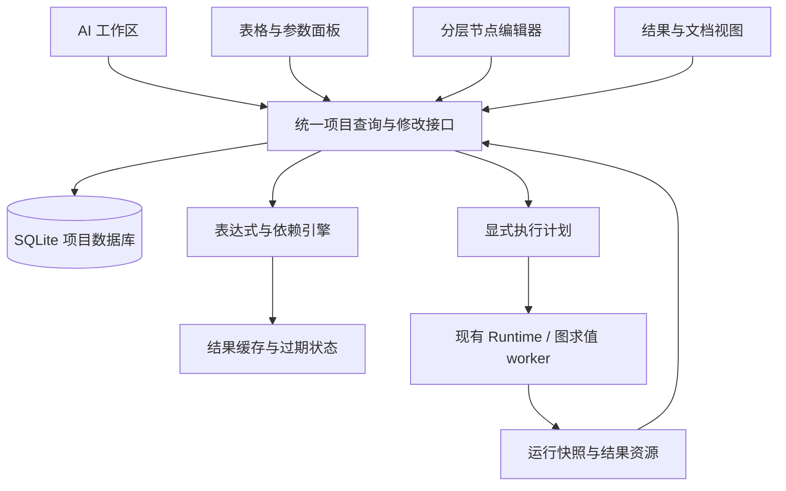

# SQLite 项目模型与参数求值

更新：2026-09-30。状态：SQLite 持久化、稳定引用、统一模型和分级求值方向已确认；
下文实体划分、文件组织、接口与实施边界为设计提案，尚非发布的数据库格式或协议。
产品背景见[项目工作台](project-workbench.md)，实施顺序见[开发计划](../development-plan.md)。

实现进展：`suan/project` 格式 2 已实现“目录 + SQLite”、记录/字段 UUID、字面量、稳定引用、
受约束的标量公式、保守单位校验、依赖缓存、原子修订命令及数据库备份/显式升级；格式 3
进一步加入项目级持久撤销/重做与对象恢复，保留 UUID、显示顺序和原历史，
具体语法与边界见[项目存储指南](../project.md)。文件元数据索引已用普通表格实现，
见[文件指南](../project-files.md)。格式 5 已增加只追加的运行方案及独立状态观察表，
冻结参数行、输入版本、执行规格和固定幂等键；运行状态更新不推进表格修订，见[运行记录](../project-runs.md)。格式 4 已增加只追加的输入清单和按内容寻址的文件副本，
见[输入快照](../project-snapshots.md)；完整运行快照、图实体和昂贵操作失效传播仍待实现。
格式 6 已增加不可变修改草案及原子应用回执，保存/放弃草案不提升编辑修订，普通撤销不重置回执，
见[持久草案指南](../project-drafts.md)。格式 7 增加明确选择范围的不可变上下文、文字消息及同一基础修订的草案来源关联，
见[上下文指南](../project-contexts.md)和[设计边界](review-drafts-and-conversations.md)；捕获、记录消息或恢复不会运行模型、脚本或任务。
格式 8 增加请求意图、固定输入来源、取消观察和原子回复关联，见[请求指南](../project-requests.md)；
桥已注册阿里 Token Plan 文字适配器，提供本机配置状态、显式开始和遗留执行核对；普通读取不会开始发送。
内部 `user_version=8` 不代表整个项目协议已冻结，下面的完整实体模型不能直接作为当前 DDL 使用。

## 职责边界

SQLite 负责持久化、关系、事务与查询。应用层负责表达式解析、依赖分析、类型与单位、
失效传播、缓存和执行计划。不能把跨表参数计算等同于 SQLite 生成列，
也不能把关联记录自动当作调度指令。SQLite 的定位参考[应用文件格式](https://www.sqlite.org/appfileformat.html)，
生成列限制见[官方说明](https://www.sqlite.org/gencol.html)。

项目数据库是编辑状态与项目组织的事实来源；实际远程任务的运行状态仍由 Runtime/控制服务负责。
数据库保存远程任务标识与带时间的状态投影，断线后显示同步状态并重新核对，不创建第二套竞争调度器。
运行时解释器仍经 Python 桥/worker 接入，重活不放在 UI 线程。

## 项目文件组织（候选）

优先验证“项目目录 + SQLite + 普通文件”的形式：数据库存结构、元数据和引用，
代码、输入、场数据、图像、视频、PDF 等保持文件形式。这样能使用 VSCode 和已有科学文件工具，
避免大型数组和视频直接占据单元格存储。内部资源尽量用项目相对路径，外部/远程资源有明确的位置和身份。

是否另提供单文件归档/分享包、哪些小附件可内嵌、扩展名和目录布局均未定稿。
导出时要列出外部依赖与缺失资源；只复制 SQLite 文件不能默认视为完整备份。
一致性备份必须包含数据库状态和所引用的资源版本；不能在写入期间随意复制数据库及其临时文件。
第一版优先单项目单写入服务，多设备实时协作不在首版范围。

## 概念实体（非 DDL）

| 实体 | 保存的内容与关系 |
|---|---|
| 项目/修订 | 项目标识、格式版本、元数据、编辑修订、修改记录 |
| 类型与字段定义 | 对象类型、字段稳定 ID、显示名称、值类型、单位、约束、插件类型与版本 |
| 对象/记录 | 节点、流程、运行方案、资源等对象的稳定 ID 与所属作用域 |
| 参数值 | 所属对象与字段、字面量/引用/表达式定义、有效类型及校验信息 |
| 流程/端口/连接 | 流程层级、节点实例、带类型的端口、子图边界映射、连接语义 |
| 表格视图 | 字段选择、查询、排序、过滤、分组与显示配置；引用对象而非复制对象 |
| 批次/案例 | 一行案例的参数绑定、流程模板版本与关联运行尝试 |
| 运行/快照 | 执行时的配置、流程版本、输入资源版本、Runtime 任务 ID、结果与来源 |
| 资源 | 本地/远程位置、类型、摘要、版本/校验信息、所属运行/节点、存在与传输状态 |
| 依赖/缓存 | 可推导的依赖索引、求值键、结果/错误和状态；不是另一份可编辑参数源 |

这些概念可能分解或合并为物理表。逻辑表格不与 SQL 表一一对应，也不为每个节点动态生成新 SQL 表。
不能把全部关系压成没有类型的通用连线；关联、参数依赖、数据流、执行依赖分别校验。

## 值的身份与表达式

可引用值具有与显示位置无关的稳定身份。首选验证“对象/记录 UUID + 字段 UUID”的组合；
若需要独立值实体，再引入值 ID。序号、列字母、行位置和用户可改的名称不作为持久引用键。
向量或嵌套结构的分量引用规则需显式定义，不能依赖可变数组位置冒充稳定对象身份。

用户可以看到易读的名称/路径，保存时绑定稳定标识。改名、排序或切换视图不破坏引用；
复制对象必须明确哪些内部引用重绑定、哪些外部引用保留；删除被引用对象应提示影响并保留可诊断的缺失引用，
不能静默引用到其他行。

每个可计算值有三种定义方式：字面量、直接引用、表达式。显示值另带类型、单位、错误、
来源修订和新鲜度。定义与缓存结果分开，重开项目可重新校验缓存。
例如案例温度引用公共温度，再计算一个偏移量；这里不规定正式表达式语法。

第一版表达式建议使用受限、可静态解析的纯函数集合，提取所有依赖，不使用任意 Python/SQL `eval`。
区分缺失值、空值和计算错误；循环、未知引用、类型/单位冲突与除零可定位到具体字段。
遵循现有“不猜测单位”规则，单位换算与维度兼容须显式校验。
函数登记求值成本，不能把外部进程、文件扫描或大数组运算伪装成自动轻量公式。

## 修改与求值生命周期

1. 表格、节点编辑器和 AI 提交同一种结构化修改命令，带目标身份与预期项目修订。
2. 项目服务校验并在事务中保存定义、修订和修改记录；过期修订返回冲突，不静默覆盖其他编辑。
3. 更新依赖索引，检测错误/循环，重新计算受影响的轻量值。
4. 将受影响的昂贵处理和运行计划标记待运行，记录失效原因；未受影响的缓存保持可用。
5. 显式执行动作校验范围、资源和输入，冻结快照，然后交给现有执行服务。
6. 结果绑定到该快照；若用户已继续编辑，结果仍可保存，但对当前配置显示过期。

执行状态与结果新鲜度是两条轴：一项任务可以“成功但结果过期”，也可以“正在运行且当前参数已改变”。
UI 同时显示任务状态、所用版本和当前输入差异。取消、失败不会删除上一次可用结果。
轻量求值异步返回时也要核对修订，避免旧值覆盖新的编辑。

当前 Viewer 的部分参数编辑会自动触发图求值；这与新项目模式的显式昂贵执行规则不同。
迁移时按操作成本划分：相机/显示更新保持即时，轻量参数自动更新，昂贵数据节点待执行。
具体分类通过节点元数据与成本策略决定，不能直接用现有 data/client stage 名称代替成本判断。

## 运行快照与可追溯性

运行前冻结参数、表达式解析后的值、流程/节点版本、输入资源身份与版本、程序/代码版本及执行配置。
文件路径或哈希本身不足以保证复现：必须保留当时内容或可取回的不可变版本；无法取得的外部输入明确标记。
代码可记录版本控制标识，未提交改动也需相应内容快照。凭据不作为普通项目参数或报告内容持久化。

案例代表可编辑的配置，运行代表一次执行尝试。重试提交使用已有幂等语义，显式重新运行生成新尝试，
历史快照不随表格修改。结果资源关联输入快照、处理链与生成者，以支持从图像/报告回到原始运行。
外部文件变更检测的策略（监视、主动刷新、校验频率）待验证；执行前必须重新核对参与运行的输入。

## 兼容、恢复与待决项

- 保持[现有契约](../specs/README.md)独立有效：`stk.graph/1`、`stk.payload/2`、`stk.result/1`、桌面桥 v1。
  已有 graph JSON 可作为分析子图的导入/导出或执行适配边界；层级、跨表表达式和项目身份不是 graph v1 的既有能力。
  不能无损映射的内容须显式报告；破坏性协议变更采用新主版本。
- 沿用节点目录的类型和参数语义；字段注册、项目服务语言/进程归属与桥扩展在 P1 定稿。
- 项目格式须有版本、迁移、迁移前备份与较新格式的拒绝/只读策略。损坏或中断写入要可诊断恢复。
  基础撤销针对项目编辑事务；已提交任务不能靠数据库撤销取消，必须发出实际取消动作。
- 缓存键需包含相关定义、输入版本和实现版本；派生索引应可重建，缺失插件保留原始定义并显示不可用。
- 在 P1 明确字段/记录标识与作用域、首版语法/函数、物理结构、资源快照策略和存储所有权；
  在 P3 明确子图边界与模板升级；在 P4 明确文档组件和报告资产分发。远程多人同步、任意脚本公式与
  将全部科学数据存进 SQLite 不列入首版目标。
