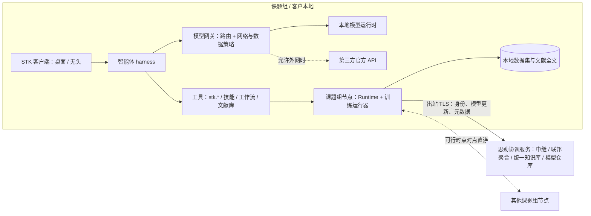

# 思劲平台方向：STK 承载材料智能体、联邦学习与领域知识库（方案）

更新：2026-10-08。状态：**方案，待所有者确认；本文所有内容均未实现。** 来源：所有者 2026-10-08 对 STK 后续方向的描述。
现有能力的边界见[项目工作台设计](project-workbench.md)、[项目数据模型](project-model.md)、[控制服务（hub）](../hub.md)与
[脚本与连接](scripting-and-connections.md)。

## 一、所有者描述的目标（复述，供核对）

1. **材料智能体**：在 STK 中部署一个智能体，专门做材料计算和材料相关数据分析。
2. **联邦学习的商业模式**：与学校合作。课题组安装 STK 客户端，按思劲的要求准备数据；客户端自动用这些数据以联邦学习的方式
   训练思劲的**机器学习神经网络模型**（不是大语言模型）。数据留在课题组，训练出的模型可以被思劲使用。
3. **文献管理与知识库**：在公开资料中检索文献标题和摘要 → 在校内下载全文 → 通过客户端上传到统一的知识库 →
   做 RAG / 知识库搭建，积累领域知识。
4. **复现验证**：利用课题组资源，检验文章中的模拟实验场景能否复现，以此判断文章质量。
5. **本地交付与持续迁移学习**：整套智能体系统在客户本地交付；每当有新数据进入系统，就在思劲已有的材料预测模型上做迁移学习，
   用新数据不断迭代优化模型。
6. **客户端需要的能力**：
   - 分布式、可通信：能在校园网内网之间进行点对点通信，支撑联邦学习；
   - 内置智能体 harness，底层模型通过 API 调用，默认使用第三方官方 API；
   - 一键在本地部署安装合适的模型：大机器上部署不量化的大模型，笔记本上部署量化的小模型；
   - 可设置是否允许访问外网；
   - 智能体能按能力自动切换不同的模型。

## 二、需要先确认的理解

- 原话“在 **SDK** 里面部署一个智能体”，按上下文理解为 **STK**（同一段话其余处都说“STK 客户端”）。
- “默认使用第三方官方提供的那通”：不确定指哪一家。现有代码只接入了阿里云 Token Plan（`aliyun-token-plan/1`），见第八节第 2 条。
- “思劲已有的机器学习材料预测模型”：我不知道这些模型的任务、网络结构、训练框架、权重格式和输入数据格式，见第九节。

## 三、现有基础（已实现，可复用）

| 能力 | 现状 | 在本方向中的用途 |
|---|---|---|
| 控制服务 hub 与节点代理 | 节点**主动出站**以 WSS 连入 hub，配对码与设备身份、内容寻址 blob、监控事件（[hub](../hub.md)） | 课题组节点连入思劲协调服务的现成模式；联邦学习的身份、通道与中继基础 |
| STK Runtime | Linux 服务端任务排队、日志、取消、结果文件；MuPRO 与并行云 | 本地训练与复现实验的执行器 |
| 项目存储 | 参数表、文件索引、不可变快照、上下文、运行记录、草案、归档（格式 11） | 数据集、训练运行、文献条目与复现报告的存放与追溯 |
| AI 请求与适配器 | `aliyun-token-plan/1`：密钥只在环境变量或 0600 文件，请求冻结、可审计，用量统计 | 模型网关的第一个提供者；身份固定的适配器模式推广到 OpenAI 兼容端点 |
| 草案与审阅 | AI 只提议，修改经保存草案、预览、明确应用 | 智能体的修改审批门槛 |
| 技能目录 `stk.skill/1` | 版本化、可校验的能力单元 | 智能体的领域技能清单 |
| 脚本 API `stk.*` 与 MCP 服务 | 项目、表格、工作流、运行、分析、技能的可编程接口；stdio MCP | 智能体的工具面 |
| 工作流与按行运行 | 参数表 → 仿真（MuFerro）→ 分析，冻结、可重算 | 复现验证的执行链路 |
| 旧 PyQt 界面的 Ollama 脚本 | `suan/gui/*ollama*`，属于待归档的旧界面 | 只作参考，不沿用 |

## 四、总体结构（目标，未实现）

原则：**数据留在课题组**，离开课题组的只有模型更新、许可范围内的文献元数据与提取结果，以及用户明确上传的内容。

## 五、各部分方案

### 5.1 模型接入、本地一键部署与自动切换（S1）

- **统一接口**：智能体的所有模型调用都经“模型网关”。提供者分两类：官方 API（已有阿里云 Token Plan，再加任意 OpenAI 兼容端点，
  如 DeepSeek、通义等）与本地运行时。常见的本地运行时（llama.cpp server、Ollama、vLLM）都提供 OpenAI 兼容接口，
  因此网关只需一种协议（含工具调用）。凭据沿用现有做法：环境变量或 0600 文件，不进项目、日志与请求记录。
- **一键本地部署**：
  1. 硬件探测：CPU、内存、GPU 型号与显存、磁盘、操作系统；
  2. 推荐档位：多卡大显存服务器 → 不量化的大模型（vLLM）；单卡工作站 → 中等模型（FP16 / INT8）；笔记本 → 量化小模型（4 位 GGUF，llama.cpp）；
  3. 安装运行时（提供离线包与国内镜像源，例如 ModelScope）；
  4. 下载权重并校验 SHA-256，记录许可；
  5. 启动、健康检查、登记到“本机模型目录”。
  模型目录列出参数量、量化方式、所需显存或内存、许可与能力标签（工具调用、上下文长度、中文、代码）。
- **自动切换**：按能力分档（小：本地、快、可处理私有数据；中；大：推理强），路由依据为任务类型（问答、工具规划、代码、文献摘要、嵌入）、
  数据敏感级别、网络策略、可用性与成本。失败或超时时回退，用户可固定某个模型。每次调用记录所用模型，供审计与复现。
- **网络与数据策略**：
  - 三档网络：离线（只用本地模型、不访问外网）／只访问指定端点（内网或白名单）／允许外网；
  - 网页检索、文献下载等工具另有开关；
  - **数据边界**与网络开关独立：标为“私有”的数据（数据集或项目级）永远不发给外部模型 API，即使允许外网。新数据集默认为私有。

### 5.2 智能体 harness（S2）

- **工具面**：现有 `stk.*` 脚本 API 与技能目录（项目、表格、工作流、运行、分析、技能；以后加数据集、模型、文献），
  可经内置工具描述或 MCP 暴露。每个工具标注副作用级别：只读／生成草案／提交运行／访问外部网络。
- **安全边界**：智能体只提议，修改项目经现有草案与审阅；提交运行按策略确认（例如本地轻量计算可自动，集群作业需确认）；
  每一步（对话、工具调用、所用模型、输入摘要、结果）记入项目，可回看。
- **首批材料能力**：MuPRO / MuFerro 模拟的准备与结果分析（已有链路）、材料数据表的统计、拟合与可视化；
  S3 之后加材料性质预测，S5 之后加文献检索与引用。
- **与现有 AI 助手的关系**：现在的 AI 助手是单轮、只读上下文；harness 是多步工具循环，复用请求记录、草案与用量统计。

### 5.3 数据集规范、本地训练与迁移学习（S3）

- **数据准备规范**由思劲给出，落成数据集契约（例如 `stk.dataset/1`）：组分、结构文件、工艺或模拟参数、性质与单位、来源、许可、敏感级别。
  校验器在客户端本地运行，生成只留在本地的数据卡（统计、缺失、分布）。
- **本地训练运行器**：PyTorch 训练作为 Runtime 任务执行（排队、日志、取消、产物）。
  模型登记（版本、基模型、训练数据摘要哈希、指标、许可）放在项目中。
- **迁移学习**：在思劲基模型上微调（如冻结骨干只训练输出头，或全量微调）；以留出集与基模型对比，过评估门槛才替换，可回滚。

### 5.4 网络与联邦学习（S4）

- **连接方式**：沿用 hub 的模式——课题组节点**主动出站**连接思劲的协调服务（或客户自建的协调服务），用 TLS / WSS 完成身份认证、配对、
  中继与聚合。校园网一般允许出站 HTTPS，不需要开放入站端口。之后在可行时增加节点之间的点对点直连
  （打洞，失败时回落到中继），用于大文件或节点直接交换。部署须经校方网络管理同意，不绕过校园网的安全措施。
- **身份与授权**：节点密钥与证书、现有配对码机制；每个参与方的数据使用授权按数据集逐个开启（opt-in），可随时退出。
- **联邦学习**：先做 FedAvg / FedProx，只上传模型更新（权重差），可选安全聚合（协调服务看不到单个更新）与差分隐私；
  每轮记录参与方、样本量、指标与发出的内容摘要，课题组可审计“离开本组的是什么”。
- **框架**：Flower（Apache-2.0，PyTorch 支持完善，传输可自定义）或在 hub 上自研，见第八节第 5 条。

### 5.5 文献与知识库（S5）

- **检索**：公开元数据源（OpenAlex、Crossref、arXiv、Semantic Scholar；知网等须在授权范围内）→ 标题、摘要、DOI、引用关系。
- **下载**：在校内由用户本人用机构权限下载全文到本地文献库；客户端不自动绕过付费墙。开放获取（OA）论文可直接获取。
- **解析**：PDF → 结构化文本（GROBID、MinerU 类工具），抽取方法、参数、结果表格，可人工校对。
- **知识库分两层**：
  - 本地层（课题组或客户本地）：全文索引与向量检索；
  - 统一层（思劲侧）：在许可允许的范围内存元数据、摘要、开放获取全文、抽取出的事实与参数、用户笔记和嵌入向量。
  付费全文能否集中存放需要法律确认（第八节第 7 条）。
- **RAG**：回答必须给出出处（文献与段落），结果可被智能体引用。

### 5.6 复现验证与文献质量（S6）

- **流程**：从文献抽取模拟设置（方法、材料参数、边界条件、网格、温度等）→ 生成 STK 工作流或批次 → 在课题组资源上运行 →
  与原文结果对比（数值容差、曲线比对）→ 复现报告与评分。评分考虑参数是否齐全、结果能否复现、对未给出参数的敏感性。
- **起点**：先从 MuPRO 已支持的问题（如铁电畴）开始，因为运行与分析链路已完整。
- **定位**：评分是辅助判断，不代替同行评议；报告列出缺失信息与所做假设。

### 5.7 本地交付与持续迁移学习（S7）

- **交付包**：桌面客户端，加 Linux 服务端（Runtime、协调服务、本地模型运行时、知识库、训练运行器），加基模型与本地语言模型；支持离线安装。
- **持续迁移学习**：新数据入库 → 校验 → 按策略（定时、数据量阈值、手动）触发训练 → 评估门槛 → 新版本 → 可回滚。
  模型更新与指标是否回传思劲按合同约定，默认不回传。
- **模型保护**：交付到客户本地的基模型权重属于思劲的知识产权，需要确定保护程度（许可校验、加密存放、水印）。
  完全防止提取不现实，要与合同条款配合。

## 六、必须写进设计的约束

- **数据**：课题组数据不离开课题组，离开的只有模型更新；参与按数据集逐个授权，可退出；每轮发出的内容可审计；
  标为私有的数据永不发往外部模型 API。
- **网络**：节点只做出站连接，点对点直连属于可选优化；部署须经校方网络管理同意。
- **文献版权**：付费全文的下载与集中存放受出版商许可约束，统一知识库默认不集中存付费全文，具体由法律确认。
- **合规**：涉及个人信息与重要数据时，遵守《数据安全法》《个人信息保护法》及学校的数据规定；与学校签数据使用协议。
- **模型来源与许可**：本地部署的开源大模型逐个记录许可（部分模型禁止商用或有用户数限制）。
- **可追溯**：智能体每一步、每次模型调用、每次训练与联邦轮次都留记录（沿用 STK 现有的“冻结、可审计”做法）。

## 七、分期与验收（建议）

| 阶段 | 内容 | 验收 |
|---|---|---|
| S0 | 本方案确认 | 所有者答复第八节；第九节输入到位 |
| S1 | 模型网关（OpenAI 兼容提供者、网络与数据策略、调用审计）；一键本地部署（探测、推荐、安装、下载校验、目录）；能力分档与自动切换 | 离线模式下只用本地模型完成一次问答与工具调用；私有数据请求不会发往外部 API（测试证明）；笔记本与 GPU 服务器各推荐并部署一档模型 |
| S2 | 智能体 harness v1：多步工具循环、副作用分级、草案审批、步骤记录；MuPRO 与数据表分析技能 | 从一句需求到准备好一个 MuFerro 扫描草案并给出结果分析，全程可审计，未经确认不修改项目、不提交集群作业 |
| S3 | 数据集契约与校验、本地训练运行器、模型登记、迁移学习与评估门槛 | 在示例数据上微调基模型，达到门槛才登记为新版本，可回滚 |
| S4 | 节点身份与出站连接、中继、联邦学习 v1（FedAvg，可选安全聚合）、审计 | 三个模拟课题组节点在只出站的网络下完成多轮联邦训练，课题组可查看每轮发出内容 |
| S5 | 文献检索、本地文献库、PDF 解析、两层知识库、带出处的 RAG | 检索 → 导入本地 PDF → 带段落出处地回答问题；统一层只收许可允许的内容 |
| S6 | 文献 → 设置抽取 → 工作流 → 运行 → 对比 → 复现报告 | 选一篇 MuPRO 相关文章完成一次复现与报告 |
| S7 | 本地交付打包、持续迁移学习策略、模型保护 | 在干净机器上离线安装并运行全流程 |

## 八、需要所有者决定

1. **理解确认**：“SDK”即 STK，智能体部署在 STK 中（桌面客户端加 Linux 服务端）。（建议：是）
2. **默认模型 API**：“第三方官方 API”默认用哪家？建议默认沿用已接入的阿里云 Token Plan，并允许配置任意 OpenAI 兼容端点。
3. **本地模型运行时**：建议笔记本与工作站用 llama.cpp（GGUF 量化），GPU 服务器用 vLLM（不量化或 FP8），统一经 OpenAI 兼容接口接入。
   另一种做法是全部用 Ollama（安装简单，但大模型多卡部署弱）。
4. **分期顺序**：建议 S1 → S2 → S3 → S4 → S5 → S6 → S7。理由：模型接入与智能体单独就有用、风险低；联邦学习需要合作协议与数据规范到位。
   如果联邦学习是最先要向学校展示的能力，可改为 S1 → S3 → S4 → S2 …。
5. **联邦学习框架**：建议用 Flower 的策略与客户端接口，传输走 STK 已有的认证出站通道；或者完全自研（可控但工作量大）。
6. **网络方式**：建议先做“出站连接到协调服务加中继”，点对点直连作为后续优化；协调服务由思劲托管，也支持客户自建。
7. **文献全文**：建议付费全文只留在课题组或客户本地，统一知识库只存元数据、摘要、开放获取全文、抽取的事实与嵌入；是否集中存全文待法律确认。
8. **数据边界**：建议“私有数据永不发往外部模型 API”作为不可关闭的规则，新数据集默认私有。

## 九、需要的输入

- 思劲现有的材料预测模型：预测什么性质，网络结构（如图神经网络或性质回归网络），训练框架，权重格式，输入数据格式与规模，许可。
- 给课题组的数据准备规范：字段、单位、文件格式、质量要求。
- 首批合作课题组：硬件（GPU、存储）、网络条件（是否允许出站 HTTPS 与 WebSocket）、数据类型。
- 本地交付客户的硬件范围，用于确定一键部署的档位。
- 法律与合同：数据使用协议模板、联邦学习参与协议、文献许可意见、模型权重的许可条款。
