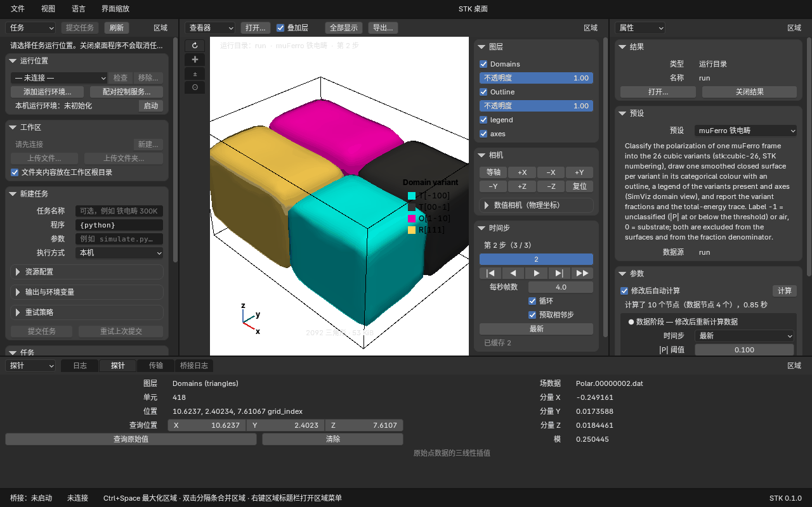
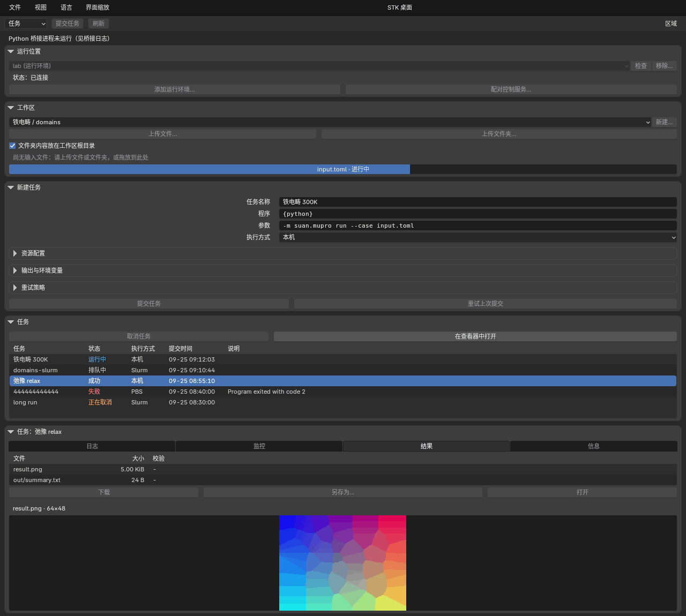
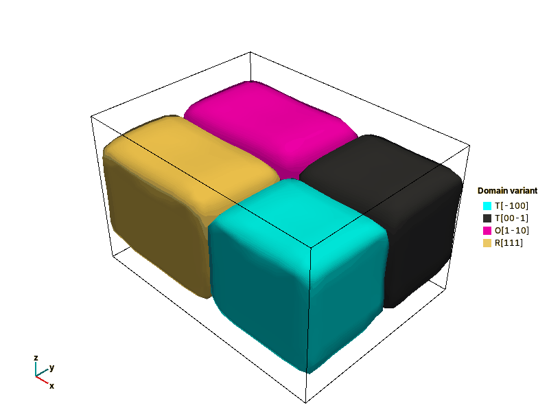
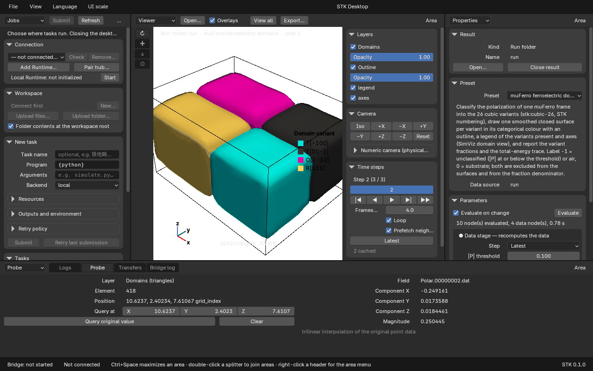

# STK 桌面程序（stk-desktop）

[English](#english)

STK 桌面程序 `stk-desktop` 是 STK 自有的 C++ 桌面端：窗口、输入、输入法与 GPU 上下文来自 Blender 的
GHOST，绘制用 Blender 的 GPU 模块（Linux 上 OpenGL 或 Vulkan，macOS 上 Metal），文字用 BLF（FreeType，
中日韩字形回退）。代码在 `desktop/`，许可为 **GPL-2.0-or-later**；STK 的 Python 包（Runtime、控制服务、
桌面桥 `suan.desktop_bridge`）仍为 MIT，桌面程序把桥作为子进程启动，经 NDJSON 协议通信
（[桥规范](specs/stk-desktop-bridge-v1.md)）。

桌面程序取代旧 PyQt 界面的“任务”页、SimViz 与 Blender 工作台（见文末“旧界面与归档计划”）：

- **任务（Jobs）**：本机 Runtime、`suan connect` 保存的 Runtime 连接和已配对的控制服务（hub）；工作区、
  文件与文件夹上传、任务提交、日志、取消、结果下载与校验、PNG 预览。
- **查看器（Viewer）、属性（Properties）、探针（Probe）**：打开渲染数据包、结果目录或运行目录，用节点图
  预设（如 `muferro-domains`）在数据旁求值，GPU 显示、拾取并查询原始值，导出 PNG 与逐步序列。
- **传输、日志、桥日志**：上传下载进度与续传、程序日志、桥的 stderr 与重启。



D1 里程碑的真实验收（经控制服务提交 muFerro、日志、下载、查看器与探针、输入法）见
[验收记录](runtime-validation.md#2026-09-25-桌面里程碑-d1自有引擎桌面端)，开发者说明见
[`desktop/README.md`](../desktop/README.md)，与旧界面的功能对照见
[`desktop/docs/parity-jobs.md`](../desktop/docs/parity-jobs.md) 与
[`desktop/docs/parity-viewer.md`](../desktop/docs/parity-viewer.md)。

## 安装

桌面程序与 Python 部分分开安装：程序包里**没有** Python（D1 不内置解释器），桥、本地求值和本机 Runtime
都用你指定的 Python 环境。

### Linux 预编译包

要求：x86_64，glibc ≥ 2.39（Ubuntu 24.04 及更新版本），X11 或 Wayland 会话，OpenGL 4.3 或 Vulkan 1.2
驱动（Mesa 的 llvmpipe／lavapipe 也可以运行，但较慢）。

CI（`.github/workflows/desktop.yml` 的 `linux-package` 作业）生成 `stk-desktop-<版本>-linux-x86_64.tar.gz`
及其 `.sha256`，在 GitHub Actions 运行页面的 `desktop-linux-package` 制品中下载。正式发布渠道确定前以此为准。

```bash
sha256sum -c stk-desktop-0.1.0-linux-x86_64.tar.gz.sha256
tar xzf stk-desktop-0.1.0-linux-x86_64.tar.gz -C ~/opt
~/opt/stk-desktop-0.1.0-linux-x86_64/bin/stk-desktop --version
```

包可以解压到任意目录（可重定位）：

| 路径 | 内容 |
|---|---|
| `bin/stk-desktop`、`bin/stk-render` | 桌面程序与无界面渲染工具 |
| `lib/stk-desktop/` | 普通桌面系统没有的共享库（shaderc、libepoxy），程序经 RPATH `$ORIGIN/../lib/stk-desktop` 找到 |
| `share/stk-desktop/datafiles/fonts` | Inter、Noto Sans CJK、DejaVu Sans Mono |
| `share/stk-desktop/i18n` | 中文（默认）与英文消息目录 |
| `share/doc/stk-desktop/` | `LICENSE`（GPL）、`THIRD-PARTY-NOTICES.md`、Blender 与字体许可、`third-party/`（nlohmann/json、libspng、miniz 及随包共享库的 Debian copyright） |

其余库（glibc、libstdc++、OpenGL／Vulkan 加载器与驱动、X11、Wayland、FreeType、zlib 等）来自系统。
CI 在只装了这些运行库的全新 Ubuntu 24.04 容器中解压包，无界面渲染（OpenGL 与 Vulkan）并运行下文的
端到端预设命令，结果与仓库中的基准图比对。

AppImage 暂不提供（后续工作）。

### Python 部分

在 Python 3.10–3.14 的虚拟环境中从仓库安装 STK（包名 `suan_toolkits`，尚未发布到 PyPI）：

```bash
python3 -m venv ~/.venvs/stk
~/.venvs/stk/bin/python -m pip install '/path/to/stk[science,visualization]'
```

- 只用任务功能（连接 Runtime 或控制服务、上传、提交、下载）时 `pip install /path/to/stk` 即可，桥只用标准库。
- 在本机求值节点图（查看器打开运行目录、本地模式）需要 `science,visualization`（NumPy、VTK、h5py、
  Matplotlib）。经控制服务求值时，计算在节点上进行，本机不需要这些依赖。
- 本机 Runtime（任务页的“本机”）只支持 Linux，见 [runtime 使用指南](runtime.md)。

桌面程序按以下顺序选择解释器：`--python PATH`，环境变量 `STK_PYTHON`，然后 `PATH` 上的 `python3`／`python`。
程序包不会把源码树加入 `PYTHONPATH`，所以所选解释器必须能 `import suan.desktop_bridge`：

```bash
STK_PYTHON=~/.venvs/stk/bin/python ~/opt/stk-desktop-0.1.0-linux-x86_64/bin/stk-desktop
```

设置界面中的解释器选项尚未提供（后续工作）。

### macOS

CI 的 `macos` 作业生成 `stk-desktop-<版本>-macos-arm64.zip`（制品 `desktop-macos-app`），内含 `STK.app`
（包标识 `ai.sijin.stk.desktop`，Apple 芯片，macOS 13.3 及以上，Metal）。应用**未签名、未公证**，只有
ad-hoc 签名；首次打开时在 Finder 中右键“打开”，或执行 `xattr -dr com.apple.quarantine STK.app`。CI 在全新
目录中解压该 zip，用 Metal 无界面运行程序与端到端预设命令。

从 Finder 启动的应用不继承终端的环境变量。可用 `launchctl setenv STK_PYTHON ~/.venvs/stk/bin/python`
（重新登录后失效），或从终端启动：

```bash
/Applications/STK.app/Contents/MacOS/stk-desktop --python ~/.venvs/stk/bin/python
```

macOS 上的交互验收（Metal 窗口、拼音输入法、Retina）尚需在实机上完成。

### Windows

D1 在 CI 中编译全部目标（MSVC，OpenGL，Win32 GHOST）并运行 CPU 测试，但不提供安装包；Windows 的安装包、
内置 Python 与 Win32 输入法验收属于里程碑 M-D2。

### 从源码构建

Linux 开发主机不需要 sudo：`fetch-sysroot.sh` 把固定版本的 Ubuntu 26.04 开发包解压到 `~/opt/stk-sysroot`，
CMake 自动使用它。没有 sysroot 时使用系统包（包名列表见 `.github/workflows/desktop.yml`）。

```bash
desktop/cmake/sysroot/fetch-sysroot.sh                 # 一次；--with-test-servers 另装 Xvfb 与 weston
cmake -S desktop -B ~/opt/stk-build/desktop -G Ninja   # 默认 RelWithDebInfo
ninja -C ~/opt/stk-build/desktop
ctest --test-dir ~/opt/stk-build/desktop --output-on-failure
~/opt/stk-build/desktop/bin/stk-desktop               # 开发构建：自动把源码树加入桥的 PYTHONPATH
```

生成可重定位的包：

```bash
cmake -S desktop -B build-pkg -G Ninja -DCMAKE_BUILD_TYPE=Release \
  -DSTK_DESKTOP_RELOCATABLE=ON -DSTK_DESKTOP_BUNDLE_LIBS=ON
cmake --build build-pkg --target stk-desktop stk-render
(cd build-pkg && cpack)                                  # Linux：stk-desktop-<版本>-linux-x86_64.tar.gz
cmake --install build-pkg --prefix /opt/stk-desktop    # 或直接安装
```

`STK_DESKTOP_RELOCATABLE` 去掉编译进程序的源码树回退（字体、消息目录、`suan` 包）；
`STK_DESKTOP_BUNDLE_LIBS`（Linux）在安装时用 `ldd` 把非系统共享库复制到 `lib/stk-desktop`。macOS 上
`cmake --install` 生成 `STK.app`。细节见 [`desktop/README.md`](../desktop/README.md#packaging)。

## 运行与连接

```bash
stk-desktop                          # 窗口（Wayland，否则 X11）
stk-desktop --lang en                # 英文界面（默认中文，菜单“语言”可切换）
stk-desktop --gpu-backend vulkan     # auto、opengl、vulkan、metal；也可用 STK_GPU_BACKEND
stk-desktop --open result/           # 启动后在查看器中打开渲染数据包、结果目录或运行目录
stk-desktop --help
```

程序启动时拉起 Python 桥，状态栏显示“桥接”状态与当前连接。任务页“运行位置”列出三类连接：

1. **本机**（仅 Linux）：本机 Runtime，显示状态；“启动”在需要时先初始化再启动（等同 `suan server init`
   与 `suan server start`）。
2. **Runtime 连接**：与 `suan connect` 共用 `~/.stk/connections.json`（`STK_PROFILES_FILE` 可指定位置）。
   “添加运行环境…”填写名称、URL 与令牌或令牌文件；远程 Runtime 经 SSH 隧道访问：

   ```bash
   ssh -N -L 9876:127.0.0.1:8765 my-compute-server
   suan connect add cluster --url http://127.0.0.1:9876     # 或在桌面程序中添加，两边互通
   ```

   “移除…”会同时从 `suan connect` 中删除该连接。
3. **控制服务（hub）**：所有者在控制服务主机上签发**桌面配置**的一次性配对码，在桌面程序“配对控制服务…”
   中输入 URL 与配对码：

   ```bash
   suan-control pair --state-dir /path/control --role client --profile desktop
   ```

   桌面配置的设备在额度内（预计传输 ≤ `--desktop-auto-mib`，默认 256 MiB）免复核运行图求值与只读操作；
   Viewer 求值和相邻时间步预取使用结果来源 hub 的额度，不受 Jobs 当前选择的连接影响。
   新命令、改动的模板和写入工作区（上传导入）仍需复核。见[控制服务指南](hub.md#桌面配置的自动执行wp11)。

**`review_policy` 建议**：默认 `any` 时，桌面程序可以确认自己提交的复核（防误操作）；从互联网可达的
hub 建议 `suan-control serve --review-policy not-self`，此时本设备的批准会被拒绝，桌面程序说明原因
（“控制服务的审核策略（not-self）不允许本设备批准该操作…”），由其他设备或所有者令牌批准后，桌面程序以
同一幂等键重发提交。控制服务应经 HTTPS 入口（反向代理加认证）或 SSH 隧道访问，不要直接绑定局域网或公网地址。

## 任务（Jobs）



1. 在“运行位置”选择连接，“检查”显示健康状态（在线、有问题、离线）。
2. “工作区”选择或新建工作区；“上传文件…”“上传文件夹…”（系统对话框，没有时显示路径输入框），或把文件
   拖到任务或传输编辑器上。勾选“文件夹内容放在工作区根目录”时，文件夹的内容直接放在工作区根目录。
3. “新建任务”：名称（支持输入法）、程序、参数（按 Python `shlex` 规则拆分）、执行方式（本机、PBS、Slurm）、
   资源（CPU 或 MPI 进程数与每进程线程数、节点、内存、时限、GPU、队列、账户）、期望输出、环境变量与重试策略。
   提交前按 Runtime 的 `TaskSpec` 规则校验；每次提交一个幂等键，自动与手动重试沿用同一个键。经控制服务
   时可选模板，或提交自定义命令（进入复核）。
4. 任务表每 2 秒刷新（状态快照），可排序；“取消任务”需确认；“在查看器中打开”把结果交给查看器。
5. 任务详情：日志（stdout、stderr 或合并，跟随末尾）、监控（监控事件摘要）、结果（制品；“下载”在磁盘上
   再次校验 sha256 并打开，“另存为…”选择位置，PNG 直接预览）、信息。
6. **关闭桌面程序不会停止任务**：关闭时只取消订阅，桥收到 EOF，不发送取消。

复核中的操作显示在任务页，“检查”显示完整请求后再“批准”；桥重启后会重新读取该操作再批准。

## 查看器、属性与探针

- **打开**：文件 > 打开数据包 / 结果…，或查看器标题栏、属性“结果”面板的“打开…”（输入路径），拖放到查看器、`--open PATH`，或任务页的“在查看器中打开”。
  `.stkp`／渲染数据包目录直接显示；`suan graph run` 的结果目录（`result.json`，或带 `series.json`
  的逐步结果）从磁盘读取；运行目录（如 muFerro）在桥管理的独立进程中按预设求值（本地模式）。Runtime
  任务的文件经校验下载后在本机求值；控制服务任务在节点上求值，只传回渲染数据包。
- **属性**：选择预设（`muferro-domains` 等 7 个），参数表单由 JSON Schema 生成，分为“数据阶段”（修改后
  重新计算数据）和“客户端阶段”（颜色表、不透明度、相机等，只重算外观节点）。修改自动求值（可关闭），
  较新的求值会取消正在进行的求值；摘要显示本次计算的节点数与数据节点数。本地求值卡住时可取消，
  不影响任务管理；求值进程崩溃后再次点击“求值”可重新启动。
- **查看器**：左侧工具栏为旋转（↻）、平移（✚）、缩放（±）、拾取（⊙），鼠标悬停显示名称。侧栏：图层可见性与
  不透明度，相机（7 个预设、复位、物理坐标下的数值相机），时间步（滑块、播放、每秒帧数、循环、预取相邻步、
  最新），显示（叠加层、光照、导航方式 Blender／ParaView）。已缓存的时间步切换不经过桥，保持相机。
- **探针**：单击拾取（GPU 拾取后以 float64 精化），探针编辑器显示图层、单元与物理位置，并经桥对原始场数据
  三线性插值得到原始值；也可输入坐标查询。
- **导出**：查看器“导出…”选择尺寸、放大倍数 ×1–×8（分块渲染）、透明背景、叠加层与“全部时间步”
  （`<名称>.%08d.png` 与 `stk.series/1` 清单）。

无界面导出（CI 端到端基准用的就是这条命令）：

```bash
stk-desktop --headless --preset muferro-domains --run /path/to/case --export domains.png \
  [--size 1600x1200] [--camera iso|+x|-x|+y|-y|+z|-z] [--param step=100] [--magnification 2] \
  [--transparent] [--no-overlays] [--sequence] [--python ~/.venvs/stk/bin/python]
stk-render --payload result/domains --export domains.png      # 已有渲染数据包，不需要 Python
```



## 键盘与鼠标

| 按键 | 作用 |
|---|---|
| Ctrl+Space | 最大化／还原指针下的区域 |
| T／N | 显示／隐藏工具栏／侧栏 |
| Ctrl+PageUp／PageDown | 切换区域中的标签页 |
| Ctrl+S | 保存布局 |
| Ctrl + ／ - ／ 0 | 界面放大、缩小、复原 |
| Ctrl+Q | 退出 |
| 双击分隔条 | 合并两侧区域 |
| 右键区域标题栏 | 区域菜单（拆分、合并、最大化、关闭、标签页） |

macOS 上保存布局、退出与界面缩放用 ⌘（⌘S、⌘Q、⌘ + ／ - ／ 0），其余按键相同。

查看器（默认 Blender 导航）：

| 操作 | 作用 |
|---|---|
| 中键拖动／Shift+中键／Ctrl+中键、滚轮 | 旋转／平移／缩放 |
| 左键拖动 | 工具栏当前工具（旋转、平移、缩放、拾取） |
| 单击 | 拾取并在探针中显示 |
| 小键盘 1／3／7（Ctrl 取反向）、0、9 | 前／右／顶视图、等轴视图、翻到对侧 |
| Home | 全部显示 |
| Space、←／→ | 播放／暂停、上一步／下一步 |

ParaView 导航（侧栏“显示”中切换）：左键旋转、中键平移、右键缩放。

## 布局保存

关闭窗口时（以及文件 > 保存布局、Ctrl+S）保存布局：Linux 为 `$XDG_CONFIG_HOME/stk/desktop/layout.json`
（通常是 `~/.config/stk/desktop/layout.json`），macOS 为 `~/Library/Application Support/stk/desktop/`，
Windows 为 `%APPDATA%\stk\desktop\`。内容包括窗口大小与位置、语言、界面缩放和区域树（分割比例、编辑器类型、
区域大小、标签页等）。

- 文件损坏、无效或来自更新的版本时，改名为 `layout.json.corrupt`，记录日志并使用默认布局。
- `--layout FILE` 使用指定布局且不写回；`--no-save-layout` 不保存；`--save-layout FILE` 写出布局。
- 文件 > 恢复默认布局（或删除 `layout.json`）回到默认布局：任务｜查看器｜属性，下方为日志、探针、传输、桥日志标签页。

## 输入法

| 平台 | 状态 |
|---|---|
| Linux Wayland | 内联预编辑（text-input-v3）：拼音在文本框中显示并提交，候选窗跟随文本框。GNOME + IBus、KDE + fcitx5 的人工验收尚未完成。 |
| Linux X11 | 只接收提交的文字：预编辑与候选窗由输入法自己的窗口显示（位置不一定跟随文本框），上屏后文字进入文本框。X11 的 over-the-spot 预编辑尚未实现，是否需要待定。 |
| macOS | Cocoa 内联预编辑（NSTextInputClient）已编译；拼音输入法的实机验收待完成。 |
| Windows | Win32 输入法属于 M-D2。 |

## 故障排查

- **桥日志**：底部“桥日志”标签页显示桥的 stderr、状态与失败后的“重启”；状态栏显示桥接状态。“Python
  桥接进程未运行”通常是解释器不对：用 `--python` 或 `STK_PYTHON` 指向安装了 STK 的虚拟环境，检查
  `"$STK_PYTHON" -c 'import suan.desktop_bridge'`。`STK_BRIDGE_VALIDATE=1` 让程序按协议 JSON Schema 校验
  每条消息。
- **本地求值失败**（查看器打开运行目录）：所选 Python 需要 `science,visualization` 依赖；
  `"$STK_PYTHON" -m suan.graph doctor` 检查。
- **GPU 后端**：`--gpu-backend opengl|vulkan|metal`（或 `STK_GPU_BACKEND`）选择后端，`auto` 依次尝试已编译的
  后端；`--verbose` 打印设备、字体与消息目录的路径。Linux 默认 OpenGL。
  - 无界面 weston（pixman 渲染）上 OpenGL 无法启动（`EGL_BAD_MATCH` 后 Wayland 连接断开），请用
    `--gpu-backend vulkan`；X11 上 OpenGL 正常。
  - weston 的 kiosk 输出比窗口小时（例如输出 1280×800、窗口请求 1440×900），weston 会断开连接；请用
    `--size` 指定不超过输出的窗口尺寸。
  - 强制使用 X11：`WAYLAND_DISPLAY= stk-desktop`。
- **字体或消息目录找不到**：程序在可执行文件旁查找（`../share/stk-desktop/`，macOS 为
  `../Resources/`）；可用 `--datafiles DIR`、`--i18n DIR` 或 `STK_BLENDER_DATAFILES`、`STK_I18N_DIR` 指定。
- **Linux 包缺库**：`ldd bin/stk-desktop | grep 'not found'`。包需要 glibc ≥ 2.39 与系统的 OpenGL／Vulkan、
  X11、Wayland、FreeType 运行库。
- **布局异常**：删除 `layout.json`，或查看 `layout.json.corrupt` 与“日志”标签页中的原因。
- Vulkan 的 SPIR-V 与管线缓存在 `$XDG_CACHE_HOME/stk-desktop`，可以删除。

## 旧界面与归档计划

| 时间 | 归档内容 |
|---|---|
| 已归档 | `native/`（Rust/egui 原型，标签 `archive/native-egui-2026-09`）；`toolkits/cpp/EffectivePropertiesDesktop/gui`（Electron） |
| D1 结束（已完成） | `blender/` SPACE_STK 定制版、`suan/blender_client`、`suan-workbench`／`suan-blender`（标签 `archive/blender-workbench-2026-09`）；`validate_scene` 已移入 `suan/render/v1.py` |
| M-D2 结束 | `suan/gui`（Qt）及其依赖组、`tests/test_desktop.py`、文档站点的 Qt 页面 |

M-D2 结束前旧 Qt 界面 `suan-gui` 仍可使用。新功能只加在桌面程序中。

---

## English

`stk-desktop` is STK's own C++ desktop application: Blender's GHOST (windows, input, IME, GPU contexts),
GPU module (OpenGL or Vulkan on Linux, Metal on macOS) and BLF (FreeType text with CJK fallback), under
**GPL-2.0-or-later** in `desktop/`. The Python side (Runtime, hub, the desktop bridge
`suan.desktop_bridge`) stays MIT and runs as a child process speaking NDJSON
([bridge spec](specs/stk-desktop-bridge-v1.md)). It replaces the PyQt Tasks tab, SimViz and the Blender
workbench: **Jobs** (local Runtime, `suan connect` profiles, paired hubs; workspaces, uploads, submit, logs,
cancel, verified downloads, PNG preview), **Viewer / Properties / Probe** (payloads, result folders and run
folders evaluated with graph presets next to the data; GPU view, picking and original-value probes; PNG and
sequence export) and **Transfers / Logs / Bridge log**. The D1 acceptance run is recorded in
[runtime-validation.md](runtime-validation.md#2026-09-25-桌面里程碑-d1自有引擎桌面端).



### Install

- **Linux tarball** (`desktop-linux-package` CI artifact, `stk-desktop-<version>-linux-x86_64.tar.gz` plus
  `.sha256`): x86_64, glibc ≥ 2.39 (Ubuntu 24.04 or newer), OpenGL 4.3 or Vulkan 1.2. Relocatable: unpack
  anywhere and run `bin/stk-desktop`. `lib/stk-desktop` holds shaderc and libepoxy (RPATH
  `$ORIGIN/../lib/stk-desktop`); fonts and catalogs are in `share/stk-desktop`; licences (GPL `LICENSE`,
  `THIRD-PARTY-NOTICES.md`, Blender and font licences, nlohmann/json, libspng, miniz, Debian copyright files
  of the bundled libraries) in `share/doc/stk-desktop`. CI unpacks it in a fresh Ubuntu 24.04 container with
  runtime libraries only and runs headless OpenGL and Vulkan renders plus the e2e preset command. No
  AppImage yet.
- **Python is not bundled in D1.** Install STK into a venv (`pip install '/path/to/stk[science,visualization]'`;
  plain `pip install /path/to/stk` is enough for Jobs only) and point the app at it with `--python PATH` or
  `STK_PYTHON`, else `python3` / `python` on PATH is used. Packaged builds do not add a source tree to
  `PYTHONPATH`. A settings-page interpreter picker is a follow-up.
- **macOS** (`desktop-macos-app` artifact): `STK.app` (bundle id `ai.sijin.stk.desktop`, Apple silicon,
  macOS 13.3+, Metal), unsigned and not notarized (ad-hoc signature): right-click > Open, or
  `xattr -dr com.apple.quarantine STK.app`. Apps started from Finder do not see shell variables: use
  `launchctl setenv STK_PYTHON …` or run `STK.app/Contents/MacOS/stk-desktop --python …`.
- **Windows**: CI compiles every target and runs the CPU tests; the installer, bundled Python and Win32 IME
  acceptance are milestone M-D2.
- **From source**: `desktop/cmake/sysroot/fetch-sysroot.sh` (no sudo; pinned Ubuntu 26.04 packages in
  `~/opt/stk-sysroot`), then `cmake -S desktop -B ~/opt/stk-build/desktop -G Ninja && ninja -C …`. Packages:
  configure with `-DCMAKE_BUILD_TYPE=Release -DSTK_DESKTOP_RELOCATABLE=ON -DSTK_DESKTOP_BUNDLE_LIBS=ON`, build
  `stk-desktop stk-render`, then `cpack` (Linux TGZ) or `cmake --install` (`STK.app` on macOS). See
  [`desktop/README.md`](../desktop/README.md#packaging).

### Running and connecting

`stk-desktop [--lang zh|en] [--gpu-backend auto|opengl|vulkan|metal] [--open PATH]`. The Jobs editor's
connection list has **this computer** (local Runtime, Linux only; Start initializes it when needed),
**Runtime profiles** shared with `suan connect` (`~/.stk/connections.json`, `STK_PROFILES_FILE`; remote
Runtimes through an SSH tunnel) and **hubs** paired with a one-time code from
`suan-control pair --role client --profile desktop`. Desktop-profile devices run graph evaluations and
read-only operations without review up to the hub's `--desktop-auto-mib` estimate (256 MiB by default).
Viewer evaluations and neighbouring-step prefetch use the result's source hub cap independently of the
connection selected in Jobs. New commands, changed templates and workspace imports are still reviewed.
**`review_policy`:** with the
default `any` the desktop confirms its own reviews (a guard against mistakes); an internet-reachable hub
should run `--review-policy not-self`, in which case the app explains the refusal and resubmits with the same
idempotency key after another device or the owner token approves. Reach hubs through the HTTPS ingress or an
SSH tunnel, never by binding them to a LAN or public address.

### Jobs, Viewer, Properties and Probe


- **Jobs**: pick a connection and a workspace, upload files or folders (dialog, path field or drag and
  drop), fill in the task (name with IME, program, `shlex` arguments, backend, resources, outputs,
  environment, retry policy; validated with the Runtime `TaskSpec` rules; one idempotency key per
  submission), follow the 2 s task table, logs, monitoring events and results (downloads re-verify the
  sha256; PNGs preview inline). Closing the app never stops jobs.
- **Viewer**: tools orbit (↻), pan (✚), zoom (±) and pick (⊙); sidebar layers, camera presets and numeric
  camera, time steps with playback and prefetch, display options. Cached steps switch without a bridge call.
- **Properties**: preset picker and JSON-Schema forms split into data-stage and client-stage parameters;
  client-stage edits re-run no data node. Local runs and downloaded Runtime task files are evaluated in
  a separate worker, so stalled calculations can be cancelled while Jobs stays available. If the worker
  crashes, Evaluate starts it again. Hub evaluations continue to run on the execution node.
- **Probe**: a click picks on the GPU (refined in float64); the bridge samples the original field
  (trilinear) at that position, or at a typed one.
- **Export**: size, ×1–×8 tiled magnification, transparency, overlays, all time steps (`stk.series/1`).
  Headless: `stk-desktop --headless --preset muferro-domains --run DIR --export out.png [--size WxH]
  [--camera …] [--param NAME=JSON] [--sequence]` (the CI e2e golden); `stk-render --payload DIR --export
  out.png` for existing payloads.

### Keyboard shortcuts

Ctrl+Space maximize / restore the area under the pointer; T / N toolbar / sidebar; Ctrl+PageUp / PageDown
switch tabs; Ctrl+S save the layout; Ctrl + / - / 0 UI scale; Ctrl+Q quit (⌘ instead of Ctrl for these
three on macOS); double-click a splitter to join;
right-click an area header for the area menu. Viewer (Blender navigation): middle drag orbit, Shift pan,
Ctrl zoom, wheel zoom; left drag uses the tool; click picks; numpad 1 / 3 / 7 (Ctrl: opposite), 0 iso,
9 flip; Home view all; Space play / pause; ← / → step. ParaView navigation: left orbit, middle pan, right
zoom.

### Layout persistence

Saved on close and with Ctrl+S to `$XDG_CONFIG_HOME/stk/desktop/layout.json` (`~/Library/Application
Support/stk/desktop/`, `%APPDATA%\stk\desktop\`): window geometry, language, UI scale and the area tree. A
corrupt, invalid or newer file is moved to `layout.json.corrupt` and the default layout is used.
`--layout FILE` (not written back), `--no-save-layout`, `--save-layout FILE`; File > Reset layout (or
deleting `layout.json`) restores the default Jobs | Viewer | Properties layout.

### IME

Wayland: inline preedit (text-input-v3), candidate window at the field (GNOME + IBus and KDE + fcitx5 manual
acceptance pending). X11: commit only (the IME shows the preedit and candidates in its own window, not necessarily at the
field; over-the-spot preedit is not implemented). macOS: Cocoa inline
preedit is built in; Pinyin acceptance on a real Mac pending. Windows: M-D2.

### Troubleshooting

- **Bridge log** tab: the bridge's stderr, state and Restart. "Bridge not running" usually means the wrong
  interpreter: check `"$STK_PYTHON" -c 'import suan.desktop_bridge'`. `STK_BRIDGE_VALIDATE=1` validates every
  message against the protocol schema.
- **Local evaluation fails**: the interpreter needs `science,visualization`; run `python -m suan.graph doctor`.
- **GPU backend**: `--gpu-backend` / `STK_GPU_BACKEND`; `--verbose` prints the device, fonts and catalogs.
  OpenGL cannot start on a headless weston with pixman (`EGL_BAD_MATCH`): use Vulkan there (OpenGL works on
  X11). weston drops a window larger than its kiosk output: pass a `--size` that fits. Force X11 with
  `WAYLAND_DISPLAY= stk-desktop`.
- **Fonts / catalogs**: looked up next to the executable; override with `--datafiles`, `--i18n`,
  `STK_BLENDER_DATAFILES`, `STK_I18N_DIR`.
- **Missing libraries (Linux package)**: `ldd bin/stk-desktop | grep 'not found'`; glibc ≥ 2.39 and the
  system's GL / Vulkan / X11 / Wayland / FreeType runtime libraries are required.

### Legacy GUIs and archive schedule

| When | What |
|---|---|
| Archived | `native/` (tag `archive/native-egui-2026-09`); `toolkits/cpp/EffectivePropertiesDesktop/gui` (Electron) |
| D1 exit (done) | `blender/` SPACE_STK fork overlay, `suan/blender_client`, `suan-workbench` / `suan-blender` (tag `archive/blender-workbench-2026-09`); `validate_scene` moved into `suan/render/v1.py` |
| M-D2 exit | `suan/gui` (Qt) and its extras, `tests/test_desktop.py`, the Qt pages of the docs site |

Until M-D2 exit the Qt `suan-gui` keeps working; new features go into the desktop app only.
