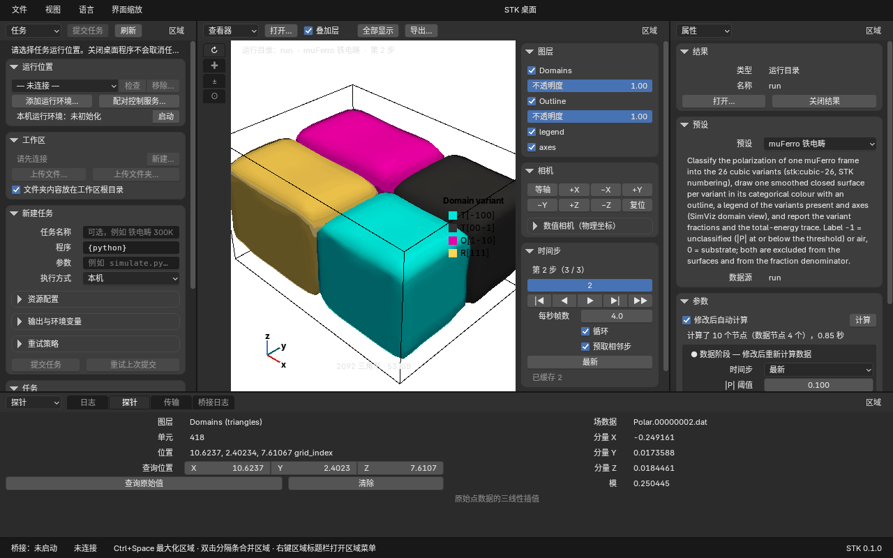
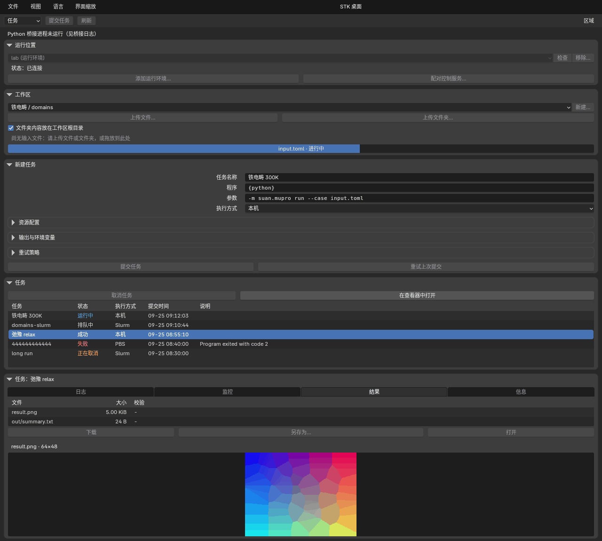
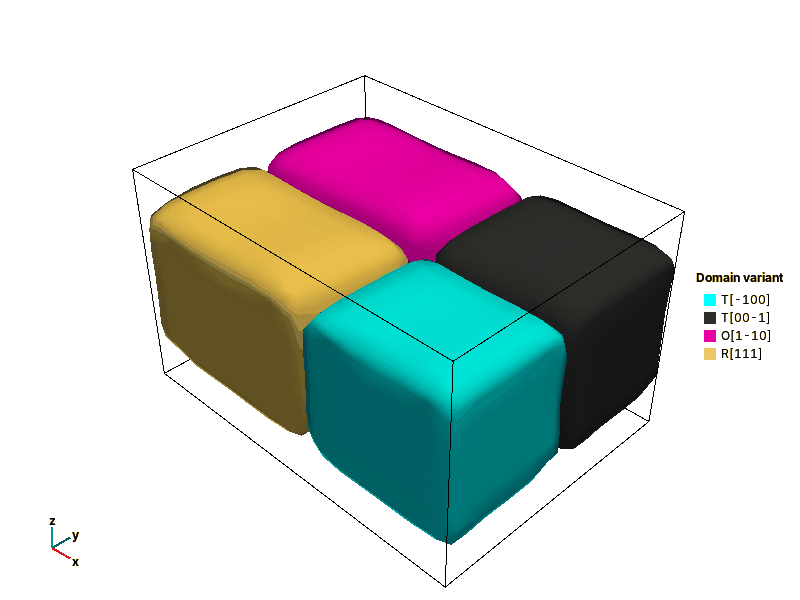
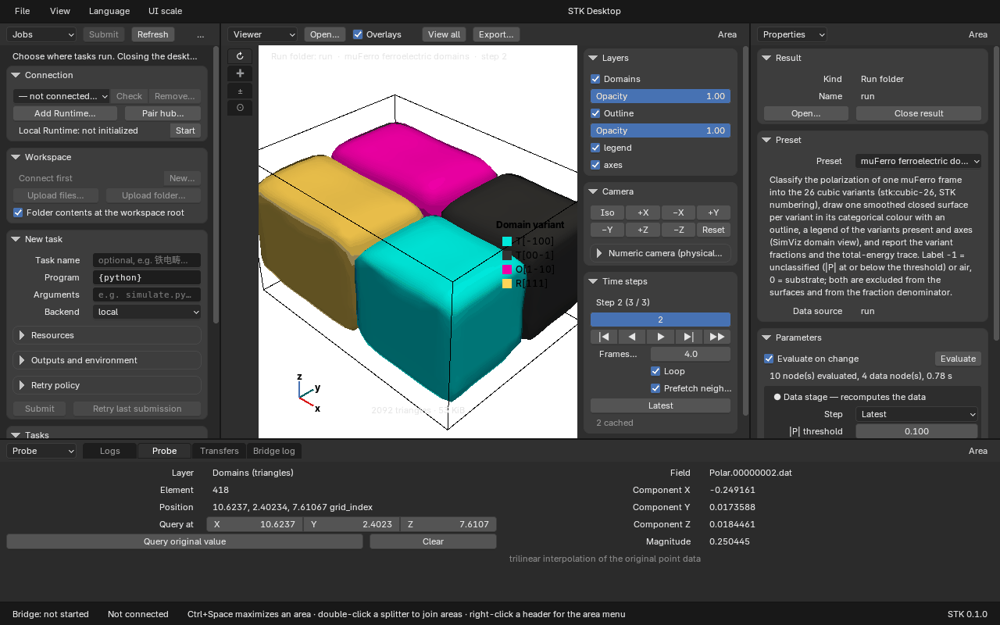

# STK 桌面程序（stk-desktop）

[English](#english)

macOS / Windows 真机测试可使用[快速编译与启动脚本](../desktop/QUICKSTART.md)。

本文介绍当前可用功能。AI 助手的进一步集成、分层节点与共享多维表格安排见
[开发计划](development-plan.md)和[工作台设计](design/project-workbench.md)。用户已反馈 macOS / Windows
均能打开窗口并看到 3D 渲染，范围见[补充验收记录](runtime-validation.md#desktop-mac-windows-smoke)。

STK 桌面程序 `stk-desktop` 是 STK 自有的 C++ 桌面端：窗口、输入、输入法与 GPU 上下文来自 Blender 的
GHOST，绘制用 Blender 的 GPU 模块（Linux 上 OpenGL 或 Vulkan，macOS 上 Metal），文字用 BLF（FreeType，
中日韩字形回退）。代码在 `desktop/`，许可为 **GPL-2.0-or-later**；STK 的 Python 包（Runtime、控制服务、
桌面桥 `suan.desktop_bridge`）仍为 MIT，桌面程序把桥作为子进程启动，经 NDJSON 协议通信
（[桥规范](specs/stk-desktop-bridge-v1.md)）。

桌面程序取代旧 PyQt 界面的“任务”页、SimViz 与 Blender 工作台（见文末“旧界面与归档计划”）：

- **任务（Jobs）**：本机 Runtime、`suan connect` 保存的 Runtime 连接和已配对的控制服务（hub）；工作区、
  文件与文件夹上传、任务提交、日志、取消、结果下载与校验、PNG 预览。
- **查看器（Viewer）、属性（Properties）、探针（Probe）**：打开渲染数据包、结果目录或运行目录，用节点图
  预设（如 `muferro-domains`）在数据旁求值，GPU 显示、拾取并查询原始值，导出 PNG 与逐步序列。
- **传输、日志、桥日志**：上传下载进度与续传、程序日志、桥的 stderr 与重启。
- **AI 助手**：在同一页检查捕获数据、准备和明确发送保存的问题、查看请求状态与普通文字回复；
  首版本机及跨平台 CI 已通过。



D1 里程碑的真实验收（经控制服务提交 muFerro、日志、下载、查看器与探针、输入法）见
[验收记录](runtime-validation.md#2026-09-25-桌面里程碑-d1自有引擎桌面端)，开发者说明见
[`desktop/README.md`](../desktop/README.md)，与旧界面的功能对照见
[`desktop/docs/parity-jobs.md`](../desktop/docs/parity-jobs.md) 与
[`desktop/docs/parity-viewer.md`](../desktop/docs/parity-viewer.md)。

## 项目工作台

界面中文/英文术语见[术语表](design/glossary.md)。各面板说明只显示第一句，末尾的“…”表示悬停可看完整说明
（范围、上限以及不会发生的操作）。UUID、哈希与 JSON 命令默认收在“技术详情”或“高级”折叠面板中；
修改检查以“表 / 字段 / 第 N 行”定位，JSON 命令编辑器在“高级：以 JSON 编辑命令”中。

新的默认布局以 **工作台** 开始（左栏，与“任务”同组标签），也可从 **文件 → 工作台** 或项目表格、AI 助手、
分析图页头的“工作台”按钮进入。

打开项目后，工作台顶部的 **需要关注** 汇总三组事项：**需要处理**（失败或中断的工作流运行、失败或待核实的分析与仿真运行、
待审的 AI 草案、失败或结果不确定的 AI 请求，失败排在待审之前）、**运行中**（带完成数）与 **已完成未查看**。每项有“打开”
（工作流运行在工作流编辑器中选中该运行，分析运行打开分析图的“运行”页，草案、请求与仿真运行打开对应项目页面）与“已看”；
打开即标为已看。“已查看”只记在本机的后台服务状态目录，不改项目；事项状态再变化（例如再次失败）会重新出现。
状态栏的 **需要处理 N** 显示未查看的需要处理数，点击回到工作台。有事项运行时每 3 秒重读一次；汇总只读，不运行任何内容。

其下的 **搜索项目** 在当前项目中查找文字（不区分大小写，按回车或“搜索”开始）：参数表与字段名称、单元格文字、工作流与保存分析的名称、
文件名与路径、AI 草案标题和对话消息。结果按类别列出（每类最多 50 项、共 100 项），“打开”到所在位置：单元格打开参数表并选中该行，
文件打开文件页并选中该文件，工作流与分析打开对应编辑器，草案打开审阅页，消息打开 AI 对话。搜索只读；结果不自动更新，
项目在搜索后有变化时会注明，再次搜索即可。

工作台按步骤引导，并根据已知状态标出“下一步”：

1. **项目**：显示已打开的项目；“打开或新建项目”进入创建、打开与最近项目入口。尚未打开项目时另有
   **创建示例项目**：用合成数据（不是物理模拟）在 `~/STK Projects` 新建并打开一个走完主流程的项目，
   不连接服务器或模型，见 [Linux 快速上手](quickstart-linux.md#2-用示例项目看一遍主流程)。
2. **参数**：显示参数表数与总行数（不含文件索引与分析定义等托管表）；“编辑参数”打开项目表格。
   表格页的 **生成参数扫描** 按每个字段的范围或取值列表一次添加多行，可一次撤销，见[参数扫描](project-sweeps.md)。

分析图“运行”页的**运行并显示**一次完成准备、开始、等待、读取校验与在查看器显示，可随时停止且不取消运行，
见[分析运行](project-analysis-runs.md#准备执行与查看)。

MuFerro 仿真与仿真批次面板可直接选择**运行环境**并用字段设置运行方式与资源（原 JSON 折叠为高级选项）；
仿真批次的**在 … 上运行所选 N 行**一次完成保存、准备与提交，见[仿真批次](simulation-batches.md)。

项目目录、CSV 输入/输出、项目文件、MuFerro 案例目录与 Python 文件的路径框旁有 **浏览…**，用系统文件对话框
（Linux 为 zenity 或 kdialog）选择后只填入路径，导入、登记、导出或运行仍需另行点击。没有系统对话框时（目前 macOS、Windows）
不显示该按钮，继续手工输入或拖入；对话框无法打开时在路径框下说明原因。打开对话框期间若切换了项目，返回的路径被丢弃。
3. **运行环境**：显示当前连接及其状态；“选择运行环境”切到“任务”标签配置 Runtime 或 SSH。
   仿真在 Linux 的 STK 运行服务上执行；本机分析不需要服务器。
4. **运行**：分别进入仿真运行与分析运行页面，再明确刷新列表。
5. **结果**：进入“保存的分析”，或切到查看器（不最大化，保留属性面板）。

“其他”中有 AI 对话、文件页、项目的**工作流**与跨项目的技能库。后台 Python 服务未就绪时，工作台顶部用一句话说明原因。
已保存布局的用户继续使用自己的布局；**文件 → 恢复默认布局** 可换成新的默认布局。
导航复用已有标签；最大化的目标可通过 **视图 → 恢复分栏布局** 返回原分栏。
工作台的项目入口会检查所有窗口的活动文本编辑；先完成或取消输入再导航。未发送问题和分析参数草稿保留。
文件入口需要切换共享表格时，还会检查所有窗口及隐藏标签的单元格及表/字段名称草稿；先在原编辑器应用或重新载入，避免隐式切表丢失输入。
进入页面本身不发送模型请求或启动计算，不改变历史运行和 Viewer。文件入口会改变共享表格选择。
布局可保存 `workspace` 编辑器，也可用 Python `stk.ui.activate_editor("workspace")` 打开。
**技能库**是跨项目的全局入口，没有打开项目时也可进入，见下节。
文件/技能对话附件和具体对象深链接仍按开发计划推进。

## 工作流

工作台“其他”中的 **工作流**（或编辑器类型菜单）打开项目工作流（实验格式 `stk.workflow/1`，见[项目工作流](project-workflows.md)）。
首次显示时读取列表并打开上次在这个项目中显示的那份（没有则第一份）；画布用分析图同样的节点与端口显示步骤（“种类 · 名称”），数据连线连接带类型的端口，
“先完成”依赖显示为（完成）→（等待）连线；有问题的步骤标红并带“!”。右侧列出校验问题（点击定位步骤）和所选步骤的引用、
内容哈希、输入输出与参数绑定。项目修订变化后自动重新读取并检查一次。
每份工作流记住自己的画布缩放与位置（与窗口大小和界面缩放无关）、所选步骤与显示的运行，切换到另一份再回来时恢复；
最近 50 份的记忆与上次显示的工作流随布局保存。“适应”按钮重新适应画布。

- **进入分析**：分析步骤在同一区域的“分析图”标签中打开引用的保存分析（已有该标签则复用），画布上方显示
  “‹ 工作流名 › 步骤名”，点击返回原工作流标签并保留所选步骤。分析图中另一份分析有未保存修改时拒绝进入，草稿保持不变；
  在分析图中改选其他分析、关闭或切换项目后面包屑消失。
- 参数表、输入文件、仿真步骤分别打开参数表（选中该表）、文件页和仿真运行记录。

- **编辑**：添加、删除、连线、设置先后、参数绑定（固定值或参数表字段）、改名与拖动位置都先作用于未保存的候选，
  画布标题注明“未保存”，修改的步骤琥珀色描边；每次修改后自动检查候选。**保存工作流**是一次可撤销的项目编辑，
  有问题也可保存；**放弃修改**回到已保存版本。另一项目编辑只移动修订时保留修改；这份工作流在别处被改动时只能放弃。
  见[项目工作流](project-workflows.md#在桌面查看与编辑)。

- **运行**：勾选参数表的行后 **运行所选 N 行**（项目格式 10），立即返回；按行 × 步骤显示任务状态，选中一行可看失败原因、
  打开该行的分析运行；可重试未成功的任务、取消或在服务重启后恢复。运行使用点击时冻结的工作流、分析与行参数。
  之后改变的行标为“过期”并列出原因，**重算过期的 N 行** 为它们开始一次新运行（沿用原运行的运行环境）。
  含 MuFerro 仿真步骤的工作流在运行区选择**运行环境**（已保存的直连或 SSH Runtime）与运行方式、MPI 进程数、每进程线程数
  （集群还需时限），按钮写为 **在 … 上运行所选 N 行**；各行同时提交，任务格显示“已提交/排队中/Runtime 运行中/收集结果”，
  选中一行可看仿真运行与 Runtime 任务。关闭 STK 不会停止 Runtime 上的任务，再次开始运行会接管它们。
  见[项目工作流](project-workflows.md#按行运行w4aw4b)。

编辑与浏览本身不运行或准备任何步骤、不改变 Viewer，也不调用模型；只有“运行”中的明确点击才执行。

## 技能目录

从 **文件 → 技能**、工作台的“技能库”或任一区域的编辑器类型菜单打开只读的版本化技能目录
（实验契约 `stk.skill/1`，见[技能目录](skills.md)）。首次显示时读取一页（最多 50 项）；搜索按 ID、标题、说明或预设过滤，
按回车或“搜索”后才发送；“重新读取”刷新当前页及已选技能的可用性。

- 左侧（窄窗口为上方）列出名称、`id@version` 和可用性：可用、部分可用（列出无法交付的输出）或不可用。
- 选择技能后显示内容 SHA-256、说明、执行入口（预设与 `graph.evaluate`）、给模型的 SKILL.md 说明包、
  输入绑定、参数（类型与默认值保持原 JSON 类型）、输出、节点/Python 依赖、未检测的运行能力及例子。
- 定义文件无法使用时，“未载入的定义”列出文件、代码、JSON 指针和原因；其他技能照常显示。
- 旧版 Python 桥没有 `skills.list/get` 时显示“不提供技能目录”，不猜测内容。桥重启或更换后清空并重新读取。

浏览只读取定义：不运行技能、不准备运行、不改变项目、Viewer 或布局，也不调用模型。
需要运行时，在 Viewer、保存的分析或 Python 中明确执行对应预设。Python 可用 `stk.skills.list/get` 读取同一目录，
用 `stk.ui.activate_editor("skills", maximize=True)` 打开此页。项目采用固定技能版本尚未实现。

## AI 助手

**视图 → 分析图** 打开当前 Viewer 预设的只读图检查，端口、参数、引用及输出使用通用表格。
可在“当前参数”和“已显示结果”间对比提交配置，显式校验不运行节点；完整用法与来源核对边界见[分析节点图](analysis-graphs.md)。
展开“项目分析文档”可把当前检查的定义保存到项目，或从列表打开“保存的分析”；保存、改名与撤销复用普通表格，
打开文档不运行图，也不把当前三维结果附给该文档，见[保存分析定义](project-analyses.md)。
保存分析的“运行”页可将定义绑定到明确的输入快照，先准备再执行；完成后读取校验过的归档并选择输出，
明确打开到空 Viewer，见[分析执行记录](project-analysis-runs.md)。旧项目需明确备份升级到格式 9。

**视图 → 聚焦准备** 会激活现有 AI 标签并最大化其区域；**聚焦分析** 对 Viewer 做同样操作。
没有对应标签时会在有空位的区域新增，已有面板和分栏比例保留。**恢复分栏布局** 显示原分栏，
但不撤销刚才的标签选择。原窗口仍在输入文字时会先要求完成输入，其他窗口的输入保持原样。
这是当前窗口的聚焦导航；每种模式独立保存整套工作区、以及启动默认 AI 主页仍按设计继续开发。
切换本身不发送问题或启动求值，未发送的 AI 问题和 Python 草稿保留在原编辑器对象中。

打开格式 8 的项目，从项目页头或 **文件 → AI 助手** 进入；旧项目先明确备份升级。
用 **项目表格** 返回数据页选择一条记录，再在 AI 助手点击 **捕获选中记录**，保存该记录全部字段
（首版最多 64 个）的当前值与定义。检查捕获值及修订；后续参数变化不会更新这份上下文。

需要比较多条记录或只提供部分字段时，点击 **选择多行与字段…**。在 **行 / 字段** 中勾选，
核对数量和 **预览选定数值**，再点 **在当前修订捕获**。每页显示 8 项，支持明确全选/清空；
单次限 100 行、64 字段、1000 个单元格，不会截取超限选择。选择器独立于表格的当前行、排序和筛选。
切换表格或明确重新载入会清空选择；选择期间项目变更后保留旧预览，并要求重新载入、选择。
保存成功后才关闭选择器，失败保留选择供核对；关闭选择器不会捕获。选择器打开期间不能准备新问题，
已保存问答保留原上下文。详见[上下文指南](project-contexts.md)。

填写模型 ID 和问题，点击 **准备问题（不发送）**。该操作只保存问题和请求意图，核对上方的已保存文字、
模型和来源后，再点 **发送这条已保存的问题（模型）**，按钮注明这条请求冻结的模型。环境配置见[请求指南](project-requests.md)；未配置凭据也能准备和查看。
配置区显示 **本项目已用** 的输入/输出 token 与完成的请求数：只统计服务商随已完成回复返回的回执（悬停按模型分列），
失败、取消或结果不确定的请求不计入，也不估算金额；费用与额度以服务商控制台为准。每次有回复完成后重读一次。
正在编辑的新文字不会改变已保存请求；选择历史问答也不会覆盖输入框。数据捕获范围与历史问答的来源分别显示。
准备分为消息保存和请求创建；第二步失败可能留下已保存消息。同次会话对当前相同输入重试会复用身份，
关闭重开后需先检查历史，不承诺跨重启的准备事务恢复。

工作区显示时，运行中/不确定状态会按约 1 秒间隔读取**本地保存记录**和本桥可用的临时流式文字，最多跟踪 90 秒。
片段标为 **临时回复（尚未保存）**；完整回复校验并保存后才成为正式文字。取消时隐藏片段，断流不保存半条回复。
出错或到期暂停，可明确点 **刷新回复** 继续读取，
**刷新记录** 更新历史列表。刷新不向模型查询、不重发；取消及遗留执行核对仍须明确点击。
保存问答随项目保留，未准备的问题及模型选择仅在本编辑器内按项目保留，退出程序或关闭编辑器后不保证恢复。

将“用途”改为 **建议参数修改** 后，可为捕获范围内的普通标量单元格生成建议。
完成的回复显示摘要和建议值；点击 **保存建议供检查** 只保存草案，再点 **打开修改检查**，
明确预览差异后才能应用。已有草案、其他窗口正在输入、项目切换或修订变化会阻止载入，保留原有工作。
原始回复可在请求详情查看，完整步骤及限制见[参数提案指南](project-parameter-edits.md)。

当前是单条问题与选定上下文的文字请求，不自动附带其他问答、文件或未保存输入；没有
工具调用、自动修改/模拟、Markdown 渲染或默认 AI 主页切换。各增量的本机与跨平台验证见[验收记录](runtime-validation.md)。
双平台真实模型和输入设备验收见[工作台清单](workbench-acceptance.md#ai-助手)。

## 安装

桌面程序与 Python 部分分开安装：程序包里**没有** Python（D1 不内置解释器），桥、本地求值和本机 Runtime
都用你指定的 Python 环境。

### Linux 预编译包

要求：x86_64，glibc ≥ 2.39（Ubuntu 24.04 及更新版本），X11 或 Wayland 会话，OpenGL 4.3 或 Vulkan 1.2
驱动（Mesa 的 llvmpipe／lavapipe 也可以运行，但较慢）。

CI（`.github/workflows/desktop.yml` 的 `linux-package` 作业）生成 `stk-desktop-<版本>-linux-x86_64.tar.gz`
及其 `.sha256`，在 GitHub Actions 运行页面的 `desktop-linux-package` 制品中下载。正式发布渠道确定前以此为准。

```bash
sha256sum -c stk-desktop-0.1.0-linux-x86_64.tar.gz.sha256
tar xzf stk-desktop-0.1.0-linux-x86_64.tar.gz -C ~/opt
~/opt/stk-desktop-0.1.0-linux-x86_64/bin/stk-desktop --version
```

包可以解压到任意目录（可重定位）：

| 路径 | 内容 |
|---|---|
| `bin/stk-desktop`、`bin/stk-render` | 桌面程序与无界面渲染工具 |
| `lib/stk-desktop/` | 普通桌面系统没有的共享库（shaderc、libepoxy），程序经 RPATH `$ORIGIN/../lib/stk-desktop` 找到 |
| `share/stk-desktop/datafiles/fonts` | Inter、Noto Sans CJK、DejaVu Sans Mono |
| `share/stk-desktop/i18n` | 中文（默认）与英文消息目录 |
| `share/doc/stk-desktop/` | `LICENSE`（GPL）、`THIRD-PARTY-NOTICES.md`、Blender 与字体许可、`third-party/`（nlohmann/json、libspng、miniz 及随包共享库的 Debian copyright） |

其余库（glibc、libstdc++、OpenGL／Vulkan 加载器与驱动、X11、Wayland、FreeType、zlib 等）来自系统。
CI 在只装了这些运行库的全新 Ubuntu 24.04 容器中解压包，无界面渲染（OpenGL 与 Vulkan）并运行下文的
端到端预设命令，结果与仓库中的基准图比对。

AppImage 暂不提供（后续工作）。

### Python 部分

在 Python 3.10–3.14 的虚拟环境中从仓库安装 STK（包名 `suan_toolkits`，尚未发布到 PyPI）：

```bash
python3 -m venv ~/.venvs/stk
~/.venvs/stk/bin/python -m pip install '/path/to/stk[science,visualization]'
```

- 只用任务功能（连接 Runtime 或控制服务、上传、提交、下载）时 `pip install /path/to/stk` 即可，桥只用标准库。
- 在本机求值节点图（查看器打开运行目录、本地模式）需要 `science,visualization`（NumPy、VTK、h5py、
  Matplotlib）。经控制服务求值时，计算在节点上进行，本机不需要这些依赖。
- 本机 Runtime（任务页的“本机”）只支持 Linux，见 [runtime 使用指南](runtime.md)。

桌面程序按以下顺序选择解释器：`--python PATH`，环境变量 `STK_PYTHON`，然后 `PATH` 上的 `python3`／`python`。
程序包不会把源码树加入 `PYTHONPATH`，所以所选解释器必须能 `import suan.desktop_bridge`：

```bash
STK_PYTHON=~/.venvs/stk/bin/python ~/opt/stk-desktop-0.1.0-linux-x86_64/bin/stk-desktop
```

设置界面中的解释器选项尚未提供（后续工作）。

### macOS

CI 的 `macos` 作业生成 `stk-desktop-<版本>-macos-arm64.zip`（制品 `desktop-macos-app`），内含 `STK.app`
（包标识 `ai.sijin.stk.desktop`，Apple 芯片，macOS 13.3 及以上，Metal）。应用**未签名、未公证**，只有
ad-hoc 签名；首次打开时在 Finder 中右键“打开”，或执行 `xattr -dr com.apple.quarantine STK.app`。CI 在全新
目录中解压该 zip，用 Metal 无界面运行程序与端到端预设命令。

从 Finder 启动的应用不继承终端的环境变量。可用 `launchctl setenv STK_PYTHON ~/.venvs/stk/bin/python`
（重新登录后失效），或从终端启动：

```bash
/Applications/STK.app/Contents/MacOS/stk-desktop --python ~/.venvs/stk/bin/python
```

macOS 上的交互验收（Metal 窗口、拼音输入法、Retina）尚需在实机上完成。

### Windows

D1 在 CI 中编译全部目标（MSVC，OpenGL，Win32 GHOST）并运行 CPU 测试，但不提供安装包；Windows 的安装包、
内置 Python 与 Win32 输入法验收属于里程碑 M-D2。

### 从源码构建

Linux 开发主机不需要 sudo：`fetch-sysroot.sh` 把固定版本的 Ubuntu 26.04 开发包解压到 `~/opt/stk-sysroot`，
CMake 自动使用它。没有 sysroot 时使用系统包（包名列表见 `.github/workflows/desktop.yml`）。

```bash
desktop/cmake/sysroot/fetch-sysroot.sh                 # 一次；--with-test-servers 另装 Xvfb 与 weston
cmake -S desktop -B ~/opt/stk-build/desktop -G Ninja   # 默认 RelWithDebInfo
ninja -C ~/opt/stk-build/desktop
ctest --test-dir ~/opt/stk-build/desktop --output-on-failure
~/opt/stk-build/desktop/bin/stk-desktop               # 开发构建：自动把源码树加入桥的 PYTHONPATH
```

生成可重定位的包：

```bash
cmake -S desktop -B build-pkg -G Ninja -DCMAKE_BUILD_TYPE=Release \
  -DSTK_DESKTOP_RELOCATABLE=ON -DSTK_DESKTOP_BUNDLE_LIBS=ON
cmake --build build-pkg --target stk-desktop stk-render
(cd build-pkg && cpack)                                  # Linux：stk-desktop-<版本>-linux-x86_64.tar.gz
cmake --install build-pkg --prefix /opt/stk-desktop    # 或直接安装
```

`STK_DESKTOP_RELOCATABLE` 去掉编译进程序的源码树回退（字体、消息目录、`suan` 包）；
`STK_DESKTOP_BUNDLE_LIBS`（Linux）在安装时用 `ldd` 把非系统共享库复制到 `lib/stk-desktop`。macOS 上
`cmake --install` 生成 `STK.app`。细节见 [`desktop/README.md`](../desktop/README.md#packaging)。

## 运行与连接

```bash
stk-desktop                          # 窗口（Wayland，否则 X11）
stk-desktop --lang en                # 英文界面（默认中文，菜单“语言”可切换）
stk-desktop --gpu-backend vulkan     # auto、opengl、vulkan、metal；也可用 STK_GPU_BACKEND
stk-desktop --open result/           # 启动后在查看器中打开渲染数据包、结果目录或运行目录
stk-desktop --help
```

程序启动时拉起 Python 桥，状态栏显示“桥接”状态与当前连接。任务页“运行位置”列出三类连接：

1. **本机**（仅 Linux）：本机 Runtime，显示状态；“启动”在需要时先初始化再启动（等同 `suan server init`
   与 `suan server start`）。
2. **Runtime 连接**：与 `suan connect` 共用 `~/.stk/connections.json`（`STK_PROFILES_FILE` 可指定位置）。
   “添加运行环境…”填写名称、URL 与令牌或令牌文件；远程 Runtime 经 SSH 隧道访问：

   ```bash
   ssh -N -L 9876:127.0.0.1:8765 my-compute-server
   suan connect add cluster --url http://127.0.0.1:9876     # 或在桌面程序中添加，两边互通
   ```

   “移除…”会同时从 `suan connect` 中删除该连接。
3. **控制服务（hub）**：所有者在控制服务主机上签发**桌面配置**的一次性配对码，在桌面程序“配对控制服务…”
   中输入 URL 与配对码：

   ```bash
   suan-control pair --state-dir /path/control --role client --profile desktop
   ```

   桌面配置的设备在额度内（预计传输 ≤ `--desktop-auto-mib`，默认 256 MiB）免复核运行图求值与只读操作；
   Viewer 求值和相邻时间步预取使用结果来源 hub 的额度，不受 Jobs 当前选择的连接影响。
   新命令、改动的模板和写入工作区（上传导入）仍需复核。见[控制服务指南](hub.md#桌面配置的自动执行wp11)。

**`review_policy` 建议**：默认 `any` 时，桌面程序可以确认自己提交的复核（防误操作）；从互联网可达的
hub 建议 `suan-control serve --review-policy not-self`，此时本设备的批准会被拒绝，桌面程序说明原因
（“控制服务的审核策略（not-self）不允许本设备批准该操作…”），由其他设备或所有者令牌批准后，桌面程序以
同一幂等键重发提交。控制服务应经 HTTPS 入口（反向代理加认证）或 SSH 隧道访问，不要直接绑定局域网或公网地址。

## 任务（Jobs）



1. 在“运行位置”选择连接，“检查”显示健康状态（在线、有问题、离线）。
2. “工作区”选择或新建工作区；“上传文件…”“上传文件夹…”（系统对话框，没有时显示路径输入框），或把文件
   拖到任务或传输编辑器上。勾选“文件夹内容放在工作区根目录”时，文件夹的内容直接放在工作区根目录。
3. “新建任务”：名称（支持输入法）、程序、参数（按 Python `shlex` 规则拆分）、执行方式（本机、PBS、Slurm）、
   资源（CPU 或 MPI 进程数与每进程线程数、节点、内存、时限、GPU、队列、账户）、期望输出、环境变量与重试策略。
   提交前按 Runtime 的 `TaskSpec` 规则校验；每次提交一个幂等键，自动与手动重试沿用同一个键。经控制服务
   时可选模板，或提交自定义命令（进入复核）。
4. 任务表每 2 秒刷新（状态快照），可排序；“取消任务”需确认；“在查看器中打开”把结果交给查看器。
5. 任务详情：日志（stdout、stderr 或合并，跟随末尾）、监控（监控事件摘要）、结果（制品；“下载”在磁盘上
   再次校验 sha256 并打开，“另存为…”选择位置，PNG 直接预览）、信息。
6. **关闭桌面程序不会停止任务**：关闭时只取消订阅，桥收到 EOF，不发送取消。

复核中的操作显示在任务页，“检查”显示完整请求后再“批准”；桥重启后会重新读取该操作再批准。

## 查看器、属性与探针

- **打开**：文件 > 打开数据包 / 结果…，或查看器标题栏、属性“结果”面板的“打开…”（输入路径），拖放到查看器、`--open PATH`，或任务页的“在查看器中打开”。
  `.stkp`／渲染数据包目录直接显示；`suan graph run` 的结果目录（`result.json`，或带 `series.json`
  的逐步结果）从磁盘读取；运行目录（如 muFerro）在桥管理的独立进程中按预设求值（本地模式）。Runtime
  任务的文件经校验下载后在本机求值；控制服务任务在节点上求值，只传回渲染数据包。
- **属性**：选择预设（`muferro-domains` 等 8 个），参数表单由 JSON Schema 生成，分为“数据阶段”（修改后
  重新计算数据）和“客户端阶段”（颜色表、不透明度、相机等，只重算外观节点）。修改自动求值（可关闭），
  较新的求值会取消正在进行的求值；摘要显示本次计算的节点数与数据节点数。本地求值卡住时可取消，
  不影响任务管理；求值进程崩溃后再次点击“求值”可重新启动。
- **体渲染透明度**：选择 `volume` 预设，在属性的“透明度”面板中查看曲线、添加或删除控制点，
  并输入位置与透明度。位置 0–1 对应值域下限到上限；透明度 0 为透明，1 为不透明。支持 2–64 个点，
  相邻点间线性插值，端点外保持端点透明度；“自动”按场类型生成透明度，“重置斜坡”恢复预设斜坡。
  修改只更新外观，不重新读取或计算数据。颜色仍通过颜色表下拉框选择。
  值域的上下限可分别勾选“自动”，或关闭自动后输入具体数值。
- **查看器**：左侧工具栏为旋转（↻）、平移（✚）、缩放（±）、拾取（⊙），鼠标悬停显示名称。侧栏：图层可见性与
  不透明度，相机（7 个预设、复位、物理坐标下的数值相机），时间步（滑块、播放、每秒帧数、循环、预取相邻步、
  最新），显示（叠加层、光照、导航方式 Blender／ParaView）。已缓存的时间步切换不经过桥，保持相机。
  **全部显示 / Home** 和原生方向按钮按三维主区域的实际宽高比重新取景，透视和正交均可用。
  调整窗口、分栏或侧栏本身不自动改变相机；**复位**恢复结果自带的数值相机，可能仍显示作者放大的局部。
  来源、警告和统计标签有不透明主题底色，不受场景背景明暗影响；标签底色不增加点击区域。
- **探针**：单击拾取（GPU 拾取后以 float64 精化），探针编辑器显示图层、单元与物理位置，并经桥对原始场数据
  三线性插值得到原始值；也可输入坐标查询。
- **导出**：查看器“导出…”选择尺寸、放大倍数 ×1–×8（分块渲染）、透明背景、叠加层与“全部时间步”
  （`<名称>.%08d.png` 与 `stk.series/1` 清单）。

无界面导出（CI 端到端基准用的就是这条命令）：

```bash
stk-desktop --headless --preset muferro-domains --run /path/to/case --export domains.png \
  [--size 1600x1200] [--camera iso|+x|-x|+y|-y|+z|-z] [--param step=100] [--magnification 2] \
  [--transparent] [--no-overlays] [--sequence] [--python ~/.venvs/stk/bin/python]
stk-render --payload result/domains --export domains.png      # 已有渲染数据包，不需要 Python
```



## 键盘与鼠标

| 按键 | 作用 |
|---|---|
| Ctrl+Space | 最大化／还原指针下的区域 |
| T／N | 显示／隐藏工具栏／侧栏 |
| Ctrl+PageUp／PageDown | 切换区域中的标签页 |
| Ctrl+S | 保存布局 |
| Ctrl + ／ - ／ 0 | 界面放大、缩小、复原 |
| Ctrl+Q | 退出 |
| 双击分隔条 | 合并两侧区域 |
| 右键区域标题栏 | 区域菜单（拆分、合并、最大化、关闭、标签页） |

macOS 上保存布局、退出与界面缩放用 ⌘（⌘S、⌘Q、⌘ + ／ - ／ 0），其余按键相同。

查看器（默认 Blender 导航）：

| 操作 | 作用 |
|---|---|
| 中键拖动／Shift+中键／Ctrl+中键、滚轮 | 旋转／平移／缩放 |
| 左键拖动 | 工具栏当前工具（旋转、平移、缩放、拾取） |
| 单击 | 拾取并在探针中显示 |
| 小键盘 1／3／7（Ctrl 取反向）、0、9 | 前／右／顶视图、等轴视图、翻到对侧 |
| Home | 全部显示 |
| Space、←／→ | 播放／暂停、上一步／下一步 |

ParaView 导航（侧栏“显示”中切换）：左键旋转、中键平移、右键缩放。

## 布局保存

关闭窗口时（以及文件 > 保存布局、Ctrl+S）保存布局：Linux 为 `$XDG_CONFIG_HOME/stk/desktop/layout.json`
（通常是 `~/.config/stk/desktop/layout.json`），macOS 为 `~/Library/Application Support/stk/desktop/`，
Windows 为 `%APPDATA%\stk\desktop\`。内容包括窗口大小与位置、语言、界面缩放和区域树（分割比例、编辑器类型、
区域大小、标签页等）。

- 文件损坏、无效或来自更新的版本时，改名为 `layout.json.corrupt`，记录日志并使用默认布局。
- `--layout FILE` 使用指定布局且不写回；`--no-save-layout` 不保存；`--save-layout FILE` 写出布局。
- 文件 > 恢复默认布局（或删除 `layout.json`）回到默认布局：工作台（与任务同组）｜查看器｜属性，下方为日志、探针、传输、桥日志标签页。

## 输入法

| 平台 | 状态 |
|---|---|
| Linux Wayland | 内联预编辑（text-input-v3）：拼音在文本框中显示并提交，候选窗跟随文本框。GNOME + IBus、KDE + fcitx5 的人工验收尚未完成。 |
| Linux X11 | 只接收提交的文字：预编辑与候选窗由输入法自己的窗口显示（位置不一定跟随文本框），上屏后文字进入文本框。X11 的 over-the-spot 预编辑尚未实现，是否需要待定。 |
| macOS | Cocoa 内联预编辑（NSTextInputClient）已编译；拼音输入法的实机验收待完成。 |
| Windows | Win32 输入法属于 M-D2。 |

## 故障排查

- **桥日志**：底部“桥日志”标签页显示桥的 stderr、状态与失败后的“重启”；状态栏显示桥接状态。“Python
  桥接进程未运行”通常是解释器不对：用 `--python` 或 `STK_PYTHON` 指向安装了 STK 的虚拟环境，检查
  `"$STK_PYTHON" -c 'import suan.desktop_bridge'`。`STK_BRIDGE_VALIDATE=1` 让程序按协议 JSON Schema 校验
  每条消息。
- **本地求值失败**（查看器打开运行目录）：所选 Python 需要 `science,visualization` 依赖；
  `"$STK_PYTHON" -m suan.graph doctor` 检查。
- **GPU 后端**：`--gpu-backend opengl|vulkan|metal`（或 `STK_GPU_BACKEND`）选择后端，`auto` 依次尝试已编译的
  后端；`--verbose` 打印设备、字体与消息目录的路径。Linux 默认 OpenGL。
  - 无界面 weston（pixman 渲染）上 OpenGL 无法启动（`EGL_BAD_MATCH` 后 Wayland 连接断开），请用
    `--gpu-backend vulkan`；X11 上 OpenGL 正常。
  - weston 的 kiosk 输出比窗口小时（例如输出 1280×800、窗口请求 1440×900），weston 会断开连接；请用
    `--size` 指定不超过输出的窗口尺寸。
  - 强制使用 X11：`WAYLAND_DISPLAY= stk-desktop`。
- **字体或消息目录找不到**：程序在可执行文件旁查找（`../share/stk-desktop/`，macOS 为
  `../Resources/`）；可用 `--datafiles DIR`、`--i18n DIR` 或 `STK_BLENDER_DATAFILES`、`STK_I18N_DIR` 指定。
- **Linux 包缺库**：`ldd bin/stk-desktop | grep 'not found'`。包需要 glibc ≥ 2.39 与系统的 OpenGL／Vulkan、
  X11、Wayland、FreeType 运行库。
- **布局异常**：删除 `layout.json`，或查看 `layout.json.corrupt` 与“日志”标签页中的原因。
- Vulkan 的 SPIR-V 与管线缓存在 `$XDG_CACHE_HOME/stk-desktop`，可以删除。

## 旧界面与归档计划

| 时间 | 归档内容 |
|---|---|
| 已归档 | `native/`（Rust/egui 原型，标签 `archive/native-egui-2026-09`）；旧 C/C++ 工具与 EffectiveProperties 工程现保存在 [`archive/legacy/toolkits/cpp/`](../archive/legacy/toolkits/cpp/) |
| D1 结束（已完成） | `blender/` SPACE_STK 定制版、`suan/blender_client`、`suan-workbench`／`suan-blender`（标签 `archive/blender-workbench-2026-09`）；`validate_scene` 已移入 `suan/render/v1.py` |
| M-D2 结束 | `suan/gui`（Qt）及其依赖组、`tests/test_desktop.py`、文档站点的 Qt 页面 |

M-D2 结束前旧 Qt 界面 `suan-gui` 仍可使用。新功能只加在桌面程序中。

M-D2 的剩余项现按[开发计划](development-plan.md)分配到 P0/P3/P5；Qt 归档仍须单独记录替代能力、
平台输入与分发验收，不因新工作台设计确认而自动执行。

---

## English

This guide describes implemented features. See the [development plan](development-plan.md) and
[workbench design](design/project-workbench.md) (Chinese) for further AI integration, hierarchical workflows
and shared tables. The owner reports successful window startup and visible 3D rendering on
both macOS and Windows; see the [scoped acceptance note](runtime-validation.md#desktop-mac-windows-smoke).

`stk-desktop` is STK's own C++ desktop application: Blender's GHOST (windows, input, IME, GPU contexts),
GPU module (OpenGL or Vulkan on Linux, Metal on macOS) and BLF (FreeType text with CJK fallback), under
**GPL-2.0-or-later** in `desktop/`. The Python side (Runtime, hub, the desktop bridge
`suan.desktop_bridge`) stays MIT and runs as a child process speaking NDJSON
([bridge spec](specs/stk-desktop-bridge-v1.md)). It replaces the PyQt Tasks tab, SimViz and the Blender
workbench: **Jobs** (local Runtime, `suan connect` profiles, paired hubs; workspaces, uploads, submit, logs,
cancel, verified downloads, PNG preview), **Viewer / Properties / Probe** (payloads, result folders and run
folders evaluated with graph presets next to the data; GPU view, picking and original-value probes; PNG and
sequence export) and **Transfers / Logs / Service log**. The D1 acceptance run is recorded in
[runtime-validation.md](runtime-validation.md#2026-09-25-桌面里程碑-d1自有引擎桌面端).



### Home (start page)

The default layout opens on **Home** (left, with Jobs as its second tab). It walks through
Project → Parameters → Where to run → Run → Results (with **Create example project**, synthetic data and no
server, while no project is open), shows what is already known for each step (open
project, parameter tables and rows, current connection and its health, whether a result is shown) and
marks the next step. Buttons only open the matching page; nothing runs, sends or changes data from here.
On the project page, **Generate a parameter scan** turns per-field ranges or value lists into new rows
as one undoable edit (every combination, or values paired in order; optionally copying the selected row's
other cells and row-relative formulas). See [parameter sweeps](project-sweeps.md) (Chinese).
In the analysis graph's Runs page, **Run and show** prepares, starts, waits for, reads and verifies a run, then shows
its first payload output in the Viewer; **Stop** ends the automatic steps without cancelling the run.
The MuFerro and simulation-batch panels pick the Runtime directly and set how and with which resources
to run through fields (the raw JSON is folded under advanced options). **Run N selected rows on …** saves
the batch, prepares every row and submits the prepared ones in one click; repeating it submits nothing twice.
Path fields for the project folder, CSV input/output, project files, the MuFerro case folder and Python
files have a **Browse…** button when a native file dialog exists (Linux: zenity or kdialog). It only fills
the field; importing, indexing, exporting or running stays a separate click. Answers arriving after another
project was opened are dropped.
Users with a saved layout keep it; File > Reset layout switches to the new default.

### Skill catalog

**File → Skills**, Home's *Skill library* button (available without a project) or any area's editor
menu opens the read-only catalog of versioned skills (experimental `stk.skill/1`, see the
[skill guide](skills.md), Chinese). It lists `id@version`, availability (available, limited with the outputs
that cannot be delivered, or unavailable) and, for the selected skill, its content SHA-256, entry (graph preset
run by `graph.evaluate`), SKILL.md method guide, inputs, typed parameters, outputs, dependencies, unchecked
runtime capabilities and examples. Unusable definition files are listed with their code, JSON pointer and
reason. Search and reload are explicit; an older bridge without `skills.list/get` shows the catalog as
unavailable. Browsing never runs a skill, prepares a run, changes a project or the Viewer, or calls a model.
Python reads the same catalog with `stk.skills.list/get`.

### AI Assistant

Open a format-8 project, then use the Project header or **File → AI Assistant**. Capture the selected record,
or explicitly choose multiple rows and fields at a fixed revision, and review the saved values.
**Prepare question (no send)** saves the question and request;
**Send this saved question** is the separate provider action. See [provider setup](project-requests.md).
Saved questions and wrapped plain-text replies share the page. While the workspace is visible, running/uncertain
records are read locally about once per second for up to 90 seconds; errors pause this follow-up. Explicit refresh resumes local reads,
without provider queries, sends or recovery. Unprepared text stays in this editor's per-project memory only.
Preparation saves a message before creating its request: failure can leave that message, and identity reuse
covers the same current input within the session, not a transaction resumed across restarts.
Streaming replies remain temporary until a complete validated response is saved; cancellation immediately hides
the partial text. Parameter suggestions can be explicitly saved as a draft, opened for review, previewed and applied;
completion alone never changes project values. See [parameter suggestions](project-parameter-edits.md).
General tool execution, automatic workflow execution and a new default homepage remain planned.
**View → Focus preparation / Focus analysis / Restore split layout** preserves existing editors and unsaved input.
See the [acceptance record](runtime-validation.md) for verification by commit and platform.
macOS/Windows real-account acceptance remains separate.

**View → Node Graph** inspects the Viewer's current preset and recorded result configuration with a read-only
node canvas and common parameter/port/output tables. Graph hashes must match before receipt details are attached
to a graph; source-file freshness is not inferred. Validation is explicit and never evaluates nodes.
Home fits the graph, F frames the selected node, and N toggles the inspector. **Project analyses** saves a copied
definition in ordinary project cells; the **Saved analysis** tab reads it independently of the Viewer.
Saving, reading and renaming never evaluate nodes. See [analysis graphs](analysis-graphs.md) and
[saved analysis documents](project-analyses.md). The saved-analysis Runs tab explicitly binds input snapshots,
prepares and starts a local attempt, and reads verified archived results for import into an empty Viewer;
see [analysis runs](project-analysis-runs.md). Connection editing and hierarchical workflows remain planned.

### Install

- **Linux tarball** (`desktop-linux-package` CI artifact, `stk-desktop-<version>-linux-x86_64.tar.gz` plus
  `.sha256`): x86_64, glibc ≥ 2.39 (Ubuntu 24.04 or newer), OpenGL 4.3 or Vulkan 1.2. Relocatable: unpack
  anywhere and run `bin/stk-desktop`. `lib/stk-desktop` holds shaderc and libepoxy (RPATH
  `$ORIGIN/../lib/stk-desktop`); fonts and catalogs are in `share/stk-desktop`; licences (GPL `LICENSE`,
  `THIRD-PARTY-NOTICES.md`, Blender and font licences, nlohmann/json, libspng, miniz, Debian copyright files
  of the bundled libraries) in `share/doc/stk-desktop`. CI unpacks it in a fresh Ubuntu 24.04 container with
  runtime libraries only and runs headless OpenGL and Vulkan renders plus the e2e preset command. No
  AppImage yet.
- **Python is not bundled in D1.** Install STK into a venv (`pip install '/path/to/stk[science,visualization]'`;
  plain `pip install /path/to/stk` is enough for Jobs only) and point the app at it with `--python PATH` or
  `STK_PYTHON`, else `python3` / `python` on PATH is used. Packaged builds do not add a source tree to
  `PYTHONPATH`. A settings-page interpreter picker is a follow-up.
- **macOS** (`desktop-macos-app` artifact): `STK.app` (bundle id `ai.sijin.stk.desktop`, Apple silicon,
  macOS 13.3+, Metal), unsigned and not notarized (ad-hoc signature): right-click > Open, or
  `xattr -dr com.apple.quarantine STK.app`. Apps started from Finder do not see shell variables: use
  `launchctl setenv STK_PYTHON …` or run `STK.app/Contents/MacOS/stk-desktop --python …`.
- **Windows**: CI compiles every target and runs the CPU tests; the installer, bundled Python and Win32 IME
  acceptance are milestone M-D2.
- **From source**: `desktop/cmake/sysroot/fetch-sysroot.sh` (no sudo; pinned Ubuntu 26.04 packages in
  `~/opt/stk-sysroot`), then `cmake -S desktop -B ~/opt/stk-build/desktop -G Ninja && ninja -C …`. Packages:
  configure with `-DCMAKE_BUILD_TYPE=Release -DSTK_DESKTOP_RELOCATABLE=ON -DSTK_DESKTOP_BUNDLE_LIBS=ON`, build
  `stk-desktop stk-render`, then `cpack` (Linux TGZ) or `cmake --install` (`STK.app` on macOS). See
  [`desktop/README.md`](../desktop/README.md#packaging).

### Running and connecting

`stk-desktop [--lang zh|en] [--gpu-backend auto|opengl|vulkan|metal] [--open PATH]`. The Jobs editor's
connection list has **this computer** (local Runtime, Linux only; Start initializes it when needed),
**Runtime profiles** shared with `suan connect` (`~/.stk/connections.json`, `STK_PROFILES_FILE`; remote
Runtimes through an SSH tunnel) and **hubs** paired with a one-time code from
`suan-control pair --role client --profile desktop`. Desktop-profile devices run graph evaluations and
read-only operations without review up to the hub's `--desktop-auto-mib` estimate (256 MiB by default).
Viewer evaluations and neighbouring-step prefetch use the result's source hub cap independently of the
connection selected in Jobs. New commands, changed templates and workspace imports are still reviewed.
**`review_policy`:** with the
default `any` the desktop confirms its own reviews (a guard against mistakes); an internet-reachable hub
should run `--review-policy not-self`, in which case the app explains the refusal and resubmits with the same
idempotency key after another device or the owner token approves. Reach hubs through the HTTPS ingress or an
SSH tunnel, never by binding them to a LAN or public address.

### Jobs, Viewer, Properties and Probe


- **Jobs**: pick a connection and a workspace, upload files or folders (dialog, path field or drag and
  drop), fill in the task (name with IME, program, `shlex` arguments, backend, resources, outputs,
  environment, retry policy; validated with the Runtime `TaskSpec` rules; one idempotency key per
  submission), follow the 2 s task table, logs, monitoring events and results (downloads re-verify the
  sha256; PNGs preview inline). Closing the app never stops jobs.
- **Viewer**: tools orbit (↻), pan (✚), zoom (±) and pick (⊙); sidebar layers, camera presets and numeric
  camera, time steps with playback and prefetch, display options. Cached steps switch without a bridge call.
- **Properties**: preset picker and JSON-Schema forms split into data-stage and client-stage parameters;
  client-stage edits re-run no data node. Local runs and downloaded Runtime task files are evaluated in
  a separate worker, so stalled calculations can be cancelled while Jobs stays available. If the worker
  crashes, Evaluate starts it again. Hub evaluations continue to run on the execution node.
- **Volume opacity**: the `volume` preset's Opacity points panel previews the curve and edits 2–64
  points with Add, Remove and numeric position/opacity fields. Positions 0–1 span the value range;
  opacity 0 is transparent and 1 opaque. Interpolation is linear, with constant opacity beyond the
  endpoints. Automatic follows the field type; Reset ramp restores the preset ramp. Edits update
  appearance without re-reading or recomputing data. Choose colours from the colormap dropdown.
  Each value-range endpoint can be automatic independently, or set to an explicit number.
- **Probe**: a click picks on the GPU (refined in float64); the bridge samples the original field
  (trilinear) at that position, or at a typed one.
- **Export**: size, ×1–×8 tiled magnification, transparency, overlays, all time steps (`stk.series/1`).
  Headless: `stk-desktop --headless --preset muferro-domains --run DIR --export out.png [--size WxH]
  [--camera …] [--param NAME=JSON] [--sequence]` (the CI e2e golden); `stk-render --payload DIR --export
  out.png` for existing payloads.

### Keyboard shortcuts

Ctrl+Space maximize / restore the area under the pointer; T / N toolbar / sidebar; Ctrl+PageUp / PageDown
switch tabs; Ctrl+S save the layout; Ctrl + / - / 0 UI scale; Ctrl+Q quit (⌘ instead of Ctrl for these
three on macOS); double-click a splitter to join;
right-click an area header for the area menu. Viewer (Blender navigation): middle drag orbit, Shift pan,
Ctrl zoom, wheel zoom; left drag uses the tool; click picks; numpad 1 / 3 / 7 (Ctrl: opposite), 0 iso,
9 flip; Home view all; Space play / pause; ← / → step. ParaView navigation: left orbit, middle pan, right
zoom.

### Layout persistence

Saved on close and with Ctrl+S to `$XDG_CONFIG_HOME/stk/desktop/layout.json` (`~/Library/Application
Support/stk/desktop/`, `%APPDATA%\stk\desktop\`): window geometry, language, UI scale and the area tree. A
corrupt, invalid or newer file is moved to `layout.json.corrupt` and the default layout is used.
`--layout FILE` (not written back), `--no-save-layout`, `--save-layout FILE`; File > Reset layout (or
deleting `layout.json`) restores the default layout: the guided Workspace (with Jobs as a second tab) | Viewer | Properties.

### IME

Wayland: inline preedit (text-input-v3), candidate window at the field (GNOME + IBus and KDE + fcitx5 manual
acceptance pending). X11: commit only (the IME shows the preedit and candidates in its own window, not necessarily at the
field; over-the-spot preedit is not implemented). macOS: Cocoa inline
preedit is built in; Pinyin acceptance on a real Mac pending. Windows: M-D2.

### Troubleshooting

- **Service log** tab: the bridge's stderr, state and Restart. "Python service not running" usually means the wrong
  interpreter: check `"$STK_PYTHON" -c 'import suan.desktop_bridge'`. `STK_BRIDGE_VALIDATE=1` validates every
  message against the protocol schema.
- **Local evaluation fails**: the interpreter needs `science,visualization`; run `python -m suan.graph doctor`.
- **GPU backend**: `--gpu-backend` / `STK_GPU_BACKEND`; `--verbose` prints the device, fonts and catalogs.
  OpenGL cannot start on a headless weston with pixman (`EGL_BAD_MATCH`): use Vulkan there (OpenGL works on
  X11). weston drops a window larger than its kiosk output: pass a `--size` that fits. Force X11 with
  `WAYLAND_DISPLAY= stk-desktop`.
- **Fonts / catalogs**: looked up next to the executable; override with `--datafiles`, `--i18n`,
  `STK_BLENDER_DATAFILES`, `STK_I18N_DIR`.
- **Missing libraries (Linux package)**: `ldd bin/stk-desktop | grep 'not found'`; glibc ≥ 2.39 and the
  system's GL / Vulkan / X11 / Wayland / FreeType runtime libraries are required.

### Legacy GUIs and archive schedule

| When | What |
|---|---|
| Archived | `native/` (tag `archive/native-egui-2026-09`); old C/C++ tools and EffectiveProperties projects now live in [`archive/legacy/toolkits/cpp/`](../archive/legacy/toolkits/cpp/) |
| D1 exit (done) | `blender/` SPACE_STK fork overlay, `suan/blender_client`, `suan-workbench` / `suan-blender` (tag `archive/blender-workbench-2026-09`); `validate_scene` moved into `suan/render/v1.py` |
| M-D2 exit | `suan/gui` (Qt) and its extras, `tests/test_desktop.py`, the Qt pages of the docs site |

Until M-D2 exit the Qt `suan-gui` keeps working; new features go into the desktop app only.

Remaining M-D2 work is now scheduled under P0/P3/P5 in the [development plan](development-plan.md).
Qt archival still needs a recorded parity, platform-input and distribution acceptance decision.

有符号标量或向量分量可使用[标量分量体渲染](scalar-volume.md)：明确字段、分量及单位标签，保留正负值。
Signed scalar and vector-component inspection is available through the `scalar-volume` preset; see the [guide](scalar-volume.md).
