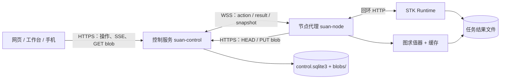

# 控制服务（hub）：图谱计算、结果 blob 与监控事件

里程碑 1 中，控制服务 `suan-control` 是自托管的 hub：客户端（网页／手机 PWA、Blender 工作台）向它
提交操作，执行节点代理 `suan-node` 主动连入并在数据所在的机器上执行。M1 在原有任务操作之外增加三类
操作 `graph.evaluate`、`graph.meta`、`task.events`，一个内容寻址的 blob 存储，以及节点目录和预设两个
只读路由。桌面程序（WP11）又增加了桌面配置（`profile: "desktop"`）的自动执行额度、客户端上传与
`workspace.import`、hub 端的 `graph.cancel`，以及不写操作记录的读路径（见“桌面程序的增量”）。所有改动都是
增量的：原有路由、操作与消息类型不变。

控制服务、节点代理与 Runtime 只在 Linux 运行，Windows / macOS 只作客户端（见
[runtime 使用指南](runtime.md)）。节点图本身的用法见 [可视化指南](visualization.md)，配对、模板与
工作台见 [Blender 工作台指南](../blender/README.md)。



数据留在节点：图在节点代理中求值，节点只把结果文档和 blob（渲染数据包缓冲区、PNG、二维图、较大的表格）
上传到 hub。hub 不读取任务文件，也不执行节点实现；它只用不依赖 NumPy 的校验器检查图。

## 启动

```bash
suan-control init --state-dir /path/control
suan-control serve --state-dir /path/control --web-dir web/dist \
  [--host 127.0.0.1] [--port 8790] [--blob-max-mib 512] [--desktop-auto-mib 256]
suan-control pair --state-dir /path/control --role client [--profile desktop]
suan-node run --state-dir /path/node [--graph-workers 1]
```

- `web/dist` 由 `(cd web && npm ci && npm run build)` 生成，只用工作台时可省略 `--web-dir`。
- `--host` 默认 `127.0.0.1`，`--port` 默认 8790。远程客户端经 HTTPS 入口（反向代理加认证）或
  SSH 隧道访问；不要把 `--host` 改为局域网或公网地址来代替入口，绑定局域网地址并不等于隔离。
- `--blob-max-mib`（默认 512，范围 1–65536）是节点或客户端可上传的单个 blob 上限（客户端上传的每个文件
  也受它限制）；前置的反向代理对 `/api/v1/blobs/` 的请求体上限必须不小于它（见“反向代理”）。
- `--desktop-auto-mib`（范围 0–65536）是桌面配置客户端免复核运行图求值的预计传输上限。**默认 256 MiB，
  是可以修改的默认值**：不给参数时读取 `control.json` 中的 `"desktop_auto_mib"`，没有时取 256；设为 0 即关闭
  桌面自动执行。见“桌面配置的自动执行”。
- `suan-control pair --role client --profile desktop` 签发桌面配置的配对码。桌面配置只能由所有者在签发配对码
  时授予，设备不能自行声明；其他客户端（网页、工作台）照旧用不带 `--profile` 的配对码。
- `--graph-workers`（默认 1，范围 1–2）是节点上同时进行的图求值数，其他操作不等待图求值。
- 求值在节点代理中进行，其 Python 环境需要 `.[control,visualization,science]`（NumPy、VTK、h5py、
  Matplotlib）；离屏 PNG 另需 EGL／OSMesa 或 `STK_RENDER_PYTHON`（见
  [可视化指南](visualization.md#渲染数据包与显示端)）。控制服务校验图时不导入 NumPy 或 VTK。

## 功能探测

| 位置 | 字段 | M1 取值 |
|---|---|---|
| 控制服务 `GET /api/v1/health` | `features` | `["blobs", "graph", "task.events"]`；WP11 另加 `desktop.profile`、`graph.cancel`、`node.read`、`uploads`、`workspace.import` |
| 节点快照（设备列表中的 `snapshot`） | `features` | `["graph.evaluate", "graph.meta", "task.events"]`；WP11 另加 `graph.cancel`、`read`、`workspace.files`、`workspace.import` |
| Runtime `GET /v1/health` | `features` | `["events"]` |

节点代理每次连接前读取控制服务的 `features`：控制服务没有 `blobs` 时，`graph.evaluate` 以
“The control hub does not accept result blobs; upgrade the STK control service” 失败。M1 没有新增
WebSocket 消息类型（旧版控制服务收到未知类型会关闭连接），新结果都经操作结果与 blob 传递。节点的
Runtime 没有 `events` 功能时，`task.events` 报错并提示升级节点的 Runtime。客户端应先查看节点快照的
`features` 再提交新操作。

## 路由

M1 新增的路由（均需 `Authorization: Bearer …`）：

| 方法与路径 | 身份 | 用途 |
|---|---|---|
| `PUT /api/v1/blobs/{sha256}` | 节点 | 上传 blob；新建返回 201，已存在返回 200，哈希不符或名称非法 400，超过上限 413 |
| `HEAD /api/v1/blobs/{sha256}` | 节点或客户端 | 是否存在及大小（200／404）；节点上传前先检查 |
| `GET /api/v1/blobs/{sha256}` | 客户端 | 原始字节 |
| `GET /api/v1/graphs/catalog` | 客户端 | 节点目录 `stk.catalog/1` |
| `GET /api/v1/graphs/presets` | 客户端 | 预设列表 `[{id, name, description, graph, bindings: [{name, description}], parameters}]` |

WP11 新增的路由（均需 `Authorization: Bearer …`；无凭据 401，凭据无效或已吊销 401，身份不符 403）：

| 方法与路径 | 身份 | 用途 |
|---|---|---|
| `GET /api/v1/policy` | 客户端 | 本设备的配置与额度：`device_profile`、`desktop_auto`、`desktop_auto_bytes`、`graph_auto_seconds`、`upload_max_bytes`、`upload_chunk_bytes`、`import_max_files`、`read_kinds` |
| `POST /api/v1/uploads` `{sha256, size}` | 客户端 | 开始（或续传）一次上传，返回 `{id, sha256, size, offset, completed}`；hub 已有该 blob 时直接 `completed` |
| `GET /api/v1/uploads/{id}` | 同一客户端 | 当前偏移（续传时从这里继续） |
| `PUT /api/v1/uploads/{id}?offset=N` | 同一客户端 | 在恰好 `offset` 处追加一块（≤ 8 MiB）；偏移不符 409，超出声明大小或块上限 413 |
| `POST /api/v1/uploads/{id}/finish` | 同一客户端 | 校验大小与 sha256 后移入 blob 存储；不完整 409，哈希不符 400（已收字节丢弃） |
| `DELETE /api/v1/uploads/{id}` | 同一客户端 | 放弃上传 |
| `GET /api/v1/actions/{id}/blobs/{sha256}` | 节点 | 节点取 `workspace.import` 的 blob：只限发给本节点、处于 `queued` 的导入操作所列的 blob，其余一律 404 |
| `POST /api/v1/nodes/{node_id}/read` `{kind, payload}` | 客户端 | 读路径：节点在线直接回答，不写操作记录（见下） |

上传会话属于开始它的设备，其他设备访问一律 404。会话名由设备、sha256 与大小决定，客户端丢失本地状态后重新
开始同一会话即可从 hub 已有的字节继续。每台设备最多 16 个未完成的会话（否则 429），7 天未动的会话自动删除。

目录和预设取自控制服务安装的 STK 包，进程内只构建一次，升级后需重启控制服务。原有的
`POST/GET /api/v1/actions`、`GET /api/v1/actions/{id}`、`POST /api/v1/actions/{id}/review`、
SSE `GET /api/v1/events` 与节点 WebSocket `/api/v1/nodes/connect` 不变。

## blob 存储

- blob 是以 sha256（64 位小写十六进制）命名的不可变字节，存放在
  `<状态目录>/blobs/<前两位>/<sha256>`。上传先流式写入 `blobs/.incoming`，哈希与名称一致后才原子
  改名到位，读者看不到不完整或不匹配的内容；重复上传无害。
- `GET` 以 `application/octet-stream` 返回，带 `Cache-Control: private, max-age=31536000, immutable`、
  `ETag`、`X-Content-Type-Options: nosniff` 与沙箱 CSP，支持 Range。媒体类型由引用它的结果给出。
- 节点代理先 `HEAD`，只 `PUT` hub 缺少的 blob；上传走节点主动发起的 HTTPS，不经 WebSocket。
- 操作结果的 JSON 超过 64 KiB 时移入 blob 存储（操作行中只留引用）。`GET /api/v1/actions` 列出最新的
  200 个操作以及待复核的操作，不含结果，也不解码结果；`GET /api/v1/actions/{id}` 返回完整结果。
  这些由控制服务自己写入的结果不受 `--blob-max-mib` 限制。

## 操作

### `graph.evaluate`

```json
{"kind": "graph.evaluate", "node_id": "<节点 ID>", "id": "<32 位十六进制>",
 "payload": {"preset": "muferro-domains",
             "bindings": {"run": {"task_id": "<任务 ID>"}},
             "parameters": {"step": 200},
             "outputs": ["view", "fractions", "energy"],
             "profile": "web"}}
```

- `payload` 只接受 `graph`（`stk.graph/1` 对象）与 `preset` 二者之一，以及 `bindings`、`parameters`、
  `outputs`、`profile`（`phone`／`web`／`desktop`，默认 `web`）、`budget`（`max_seconds`、
  `max_memory_mb`、`max_output_bytes`）、`plot_format`（`svg`／`png`，默认 `svg`）、`accept`。
  请求 JSON 最多 512 KiB。绑定只能是任务 ID，请求中不能出现文件路径；节点只能读已结束任务的结果文件。
- 控制服务在入队前校验图（不导入 NumPy）：图无效、输出名不存在、路径参数不是绑定内的相对路径时直接
  返回 400。
- 节点上的默认预算：`max_seconds` 300；`max_output_bytes` 为交付字节（blob 加结果文档）的上限，
  默认按 profile 取 32 MiB／128 MiB／2 GiB。
- 结果为 `stk.graph-result/1`：`outputs` 按输出名给出，payload 为 `{"type": "payload", "manifest": …}`，
  缓冲区以 `"uri": "sha256:<hex>"` 引用 blob；图像为 `{"type": "image", "blob", "media_type", "width",
  "height", "size"}`；二维图为 `{"type": "plot", "blob", "media_type", "data_blob", "size"}`；
  表格带有按列顺序排列的 `column_names`，不超过 256 KiB 时内联 `columns`／`units`／`attrs`，否则为 `{"type": "table", "blob",
  "media_type": "application/json", "size", "rows"}`；导出文件为 `{"type": "file", "name",
  "media_type", "blob", "size"}`。另有 `graph_sha256`、`graph_hash`、`parameters`（含步号
  `choices`）、`timings`、`cache`、`warnings`、`keys`、`evaluated`、`profile`，部分输出失败时有
  `errors`。完整示例见 [stk-graph-v1 §9](specs/stk-graph-v1.md)。控制服务按原有键顺序保存结果。
- 节点上的结果 JSON 超过 12 MiB 时该操作失败。

### `graph.meta` 与 `task.events`

- `graph.meta {include?: ["catalog", "presets", "features", "render"]}`（默认前三项）返回节点的
  `stk.graph-meta/1`：节点目录与插件加载错误、预设（不含图）、`features`（`agent`、`graph_workers`、
  `hub`），以及 `render`（节点上离屏渲染探测的结果，首次请求时探测）。
- `task.events {task_id, offset?, limit?}`（`limit` 1 … 1 MiB）返回 Runtime `GET /v1/tasks/{id}/events`
  的结构 `{events, offset, next_offset, size, terminal, invalid}`，见
  [runtime 使用指南](runtime.md#监控事件)。
- 这两个操作是只读的，从不进入复核，节点也不缓存其结果（重复执行无害）。

### `workspace.import`、`workspace.files` 与 `graph.cancel`（WP11）

- `workspace.import {workspace_id, files: [{path, sha256, size}]}`：把客户端已上传到 hub 的 blob 写入节点
  Runtime 工作区的输入文件。控制服务在入队前检查：每个 blob 已在存储中且大小一致；路径是规范化的相对路径
  （拒绝 `..`、绝对路径、盘符与冒号、反斜杠、`//`、`.` 段、结尾的 `/` 和控制字符，单段 ≤ 255 字节、全长
  ≤ 1024 字节）；无重复，且没有“文件又是另一文件的目录”；最多 10000 个文件。节点代理再次做同样的检查，按序号
  （而不是客户端给的路径）暂存每个 blob，**在节点上重新计算 sha256**，不符即失败且不写入任何后续文件，然后经
  Runtime 的可续传上传写入（Runtime 再校验一次并保证路径不出工作区）。结果为 `{workspace_id, files: [{path,
  size, sha256}]}`。导入会写入工作区（同名输入文件会被覆盖），因此**总是进入复核**，无论谁提交。
- `workspace.files {workspace_id}`：工作区输入文件列表（只读，从不复核）。`file.read` 现在也接受
  `workspace_id`（与 `task_id` 二选一），用于下载工作区输入文件。
- `graph.cancel {action_id}`：取消同一节点上的 `graph.evaluate` 操作。目标仍在复核时，控制服务直接把它标为
  `failed`（错误以 `cancelled:` 开头），取消操作立即 `succeeded`，结果 `{cancelled: true, state: "failed"}`；
  目标已结束时取消操作立即 `succeeded`，结果 `{cancelled: false, state}`；目标处于 `queued`（可能正在运行）时，
  取消操作派发给节点：节点对正在求值的图触发求值器的取消令牌（`suan.graph.registry.CancelToken`，求值器在
  节点之间和 Runtime 下载的分块之间检查），对尚未开始的求值写下标记，开始时立即取消（节点代理重启后仍有效）。
  被取消的求值以 `failed` 结束，错误以 `cancelled:` 开头。取消只能由客户端发起（不接受模型提议）。

### 自动执行额度与复核

`graph.evaluate` 在额度内自动执行，超出任一项时进入复核，复核说明为“图谱计算超过自动执行额度（…），
请检查图谱与预算后批准执行。”：

| 项目 | 自动执行的范围 |
|---|---|
| `budget.max_seconds` | 不设置，或不超过 300 秒（显式设为 null 即复核） |
| `budget.max_output_bytes` | 不设置，或不超过 128 MiB（显式设为 null 即复核） |
| 请求 `profile` | `phone` 或 `web`（`desktop` 复核） |
| `stk.output.payload@1` 的 `profile` | `auto`、`phone` 或 `web` |
| `stk.output.payload@1` 的 `budget` | 三角形 ≤ 2 000 000、实例 ≤ 500 000、点 ≤ 2 000 000、体素 ≤ 256³、字节 ≤ 128 MiB |
| `stk.output.image@1` 的像素 | 宽 × 高 × 放大倍数² ≤ 7680 × 4320（未设尺寸时取场景视口，默认 1600 × 1200） |
| 节点类型 | 全部为控制服务已安装的类型；只装在节点上的插件节点无法在 hub 检查参数，进入复核 |

网页在等待复核时显示提示，批准后自动显示结果。任务提交（`task.submit`）的复核规则不变。

### 桌面配置的自动执行（WP11）

所有者用 `--profile desktop` 配对的客户端设备（桌面程序）在额度内可以不经逐项复核运行图求值与只读数据操作。
额度的核心是**预计传输字节数**：请求的 `budget.max_output_bytes`，未设置时为该结果配置的默认交付上限（phone
32 MiB、web 128 MiB、desktop 2 GiB）。节点在交付时强制执行这一上限，所以它就是本次求值最多传出的字节数。
上限默认 256 MiB，所有者可用 `--desktop-auto-mib` 或 `control.json` 的 `desktop_auto_mib` 修改（0 为关闭）。

| 请求 | 所有者令牌、普通客户端、模型提议 | 桌面配置客户端 |
|---|---|---|
| `graph.evaluate`，`phone`/`web`，在上表额度内 | 自动 | 自动（预计传输 ≤ 上限时） |
| `graph.evaluate`，结果配置 `desktop` 或桌面级渲染数据包 | 复核 | 自动，须预计传输 ≤ 上限（即设置 `budget.max_output_bytes` ≤ 上限） |
| `graph.evaluate`，预计传输超过上限（含未设置上限的 `desktop` 请求、`max_output_bytes: null`） | 复核（输出大小） | 复核（“预计传输超过桌面自动执行上限”） |
| `stk.output.payload@1` 的 `budget` | 不超过 web 配置 | 不超过 desktop 配置的计数（三角形 2 千万、实例 5 百万、点 2 千万、体素 1024³），`bytes` ≤ 上限 |
| `budget.max_seconds` > 300、图像像素超限、hub 未安装的节点类型 | 复核 | 复核（不变） |
| `task.logs`、`task.events`、`task.artifacts`、`file.read`、`workspace.files`、`view.build`、`view.probe`、`graph.meta`、`graph.cancel` | 自动 | 自动 |
| `workspace.create`、`task.cancel`、精确模板的 `task.submit` | 自动（不变） | 自动（不变） |
| 其他 `task.submit`（新命令、改动的模板、超出资源额度） | 复核 | 复核 |
| `workspace.import`（写入工作区） | 复核 | 复核 |

吊销的设备（包括桌面配置设备）的凭据立即失效，所有路由都返回 401；自动执行只在创建操作时按当时的设备配置
判断。所有者令牌不是桌面配置设备，照普通规则判断。

### 读路径（WP11）

`POST /api/v1/nodes/{node_id}/read {kind, payload}` 让客户端直接读取节点上的只读数据，`kind` 为
`task.logs`、`task.events`、`task.artifacts`、`file.read`、`workspace.files`，负载规则与同名操作相同。控制服务经
已打开的节点 WebSocket 发送 `{"type": "read", id, kind, payload}`，节点代理在读通道（最多同时 4 个）执行后回复
`{"type": "read_result", id, result | error}`，控制服务再把 `{result}` 返回给客户端。**不写操作记录、不产生
`actions.changed` 事件**，所以桌面程序每 2 秒轮询日志、事件和下载分块时，操作表和事件流不再随之增长。

- 节点离线时 503（读取不排队：离线期间的轮询不会在节点上线后一起执行），30 秒无回复 504，每个节点最多 16 个
  未完成的读取（429），节点报告的错误 422（`detail` 为节点的错误文本）。
- 节点快照的 `features` 没有 `read`（旧版节点代理）时 501；旧版控制服务没有这个路由（404/405）。两种情况下
  客户端改用原有的读操作（每次一个操作记录），桌面桥会自动回退，一分钟后再试读路径。
- 这是 hub → 节点的新 WebSocket 消息类型，但只发给在快照里声明了 `read` 的节点代理；节点代理只在收到 `read`
  时才发送 `read_result`，旧版控制服务不会收到它。

## 节点代理

- 三条执行通道：快速通道最多同时 4 个操作（Runtime 调用、视图、`task.events`、`graph.meta`、
  `graph.cancel`、`workspace.import`），图通道同时 `--graph-workers` 个 `graph.evaluate`，读通道最多同时 4 个
  读路径请求。重连后 hub 再次派发仍在执行的操作时不会重复启动，结果从
  完成时仍连着的连接发回。
- 缓存位于节点状态目录：`cache/<操作 ID>.json`（除 `task.events`、`graph.meta` 外的操作结果）、
  `cache/graph/cache`（图结果，磁盘层默认 20 GiB，按最近使用清理）、`cache/graph/downloads`（从
  Runtime 下载的任务文件，单个文件上限 1 GiB）、`cache/imports/<操作 ID>`（`workspace.import` 的暂存文件，
  操作结束即删除）、`cache/cancelled/<操作 ID>`（尚未开始就被取消的图求值的标记）。未设置 `MPLCONFIGDIR`
  时指向 `cache/graph/matplotlib`。
- 连接控制服务时不跟随重定向，也不使用环境中的 HTTP 代理；`--control-url` 必须是不带路径的最终源，
  远程地址必须是 HTTPS（`http://` 只允许 `localhost`、`127.0.0.1`、`::1`）。因此控制服务需部署在
  独立主机名的根路径下，不能挂在子路径。

## 反向代理

在控制服务前放反向代理（例如 nginx 或 Nginx Proxy Manager）时：

- **请求体上限**：`/api/v1/blobs/` 的上限必须不小于 `--blob-max-mib`。nginx 的 `client_max_body_size`
  默认只有 1 MiB，超过时节点上传收到 413，`graph.evaluate` 失败。经 CDN 或隧道服务时还受其请求体上限
  约束，此时把 `--blob-max-mib` 设为不超过该上限。客户端上传按块发送，`/api/v1/uploads/` 的上限不小于
  8 MiB 即可（桌面桥每块 1 MiB）。
- **SSE**：`/api/v1/events` 不能缓冲。控制服务已发送 `X-Accel-Buffering: no` 和
  `Cache-Control: no-store`，其他代理需显式关闭响应缓冲；空闲时每 2 秒发送一次心跳注释。
- **WebSocket**：`/api/v1/nodes/connect` 需要转发 `Upgrade`／`Connection` 头（Nginx Proxy Manager 中开启
  WebSocket 支持）且不缓冲。节点每 3 秒发送一次快照，控制服务 30 秒收不到消息即断开；单条消息上限
  16 MiB。这个端点拒绝带 `Origin` 头的请求（浏览器不能连接），代理不要自行添加该头。
- 代理使用 HTTPS，控制服务仍只监听回环地址；数据库与管理端点不对外暴露。

nginx 片段示例（按实际证书、主机名与上游调整）：

```nginx
location /api/v1/blobs/ {
    client_max_body_size 512m;          # >= --blob-max-mib
    proxy_request_buffering off;
    proxy_pass http://127.0.0.1:8790;
}
location /api/v1/uploads/ {
    client_max_body_size 8m;            # >= one upload chunk
    proxy_pass http://127.0.0.1:8790;
}
location /api/v1/events {
    proxy_buffering off;
    proxy_pass http://127.0.0.1:8790;
}
location /api/v1/nodes/connect {
    proxy_http_version 1.1;
    proxy_set_header Upgrade $http_upgrade;
    proxy_set_header Connection "upgrade";
    proxy_buffering off;
    proxy_pass http://127.0.0.1:8790;
}
```

## 保留与清理

M1 没有保留策略或垃圾回收：hub 的 blob（包括客户端上传的文件）与操作记录、节点的操作结果缓存和下载缓存
都会一直增长；只有节点的图结果磁盘缓存按大小清理，未完成的客户端上传会话 7 天后删除。删除仍被旧结果引用的 blob 后，这些结果中的图像或数据包无法再显示；移入
blob 的操作结果缺失时，该操作的 `result` 为 null。按任务的保留、备份与多节点持久作业属于后续的 hub v2。
