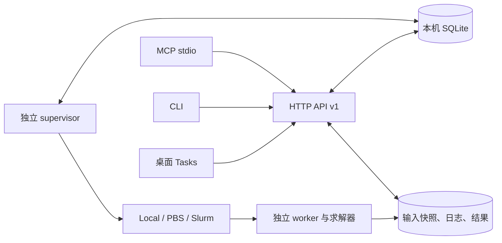

# STK 本地与服务器 runtime

STK 0.1.0a1 提供个人使用的持久任务服务。桌面 Tasks、CLI 和 MCP 共用
`RuntimeClient`。本机进程、OpenPBS/PBS Professional、Slurm 使用同一任务合同。
服务器仅监听回环地址；远程连接通过 SSH 端口转发。



远程客户端通过 SSH 转发访问图中的 API；API、supervisor 和 worker 分别运行，
无需让桌面进程一直保持打开。当前实现的验收记录见 [runtime 验收记录](runtime-validation.md)。

## 安装与启动

在仓库根目录安装；Python 要求为 3.10–3.14。服务器、桌面和计算节点可采用
不同环境；求解器、MPI 和集群命令由目标机器提供。

```bash
# 服务器：不安装 Qt、VTK、AI 模型
python -m pip install '.[server,science]'
# 桌面／远程客户端
python -m pip install '.[desktop]'
# 可选 AI 对话、MCP
python -m pip install '.[ai,mcp]'

suan server --state-dir /local-disk/stk-state init \
  --workspace-root /shared/user/stk-workspaces --concurrency 1
suan server --state-dir /local-disk/stk-state start
suan server --state-dir /local-disk/stk-state status
suan server --state-dir /local-disk/stk-state doctor --science
suan-gui
```

`state-dir` 中的 SQLite 必须放在本机磁盘；不要放在 NFS 等网络文件系统。
`workspace-root` 在集群部署时必须是登录／服务节点和计算节点均可访问的共享目录。
配置文件首次创建后不会被 `init` 覆盖。需要改变端口、Python 路径或并发数时，
先停止 API 和 supervisor，再编辑 `config.json` 并重新启动。

`config.json` 中的 `python` 是实际运行 worker 的解释器路径。每个计算节点必须
能运行它并导入 `psutil`；科学示例另需 `science` 依赖。worker.py 会被复制到任务
目录，因此任意外部程序任务无需在计算节点导入 STK。调用 `smesh/sviz` 的任务
则需要计算环境已安装相应 STK 包。

API 与 supervisor 是独立后台进程，`start` 返回后仍继续运行。默认状态目录为
`~/.stk/runtime`，也可通过 `STK_STATE_DIR` 指定。

```bash
# 仅停止 API；后台计算及调度继续
suan server --state-dir /local-disk/stk-state stop
# 同时停止调度／查询；已启动的独立 worker 继续
suan server --state-dir /local-disk/stk-state stop --supervisor
```

Linux 长期部署可使用 `deploy/systemd/` 的用户服务模板，管理员须允许该用户服务
在退出 SSH 后持续运行。集群节点必须允许常驻管理服务，重型计算应通过队列执行。

## 部署诊断

在服务所在机器运行诊断，按实际后端选择 `local`、`pbs` 或 `slurm`：

```bash
suan server --state-dir /local-disk/stk-state doctor --backend slurm --science
# 保存供脚本读取的诊断报告；失败时仍输出完整 JSON，退出码为 1
suan server --state-dir /local-disk/stk-state doctor --backend slurm --science --json > doctor.json
```

诊断检查配置字段、状态与工作目录的临时写入／原子替换／文件锁、SQLite 文件系统
类型与 quick_check、配置中的 worker Python 及 psutil、API 认证和 supervisor。
`--science` 额外在该 Python 中导入 STK 科学模块、NumPy 和 Matplotlib；检查从
`workspace-root` 启动，能发现仅在源码目录中可导入的安装问题。
`--timeout` 设置每次 Python、数据库和 API 检查的等待秒数，默认 5 秒。
诊断探针使用临时子目录并自动清理，不初始化配置、启动服务或提交计算任务。

JSON 包含 `schema_version`、`checked_at`、`scope`、`ok` 和逐项 `checks`；
每项状态为 `pass`、`warn` 或 `fail`。有 `fail` 时退出码为 1，其余为 0。
`ok=true` 仅表示本次检查没有失败项。PBS／Slurm 检查当前主机 PATH 中的提交、
查询和取消命令；计算节点的解释器、共享目录可见性及实际队列／历史查询能力
仍须通过下面的站点案例验证。报告不包含连接令牌。

## 远程连接

```bash
# 使用 SSH 配置中的 Host 别名及现有认证；隧道断开不取消任务
ssh -N -L 9876:127.0.0.1:8765 my-compute-server
```

通过自己的安全终端读取服务器 `config.json` 中的 `token`。在本机运行：

```bash
suan connect add cluster --url http://127.0.0.1:9876
# 按隐藏输入提示填写服务器令牌
suan connect check cluster
suan workspaces --profile cluster create my-project
suan jobs --profile cluster list
```

桌面 Tasks 页提供相同的连接保存、工作区新建、文件上传、任务提交、取消和结果查看。
点击“本机 → 连接”会初始化并启动本机 runtime。服务器连接使用先前建立的 SSH 隧道。
连接令牌保存在用户私有的 `~/.stk/connections.json`；不写入共享 `.suan` 工作区。
可通过 `STK_PROFILES_FILE` 指定连接配置文件位置。

`suan connect check cluster --json` 可在客户端检查已保存连接的 API 版本、认证和
supervisor 状态。它沿用现有 SSH 隧道，报告范围为 `connection`；若需检查服务器
的磁盘和 worker 环境，在服务器上运行 `suan server doctor`。

桌面配置可通过 `STK_CONFIG_DIR` 移至其他目录。Linux 桌面需可用的 Qt 系统库
（包括 EGL）；打开三维结果还需 OpenGL 驱动。服务器生成 PNG 无需这些图形库。

## 输入与任务

```bash
suan workspaces --profile cluster upload WORKSPACE_ID ./inputs
suan jobs --profile cluster submit --workspace WORKSPACE_ID \
  --backend slurm --key my-run-001 -- /path/to/mupro input.in
suan jobs --profile cluster show TASK_ID
suan jobs --profile cluster logs TASK_ID --follow
suan jobs --profile cluster cancel TASK_ID
suan jobs --profile cluster artifacts TASK_ID
suan jobs --profile cluster download TASK_ID result.vtk ./result.vtk
```

复杂任务使用 `--spec task.json`：

```json
{
  "workspace_id": "替换为工作区 ID",
  "argv": ["{python}", "simulate.py"],
  "backend": "pbs",
  "name": "parameter-001",
  "inputs": ["simulate.py", "input.json"],
  "outputs": ["field.vtk", "preview.png"],
  "env": {"OMP_NUM_THREADS": "4"},
  "resources": {"cpus": 4, "nodes": 1, "memory_mb": 4096,
                "walltime_seconds": 3600, "queue": "workq"}
}
```

`argv` 是参数列表，`{python}` 表示配置中的 Python。需要 shell、module load 或 MPI
启动逻辑时，上传显式脚本并以 `[/bin/bash, run.sh]` 等参数列表执行。不会自动添加
mpirun/srun，也不会自动分配本机 GPU。`cpus` 是每节点 CPU；`memory_mb` 为每节点
请求，`nodes` 为节点数。PBS 用 `select` 资源语法，Torque 尚未列入兼容基线。
`gpus` 同样按每节点计数。Slurm 显式使用每节点一个任务槽，并将 `cpus` 映射为
该槽的 CPU 数，GPU 映射为 `--gpus-per-node`；MPI 进程布局仍由上传的启动脚本指定。
参数语义参照 [Slurm sbatch 手册](https://slurm.schedmd.com/sbatch.html)。
本机采用独立进程、可配置并发数、时间限制和进程树内存监测；这些是运行管理，
不是不可信程序的安全沙箱。

任务提交先登记，再复制选定输入；省略 `inputs` 时复制全部已完成上传的输入。
结果在每任务独立的 `work` 目录中生成。`outputs` 列出必须存在的结果；程序返回 0
但缺少这些文件时任务仍失败。未声明的新增或修改文件也会出现在结果列表中。
输入 manifest、启动参数和运行环境摘要保留在任务目录中。

上传使用 SHA-256、分块和原子提交。未完成的上传不能进入快照。重新执行相同上传
可续传；API 也提供取消上传接口。下载通过 `.part` 和 `.part.json` 续传并校验。
任务运行期间请勿从服务器端直接修改其私有目录。

## 生命周期与恢复

- 状态：`preparing`、`queued`、`submitting`、`running`、`succeeded`、`failed`、
  `cancelled`、`unknown`。`cancel_requested` 表示取消意图，不伪装成已退出。
- CLI 提交前将幂等键打印到 stderr；响应丢失后使用同一个 `--key` 重试。
  同一键对应不同 TaskSpec 会被拒绝。桌面提供“重试上次提交”，保留同一键。
- 发生调度提交超时或无法识别返回值时，保存 `unknown`，通过任务名和调度历史核对；
  不自动再次提交。历史不可用时保持待核实，管理员可依据原生队列信息排查。
- 单机通过 PID 和创建时间识别原 worker，避免将复用的 PID 当作原任务。
  worker 独立记录完成状态，supervisor 停止期间完成的任务在重启后也能核对。
- API 重启不影响 worker；主机重启或 worker 意外退出后会报告失败／待核实。
  求解器 checkpoint 续算需要显式提交相应启动命令。
- 前台日志使用字节偏移与 base64 传输，Qt/CLI 采用增量 UTF-8 解码。
  服务器保留完整日志；桌面仅保留最近 10,000 个文本块。
- 本版是个人可信程序环境。用户程序具有运行账户的权限；不提供多租户隔离。

## 可视化与科学工具

```bash
suan smesh run --input input.toml --output generated-directory
suan smesh info --file field.dat
suan smesh run --input field.dat --output field.vtk
suan sviz plot-scalar --input field.dat --output preview.png --axis z --index 2
suan sviz plot-vector --input vector.dat --output vectors.png --axis z
```

科学数据数组采用 `(x,y,z,component)`。支持 DAT 的三维网格及现有结构生成器的
4/5 维索引格式、NPY、零原点／单位间距的 ASCII STRUCTURED_POINTS VTK。
不支持的网格类型／坐标尺度会明确报错，不会丢弃坐标信息后继续绘图。
VTK 导出支持单标量或三分量矢量。PNG 使用 FigureCanvasAgg，不创建 Qt 或 OpenGL 窗口。
桌面可直接预览 PNG，下载 VTK 后在已有 VTK 页中交互。

旧桌面代码分析／本地绘图入口保留用于兼容；需要持久后台计算时使用 Tasks 页。
旧 `sjob schedule/create/execute` 继续可用。`Command` 仍按历史约定作为 shell 脚本执行，
`execute --command`、起止范围和失败退出码已修正。新的 `sjob.core` 函数显式接收目录。

## MCP

安装 `.[mcp]` 后以 `python -m suan.mcp` 启动。通过 `STK_STATE_DIR` 或
`STK_RUNTIME_URL` / `STK_RUNTIME_TOKEN` 连接同一个 runtime。工具包括工作区创建、
输入上传、`submit_task`、状态、日志、取消、结果下载。

MCP 长任务返回任务记录，不同步等待计算完成。旧 `run_stk_command` 迁移为持久任务：
必须提供 `workspace_id` 与 `idempotency_key`，返回值由文本改为任务记录。
旧自动发现的 CLI 工具和 `run_sjob/run_smesh/run_sviz` 名称由此统一入口替代；
更新客户端提示词／工具配置，不要假定旧调用签名仍兼容。

## HTTP API v1 与代码入口

所有路由都以 `/v1` 开头，要求 `Authorization: Bearer TOKEN`。请求／响应为
JSON；文件分块使用二进制响应。日志响应含 base64 `data` 与 `next_offset`。

| 方法与路径（省略 `/v1`） | 用途 |
|---|---|
| `GET /health` | API 版本、supervisor 存活状态 |
| `GET/POST /workspaces` | 工作区列表／创建 |
| `GET /workspaces/{id}/files` | 输入清单与校验值 |
| `POST /workspaces/{id}/uploads` | 以 path、size、sha256 建立／恢复上传 |
| `GET/PUT/DELETE /workspaces/{id}/uploads/{upload_id}` | 上传状态／按 offset 写入／放弃 |
| `POST /workspaces/{id}/uploads/{upload_id}/finish` | 校验后原子提交 |
| `GET /workspaces/{id}/file?path=…&offset=…&limit=…` | 读取输入分块 |
| `GET/POST /tasks` | 列表／用 spec 与 idempotency_key 提交，返回 202 |
| `GET /tasks/{id}` | 状态与输入快照清单 |
| `POST /tasks/{id}/cancel` | 持久化取消意图 |
| `GET /tasks/{id}/logs?stream=stdout&offset=…` | 增量日志 |
| `GET /tasks/{id}/artifacts` | 完成任务的结果清单 |
| `GET /tasks/{id}/file?path=…&offset=…&limit=…` | 结果分块下载 |

上传／下载分块上限为 1 MiB。非法参数返回 400，认证失败 401，资源缺失 404，
请求体过大 413；服务端异常返回 500。202 仅表示登记成功。

模块关系：`models` 定义合同，`store/service` 管理持久记录与文件，`server` 提供 API，
`supervisor` 调度与恢复，`backends` 适配执行方式，独立 `worker.py` 记录实际退出状态。
`client` 被 `runtime/cli.py`、`gui/Tab/runtime_tab.py` 和 `mcp/server.py` 共用。
新增科学能力可作为 `TaskSpec.argv` 中的程序接入，无需依赖 GUI 或修改传输协议。

结果首次登记后保留 SHA-256 manifest，反复查看任务不会重新扫描大结果文件。
结果目录视为不可变；外部修改会在客户端下载校验时被发现。

## 验收与限制

```bash
python -m pip install '.[science,test]'
python -m pytest -m 'not desktop'
# 安装 desktop/mcp/test 后检查桌面与 MCP
QT_QPA_PLATFORM=offscreen python -m pytest tests/test_desktop.py tests/test_mcp.py
python examples/runtime/run_demo.py --state-dir /local-disk/stk-state --output /tmp/stk-results
# 对真实集群重复同一案例；配置环境和队列后运行
python examples/runtime/run_demo.py --profile cluster --backend pbs --queue workq --output /tmp/stk-pbs
python examples/runtime/run_demo.py --profile cluster --backend slurm --queue compute --output /tmp/stk-slurm
```

示例是确定性的输入输出验收场 `amplitude*(x+2y+3z)`，不是物理求解器。
运行示例的客户端和计算环境均需安装 `science` 可选组件。验收器以绝对误差
`1e-12` 核对摘要及 DAT／VTK 的全部 `(8,6,4)` 网格值，并解码 PNG 检查图像格式。
每次运行在输出目录保存独立的 `acceptance-<run_id>.json`，同时记录：

- 案例源文件 SHA-256、客户端和计算环境版本、后端与资源选项、总耗时。
- 工作区、任务 ID、提交前持久保存的 TaskSpec／幂等键、输入和结果 SHA-256。
- 各任务状态、退出码、前 64 KiB 日志片段、场数据误差和 PNG 尺寸。

报告在提交前及关键步骤后原子写入。退出状态为 `succeeded`、`failed`、`timed_out`
或 `interrupted`；仅所有任务完成下载并通过校验时 `verified=true`。
失败或等待超时的退出码为 1，Ctrl+C 为 130。已提交的任务继续由 runtime 管理，
可用报告中的 ID 查询或显式取消；任务尚未返回 ID 时，保留的 `spec` 和
`idempotency_key` 可用于 `suan jobs submit --spec ... --key ...` 重试同一次提交。
重新运行整个示例会建立新工作区和新任务，已有报告保留。超时是客户端等待结果
的时限，默认每个任务 600 秒，不会转换成取消请求。

测试覆盖真实单机进程、API、重连、取消、
文件边界、幂等性及模拟的 PBS/Slurm 命令协议。协议模拟会执行实际 job.sh、worker 和
程序，但不代表已经通过真实集群验收。站点验收还需检查队列、MPI、module、共享目录、
调度历史保留、权限与内存／时间资源语义。未设置吞吐量或并行扩展性能承诺。
验收报告中的耗时用于复现记录，不作为扩展性能基准；通过此案例也不代表
MuPRO／MPI／module 环境或物理计算精度已经验收。

当前安装验收以 Python wheel／源码安装为准。已有 PyInstaller 配置保留；冻结桌面
二进制的 runtime 进程启动与解释器打包尚未列入已验证发布物。不要把 wheel 安装验证
视为 Windows/macOS/Linux 独立安装器验收。

交互式 Python 内核、远程实时三维渲染、Web/手机和团队权限留在后续版本。
