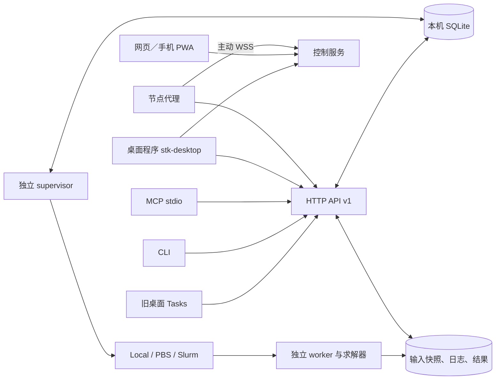

# STK 本地与服务器 runtime

STK 0.1.0a1 提供个人使用的持久任务服务。桌面程序 `stk-desktop`（直连或经节点代理）、旧桌面 Tasks、
CLI 和 MCP 共用 `RuntimeClient`。本机进程、OpenPBS/PBS Professional、Slurm 使用同一任务合同；
MuPRO 作业的排队也由 STK Runtime 负责，见 [MuPRO 指南](runtime-mupro.md)。
服务器仅支持 Linux，Windows / macOS 只作客户端。
服务器仅监听回环地址；远程连接通过 SSH 端口转发。



远程客户端通过 SSH 转发访问图中的 API；API、supervisor 和 worker 分别运行，
无需让桌面进程一直保持打开。当前实现的验收记录见 [runtime 验收记录](runtime-validation.md)。

## 安装与启动

在仓库根目录安装；Python 要求为 3.10–3.14。服务器与计算节点仅支持 Linux；
客户端可在 Windows、macOS 或 Linux 上运行。服务器、客户端和计算节点可采用
不同环境；求解器、MPI 和集群命令由目标机器提供。

```bash
# 服务器：不安装 Qt、VTK、AI 模型
python -m pip install '.[server,science]'
# 客户端：CLI 与桌面程序的 Python 桥，任意系统
python -m pip install .
# 旧 Qt 桌面客户端
python -m pip install '.[desktop]'
# 可选 AI 对话、MCP
python -m pip install '.[ai,mcp]'

suan server --state-dir /local-disk/stk-state init \
  --workspace-root /shared/user/stk-workspaces --concurrency 1
suan server --state-dir /local-disk/stk-state start
suan server --state-dir /local-disk/stk-state status
suan server --state-dir /local-disk/stk-state doctor --science
# 客户端：桌面程序 stk-desktop（见 docs/desktop.md）或旧 Qt 客户端 suan-gui
```

`state-dir` 中的 SQLite 必须放在本机磁盘；不要放在 NFS 等网络文件系统。
`workspace-root` 在集群部署时必须是登录／服务节点和计算节点均可访问的共享目录。
配置文件首次创建后不会被 `init` 覆盖。需要改变端口、Python 路径或并发数时，
先停止 API 和 supervisor，再编辑 `config.json` 并重新启动。
常驻 runtime 使用固定端口（默认 8765）。`suan-node` 按 `config.json` 中的端口连接，
SSH 隧道和已保存的连接也依赖固定端口；`--port 0` 每次启动都会换端口，不要用于
常驻 runtime 或 `suan-node`，API 停止后 `status` 的 `url` 为 `null`。多人共用的登录节点上
改用未被占用的非默认端口。
`init`、`start` 等服务器命令在 Windows / macOS 上会提示只支持 Linux 并退出，不创建任何文件。

`config.json` 中的 `python` 是实际运行 worker 的解释器路径。每个计算节点必须
能运行它并导入 `psutil`；科学示例另需 `science` 依赖。worker.py 会被复制到任务
目录，因此任意外部程序任务无需在计算节点导入 STK。调用 `smesh/sviz` 的任务
则需要计算环境已安装相应 STK 包。复制在提交时进行：升级 STK 后，已排队或已交给
调度器的任务仍运行提交时的 worker.py。

API 与 supervisor 是独立后台进程，`start` 返回后仍继续运行。默认状态目录为
`~/.stk/runtime`，也可通过 `STK_STATE_DIR` 指定。

```bash
# 仅停止 API；后台计算及调度继续
suan server --state-dir /local-disk/stk-state stop
# 同时停止调度／查询；已启动的独立 worker 继续
suan server --state-dir /local-disk/stk-state stop --supervisor
```

Linux 长期部署可使用 `deploy/systemd/` 的用户服务模板，管理员须允许该用户服务
在退出 SSH 后持续运行。集群节点必须允许常驻管理服务，重型计算应通过队列执行。
worker 继承 supervisor 的环境；MuPRO 所需变量放在 `stk-mupro.env.example` 所示的
EnvironmentFile 中，用 `suan server start` 启动时则取自执行该命令的 shell。`start` 不会
重启已在运行的 supervisor：修改这些变量后先 `suan server stop --supervisor`，再从导出了
新变量的 shell 执行 `suan server start`（systemd 部署则重启 supervisor 服务）。已在运行的
worker 保留原来的环境。

## 部署诊断

在服务所在机器运行诊断，按实际后端选择 `local`、`pbs` 或 `slurm`：

```bash
suan server --state-dir /local-disk/stk-state doctor --backend slurm --science
# 保存供脚本读取的诊断报告；失败时仍输出完整 JSON，退出码为 1
suan server --state-dir /local-disk/stk-state doctor --backend slurm --science --json > doctor.json
```

诊断检查配置字段、状态与工作目录的临时写入／原子替换／文件锁、SQLite 文件系统
类型与 quick_check、配置中的 worker Python 及 psutil、API 认证和 supervisor。
`--science` 额外在该 Python 中导入 STK 科学模块、NumPy 和 Matplotlib；检查从
`workspace-root` 启动，能发现仅在源码目录中可导入的安装问题。
`--timeout` 设置每次 Python、数据库和 API 检查的等待秒数，默认 5 秒。
诊断探针使用临时子目录并自动清理，不初始化配置、启动服务或提交计算任务。

JSON 包含 `schema_version`、`checked_at`、`scope`、`ok` 和逐项 `checks`；
每项状态为 `pass`、`warn` 或 `fail`。有 `fail` 时退出码为 1，其余为 0。
`ok=true` 仅表示本次检查没有失败项。PBS／Slurm 检查当前主机 PATH 中的提交、
查询和取消命令，并在 `scheduler_profile` 中报告生效的站点配置。Slurm 另做不提交
作业的探针：`sbatch --version`（`slurm_version`）、`sinfo` 查看分区是否 up、时限、
每节点 CPU 和内存（`slurm_partition`）、`sbatch --test-only` 校验分区／账户／QOS
（`slurm_submit_test`）、`sacct` 历史是否可用（`slurm_accounting`）。
`--partition`、`--account`、`--qos` 覆盖站点配置中的对应值；未给分区时
`slurm_partition` 为警告。站点配置含 `preamble` 时默认不执行；`--probe-preamble`
在本机用 `job_shell` 试运行一次（`scheduler_preamble`），计算节点环境可能不同。
计算节点的解释器、共享目录可见性仍须通过下面的站点案例验证。报告不包含连接令牌。

## 站点配置（scheduler）

集群可在 `config.json` 中加入可选的 `scheduler` 对象。它只由运维人员编辑，不能通过
TaskSpec 或 API 设置，也不影响幂等键。与改端口相同，先停止 API 和 supervisor，
编辑后重新启动。并行云风格的示例（路径与模块名以站点为准）：

```json
"scheduler": {
  "queue": "PARTITION",
  "job_shell": "/bin/bash",
  "preamble": ["source /public1/soft/modules/module.sh", "module load mpi/intel/VERSION"]
}
```

- `queue`、`account`：任务未写 `queue`／`account` 时使用的默认分区与账户。`qos`
  映射为 Slurm `--qos`，PBS 忽略。取值只含字母、数字和 `_ . @ / -`。
- `job_shell`：job.sh 首行 `#!` 之后的内容，即解释器绝对路径，默认 `/bin/sh`；preamble
  使用 `source` 或 module 时设为 `/bin/bash`。与 `#!` 行相同，可以带一个参数（如
  `/bin/bash -l`）：内核把解释器之后的全部内容作为一个参数传入，所以 `/usr/bin/env bash -l`
  在 Linux 上不可用，doctor 的 `--probe-preamble` 也按同样方式运行。PBS 可能忽略 `#!` 行，
  除非 qsub 带 `-S`，STK 目前不添加 `-S`。
- `preamble`：逐行原样写在 job.sh 的 `exec` worker 之前，每行不得含换行，也不得是
  `#SBATCH`／`#PBS` 指令：调度器把第一条命令之前的指令当作提交参数，会绕过下面对
  `submit_args` 的检查。站点示例作业头中的调度参数请写到 `submit_args`。
- `submit_args`：追加在 STK 生成的参数之后、job.sh 之前，必须是以 `-` 开头、至少
  两个字符的选项。不得设置 STK 自己使用或依赖的选项：`--job-name`、`--parsable`、
  `--chdir`、`--output`、`--error`、`--wrap`、`--array`、`--test-only`、`--wait`、
  `--export`、`--help`、`--usage`、`--version`、`--clusters`、`--quiet`（含其无歧义前缀，
  如 `--out=`、`--test`、`--cluster=`）、单独的 `--`，以及 `-J -D -o -e -a -W -N -I -h -V`。
  Slurm 另外不得使用 `-M`（`--clusters`：作业提交到其他集群，STK 查询和取消时找不到）和
  `-Q`（`--quiet`：不打印作业号）；PBS 不得使用 `-z`（不打印作业号），`-M`（邮件地址）
  可以使用。doctor 按 `--backend` 所选调度器检查，不带 `--backend` 时按两种调度器一起检查。
  也不要重复 STK 已生成的布局与资源参数（`--nodes`、`--ntasks`、`--cpus-per-task`、
  `--time`、`--mem`、`--partition`、PBS `-l` 等）：调度器以最后一次出现为准，会使实际
  分配与 worker 的线程设置和 `{ranks}` 不一致。组合短选项（如 `-vJname`）不会被拆开检查。

没有 `scheduler` 时 job.sh 与之前完全相同。未知键或非法值会让任务在调用 sbatch／qsub
之前失败，原因包含 `Invalid scheduler profile: …`；doctor 的 `config` 检查报告同一信息。
修改后在服务所在机器检查：

```bash
suan server --state-dir /local-disk/stk-state doctor --backend slurm \
  --partition PARTITION --probe-preamble
```

## 远程连接

```bash
# 使用 SSH 配置中的 Host 别名及现有认证；隧道断开不取消任务
ssh -N -L 9876:127.0.0.1:8765 my-compute-server
```

通过自己的安全终端读取服务器 `config.json` 中的 `token`。在本机运行：

```bash
suan connect add cluster --url http://127.0.0.1:9876
# 按隐藏输入提示填写服务器令牌
suan connect check cluster
suan workspaces --profile cluster create my-project
suan jobs --profile cluster list
```

桌面 Tasks 页提供相同的连接保存、工作区新建、文件上传、任务提交、取消和结果查看。
点击“本机 → 连接”只在 Linux 上初始化并启动本机 runtime；Windows / macOS 上会显示
只支持 Linux 的提示。服务器连接使用先前建立的 SSH 隧道。
连接令牌保存在用户私有的 `~/.stk/connections.json`；不写入共享 `.suan` 工作区。
可通过 `STK_PROFILES_FILE` 指定连接配置文件位置。

`suan connect check cluster --json` 可在客户端检查已保存连接的 API 版本、认证和
supervisor 状态。它沿用现有 SSH 隧道，报告范围为 `connection`；若需检查服务器
的磁盘和 worker 环境，在服务器上运行 `suan server doctor`。

Windows / macOS 只作客户端：按上面的方式建立 SSH 隧道并用 `suan connect add` 保存连接，
然后在 `suan jobs`、`suan workspaces`、`suan mupro` 中传 `--profile cluster`；也可设置
`STK_RUNTIME_URL` 与 `STK_RUNTIME_TOKEN`。在这些系统上运行 `suan server init/start` 会退出
并提示 `The STK server Runtime runs on Linux only. …`；`suan-control init/serve/pair` 与
`suan-node pair/run` 提示 `The STK control service and node agent run on Linux only, …`，
并说明客户端电脑作为 hub 客户端连接：服务器上用 `suan-control pair --role client --profile desktop`
签发配对码，经 SSH 隧道把 `stk-desktop` 与 `http://127.0.0.1:8790` 配对。
两者都不创建任何文件。

桌面配置可通过 `STK_CONFIG_DIR` 移至其他目录。Linux 桌面需可用的 Qt 系统库
（包括 EGL）；打开三维结果还需 OpenGL 驱动。服务器生成 PNG 无需这些图形库。

## 输入与任务

```bash
suan workspaces --profile cluster upload WORKSPACE_ID ./inputs
suan jobs --profile cluster submit --workspace WORKSPACE_ID \
  --backend slurm --key my-run-001 -- /path/to/solver input.json
suan jobs --profile cluster show TASK_ID
suan jobs --profile cluster logs TASK_ID --follow
suan jobs --profile cluster cancel TASK_ID
suan jobs --profile cluster artifacts TASK_ID
suan jobs --profile cluster download TASK_ID result.vtk ./result.vtk
```

命令行形式的 `submit` 不能设置 `walltime_seconds`，集群作业因此按分区默认时限运行（并行云
BSCC 分区默认为 `infinite`，按核时计费）；集群任务应使用 `--spec` 写明 `walltime_seconds`。
MuPRO 作业使用 `suan mupro submit … --backend slurm --queue PARTITION --walltime 秒数`，见
[MuPRO 指南](runtime-mupro.md)。

复杂任务使用 `--spec task.json`。下例为 2 节点、共 8 个 MPI rank、每 rank 2 线程：

```json
{
  "workspace_id": "替换为工作区 ID",
  "argv": ["/bin/bash", "run.sh", "{nodes}", "{ranks}", "{threads_per_rank}"],
  "backend": "slurm",
  "name": "mpi-001",
  "inputs": ["run.sh", "input.json"],
  "outputs": ["field.vtk"],
  "env": {},
  "resources": {"nodes": 2, "ranks": 8, "threads_per_rank": 2, "memory_mb": 4096,
                "walltime_seconds": 3600, "queue": "compute"}
}
```

`argv` 是参数列表。与占位符完全相同的整个参数由 worker 替换：`{python}` 为配置中的
Python；`{ranks}` 为 `ranks`（默认 1）；`{threads_per_rank}` 为每 rank 线程数
（MPI 布局取 `threads_per_rank`，默认 1，否则取 `cpus`，默认 1）；`{nodes}` 为 `nodes`
（默认 1）。只替换整个参数，不做子串或格式化替换。需要 shell、module load 或 MPI
启动逻辑时，上传显式脚本并以 `[/bin/bash, run.sh]` 等参数列表执行。除 MuPRO 启动器
（`python -m suan.mupro run`，见 [MuPRO 指南](runtime-mupro.md)）外，STK 不会自动添加
mpirun/srun，也不会自动分配本机 GPU。

资源有两种布局，不能混用：

- 每节点一个进程（原有布局）：`cpus` 是该进程的 CPU 数。Slurm 为
  `--ntasks-per-node=1 --cpus-per-task=cpus --nodes=N`，PBS 为 `select=N:ncpus=cpus`。
  worker 的 `OMP_NUM_THREADS` 依次取 `env`、继承的环境值、`cpus`（默认 1），
  不设置 `MKL_NUM_THREADS`。
- MPI 布局（出现 `ranks` 或 `threads_per_rank`）：`ranks` 是所有节点的 MPI 进程总数，
  必须是 `nodes` 的整数倍；`threads_per_rank` 是每 rank 的 OpenMP/MKL 线程数，默认 1；
  不能同时写 `cpus`。Slurm 为 `--nodes=N --ntasks=R --ntasks-per-node=R/N
  --cpus-per-task=T`，PBS 为 `select=N:ncpus=(R/N)×T:mpiprocs=R/N:ompthreads=T`。
  worker 先把 `OMP_NUM_THREADS` 与 `MKL_NUM_THREADS` 设为 T，覆盖登录 shell 或 PBS
  继承的值；`env` 中的显式值仍优先。

`memory_mb` 为每节点请求，`nodes` 为节点数，`gpus` 同样按每节点计数，Slurm 映射为
`--gpus-per-node`。PBS 用 `select` 资源语法，Torque 尚未列入兼容基线。任务目录中的
`environment.json` 记录实际 argv、`layout` 与 `threads`。
参数语义参照 [Slurm sbatch 手册](https://slurm.schedmd.com/sbatch.html)。
本机采用独立进程、可配置并发数、时间限制和进程树内存监测；这些是运行管理，
不是不可信程序的安全沙箱。

任务提交先登记，再复制选定输入；省略 `inputs` 时复制全部已完成上传的输入。
结果在每任务独立的 `work` 目录中生成。`outputs` 列出必须存在的结果；程序返回 0
但缺少这些文件时任务仍失败。未声明的新增或修改文件也会出现在结果列表中。
输入 manifest、启动参数和运行环境摘要保留在任务目录中。

上传使用 SHA-256、分块和原子提交。未完成的上传不能进入快照。重新执行相同上传
可续传；API 也提供取消上传接口。下载通过 `.part` 和 `.part.json` 续传并校验。
任务运行期间请勿从服务器端直接修改其私有目录。

## 生命周期与恢复

- 状态：`preparing`、`queued`、`submitting`、`running`、`succeeded`、`failed`、
  `cancelled`、`unknown`。`cancel_requested` 表示取消意图，不伪装成已退出。
- CLI 提交前将幂等键打印到 stderr；响应丢失后使用同一个 `--key` 重试。
  同一键对应不同 TaskSpec 会被拒绝。桌面提供“重试上次提交”，保留同一键。
- 发生调度提交超时或无法识别返回值时，保存 `unknown`，通过任务名和调度历史核对；
  不自动再次提交。历史不可用时保持待核实，管理员可依据原生队列信息排查。
  调度器明确拒绝（无效分区／账户／QOS、违反账户或 QOS 策略等）直接记为失败。
- 本机 worker 无法启动时任务失败并释放并发名额；进程、内存或文件描述符暂时耗尽时
  任务退回队列，稍后重试。
- 单机通过 PID 和创建时间识别原 worker，避免将复用的 PID 当作原任务。
  worker 独立记录完成状态，supervisor 停止期间完成的任务在重启后也能核对。
- API 重启不影响 worker；主机重启或 worker 意外退出后会报告失败／待核实。
  求解器 checkpoint 续算需要显式提交相应启动命令。
- 前台日志使用字节偏移与 base64 传输，Qt/CLI 采用增量 UTF-8 解码。
  服务器保留完整日志；桌面仅保留最近 10,000 个文本块。
- 本版是个人可信程序环境。用户程序具有运行账户的权限；不提供多租户隔离。

## 监控事件

运行中的程序可以把进度、指标和已完成的结果帧写成监控事件，客户端按字节偏移增量读取。格式是
[监控事件 v1](specs/stk-events-v1.md)：每行一个 JSON 对象
`{"v": 1, "seq", "ts"（Unix 秒）, "type", "src", "data"}`，每行最多 16 KiB，非有限数写成字符串
`"NaN"`、`"Inf"`、`"-Inf"`。

- worker 在应用 TaskSpec 的 `env` **之后**设置 `STK_MONITOR_PATH=<任务目录>/events.jsonl` 与
  `STK_TASK_ID`。两者都在保留变量中（`suan.runtime.models.RESERVED_ENV`），TaskSpec 的 `env` 设置它们
  会被拒绝（400），任务也无法改写或伪造。事件文件与 `stdout.log` 同在任务目录，位于 `work/` 之外，
  不会出现在结果列表中。
- worker.py 在提交时复制到任务目录，升级前已排队或已交给调度器的任务仍用旧 worker，不产生事件。
- 每个事件文件只有一个写入者，只由 MPI rank 0 写；写入失败只在 stderr 报告一次，绝不影响计算。
  未设置 `STK_MONITOR_PATH` 时写入器什么都不做，程序在 STK 之外行为不变。

读取：

```bash
# token 取自服务器 config.json；经 SSH 隧道时换成本机转发端口
curl -s -H "Authorization: Bearer $TOKEN" \
  "http://127.0.0.1:8765/v1/tasks/TASK_ID/events?offset=0&limit=1048576"
suan jobs --profile cluster show TASK_ID     # 任务记录中的 monitor 摘要
```

- `GET /v1/tasks/{id}/events?offset=…&limit=…` 返回
  `{"events", "offset", "next_offset", "size", "terminal", "invalid": [{"offset", "reason"}]}`。
  `limit` 以字节计，范围 1 … 1 MiB（默认 1 MiB）。只返回完整的行，`next_offset` 是最后一个完整行之后的
  字节位置，下次以它为 `offset` 继续；单行超过 `limit` 时仍整行返回。无效或超长的行跳过，并在
  `invalid` 中给出字节偏移。偏移超过文件大小返回 400；还没有事件文件时返回空列表。`terminal` 为 true
  表示任务已结束、文件不再增长，读到 `next_offset` 等于 `size` 即已读完。
- `GET /v1/health` 增加 `"features": ["events"]`；客户端用 `"events" in health.get("features", [])`
  判断服务端是否支持。
- `RuntimeClient.events(task_id, offset=0, limit=1048576)` 返回同样的结构。
- `GET /v1/tasks/{id}` 的任务记录在事件文件存在时增加 `monitor`：`{"events_size", "last_progress",
  "last_ts"}`，取自文件末尾 64 KiB 内最后一个 `progress` 事件的 `data` 和最后一个有效事件的 `ts`。
  任务列表 `GET /v1/tasks` 不含此字段。
- 控制服务操作 `task.events {task_id, offset, limit}`（见 [控制服务指南](hub.md)）、MCP 工具
  `get_task_events` 和网页“图谱”模式的进度行返回或使用同一结构。

事件类型有 `run.started`、`run.phase`、`progress`、`metric.declare`、`metrics`、`frame`（已发布、
内容不再改变的结果帧）、`checkpoint`、`artifact`、`message`、`usage`、`verification`、
`run.completed`。`run.completed` 只是程序自己的声明；任务是否成功以 Runtime 状态和结果校验为准。
事件中的 `ts` 仅供参考（计算节点时钟可能有偏差），顺序以文件偏移为准。

自己的 Python 程序可以用标准库实现的写入器（MPI 程序只在 rank 0 写）：

```python
from suan.monitor import Emitter

with Emitter() as mon:          # 路径取自 $STK_MONITOR_PATH；未设置时不写
    mon.started("my-solver", total_steps=1000)
    mon.declare("residual", "1", label="Residual")
    mon.progress(step=120, total_steps=1000)       # 合并为每秒最多一次，最后一次总会写出
    mon.metrics({"residual": 1.2e-6}, step=120)
    mon.frame("T", 120, "out/T.00000120.vti", components=1)   # 路径相对 work/
    mon.completed("succeeded")
```

`STK_MONITOR_FAKE_TIME`（浮点秒）固定 `ts`，用于测试。C／Fortran SDK 属于后续里程碑。
MuPRO 启动器 `python -m suan.mupro run` 以适配器方式把 muFerro 的原生输出转成事件，见
[MuPRO 指南](runtime-mupro.md#运行中的进度与结果查看)。

## 可视化与科学工具

```bash
suan smesh run --input input.toml --output generated-directory
suan smesh info --file field.dat
suan smesh run --input field.dat --output field.vtk
suan sviz plot-scalar --input field.dat --output preview.png --axis z --index 2
suan sviz plot-vector --input vector.dat --output vectors.png --axis z
```

科学数据数组采用 `(x,y,z,component)`。支持 DAT 的三维网格及现有结构生成器的
4/5 维索引格式、NPY、零原点／单位间距的 ASCII STRUCTURED_POINTS VTK。
不支持的网格类型／坐标尺度会明确报错，不会丢弃坐标信息后继续绘图。
VTK 导出支持单标量或三分量矢量。PNG 使用 FigureCanvasAgg，不创建 Qt 或 OpenGL 窗口。
桌面可直接预览 PNG，下载 VTK 后在已有 VTK 页中交互。

节点图、预设、渲染数据包与二维图（`suan graph catalog/validate/run/doctor`）见
[可视化指南](visualization.md)。

旧桌面代码分析／本地绘图入口保留用于兼容；需要持久后台计算时使用 Tasks 页。
旧 `sjob schedule/create/execute` 继续可用。`Command` 仍按历史约定作为 shell 脚本执行，
`execute --command`、起止范围和失败退出码已修正。新的 `sjob.core` 函数显式接收目录。

## MCP

安装 `.[mcp]` 后以 `python -m suan.mcp` 启动。通过 `STK_STATE_DIR` 或
`STK_RUNTIME_URL` / `STK_RUNTIME_TOKEN` 连接同一个 runtime。工具包括工作区创建、
输入上传、`submit_task`、状态、日志、取消、结果下载，以及读取监控事件的 `get_task_events`。
图谱与绘图工具（`graph_catalog`、`graph_validate`、`graph_evaluate`、`graph_render`、`plot_table`）
见 [可视化指南](visualization.md)。

MCP 长任务返回任务记录，不同步等待计算完成。旧 `run_stk_command` 迁移为持久任务：
必须提供 `workspace_id` 与 `idempotency_key`，返回值由文本改为任务记录。
旧自动发现的 CLI 工具和 `run_sjob/run_smesh/run_sviz` 名称由此统一入口替代；
更新客户端提示词／工具配置，不要假定旧调用签名仍兼容。

## HTTP API v1 与代码入口

所有路由都以 `/v1` 开头，要求 `Authorization: Bearer TOKEN`。请求／响应为
JSON；文件分块使用二进制响应。日志响应含 base64 `data` 与 `next_offset`。

| 方法与路径（省略 `/v1`） | 用途 |
|---|---|
| `GET /health` | API 版本、supervisor 存活状态、可用资源键 `resources`、argv 占位符 `argv_tokens`、功能列表 `features` |
| `GET/POST /workspaces` | 工作区列表／创建 |
| `GET /workspaces/{id}/files` | 输入清单与校验值 |
| `POST /workspaces/{id}/uploads` | 以 path、size、sha256 建立／恢复上传 |
| `GET/PUT/DELETE /workspaces/{id}/uploads/{upload_id}` | 上传状态／按 offset 写入／放弃 |
| `POST /workspaces/{id}/uploads/{upload_id}/finish` | 校验后原子提交 |
| `GET /workspaces/{id}/file?path=…&offset=…&limit=…` | 读取输入分块 |
| `GET/POST /tasks` | 列表／用 spec 与 idempotency_key 提交，返回 202 |
| `GET /tasks/{id}` | 状态与输入快照清单；有事件时含 `monitor` 摘要 |
| `POST /tasks/{id}/cancel` | 持久化取消意图 |
| `GET /tasks/{id}/logs?stream=stdout&offset=…` | 增量日志 |
| `GET /tasks/{id}/events?offset=…&limit=…` | 增量监控事件（见“监控事件”） |
| `GET /tasks/{id}/artifacts` | 完成任务的结果清单 |
| `GET /tasks/{id}/file?path=…&offset=…&limit=…` | 结果分块下载 |

上传／下载分块上限为 1 MiB。非法参数返回 400，认证失败 401，资源缺失 404，
请求体过大 413；服务端异常返回 500。202 仅表示登记成功。

v1 只做增量扩展，没有增删或改名任何路径：本轮在 `/health` 增加 `resources` 与
`argv_tokens`，在 TaskSpec 的 `resources` 中增加可选的 `ranks`、`threads_per_rank`。
客户端用 `"ranks" in health.get("resources", [])` 判断服务端是否支持 MPI 布局；
`suan mupro submit` 遇到不支持的旧服务会拒绝提交。已有 TaskSpec 的幂等键不变；
其中若有参数恰好等于 `{ranks}`、`{threads_per_rank}` 或 `{nodes}`，执行时该参数现在
会被替换。里程碑 1 增加 `GET /tasks/{id}/events`、`/health` 的 `features`（`["events"]`）和
单个任务记录中的 `monitor`，并把 `STK_MONITOR_PATH`、`STK_TASK_ID` 列为保留变量。
v1 的使用方包括节点代理（`suan/control/agent.py`）、可选的 Synorder 节点
（`suan-synorder-node`）和今后的 Synthrix。

模块关系：`models` 定义合同，`store/service` 管理持久记录与文件，`server` 提供 API，
`supervisor` 调度与恢复，`backends` 适配执行方式，独立 `worker.py` 记录实际退出状态。
`client` 被 `runtime/cli.py`、`gui/Tab/runtime_tab.py`、`mcp/server.py`、`control/agent.py`
和 `suan/mupro` 共用。
新增科学能力可作为 `TaskSpec.argv` 中的程序接入，无需依赖 GUI 或修改传输协议。

结果首次登记后保留 SHA-256 manifest，反复查看任务不会重新扫描大结果文件。
结果目录视为不可变；外部修改会在客户端下载校验时被发现。

## 验收与限制

```bash
# Linux：服务器、控制服务与节点代理协议测试
python -m pip install '.[server,science,control,visualization,test]'
python -m pytest -m 'not desktop'
# Windows / macOS 客户端：安装 '.[science,test]'，只运行客户端测试
python -m pytest -m 'not server and not desktop'
# 安装 desktop/mcp/test 后检查桌面与 MCP
QT_QPA_PLATFORM=offscreen python -m pytest tests/test_desktop.py tests/test_mcp.py
python examples/runtime/run_demo.py --state-dir /local-disk/stk-state --output /tmp/stk-results
# 对真实集群重复同一案例；配置环境和队列后运行。首个真实站点为并行云（Slurm），见 runtime-paratera.md
python examples/runtime/run_demo.py --profile cluster --backend pbs --queue workq --output /tmp/stk-pbs
python examples/runtime/run_demo.py --profile cluster --backend slurm --queue compute --output /tmp/stk-slurm
```

示例是确定性的输入输出验收场 `amplitude*(x+2y+3z)`，不是物理求解器。
运行示例的客户端和计算环境均需安装 `science` 可选组件。验收器以绝对误差
`1e-12` 核对摘要及 DAT／VTK 的全部 `(8,6,4)` 网格值，并解码 PNG 检查图像格式。
每次运行在输出目录保存独立的 `acceptance-<run_id>.json`，同时记录：

- 案例源文件 SHA-256、客户端和计算环境版本、后端与资源选项、总耗时。
- 工作区、任务 ID、提交前持久保存的 TaskSpec／幂等键、输入和结果 SHA-256。
- 各任务状态、退出码、前 64 KiB 日志片段、场数据误差和 PNG 尺寸。

报告在提交前及关键步骤后原子写入。退出状态为 `succeeded`、`failed`、`timed_out`
或 `interrupted`；仅所有任务完成下载并通过校验时 `verified=true`。
失败或等待超时的退出码为 1，Ctrl+C 为 130。已提交的任务继续由 runtime 管理，
可用报告中的 ID 查询或显式取消；任务尚未返回 ID 时，保留的 `spec` 和
`idempotency_key` 可用于 `suan jobs submit --spec ... --key ...` 重试同一次提交。
重新运行整个示例会建立新工作区和新任务，已有报告保留。超时是客户端等待结果
的时限，默认每个任务 600 秒，不会转换成取消请求。

测试覆盖真实单机进程、API、重连、取消、
文件边界、幂等性及模拟的 PBS/Slurm 命令协议。协议模拟会执行实际 job.sh、worker 和
程序，但不代表已经通过真实集群验收。站点验收还需检查队列、MPI、module、共享目录、
调度历史保留、权限与内存／时间资源语义。未设置吞吐量或并行扩展性能承诺。
验收报告中的耗时用于复现记录，不作为扩展性能基准；通过此案例也不代表
MuPRO／MPI／module 环境或物理计算精度已经验收。
首个真实站点验收计划在并行云进行，尚未开始，见 [并行云站点验收清单](runtime-paratera.md)；
MuPRO 本机验收流程见 [MuPRO 指南](runtime-mupro.md)。

当前安装验收以 Python wheel／源码安装为准。已有 PyInstaller 配置保留；冻结桌面
二进制的 runtime 进程启动与解释器打包尚未列入已验证发布物。不要把 wheel 安装验证
视为 Windows/macOS/Linux 独立安装器验收。服务器端只支持 Linux；Windows / macOS
只作客户端，CI 只在 Windows 上运行客户端测试。`poetry.lock` 尚未随本轮依赖重新生成（例如缺少 fastapi、websockets、
tomli），安装以 `pyproject.toml` 为准。

交互式 Python 内核、远程实时三维渲染和团队权限留在后续版本。网页／手机 PWA 由控制服务
提供，见 [控制服务指南](hub.md)。
