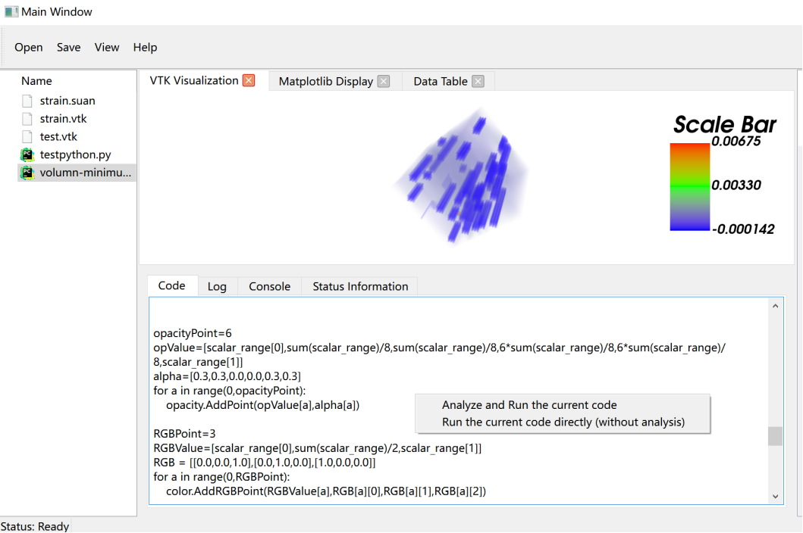

This module is used to display user file content, and can also execute and analyze related code files, display console information and running logs.

## Display File Content
When a user double-clicks on a file node on the left, the file system module finds the corresponding file path, then reads the corresponding file content, and then displays it in the info bar.

## Execute and Analyze Code
The user can then right-click the "Analyze and Run the current code" button to run and analyze the corresponding code, and finally display the corresponding results in the visualization interface module and status bar module.
