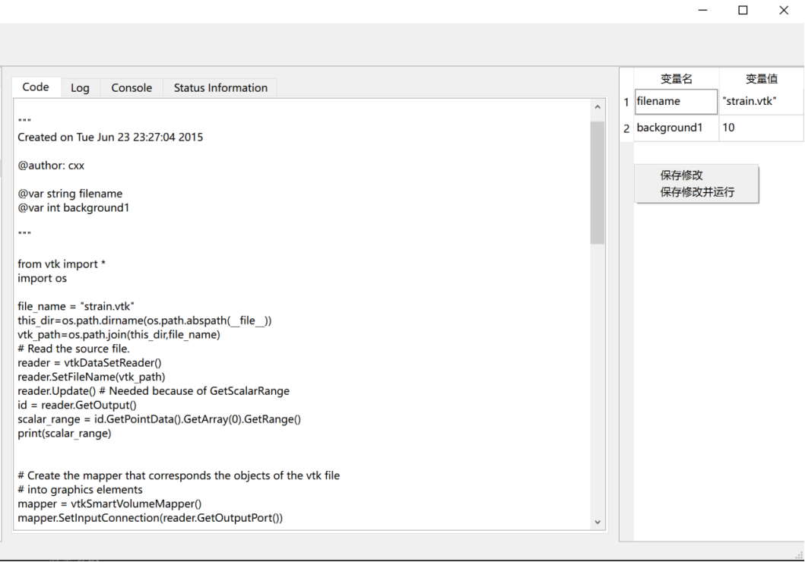

This module is the display and editing area for state variables after user code parsing.
The design of this module aims to simplify the process of monitoring and modifying code state variables for users. By declaring variables that need to be monitored in the info bar, users can quickly view and edit these variables in the status bar without having to manually search for and modify the code. This interaction method makes code testing and debugging more efficient and convenient, helping to improve user work efficiency and code quality.

## Monitor Specific Variable States
In the code content displayed in the info bar, users can declare related variables that need to be monitored using a fixed syntax format.
Once the user has declared variables using the correct syntax format, they can then right-click the "Analyze and Run the current code" button to view the status information of related variables in the status bar on the right.
In the status bar, users can easily view the current value of each variable as well as other related information.
In addition to viewing the current initial value of variables, users can also modify the initial values of these variables in the status bar.
This way, users can quickly test different situations and scenarios by editing the values in the status bar. Once a user has modified the initial value of a variable, they can right-click the "Save and Modify" button to test the code accordingly.
This feature provides users with a convenient way to test different inputs and conditions for their code, helping them to more effectively debug and optimize their code.
As shown in the figure below, this is the effect after declaring the variables filename and background1 in the info bar code section.
