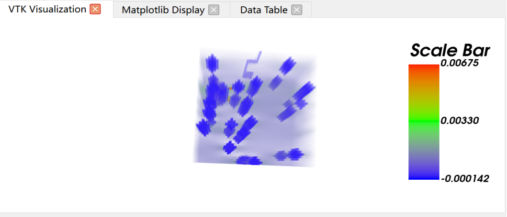
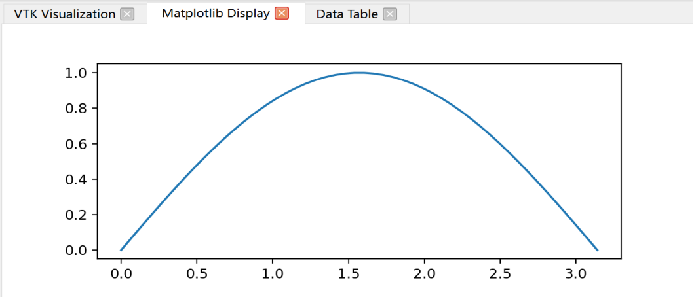
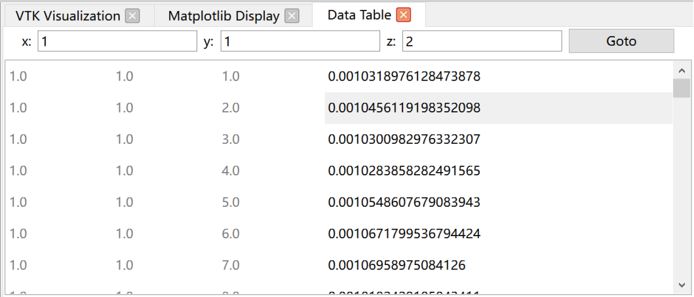

This module is used to display data visualization effects processed by VTK and Matplotlib code. By automatically identifying and extracting relevant variables, as well as removing unnecessary code, users can more easily view and modify data visualization effects in the visualization interface. This design can improve user work efficiency and make the data visualization process smoother and more efficient.

## VTK
As shown in the figure below, when a user opens a VTK-related code file, the info bar displays the content of that code. The user can right-click the "Analyze and Run the current code" button in the info bar, and the system will analyze the code, determining which parts involve the VTK library. Once it is determined that the code involves the VTK library, the visualization interface will automatically switch to the "VTK Visualization" tab interface. Then the system will automatically identify and extract visualization-related variables, and automatically delete some unnecessary code (to facilitate integration into the "VTK Visualization" tab interface), in order to clearly and accurately display the VTK visualization effect shown by the code in the "VTK Visualization" tab interface.

## Matplotlib
If the opened file is Matplotlib-related code, the processing flow is the same as above. The software determines that the code involves Matplotlib, the visualization interface switches to the "Matplotlib Display" tab interface, then extracts the needed variables, deletes some unnecessary code, in order to display it in that tab interface, as shown in the figure below.

## Data Files
When a user opens a VTK data file, the system displays the content of that file in the info bar. Based on the content and format of the file, the software can determine that the file is a VTK data file and process it accordingly.
As shown in the figure below, once it is determined that the file is a VTK data file, the visualization interface automatically switches to the "Data Table" tab interface. On this interface, the software analyzes the file content and converts the data into a table format, including the coordinates (x, y, z) of each data point and the corresponding values. This way, users can clearly view the data information contained in the file.
In the "Data Table" tab interface, users can directly input or edit the corresponding x, y, z values, and the software will automatically locate the corresponding row. This way, users can conveniently select specific data points and perform operations, such as modifying values.
This design is intended to help users more conveniently process and analyze VTK data files. By converting the data into a table format, users can more intuitively understand the structure and content of the data. At the same time, users can also quickly locate data points of interest by inputting the corresponding coordinate values in the table, achieving more precise data operations and analysis.
