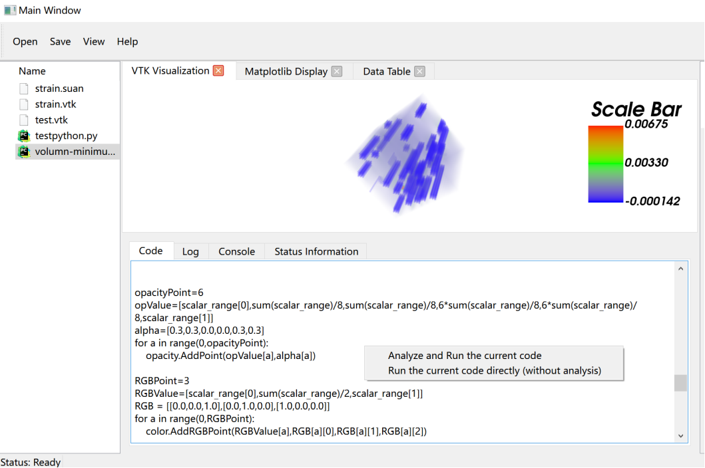

该模块用于显示用户文件内容，也可以执行分析相关代码文件，显示控制台信息和运行日志。
## 显示文件内容
当用户双击点击左侧文件节点时，通过文件系统模块，找到对应文件路径，然后读取对应文件内容，接着将其显示在信息栏中。
## 执行并分析代码
用户之后可以右键点击“Analyze and Run the current code”按钮，来运行和分析相应代码，最后会在可视化界面模块与状态栏模块显示对应结果。
