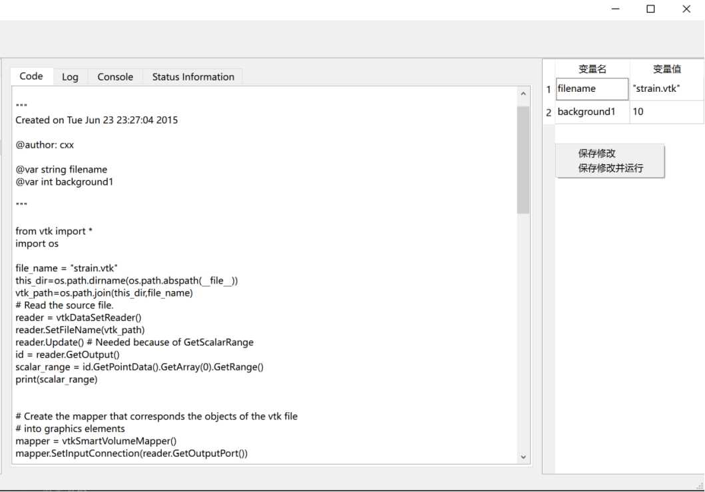

该模块是用户代码解析后状态变量的显示和编辑区域。
该模块的设计旨在简化用户对代码状态变量的监视和修改过程。通过在信息栏中声明需要监视的变量，用户可以在状态栏中快速查看和编辑这些变量，而无需手动查找和修改代码。这种交互方式使得代码测试和调试变得更加高效和方便，有助于提高用户的工作效率和代码质量。
## 监视特定变量状态
在信息栏显示的代码内容处，用户可以通过固定语法格式声明需要监视的相关变量。
一旦用户使用了正确的语法格式声明了变量，接着右键点击“Analyze and Run the current code”按钮，就能在右侧状态栏查看到相关变量的状态信息。
在状态栏中，用户可以轻松查看每个变量的当前值以及其他相关信息。
除了查看变量的当前的初始值外，用户还可以在状态栏中对这些变量的初始值进行修改。
这样，用户可以通过编辑状态栏中的值来快速测试不同的情况和场景。一旦用户对变量的初始值进行了修改，可以右键点击“保存并修改”按钮，对代码进行相关测试。
这个功能为用户提供了一个方便的方式来测试代码的不同输入和条件，帮助他们更有效地调试和优化代码。
如下图所示便是在信息栏代码处声明了变量filename与background1后的效果。
