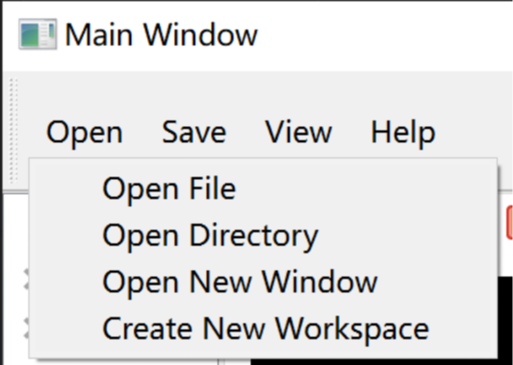
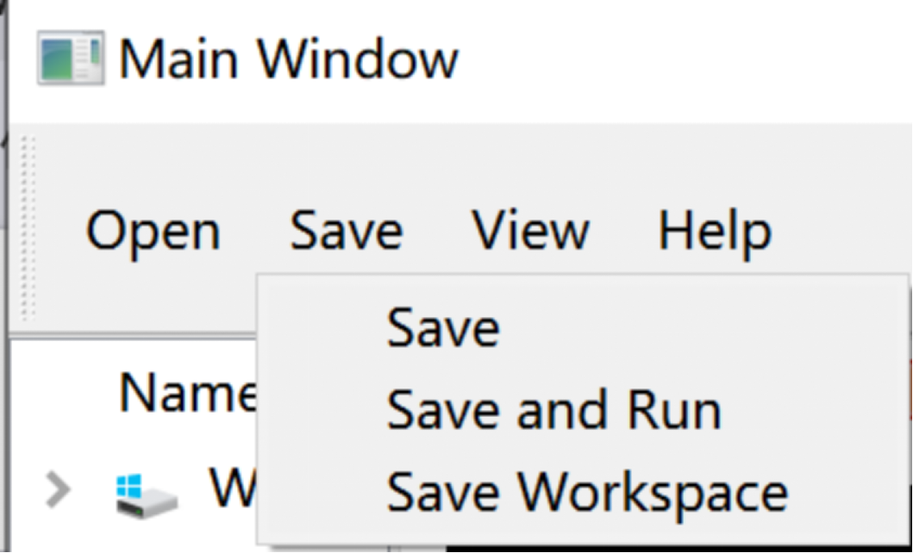
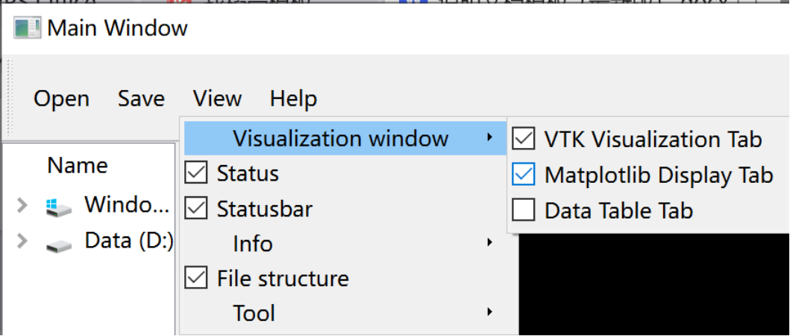
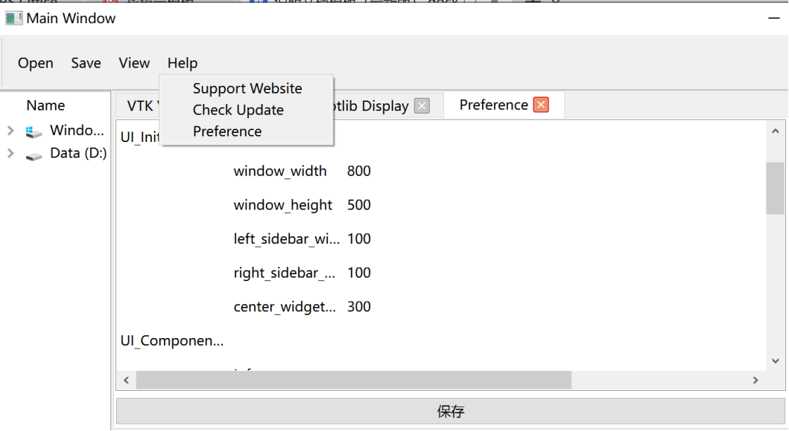

该模块为用户提供了一系列实用工具，从而让用户能够更方便地完成日常任务。
## Open
例如当用户点击“Open”工具按钮时，可以选择打开指定文件，或者选择打开指定目录，打开新的窗口，也可以选择为指定目录创建新的工作区，
如下图所示。

## Save
当用户点击“Save”工具按钮时，可以选择保存当前文件，或者选择保存并运行当前文件，也可以选择保存当前工作区，如下图所示。

## View
当用户点击软件界面上的“View”工具按钮时，如下图所示，他们将获得一个可以灵活控制软件功能视图显示状态的菜单界面。这一功能设计旨在提供用户更大的自定义界面布局的自由度，从而提升他们在使用软件时的整体体验。通过这一菜单，用户可以选择哪些功能视图需要显示在当前的软件界面中，而哪些则可以被隐藏。
在这个菜单界面中，每个功能视图旁边都有一个复选框。当某个视图被勾选上时，这意味着该视图将会显示在软件的主界面上，用户可以立即看到并使用该视图所提供的功能和信息。相反，如果用户取消勾选某个视图，表示用户不希望在主界面上看到该视图，该视图将会立即从界面中消失。
这种设计的好处在于，用户可以根据自己的实际需求和偏好来定制界面布局。例如，某些功能视图可能在某些特定的工作流程中更为重要，因此用户可以选择将这些视图始终保持在界面上，以便随时访问。而对于那些不常使用的功能视图，用户可以选择将其隐藏，这样不仅可以使界面更加简洁，还能避免视觉上的干扰，提高工作效率。
此外，这种自定义视图显示状态的功能也使得软件更具适应性，可以满足不同用户群体的需求。对于初学者来说，他们可以只显示最基本的功能视图，简化操作流程，减少学习难度。而对于高级用户，他们可以根据自己的习惯和需求，显示更多高级功能视图，以便在同一界面上完成更多复杂的操作。

## Help
当用户点击软件界面上的“Help”工具按钮时，系统将为用户提供多种选项，以便他们可以获取所需的帮助和信息。首先，用户可以选择打开默认的网络浏览器，自动跳转到帮助文档网站。这个网站的地址是https://3dfd8b42.stk.pages.dev。在这个帮助文档网站上，用户可以找到详细的使用说明、常见问题解答以及其他相关的帮助资源。无论是软件的基本操作指南，还是高级功能的使用技巧，这个网站都提供了详尽的信息，帮助用户更好地使用软件。
此外，用户还可以选择通过软件发送请求到服务器，检查当前软件的版本是否为最新版本。这项功能对于确保软件始终保持最新状态、利用最新的功能和安全补丁非常重要。当用户选择这个选项时，软件将自动与储存更新版本和更新日志的服务器进行通信，查询当前软件版本的相关信息。如果服务器检测到用户所使用的版本不是最新版本，系统将提示用户进行版本更新。用户可以根据提示下载并安装最新版本的更新包，从而保证软件始终处于最佳运行状态，享受最新的功能改进和安全保护。
除了以上两项功能，用户还可以通过“Help”工具按钮访问软件的首选项设置界面。在这个设置界面中，用户可以查看和修改软件的各项首选项，根据个人需求调整软件的运行参数。比如，用户可以设置软件的界面语言、主题颜色、启动时的默认行为以及其他个性化选项。这些设置选项能够让用户根据自己的使用习惯和需求，定制出最适合自己的软件使用环境，如下图所示。
