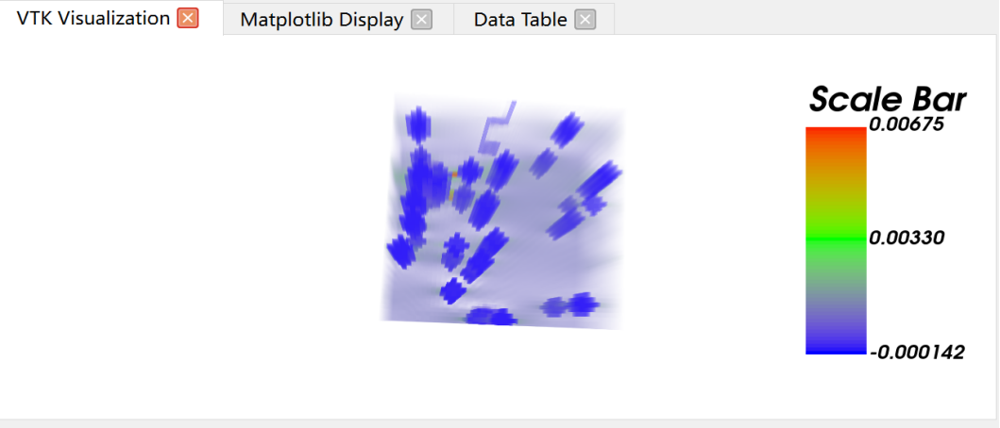
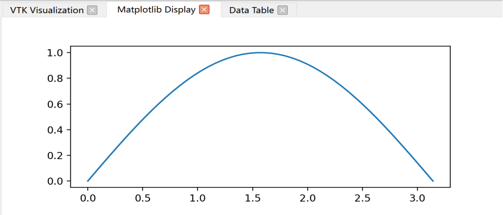
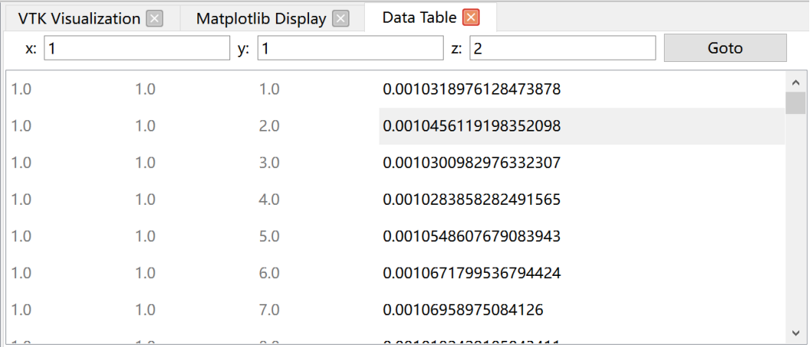

该模块用于展示经过VTK和Matplotlib代码处理后的数据可视化效果，通过自动识别和提取相关变量，以及删除不必要的代码，用户可以更轻松地在可视化界面中查看和修改数据可视化效果。这种设计能够提高用户的工作效率，并使数据可视化过程更加顺畅和高效。	
## VTK
如下图所示，当用户打开一个VTK相关的代码文件时，信息栏会显示该代码的内容。用户可以在信息栏右键点击“Analyze and Run the current code”按钮，系统会对该代码进行分析，判断出其中涉及到VTK库的部分。一旦确定代码中涉及到VTK库，可视化界面将自动转到“VTK Visualization”选项卡界面。然后系统会自动识别并提取出与可视化相关的变量，而且自动删除一些不必要的代码（方便集成到“VTK Visualization”选项卡界面中），以便在“VTK Visualization”选项卡界面中清晰准确地显示出代码展示的VTK可视化效果。

## Matplotlib
如果打开的是Matplotlib相关的代码文件，也是跟上面一样的处理流程，软件判断出该代码涉及到Matplotlib，可视化界面转到“Matplotlib Display”选项卡界面，然后提取出需要的变量，删除一些不必要的代码，以便能够在该选项卡界面中显示出来，如下图所示。

## 数据文件
当用户打开的是VTK的数据文件时，系统会在信息栏显示该文件的内容。根据文件的内容和格式，软件能够判断出该文件是VTK的数据文件，并相应地进行处理。
如下图所示，一旦确定文件是VTK的数据文件，可视化界面会自动转到“Data Table”选项卡界面。在这个界面上，软件会对文件内容进行分析，并将数据转换成表格形式，包括每个数据点的坐标（x，y，z）以及对应的数值。这样，用户可以清晰地查看文件中包含的数据信息。
在“Data Table”选项卡界面中，用户可以直接输入或编辑相应的x、y、z值，软件会自动定位到对应的行处。这样，用户可以方便地选择特定的数据点并进行操作，如修改数值等。
这个设计旨在帮助用户更方便地处理和分析VTK的数据文件。通过将数据转换成表格形式，用户可以更直观地了解数据的结构和内容。同时，用户也可以通过在表格中输入对应的坐标值来快速定位到感兴趣的数据点，实现更精准的数据操作和分析。
