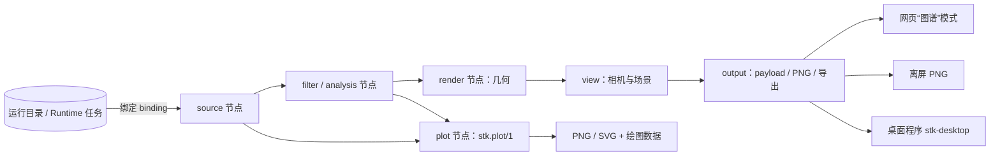

# STK 可视化工作流

里程碑 1（M1）的可视化按“数据留在计算处”设计：图（graph）送到数据旁求值，只把小结果送回，
包括渲染数据包、PNG、表格和二维图。数据可以是 Runtime 任务的结果，也可以是本机目录。三维与统计两条流水线
共用同一套数据绑定和缓存。契约为英文规范，见 [规范索引](specs/README.md)；控制服务（hub）侧的
部署与操作见 [控制服务指南](hub.md)。



- **三维节点图 `stk.graph/1`**：带类型端口的 JSON 有向无环图。source、filter、analysis 节点在数据
  旁的无界面求值器中运行（节点代理、`suan graph run` 或 MCP 所在主机）。render 节点在求值器中只准备
  几何；颜色表、不透明度、箭头缩放、相机等外观参数标为 `x-stk-stage: client`，改动时不重算数据节点。
  结果是渲染数据包 `stk.payload/2`，由各显示端按同一份数据绘制。
- **二维图 `stk.plot/1`**：声明式绘图规格，由 matplotlib（`Figure` + `FigureCanvasAgg`，不用 pyplot）
  输出 PNG／SVG，同时给出实际绘制的数据（`stk.plot-data/1` JSON）。

## 安装与检查

```bash
# 求值节点：NumPy、VTK、h5py（visualization）与 Matplotlib（science）
python -m pip install '.[visualization,science]'
suan graph doctor          # 依赖、节点模块、节点目录与离屏渲染（在子进程中探测）
```

`suan graph catalog`、`suan graph schema`、`suan graph validate` 不需要 NumPy 或 VTK；控制服务
校验图时也不导入 NumPy。`python -m suan.graph` 与 `suan graph` 等价。`doctor` 把内置节点与
[`docs/specs/catalog/stk-catalog-m1.json`](specs/catalog/stk-catalog-m1.json) 比对，
离屏渲染不可用时给出警告和安装提示（见下文“离屏 PNG”），不影响其他输出。

## 快速开始：muFerro 畴结构

```bash
suan graph catalog                                   # 已安装的节点类型
suan graph validate muferro-domains                  # 预设 ID 或图文件
# 本机运行目录（含 Polar.<8位步号>.dat 与 energy_out.dat 的目录）
suan graph run muferro-domains --bind run=/path/to/case --out ./domains
# 逐个时间步批量渲染（SimViz 批量重绘）：每步一套文件加 series.json
suan graph run muferro-domains --bind run=/path/to/case --out ./domains-series \
  --param step=all --output image --output fractions
# 已结束的 Runtime 任务（经已保存的连接下载所需文件；案例须在 work 根目录，见“绑定”）
suan graph run muferro-domains --connection cluster --bind run=task:TASK_ID --out ./domains
```

`FILE` 可以是图文件、预设文件（`{"id", "graph", …}` 包装，会自动取出 `graph`）或预设 ID。
`--param NAME=VALUE` 的值按 JSON 解析，解析失败时按字符串处理：`--param step=200`、
`--param film_detection=false`、`--param view=+z`。`NAME=all` 用于 `step` 或 `enum` 类型的参数：
`step=all` 先求值一次以取得可用步号再逐步求值；`view=all` 逐个取枚举值。一次只能有一个参数为 `all`。

`--out` 目录中的文件：

| 输出类型 | 文件 |
|---|---|
| 场景 / payload | `<输出名>/manifest.json` 与每个缓冲区一个 `<sha256>.bin`（`v1_fallback` 时另有 `scene_v1.json`） |
| 图像 | `<输出名>.png` |
| 二维图 | `<输出名>.png`（`--plot-format svg` 时为 `.svg`）与 `<输出名>.data.json` |
| 表格、值、数据集描述 | `<输出名>.json` |
| 数据导出 | `<输出名>` 加导出文件的扩展名 |
| 结果 | `result.json`（`stk.graph-result/1`，含 `files`） |

`--param NAME=all` 时每个值的文件名带后缀：整数步号为 8 位（`image.00000200.png`、
`result.00000200.json`），另有 `series.json`（`stk.series/1`，列出每个值的输出文件）。某个输出
失败时其余输出照常写出，错误打印到 stderr，退出码为 1；`all` 模式逐值打印（`step=100: error […]`）。
`--output NAME` 可重复，只计算所需输出及其上游节点。CLI 求值不设时间与输出字节上限；
`--profile phone|web|desktop`（默认 `web`）决定渲染数据包的预算。`-v` 打印逐节点事件，
`--json` 把结果文档打印到 stdout。

## 节点图 `stk.graph/1`

```json
{"schema": "stk.graph/1", "catalog": {"stk": 1},
 "parameters": [{"name": "step", "type": "step", "default": "latest"}],
 "nodes": [
   {"id": "run", "type": "stk.source.muferro_run@1", "params": {"binding": "run"}},
   {"id": "polar", "type": "stk.source.muferro_frame@1", "inputs": {"frames": {"from": "run.frames"}},
    "params": {"dataset": "Polar", "step": {"$param": "step"}}}
 ],
 "outputs": {"polar": "polar.out"}}
```

- 节点类型为 `命名空间.族.名称@主版本`，例如 `stk.filter.contour@1`。连线写在输入端：
  `{"from": "<节点>.<端口>"}`，多输入端口（如场景的 `layers`）用列表，顺序即图层顺序。
- 图级 `parameters`（`number`、`integer`、`boolean`、`string`、`step`、`vector3`、`int3`、`range`、
  `enum`、`json`）可在节点参数中以 `{"$param": "<名称>"}` 引用；优先修改图参数，而不是改节点。
- `id`、`name`、`description`、`ui`、`label` 与 `x-*` 键不影响求值和缓存键。
- 校验 `suan graph validate FILE [--param k=v] [--json]` 给出错误码、JSON Pointer 路径、节点和提示，
  错误码表见 [stk-graph-v1 §11](specs/stk-graph-v1.md#11-validation-suangraphschemavalidate_graphgraph-registry--parametersnone)。
  限制：最多 200 个节点、64 个图参数，规范化 JSON 不超过 256 KiB。

各族与运行位置：

| 族 | stage | 运行位置与缓存 |
|---|---|---|
| `source` | `source` | 求值器，经绑定读文件；按所读内容的 sha256 建键 |
| `filter` | `data` | 求值器；数据键 |
| `analysis` | `analysis` | 求值器；数据键 |
| `render` | `representation` | 求值器只准备几何（数据键）；外观参数随后附加（完整键） |
| `view` | `view` | 求值器（开销很小）；完整键 |
| `output` | `output` | 求值器：payload 编码、离屏渲染、导出；完整键 |
| `plot` | `plot` | 求值器：规格与 matplotlib；完整键 |

M1 节点目录共 34 个类型（`suan graph catalog` 列出，`--json` 输出 `stk.catalog/1`）。每个节点的端口、
参数、默认值与取值范围见 [stk-graph-v1 §13](specs/stk-graph-v1.md#13-milestone-1-node-catalog)，
语义见 §14：

| 族 | 节点（省略 `stk.` 前缀与 `@1`） |
|---|---|
| source | `source.muferro_run`（运行目录索引：帧表、能量、进度、`stk.result/1`）、`source.muferro_frame`（按步号读一帧）、`source.file`（DAT、NPY、VTI、旧版 VTK STRUCTURED_POINTS、VTKHDF）、`source.table`（`energy_out.dat`、空白分隔列、CSV、进度 JSONL） |
| filter | `crop`、`sample`、`calculator`（固定运算：magnitude、component、scale、normalize、compose）、`slice`（按轴索引或任意平面）、`threshold`、`contour`（多个等值）、`glyph_source`（步长／随机采样、幅值范围、标签掩码）、`label_surfaces`（每个标签一个平滑封闭曲面）、`streamlines`（扩展目标） |
| analysis | `orientation_classify`（`stk:cubic-26` 等方向集）、`film_detect`、`label_fractions`、`statistics` |
| render | `surface`、`glyphs`（实例化箭头等）、`volume`（颜色与不透明度传递函数）、`outline`、`axes`、`scalar_bar`、`categorical_legend`、`orientation_legend` |
| view | `camera`（预设 `iso`、`±x`、`±y`、`±z` 或数值相机）、`scene` |
| output | `payload`、`image`（PNG，可放大倍数）、`dataset`（VTKHDF、VTI、NPY、CSV、JSON） |
| plot | `line`（第二 y 轴、行过滤、样式）、`heatmap`、`histogram`、`bar` |

第三方包可经 entry point `stk.nodes` 注册节点（加载失败只报告、不影响内置节点）；私有
`stk-mupro` 包也通过它以更高优先级覆盖或增加 `mupro.*` 节点。

## 预设

预设位于 `suan/graph/presets/<id>.json`，控制服务以 `GET /api/v1/graphs/presets` 提供给网页。

| 预设 | 绑定 | 图参数 | 输出 |
|---|---|---|---|
| `muferro-domains` | `run` | `step`（`latest`）、`min_magnitude`（0.1）、`max_angle_deg`（180）、`film_detection`（true）、`smooth_iterations`（30）、`view`（`iso`） | `view`、`image`、`fractions`、`families`、`energy` |
| `muferro-polarization-glyphs` | `run` | `step`、`stride`（[2,2,2]）、`max_points`（20000）、`min_magnitude`（0）、`view` | `view`、`image` |
| `energy-plot` | `run` | `last_n`（null）、`stats`（false） | `energy`、`table` |
| `slice` | `data` | `path`（`Polar.00000000.dat`）、`axis`（z）、`index`（null = 中间）、`component`（0）、`colormap`、`view` | `view`、`image` |
| `iso` | `data` | `path`、`levels`（null = 数据范围中点）、`colormap`、`opacity`、`view` | `view`、`image` |
| `vectors` | `data` | `path`、`stride`、`max_points`（5000）、`view` | `view`、`image` |
| `volume` | `data` | `path`、`colormap`、`range`、`opacity`、`view` | `view`、`image` |

- `muferro-domains`：把一帧 Polar 分到 26 个立方取向变体（`stk:cubic-26`，STK 编号），每个变体一个
  平滑封闭曲面，加外框、出现变体的图例和坐标轴（SimViz 畴视图），并给出变体体积分数、按 T/O/R
  汇总的 `families` 和总能量曲线。
- `muferro-polarization-glyphs`：按步长采样的极化箭头，颜色为 `stk:orientation-hsl`
  （色相 = 面内方位角，明度 = P_z），长度按 |P|，附取向色球。
- `slice`、`iso`、`vectors` 复现现有 `view.build` 的三种模式，`volume` 为 |v| 体渲染；
  它们读取绑定 `data` 中 `path` 指定的场文件。
- 颜色表可选 `viridis`、`cividis`、`coolwarm`、`turbo`、`gray`。

## 绑定：图中不含路径

source 节点只写绑定名（如 `run`、`data`）和绑定内的相对路径，不能写绝对路径、`..`、反斜杠或盘符；
绑定由调用方解析：

| 调用方 | 绑定写法 |
|---|---|
| `suan graph run` | `--bind NAME=DIR`（本机目录）或 `--bind NAME=task:ID`（Runtime 任务，配合 `--connection NAME` 或 `--state-dir DIR`） |
| 控制服务 `graph.evaluate` | `{"bindings": {"run": {"task_id": "<32 位十六进制>"}}}`，只接受任务 ID |
| MCP `graph_evaluate` / `graph_render` | `{"task_id": "…"}`，或 MCP 主机上的目录 `{"dir": "/path"}` |

- 本机目录内的符号链接不能指向目录之外。
- 任务绑定只能读取**已结束**任务的结果文件（Runtime 在任务结束后才列出结果）。文件按 sha256 下载到
  内容寻址缓存，单个文件上限 1 GiB。运行中的任务请看监控事件（见 [runtime 指南](runtime.md#监控事件)）。
- `stk.source.muferro_run@1` 在绑定内的 `case_dir` 中查找帧、`energy_out.dat` 与
  `mupro_progress.jsonl`，帧必须直接位于该目录。`case_dir` 默认为 `auto`：读取绑定根目录下
  `stk-mupro.json` 记录的案例目录（`suan mupro submit --input case16` 时为 `case16`，`--example` 时为
  `.`），没有记录或路径不安全时为 `.`。因此预设、MCP 与网页“图谱”模式对两种提交方式都适用；
  其他布局可在图中显式设置 `case_dir`。

## 缓存

每个节点的结果以 Merkle 内容哈希为键（规范化 JSON 的 sha256，见
[stk-graph-v1 §5](specs/stk-graph-v1.md#5-evaluation-implemented-by-suangraphevaluatorevaluate-phase-b2)）：

- 数据键包含节点类型与 `impl_version`、data 阶段参数（规范化后）、上游数据键，以及 source 节点
  读取内容的指纹（路径、sha256、读取器）。完整键再加上 client 阶段参数和上游完整键。
- source 节点按实际解析到的内容建键：`step: "latest"`、`step: 2` 以及解析到同一帧的其他写法共用
  一个缓存项。运行仍在追加能量行时，运行索引和依赖能量的节点会重算，由未变帧导出的节点不会重算。
  可用步号每次求值重新报告，结果的 `parameters.step` 给出 `value` 与 `choices`。
- 只改 client 阶段参数（相机、颜色表、不透明度、箭头缩放、图例位置、图像尺寸等）时，source、filter、
  analysis 节点和 render 节点的几何都命中缓存，只重新附加外观并重算 view／output 节点；改步号从读帧
  节点开始重算，回到看过的步号直接命中；改分类阈值等 data 参数从该节点向下游重算。
- 两级缓存：进程内按字节计的 LRU（默认 2 GiB），以及 `cache: disk` 节点的磁盘存储（默认 20 GiB，
  按最近使用清理）。磁盘缓存的节点是 `source.file`、`source.muferro_frame`、
  `analysis.orientation_classify`、`filter.contour`、`filter.label_surfaces`。节点代理和 MCP
  服务是常驻进程，两级都生效；每次 `suan graph run` 是新进程，只有磁盘缓存跨次复用。
- CLI 缓存目录为 `--cache DIR`，默认 `$STK_GRAPH_CACHE`，否则 `~/.cache/stk/graph`
  （Windows 为 `%LOCALAPPDATA%\stk\graph`）；`--no-cache` 只用内存。节点代理使用
  `<节点状态目录>/cache/graph/cache`。

## 渲染数据包与显示端

`stk.payload/2`（[规范](specs/stk-render-payload-v2.md)）是 glTF 风格的 JSON 清单加上以 sha256 命名的
二进制缓冲区，也可打包为单文件 `.stkp`。图层类型为 `triangles`、`slice_image`、`lines`、`points`、
`instances`、`volume`、`overlay`；颜色表以 256 项 RGBA8 查找表传输，坐标是相对 float64 `render_origin`
的 float32。编码时按预算裁剪，每次裁剪记录在清单的 `budget.reductions` 中（经
`stk.output.payload@1` 编码时与交付 `scene` 输出时都另有警告 `payload_reduced`）：

| profile | 三角形 | 实例 | 点 | 体素 | 字节 |
|---|---|---|---|---|---|
| `phone` | 300 000 | 50 000 | 200 000 | 128³（u8） | 32 MiB |
| `web` | 2 000 000 | 500 000 | 2 000 000 | 256³（u16） | 128 MiB |
| `desktop`（离屏） | 20 000 000 | 5 000 000 | 20 000 000 | 1024³（f32） | 2 GiB |

同一份数据包供以下显示端使用：

- **网页“图谱”模式**：控制服务以 `--web-dir web/dist` 提供网页。在“图谱”页选择预设、编辑参数、
  绑定任务后提交 `graph.evaluate`，用 vtk.js 绘制返回的数据包；步号滑块切换时保持相机；二维图、图像和
  表格以卡片显示；点击表面或切片可用 `view.probe` 查询原始值；也可打开本地 `.stkp` 文件（此时不能查询
  原始值）。默认不生成场景 PNG，勾选“同时生成离屏渲染 PNG（较慢）”时才生成。M1 中修改任何参数都会
  重新提交请求，外观参数的改动只重算 view／output 节点。原有“结果文件”模式（scene v1）不变。
- **离屏 PNG**：`stk.output.image@1` 用 desktop 预算的数据包在**子进程**中以 VTK 离屏渲染
  （`python -m suan.render.offscreen`），因为缺少 EGL／OSMesa 时 VTK 会让整个解释器退出。
  渲染解释器依次取 `STK_RENDER_PYTHON`、当前解释器；它需要 NumPy 与 VTK，装有 Matplotlib 时标注
  文字使用 DejaVu Sans。没有可用 OpenGL 时该输出以 `render_unavailable` 失败，其他输出照常交付。
  任选一种安装方式：

  ```bash
  # EGL
  sudo apt install libegl1 libegl-mesa0 libgl1-mesa-dri
  export VTK_DEFAULT_OPENGL_WINDOW=vtkEGLRenderWindow
  # 或 OSMesa
  sudo apt install libosmesa6
  export VTK_DEFAULT_OPENGL_WINDOW=vtkOSOpenGLRenderWindow
  # 或独立环境中的 Kitware OSMesa 版 VTK
  python -m venv /opt/stk-render && /opt/stk-render/bin/pip install numpy \
    --extra-index-url https://wheels.vtk.org vtk-osmesa
  export STK_RENDER_PYTHON=/opt/stk-render/bin/python
  suan graph doctor
  ```

  渲染尺寸取 `width` × `height`（默认为场景视口 1600 × 1200）乘以 `magnification`；放大时字号、线宽
  和叠加层一起放大，得到同一画面的高分辨率版本。
- **Blender**：数据包转为 Blender 真实对象属于后续里程碑（M2 构建流水线、M3 数据包 → Blender 对象，
  节点编辑器与图 JSON 互转为 M6）。scene v1 和 `view.build`／`view.probe` 保持不变（C++ `SPACE_STK` 编辑器已归档于标签
  `archive/blender-workbench-2026-09`，由桌面程序取代）；`stk.output.payload@1` 设 `v1_fallback: true` 时同时给出 scene v1 降级版本。

## 二维图 `stk.plot/1`

plot 节点生成 `stk.plot/1` 规格（坐标轴含第二 y 轴，标记 line、scatter、bar、hist、heatmap、quiver、
errorbar、fill_between），交付时由 matplotlib 渲染：CLI 默认 PNG（`--plot-format svg` 改为 SVG），
控制服务与 MCP 默认 SVG。每张图附带实际绘制的数据（`<输出名>.data.json`，`stk.plot-data/1`），报告
数值时从这里或表格读取，不从图上读。轴标签默认为列名加单位，单位未知时显示 `unspecified`。
服务进程中 `MPLCONFIGDIR` 指向可写的缓存目录。MCP 的 `plot_table` 可直接对列数据作图。

## 标签语义与分类器

`stk.analysis.orientation_classify@1` 输出整数标签场（公式见
[domain-classifiers](specs/domain-classifiers.md)）：

| 值 | 含义 |
|---|---|
| `-1` | 未分类／无数据：幅值 ≤ `min_magnitude`、与所有方向的夹角不小于 `max_angle_deg`、分量非有限，或薄膜上方的空气层 |
| `0` | 衬底（仅在启用薄膜检测时出现） |
| `1…26` | `stk:cubic-26` 的变体：T 1–6、O 7–18、R 19–26，每个变体后紧跟其反平行变体 |

- `label_fractions` 默认排除 `-1` 与 `0`：分母只计已分类点，被排除的值的 `fraction` 为 NaN；表格的
  `attrs` 给出 `denominator`、`total` 与各排除值的计数。报告分数时同时说明分母和未分类点数。
- `numbering: "stk-legacy"` 复现 `toolkits/sviz/nt_vtk.py` 与 SimViz 的旧编号（R 1–8、O 9–20、
  T 21–26）。`min_magnitude` 默认 0.1 是 STK 的选择，预设都显式给出，报告时连同场的单位一起说明。
- 分类、薄膜检测、畴分数、HSL 取向色和标签曲面是净室（clean-room）实现：只依据公开规范，26 个取向
  即 {−1,0,1}³ 的 26 个非零向量归一化，测试用例来自物理构造而非 MuPRO 程序输出。MuPRO 自有语义
  （VO2 分类器、精确阈值与标签映射、完整 muFerro 输入模式）不在公开 STK 中，由私有 `stk-mupro` 包
  经 `stk.nodes` entry point 提供。

## 单位

单位从不猜测：`unspecified` 表示未知，不等于无量纲 `1`。保留记号为 `unspecified`、`1`、`normalized`、
`grid_index`，其余为 UCUM 代码。

- muFerro 场值为 `unspecified`，能量为 `normalized`，长度为 `grid_index`（间距 1、原点 0，坐标是从 0
  开始的网格索引）。`Polar.00000000.dat` 是极化乘以 p0，后续 Polar 帧为归一化极化，二者（以及同一
  阈值下的分类结果）不能直接比较，见 [MuPRO 指南](runtime-mupro.md#输出与结果解读)。
- 需要物理单位时由图显式声明：`stk.source.muferro_frame@1` 与 `stk.source.file@1` 的 `spacing`、
  `origin`、`length_unit`、`unit`、`quantity`，`stk.source.table@1` 的 `units`，以及
  `stk.filter.calculator@1` 的 `unit`。声明写在图里，随缓存键与结果一起记录。
- 网页把 `unspecified`、`1`、`normalized`、`grid_index` 显示为“单位未指定”“无量纲”“归一化”“网格索引”。

## 面向 LLM 的技能与 MCP 工具

STK 提供技能说明（`SKILL.md`）与 MCP 工具，智能体循环在 STK 之外：

```bash
suan skills list
suan skills export --dest ~/.claude/skills            # 每个技能一个目录；--name 只导出指定技能，--force 覆盖
```

- `stk-visualize`：找到任务 → 从预设或示例开始 → 绑定数据、修改参数 → 校验 → 渲染或求值 → 如实报告
  阈值、单位、步号和警告。导出时按已安装的节点目录重新生成 `reference/nodes.md`；`examples/` 为完整图。
- `stk-monitor`：按监控事件跟踪运行中的任务，进度不等于成功。
- MCP 服务 `stk-toolkit`（安装 `.[mcp]` 后 `python -m suan.mcp`，求值另需 `.[visualization]`）新增工具：`graph_catalog`、
  `graph_validate`、`graph_evaluate`、`graph_render`（返回 PNG）、`plot_table`、`get_task_events`。
  求值在 MCP 所在主机进行，文件写到 `output_dir`；未指定时每次调用在 `$STK_MCP_OUTPUT_DIR`（否则为
  临时目录下仅本用户可访问的 `stk-mcp-<uid>`，权限 0700）中新建独立子目录；磁盘缓存与 CLI 相同。
- 经控制服务时，同样的请求是操作 `graph.evaluate`，见 [控制服务指南](hub.md)。

## 里程碑 1 的限制

- 没有表达式语言：`calculator` 只有固定运算，图中不执行任意代码。
- 数据种类只实现 `image`（含标签场）、`polydata`（含点集）与 `table`；rectilinear、structured、
  unstructured（有限元）、particles、collection 已有规范，未实现。
- VO2 分类器与 MuPRO 专有阈值不在公开 STK 中。
- Blender 端显示、Blender 节点编辑器与图 JSON 互转在后续里程碑；网页暂不能在本地直接修改外观。
- 任务绑定只能读已结束任务的文件（运行中的任务请看监控事件）。
- `vtkHDFReader`（VTK 9.3.1 与 9.7.0 检查）：`ny = 1` 或 `nz = 1` 的二维 ImageData 读不出数组，需要在
  ParaView 中打开时用 `stk.output.dataset@1` 的 `format: "vti"` 导出；VTK 9.3 不识别 `Table` 类型，
  VTK 9.7 可读 STK 表格但不读字符串列。STK 自己用 h5py 读写不受影响。
- 离屏渲染依赖主机上的 EGL／OSMesa 或 `STK_RENDER_PYTHON` 指定的环境。
