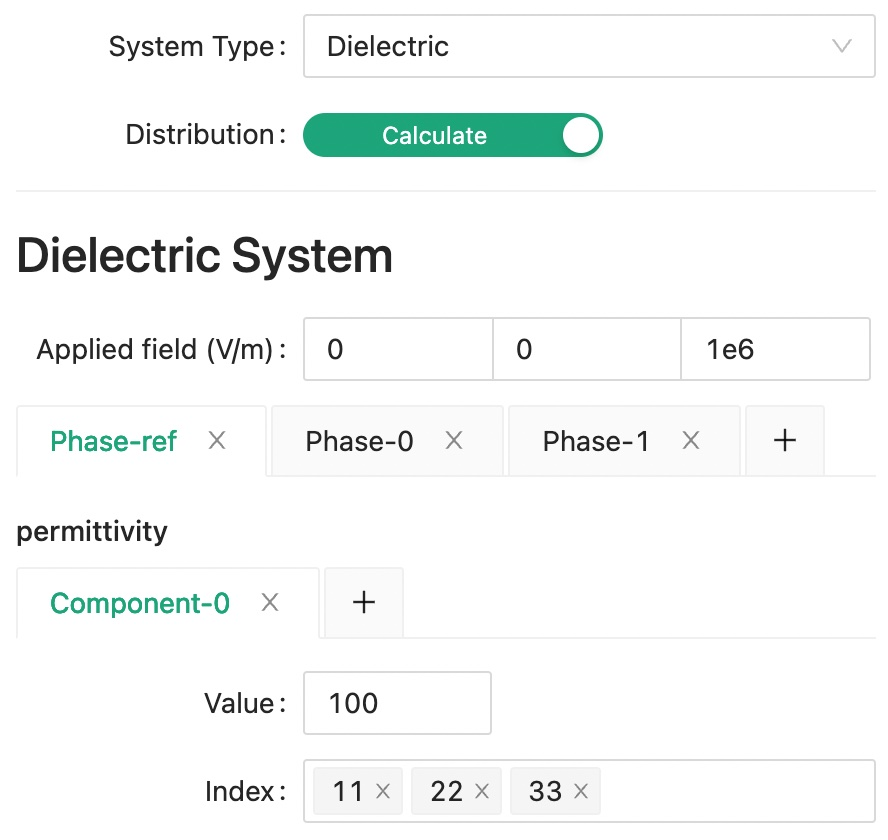
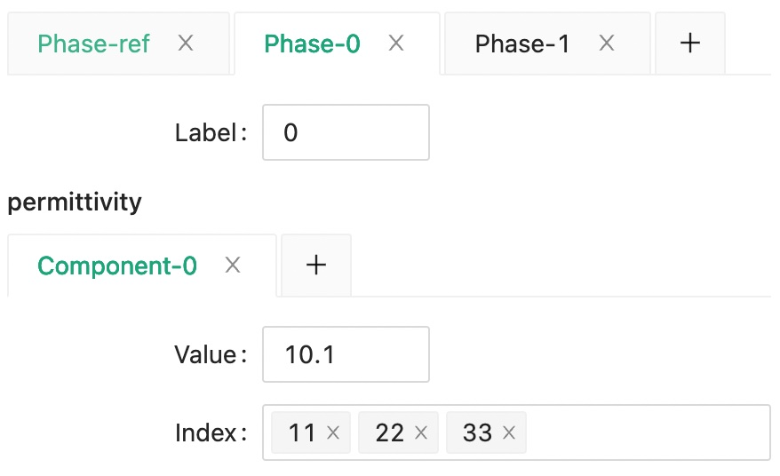
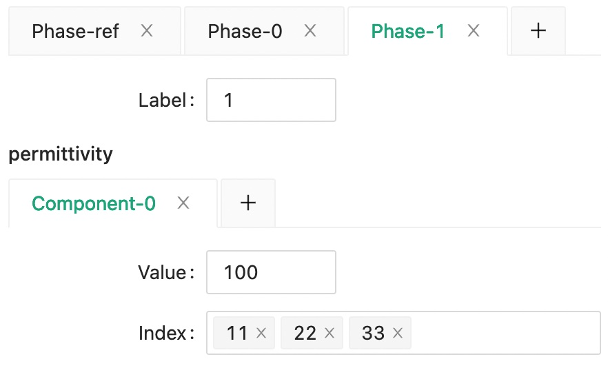
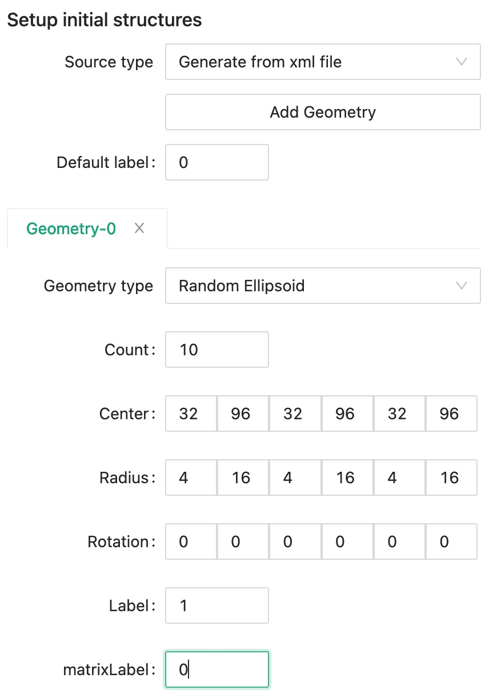
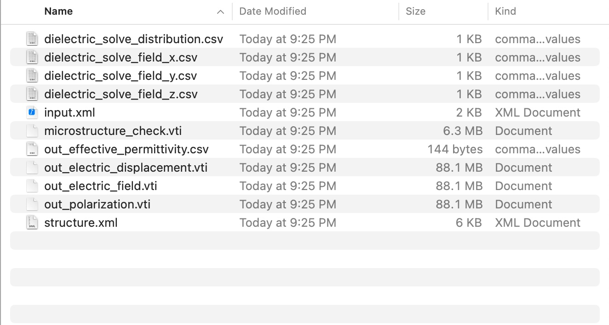
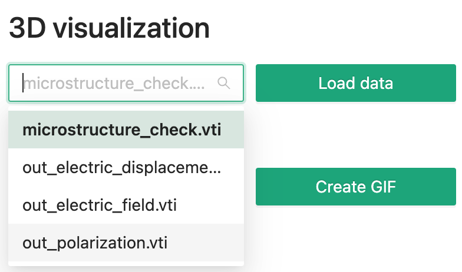
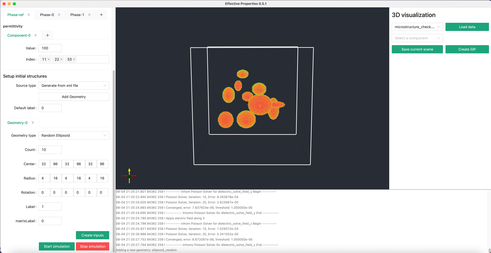
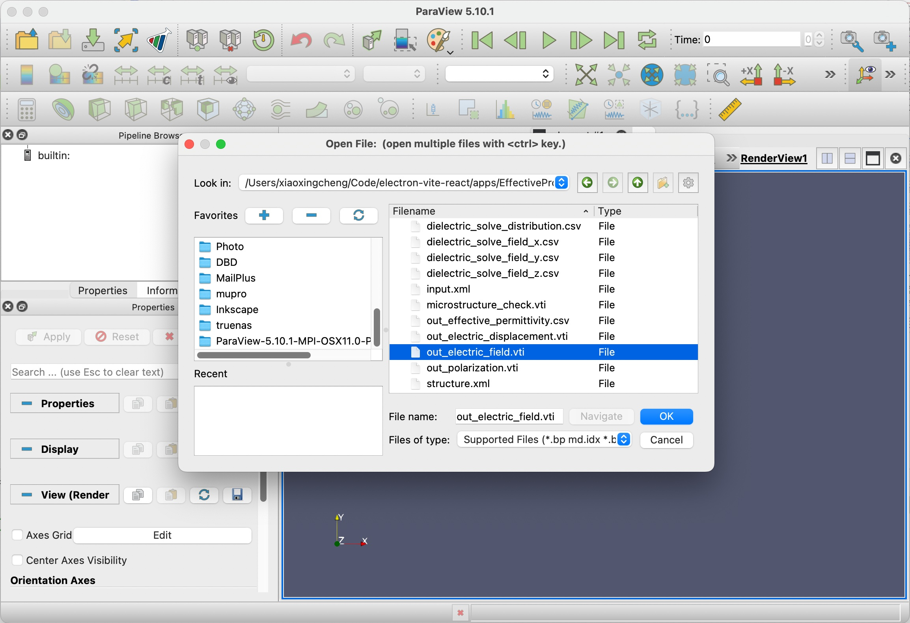
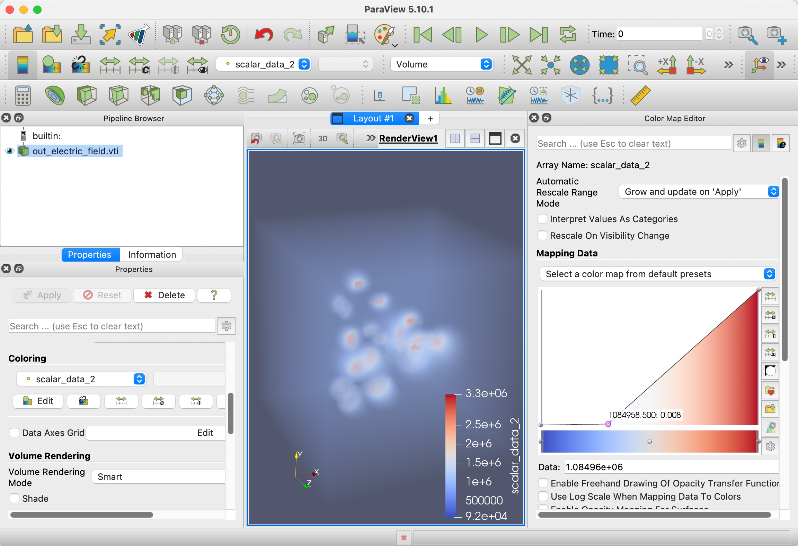

---
head:
  - - link
    - rel: stylesheet
      href: https://cdnjs.cloudflare.com/ajax/libs/KaTeX/0.5.1/katex.min.css
---

# Permittivity of random ellipsoid structure

For details about the effective dielectric permittivity calculation, please see [here](/manual/dielectric).

## Overview

First, we will setup a cubic simulation with 128 microns along each dimension, that is 128 simulation grids times 1 micrometer for each grid.

Next, we will add two phases into the system, one for the matrix with lower permittivity, and the other for the embedded particle with higher permittivity.

Lastly, we will setup a structure with random ellipsoid for the composite material.

## Step 1: Fill Input

<!--@include: ./step_1.md-->

### Dimension

> { width=60%,height:30px }

### Output

<!--@include: ./output.md-->

### System

Choose "Dielectric" system for the **System Type**.
Besides from the effective properties of dielectric permittivity, we also want to calculate a field distribution on external applied electric field, so we need to turn on the **Distribution** switch and set an **Applied field** value.

Next, set the reference permittivity value to be used in our solver.

> {width=60%,height:30px}

Then, set the low permittivity matrix phase as phase 0.

> {width=60%,height:30px}

And the high permittivity embedded phase as phase 1.

> {width=60%,height:30px}

### Structure

Since we want to generate the structure within the effective properties simulation program, we should choose "Generate from xml file" for the **Source type**.

Click **Add Geometry** button to create a new geometry tab, and set label 0 as the **Default label**.

We want to create 10 randomly generated ellipsoids whose centers are within the 32~96 grid points cubic box.

The ellipsoid radius is random value between 4 to 16 grid points, and there is no rotation added to the ellipsoid.

We will assign phase label 1 to this newly defined geometry and set its matrix label to be phase 0.

> {width=60%,height:30px}

## Step 1.5: Or Import Input

<!--@include: ./step_1.5.md-->

```xml
<input>
  <dimension>
    <nx>128</nx>
    <ny>128</ny>
    <nz>128</nz>
    <dx>1e-6</dx>
    <dy>1e-6</dy>
    <dz>1e-6</dz>
  </dimension>
  <output>
    <format>vti</format>
  </output>
  <system>
    <type>dielectric</type>
    <distribution>1</distribution>
    <external>
      <electricField>
        <x>0</x>
        <y>0</y>
        <z>1e6</z>
      </electricField>
    </external>
    <solver>
      <ref>
        <tensor>
          <name>permittivity</name>
          <rank>2</rank>
          <pointGroup>custom</pointGroup>
          <component>
            <value>100</value>
            <index>11</index>
            <index>22</index>
            <index>33</index>
          </component>
        </tensor>
      </ref>
    </solver>
    <material>
      <phase>
        <label>0</label>
        <tensor>
          <name>permittivity</name>
          <rank>2</rank>
          <pointGroup>custom</pointGroup>
          <component>
            <value>10.1</value>
            <index>11</index>
            <index>22</index>
            <index>33</index>
          </component>
        </tensor>
      </phase>
      <phase>
        <label>1</label>
        <tensor>
          <name>permittivity</name>
          <rank>2</rank>
          <pointGroup>custom</pointGroup>
          <component>
            <value>100</value>
            <index>11</index>
            <index>22</index>
            <index>33</index>
          </component>
        </tensor>
      </phase>
    </material>
  </system>
  <structure>
    <matrixLabel>0</matrixLabel>
    <sourceType>xml</sourceType>
    <geometry>
      <type>ellipsoid_random</type>
      <count>10</count>
      <centerXMin>32</centerXMin>
      <centerXMax>96</centerXMax>
      <centerYMin>32</centerYMin>
      <centerYMax>96</centerYMax>
      <centerZMin>32</centerZMin>
      <centerZMax>96</centerZMax>
      <radiusXMin>4</radiusXMin>
      <radiusXMax>16</radiusXMax>
      <radiusYMin>4</radiusYMin>
      <radiusYMax>16</radiusYMax>
      <radiusZMin>4</radiusZMin>
      <radiusZMax>16</radiusZMax>
      <rotationXMin>0</rotationXMin>
      <rotationXMax>0</rotationXMax>
      <rotationYMin>0</rotationYMin>
      <rotationYMax>0</rotationYMax>
      <rotationZMin>0</rotationZMin>
      <rotationZMax>0</rotationZMax>
      <label>1</label>
      <matrixLabel>0</matrixLabel>
    </geometry>
  </structure>
</input>
```

## Step 2: Export Input

<!--@include: ./step_2.md-->

## Step 3: Run calculation

<!--@include: ./step_3.md-->

## Step 4: Check Output

You will see the following output files in your simulation folder. Meaning for each of the files are explained in the [Dielectric System](/manual/dielectric#output-files).

> {width=80%,height:30px}

Overall, there are two types of output data, vti files for 3D data, and csv files for tabular data.

## Step 4.1: Check 3D data

Within our software, you can quickly check a 3D vti data file.

Select the file you want to visualize using the dropdown menu, then click **Load data** button.

> {width=60%}

Then you will see something like this.

> {width=100%}

## Step 4.2: Paraview

Next, we can try visualizing other files with Paraview. Click the first **Open** icon in the tool bar.

> {width=100%}

After the data is loaded, click **Apply**, then switch to **Volume** rendering and choose **scalar_data_2**, which is electric field along z for visualization.

We also need to tune the color lookup table to add some transparency to the data.

> {width=100%}

## Step 4.3: Check tabular data

Though 3D data looks cool, the more important thing probably is still the effective permittivity, _out_effective_permittivity.csv_.

| Index | 1             | 2             | 3             |
| ----- | ------------- | ------------- | ------------- |
| 1     | +1.052429e+01 | +3.109117e-03 | -1.018976e-02 |
| 2     | +3.065335e-03 | +1.051951e+01 | +2.054915e-02 |
| 3     | -1.037035e-02 | +2.120530e-02 | +1.056976e+01 |
