---
head:
  - - link
    - rel: stylesheet
      href: https://cdnjs.cloudflare.com/ajax/libs/KaTeX/0.5.1/katex.min.css
---

# Diffusivity of ellipsoid shell structure

For details about the effective diffusivity calculation, please see [here](/manual/diffusion).

## Overview

First, we will setup a cubic simulation with 128 microns along each dimension, that is 128 simulation grids times 1 micrometer for each grid.

Next, we will add three phases into the system, one for the matrix with lower diffusivity, and the other two for the ellipsoid shell and its inner part.

Lastly, we will setup a structure of ellipsoid shell.

## Step 1: Fill Input

<!--@include: ./step_1.md-->

### Dimension

> 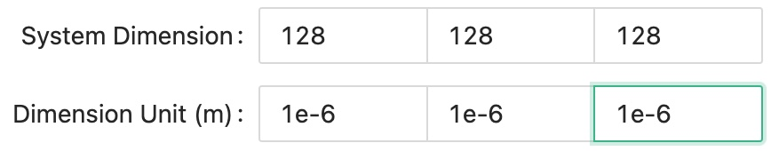{ width=60%,height:30px }

### Output

<!--@include: ./output.md-->

### System

Choose "Diffusion" system for the **System Type**.
Besides from the effective properties of diffusivity, we also want to calculate a field distribution on external applied concentration gradient, so we need to turn on the **Distribution** switch and set an **Concentration gradient** value.

Next, set the reference diffusivity value to be used in our solver.

> 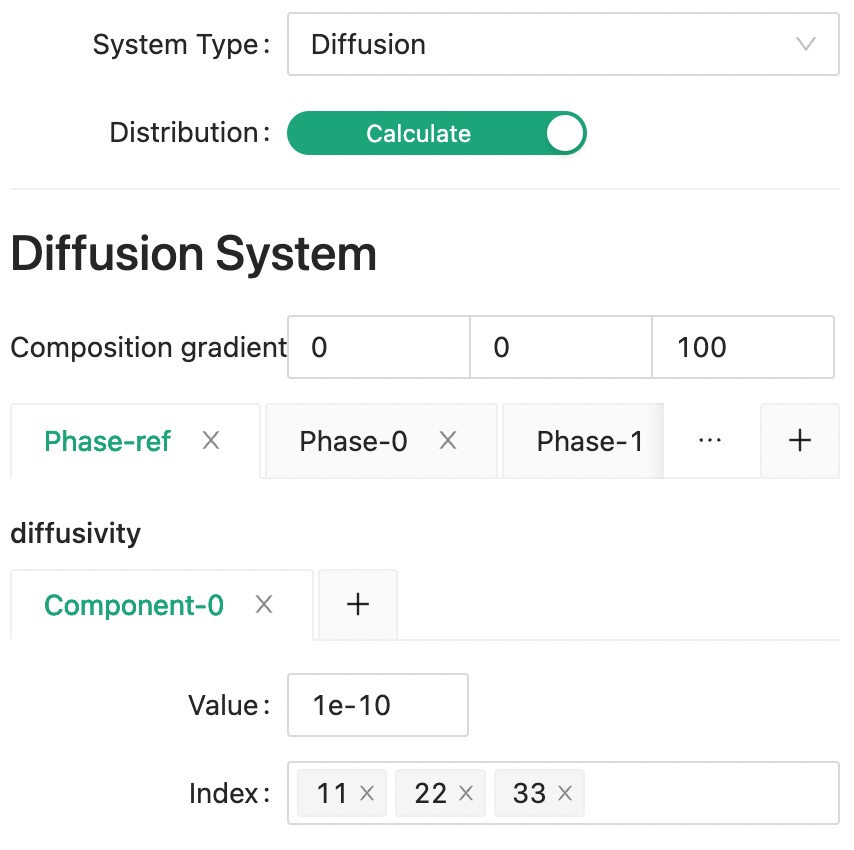{width=60%,height:30px}

Then, set the diffusivity of matrix phase as phase 0.

> 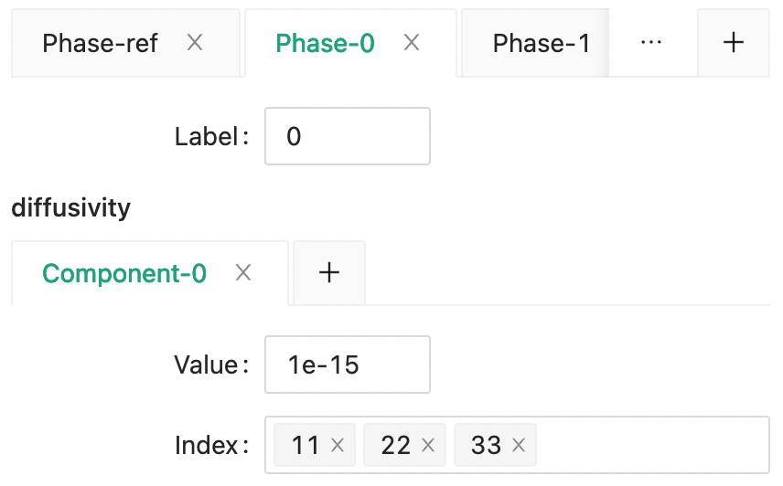{width=60%,height:30px}

And the the diffusivity for phase 1 and phase 2.

> 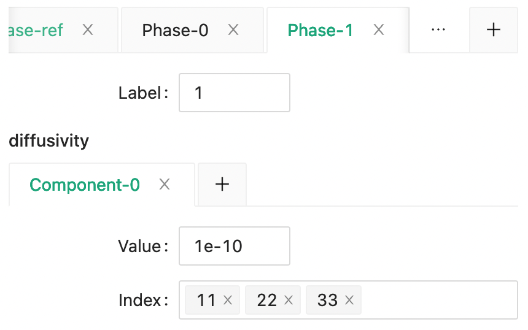{width=60%,height:30px}

> 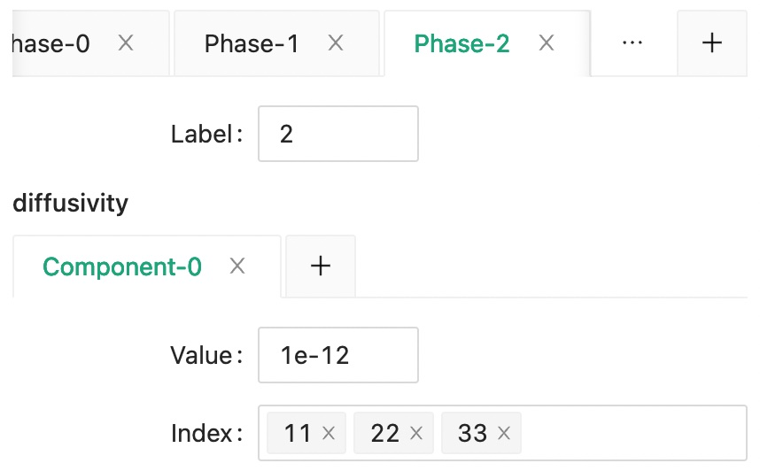{width=60%,height:30px}

### Structure

Since we want to generate the structure within the effective properties simulation program, we should choose "Generate from xml file" for the **Source type**.

Click **Add Geometry** button to create a new geometry tab, and set label 0 as the **Default label**.

We want to create a ellipsoid shell at the center of the system.

We can set the inner and outer ellipsoid respectively as in the following figure.

> 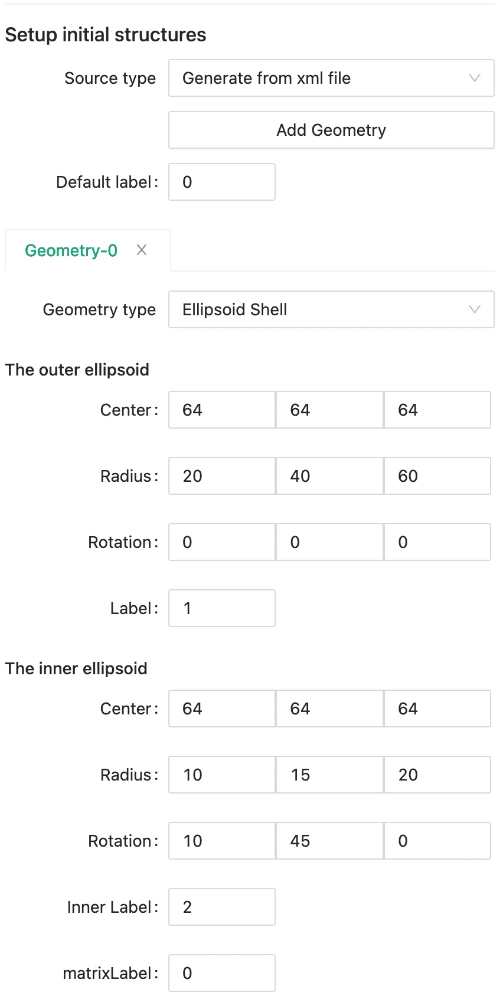{width=60%,height:30px}

## Step 1.5: Or Import Input

<!--@include: ./step_1.5.md-->

```xml
<input>
  <dimension>
    <nx>128</nx>
    <ny>128</ny>
    <nz>128</nz>
    <dx>1e-6</dx>
    <dy>1e-6</dy>
    <dz>1e-6</dz>
  </dimension>
  <output>
    <format>vti</format>
  </output>
  <system>
    <type>diffusion</type>
    <distribution>1</distribution>
    <external>
      <concentrationGradient>
        <x>0</x>
        <y>0</y>
        <z>100</z>
      </concentrationGradient>
    </external>
    <solver>
      <ref>
        <tensor>
          <name>diffusivity</name>
          <rank>2</rank>
          <pointGroup>custom</pointGroup>
          <component>
            <value>1e-10</value>
            <index>11</index>
            <index>22</index>
            <index>33</index>
          </component>
        </tensor>
      </ref>
    </solver>
    <material>
      <phase>
        <label>0</label>
        <tensor>
          <name>diffusivity</name>
          <rank>2</rank>
          <pointGroup>custom</pointGroup>
          <component>
            <value>1e-15</value>
            <index>11</index>
            <index>22</index>
            <index>33</index>
          </component>
        </tensor>
      </phase>
      <phase>
        <label>1</label>
        <tensor>
          <name>diffusivity</name>
          <rank>2</rank>
          <pointGroup>custom</pointGroup>
          <component>
            <value>1e-10</value>
            <index>11</index>
            <index>22</index>
            <index>33</index>
          </component>
        </tensor>
      </phase>
      <phase>
        <label>2</label>
        <tensor>
          <name>diffusivity</name>
          <rank>2</rank>
          <pointGroup>custom</pointGroup>
          <component>
            <value>1e-12</value>
            <index>11</index>
            <index>22</index>
            <index>33</index>
          </component>
        </tensor>
      </phase>
    </material>
  </system>
  <structure>
    <matrixLabel>0</matrixLabel>
    <sourceType>xml</sourceType>
    <geometry>
      <type>ellipsoid_shell</type>
      <centerXOuter>64</centerXOuter>
      <centerXInner>64</centerXInner>
      <centerYOuter>64</centerYOuter>
      <centerYInner>64</centerYInner>
      <centerZOuter>64</centerZOuter>
      <centerZInner>64</centerZInner>
      <radiusXOuter>20</radiusXOuter>
      <radiusXInner>10</radiusXInner>
      <radiusYOuter>40</radiusYOuter>
      <radiusYInner>15</radiusYInner>
      <radiusZOuter>60</radiusZOuter>
      <radiusZInner>20</radiusZInner>
      <rotationXOuter>0</rotationXOuter>
      <rotationXInner>10</rotationXInner>
      <rotationYOuter>0</rotationYOuter>
      <rotationYInner>45</rotationYInner>
      <rotationZOuter>0</rotationZOuter>
      <rotationZInner>0</rotationZInner>
      <label>1</label>
      <labelInner>2</labelInner>
      <matrixLabel>0</matrixLabel>
    </geometry>
  </structure>
</input>
```

## Step 2: Export Input

<!--@include: ./step_2.md-->

## Step 3: Run calculation

<!--@include: ./step_3.md-->

## Step 4: Check Output

You will see the following output files in your simulation folder. Meaning for each of the files are explained in the [Diffusion System](/manual/diffusion#output-files).

> 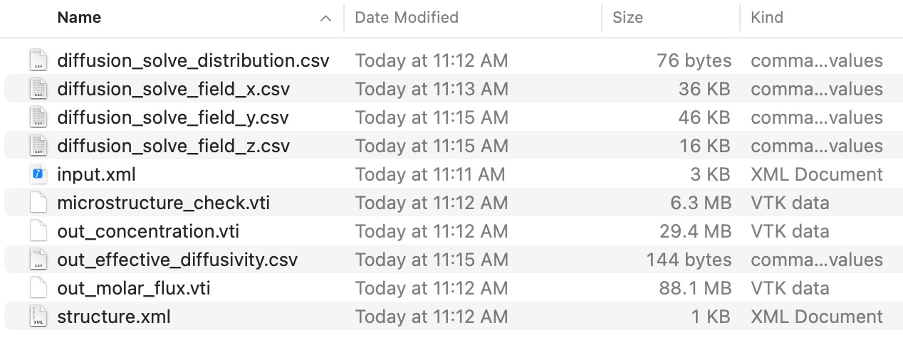{width=80%,height:30px}

Overall, there are two types of output data, vti files for 3D data, and csv files for tabular data.

## Step 4.1: Check 3D data

Within our software, you can quickly check a 3D vti data file.

Select the file you want to visualize using the dropdown menu, then click **Load data** button.

> 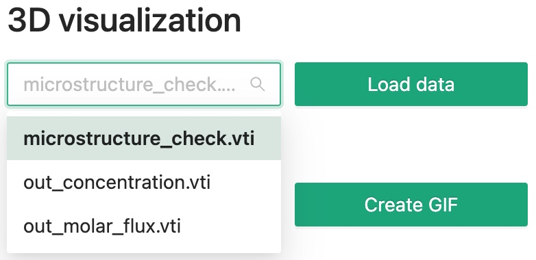{width=60%}

Then you will see something like this.

> 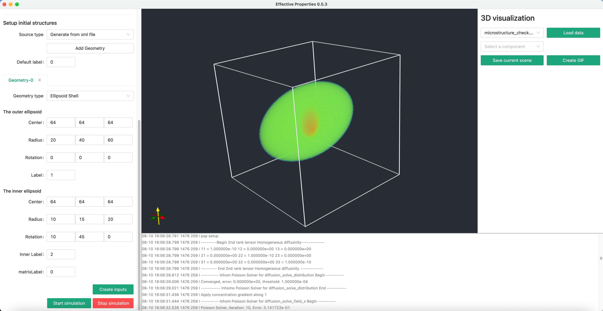{width=100%}

## Step 4.2: Paraview

Next, we can try visualizing other files with Paraview. Click the first **Open** icon in the tool bar.

> 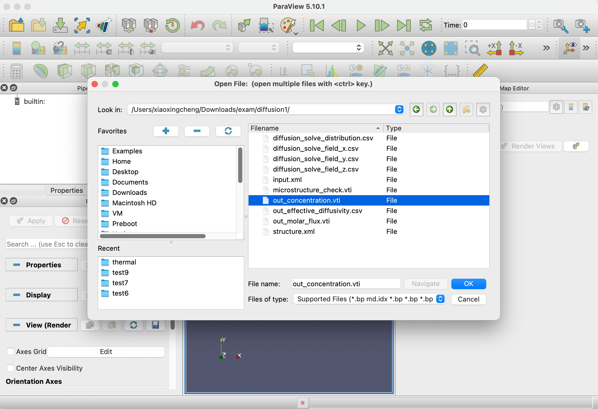{width=100%}

After the data is loaded, click **Apply**, then switch to **Volume** rendering and choose **scalar_data_2**, which is electric field along z for visualization.

We also need to tune the color lookup table to add some transparency to the data.

> 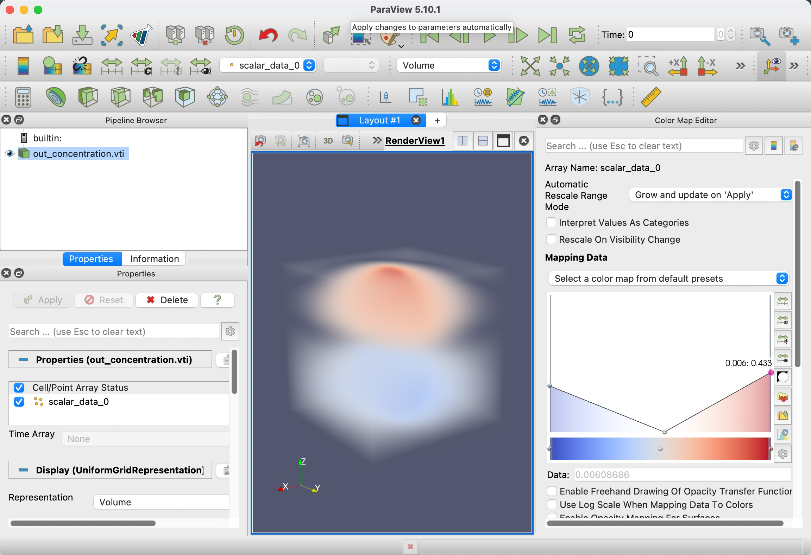{width=100%}

## Step 4.3: Check tabular data

Though 3D data looks cool, the more important thing probably is still the effective permittivity, _out_effective_diffusivity.csv_.

| Index | 1             | 2             | 3             |
| ----- | ------------- | ------------- | ------------- |
| 1     | +1.408238e-15 | +0.000000e+00 | +0.000000e+00 |
| 2     | +0.000000e+00 | +1.810113e-15 | +0.000000e+00 |
| 3     | +0.000000e+00 | +0.000000e+00 | +3.751247e-15 |
