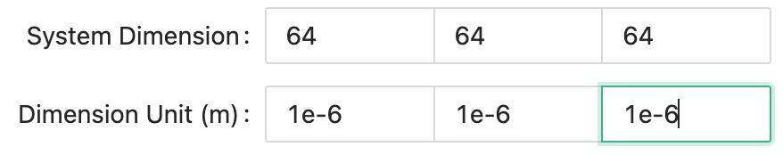
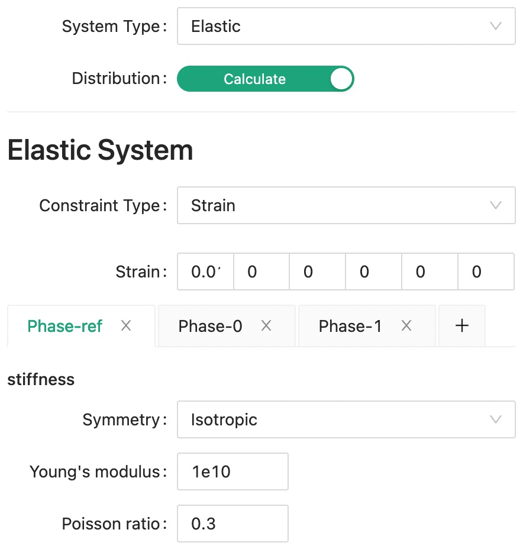
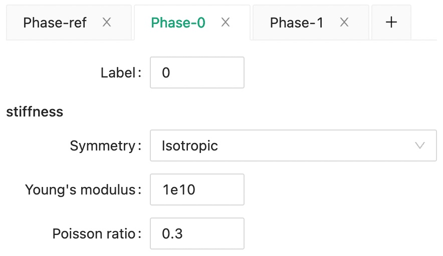
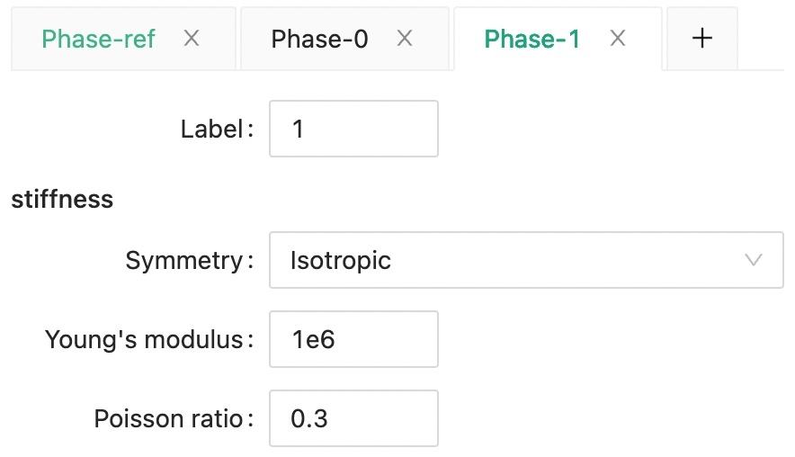
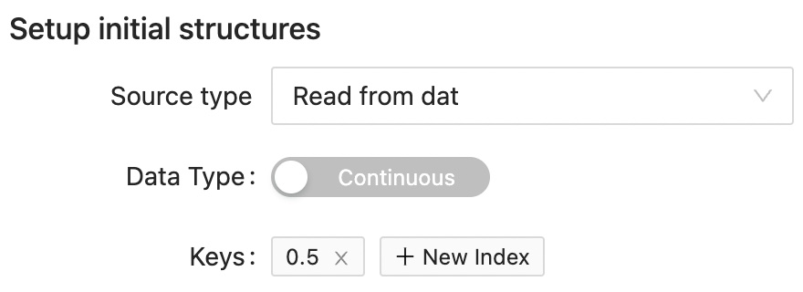
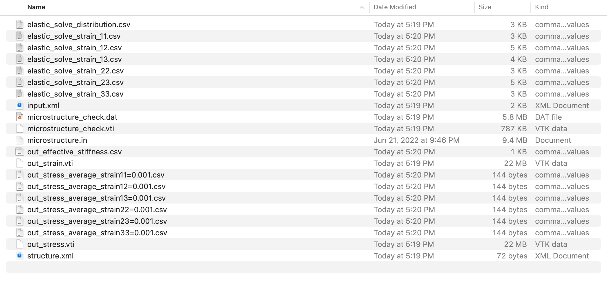
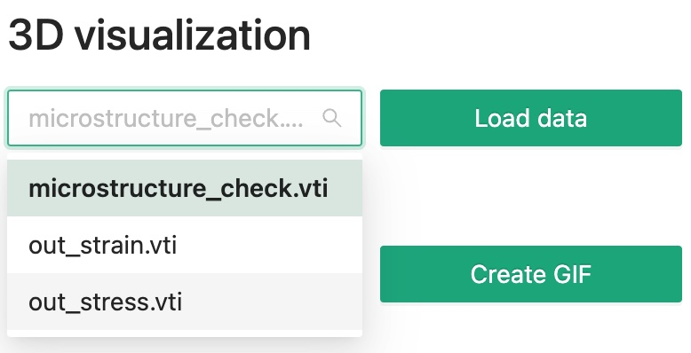
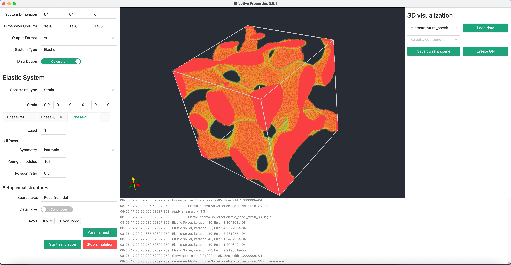
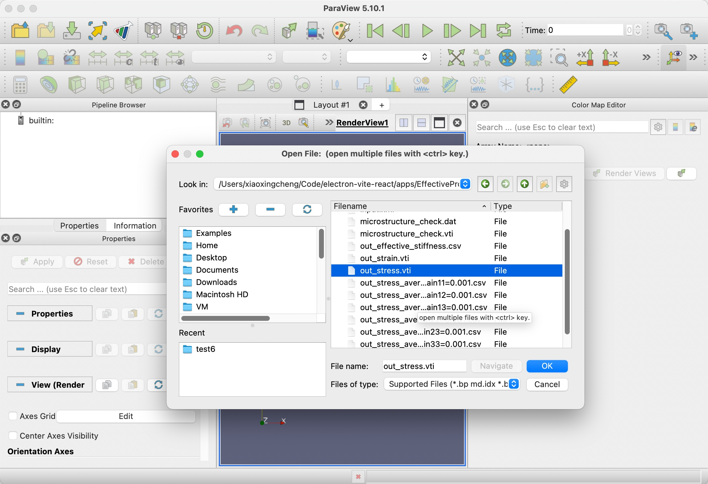
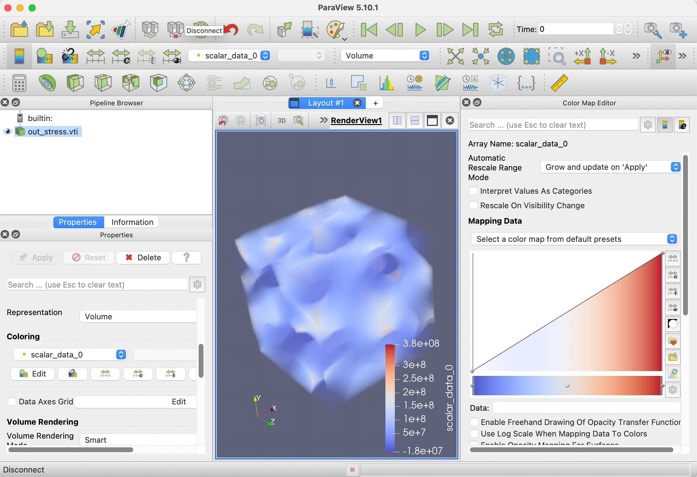

---
head:
  - - link
    - rel: stylesheet
      href: https://cdnjs.cloudflare.com/ajax/libs/KaTeX/0.5.1/katex.min.css
---

# Stiffness of custom microstructure

For details about the effective elastic modulus calculation please see [here](/manual/elastic).

## Overview

Since for custom microstructure setup, we need to read a microstructure file, to save some download bandwidth, we will only setup a cubic simulation with only 64 microns along each dimension, that's 64 simulations grids points with 1 micrometer for each grid.

We will need to prepare a <b>microstructure.in</b> file in advance for this calculation, you can download an example one from [here](microstructure.zip).

We would like to separate the continuous composition distribution defined in microstructure.in file into two phases with a threshold value of 0.5.

In this example, we are using a bicontinuous structure. You can use any microstructure input file as long as it follows the [correct format](/manual/input_file_structure).

## Step 1: Fill Input

<!--@include: ./step_1.md-->

### Dimension

> {width=60%}

### Output

<!--@include: ./output.md-->

### System

Choose "Elastic" system for the **System Type**.
Since we also want to calculate the mechanical field distribution under external stimuli, we need to turn on the **Distribution** switch. For this example, we choose _Strain_ for the **Constraint Type**, with a value of $\epsilon_{11}=0.01$.

Next, set the reference modulus value to be used in our solver. Here, we are supposing the material is isotropic, and we set the elastic stiffness by providing the Youngs modulus and Poisson ratio.

> {width=60%,height:30px}

Then, set the two phase.

> {width=60%,height:30px}

> {width=60%,height:30px}

### Structure

Since we are using our own custom microstructure, we should choose "Read from dat" for the **Source Type**.

If you download and examine the <span>microstructure.in</span> file, you will find the data is continuous floating point number rather than discrete integer, thus toggle the swtich of **Data type** to _Continuous_ and set a threshold value of 0.5 for the **Keys**.

> {width=60%,height=30px}

## Step 1.5: Or Import Input

<!--@include: ./step_1.5.md-->

```xml
<input>
  <output>
    <format>vti</format>
  </output>
  <dimension>
    <nx>64</nx>
    <ny>64</ny>
    <nz>64</nz>
    <dx>1e-6</dx>
    <dy>1e-6</dy>
    <dz>1e-6</dz>
  </dimension>
  <system>
    <type>elastic</type>
    <distribution>1</distribution>
    <external>
      <elastic>
        <type>strain</type>
        <strain>
          <tensor11>0.01</tensor11>
          <tensor22>0.00</tensor22>
          <tensor33>0.00</tensor33>
          <tensor23>0.00</tensor23>
          <tensor13>0.00</tensor13>
          <tensor12>0.00</tensor12>
        </strain>
      </elastic>
    </external>
    <solver>
      <ref>
        <tensor>
          <name>stiffness</name>
          <rank>4</rank>
          <pointGroup>isotropic</pointGroup>
          <component>
            <value>1e10</value>
            <index>young</index>
          </component>
          <component>
            <value>0.3</value>
            <index>poisson</index>
          </component>
        </tensor>
      </ref>
    </solver>
    <material>
      <phase>
        <label>0</label>
        <tensor>
          <name>stiffness</name>
          <rank>4</rank>
          <pointGroup>isotropic</pointGroup>
          <component>
            <value>1e10</value>
            <index>young</index>
          </component>
          <component>
            <value>0.3</value>
            <index>poisson</index>
          </component>
        </tensor>
      </phase>
      <phase>
        <label>1</label>
        <tensor>
          <name>stiffness</name>
          <rank>4</rank>
          <pointGroup>isotropic</pointGroup>
          <component>
            <value>1e7</value>
            <index>young</index>
          </component>
          <component>
            <value>0.3</value>
            <index>poisson</index>
          </component>
        </tensor>
      </phase>
    </material>
  </system>
  <structure>
    <sourceType>dat</sourceType>
    <dataType>continuous</dataType>
    <keypoints>
      <value>0.5</value>
    </keypoints>
  </structure>
</input>
```

## Step 2: Export Input

<!--@include: ./step_2.md-->

## Step 3: Run calculation

<!--@include: ./step_3.md-->

## Step 4: Check Output

You will see the following output files in your simulation folder. Meaning for each of the files are explained in the [Elastic System](/manual/elastic#output-files).

> {width=80%,height:30px}

Overall, there are two types of output data, vti files for 3D data, and csv files for tabular data.

## Step 4.1: Check 3D data

We can quickly take a look at the bicontinuous structure that we used within the software.

Select the file you want to visualize using the dropdown menu, then click **Load data** button.

> {width=60%}

Then you will see a structure like this.

> (width=100%)

## Step 4.2: Paraview

Next, we can try visualizing other files with Paraview. Click the first **Open** icon in the tool bar.

> {width=100%}

After the data is loaded, click **Apply**, then switch to **Volume** rendering, and you will see.

> {width=100%}

## Step 4.2: Check tabular data

You can check the _out_effective_stiffness.csv_ file for the effective stiffness result of the system.

| Index | 11       | 12      | 13      | 21      | 22      | 23      | 31      | 32     | 33      |
| ----- | -------- | ------- | ------- | ------- | ------- | ------- | ------- | ------ | ------- |
| 11    | 4.8e+09  | 8.5e+07 | -1.2+08 | 8.5e+07 | 1.6e+09 | 7.3e+06 | -1.2+08 | 7.3+06 | 1.7+09  |
| 12    | 8.6e+07  | 2.0e+09 | 2.8+07  | 2.0e+09 | 2.2e+07 | 6.1e+07 | 2.8+07  | 6.1+07 | 5.6+07  |
| 13    | -1.2e+08 | 2.8e+07 | 2.3+09  | 2.8e+07 | 4.6e+07 | 1.2e+08 | 2.3+09  | 1.2+08 | -7.7+07 |
| 21    | 8.6e+07  | 2.0e+09 | 2.8+07  | 2.0e+09 | 2.2e+07 | 6.1e+07 | 2.8+07  | 6.1+07 | 5.6+07  |
| 22    | 1.6e+09  | 2.2e+07 | 4.6+07  | 2.2e+07 | 4.2e+09 | 1.7e+07 | 4.6+07  | 1.7+07 | 1.6+09  |
| 23    | 7.4+06   | 6.1e+07 | 1.2+08  | 6.1e+07 | 1.7e+07 | 2.0e+09 | 1.2+08  | 2.0+09 | 1.2+08  |
| 31    | -1.2+08  | 2.8e+07 | 2.3+09  | 2.8e+07 | 4.6e+07 | 1.2e+08 | 2.3+09  | 1.2+08 | -7.7+07 |
| 32    | 7.4+06   | 6.1e+07 | 1.2+08  | 6.1e+07 | 1.7e+07 | 2.0e+09 | 1.2+08  | 2.0+09 | 1.2+08  |
| 33    | 1.7+09   | 5.6e+07 | -7.7+07 | 5.6e+07 | 1.6e+09 | 1.2e+08 | -7.7+07 | 1.2+08 | 4.5+09  |
